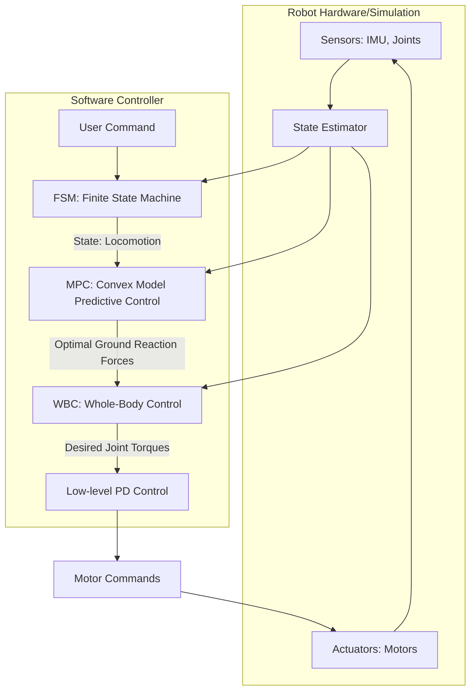

# MIT Cheetah Controller 深入分析

本文档旨在深入分析 `MIT_Controller`，阐述其工作原理、核心模块功能、模块间关系及数据交互流程，以全面理解这一先进的四足机器人控制系统。

## 1. 核心模块功能

MIT Controller 是一个分层级的控制框架，其核心思想是通过有限状态机（FSM）来管理机器人的不同行为模式（如站立、行走、后空翻），并在每个状态下调用相应的底层控制器（如MPC、WBC）来计算最终的关节力矩。

### 1.1. 有限状态机 (FSM - Finite State Machine)
- **位置**: `FSM_States/`
- **功能**: FSM 是整个控制器的“大脑”，负责顶层的决策和调度。它根据用户指令（如遥控器输入）和机器人自身状态，决定机器人应该处于哪种行为状态，并负责在不同状态之间进行安全、平滑的切换。
- **重要文件**:
    - `ControlFSM.h/.cpp`: FSM 的主控类，管理所有状态，并执行当前状态的逻辑。
    - `FSM_State.h/.cpp`: 所有具体状态的基类，定义了状态的通用接口，如 `onEnter`, `run`, `onExit`。
    - `FSM_State_*.h/.cpp`: 具体的状态实现，例如：
        - `FSM_State_Locomotion`: 行走状态，调用 MPC+WBC 实现动态行走。
        - `FSM_State_BalanceStand`: 平衡站立状态，使用专门的平衡控制器。
        - `FSM_State_BackFlip`: 后空翻状态，执行预定义的后空翻动作序列。
        - `FSM_State_Passive`: 空闲状态，电机不输出力矩。
        - `FSM_State_RecoveryStand`: 摔倒后恢复站立的状态。

### 1.2. 运动控制器 (Controllers)
- **位置**: `Controllers/`
- **功能**: 该模块包含用于计算机器人期望运动的各种先进控制算法。FSM 根据当前状态选择并激活其中一个控制器。

#### 1.2.1. 凸模型预测控制 (Convex MPC)
- **位置**: `Controllers/convexMPC/`
- **功能**: 这是实现动态行走的核心。MPC 通过一个简化的机器人动力学模型（通常是单刚体模型或点质量模型），预测未来一小段时间内（预测时域）的最优地面反作用力（GRF）。它将复杂的非线性动力学问题转化为一个可以快速求解的凸优化问题，从而实现在线实时计算。
- **输入**: 机器人当前状态（质心位置、速度、姿态）、期望运动轨迹（来自用户指令）、以及预定义的步态序列。
- **输出**: 未来几个时间步内，每个足端的最佳接触力和运动轨迹。
- **重要文件**:
    - `ConvexMPCLocomotion.h/.cpp`: MPC 控制器的主要逻辑封装。
    - `SolverMPC.h/.cpp`: 使用 `qpOASES` 等二次规划求解器来求解 MPC 问题。
    - `Gait.h/.cpp`: 定义步态，如 `trot` (对角小跑), `gallop` (奔跑) 等，决定了在特定时间哪些腿应该接触地面。

#### 1.2.2. 全身控制器 (WBC - Whole-Body Control)
- **位置**: `Controllers/WBC/`
- **功能**: WBC 是连接 MPC（期望的力）和机器人关节（实际的力矩）的桥梁。它接收来自 MPC 的最优地面反作用力作为高级任务，同时还考虑其他任务，如保持身体姿态、跟踪摆动腿轨迹、遵守关节限制等。WBC 将这些任务统一到一个优化问题中，计算出实现这些任务所需的最优关节加速度和力矩。
- **输入**: MPC 计算出的期望地面反作用力、机器人当前完整的运动学和动力学状态。
- **输出**: 12个关节的目标力矩。
- **重要文件**:
    - `WBC.hpp`: WBC 的通用接口定义。
    - `WBIC/WBIC.hpp`: 基于优化的全身控制器实现，它将任务分为不同优先级，并求解一个考虑动力学约束的二次规划问题。
    - `ContactSpec.hpp`, `Task.hpp`: 定义了 WBC 中的任务，如接触任务（施加地面反作用力）、关节姿态任务等。

#### 1.2.3. 其他控制器
- **BalanceController**: 一个相对简单的控制器，用于在原地保持静态平衡。
- **BackFlipCtrl**: 用于执行后空翻等高动态敏捷动作的专用控制器，通常基于预先计算好的轨迹。

## 2. 详细的类与方法解析

- **`MIT_Controller` (`MIT_Controller.h/.cpp`)**:
  - **功能**: 顶层封装类，整合了 FSM 和用户参数。
  - **`runController()`**: 主循环函数。它从硬件/仿真接口获取传感器数据，将其传递给 FSM，然后执行 FSM 的 `run()` 方法，最后将计算出的关节力矩返回给执行器。

- **`ControlFSM` (`FSM_States/ControlFSM.h/.cpp`)**:
  - **功能**: 有限状态机的核心，管理所有状态的生命周期。
  - **`runFSM()`**: 每个控制周期被 `MIT_Controller` 调用。它首先检查是否需要切换状态，然后执行当前状态的 `run()` 方法。
  - **`initialize()`**: 初始化所有定义的状态，并将初始状态设置为 `FSM_State_Passive`。

- **`FSM_State` (`FSM_States/FSM_State.h/.cpp`)**:
  - **功能**: 所有状态的抽象基类。
  - **`onEnter()`**: 进入该状态时执行一次的初始化代码。
  - **`run()`**: 在该状态下每个控制周期都会执行的核心逻辑。
  - **`onExit()`**: 退出该状态时执行一次的清理代码。
  - **`checkTransition()`**: 检查是否满足切换到其他状态的条件。

- **`ConvexMPCLocomotion` (`Controllers/convexMPC/ConvexMPCLocomotion.h/.cpp`)**:
  - **功能**: MPC 控制器的实现。
  - **`run()`**: 运行 MPC 算法。它设置优化问题，调用求解器，并处理结果。

- **`WBIC` (`Controllers/WBC/WBIC/WBIC.hpp`)**:
  - **功能**: 全身脉冲控制器的实现。
  - **`update()`**: 设置 WBC 的优化问题，包括接触约束、任务等。
  - **`solve()`**: 求解优化问题，得到关节加速度和力矩。

## 3. 各模块的关系

MIT Controller 采用经典的三层分层控制思想：**顶层决策（FSM）** -> **中层规划（MPC）** -> **底层执行（WBC）**。

- **文字表述**:
  1.  **FSM** 作为最高层，根据用户输入（如“开始行走”）和机器人状态，决定进入 `Locomotion` 状态。
  2.  在 `Locomotion` 状态下，**MPC** 被激活。MPC 根据期望速度和当前状态，计算出未来一段时间内最优的地面反作用力，以实现稳定、高效的行走。
  3.  MPC 的输出（期望的力）被传递给 **WBC**。
  4.  **WBC** 将这个“力”任务，连同其他任务（如保持身体平衡、摆动腿按预定轨迹运动），转化为一个全身动力学优化问题。
  5.  WBC 求解该问题，计算出能够最好地满足所有任务的12个关节力矩。
  6.  这些力矩最终被发送给机器人电机执行。

- **Mermaid 关系图**:

## 4. 详细的数据交互流程

1.  **数据输入**: `MIT_Controller` 从仿真或真实机器人处接收传感器数据（`LegControllerData`），包括关节角度、速度，IMU数据（姿态、角速度、加速度）等。同时，它也接收用户指令（`GamepadCommand`）。
2.  **状态估计**: 传感器数据被送入状态估计器，计算出更高级的状态，如机身质心位置、速度、足端位置等。
3.  **FSM 决策**: `ControlFSM` 接收状态估计和用户指令。`runFSM()` 方法首先调用当前状态的 `checkTransition()` 来判断是否需要切换状态。例如，如果用户按下“启动”按钮，FSM 可能从 `Passive` 状态切换到 `StandUp` 状态。
4.  **状态执行**: FSM 执行当前状态的 `run()` 方法。
    -   **以行走为例 (`FSM_State_Locomotion`)**:  
        a.  `run()` 方法会调用 `ConvexMPCLocomotion` 控制器。  
        b.  MPC 接收当前状态和期望速度，运行优化，计算出最优地面反作用力。  
        c.  `run()` 方法接着调用 `WBC` 控制器。  
        d.  WBC 接收 MPC 的结果和完整的机器人状态，运行优化，计算出最终的关节力矩。
5.  **数据输出**: 计算出的关节力矩（`LegControllerCommand`）被 `MIT_Controller` 返回，并发送给底层电机驱动器执行。
6.  **循环**: 整个流程在每个控制周期（通常为 1-2ms）重复执行，形成一个高频的闭环控制。

## 5. 补充说明

- **分层思想的重要性**: 这种分层架构极大地简化了复杂问题。MPC 在简化的模型上进行快速规划，而 WBC 则处理完整的、非线性的动力学模型，确保规划得以精确执行。FSM 则提供了高度的模块化和行为扩展性。
- **实时性**: MPC 和 WBC 中的优化问题都经过精心设计，以确保可以在毫秒级的时间内求解，满足实时控制的需求。
- **鲁棒性**: MPC 的预测能力使得控制器能够“预见”并应对未来的扰动，例如地形变化，从而大大提高了机器人的鲁棒性
- **可扩展性**: 添加新的机器人行为非常简单，只需创建一个新的 FSM 状态类，并实现其 `run()` 方法来调用相应的控制器即可。

这份文档全面地分析了 `MIT_Controller` 的架构和技术细节。
