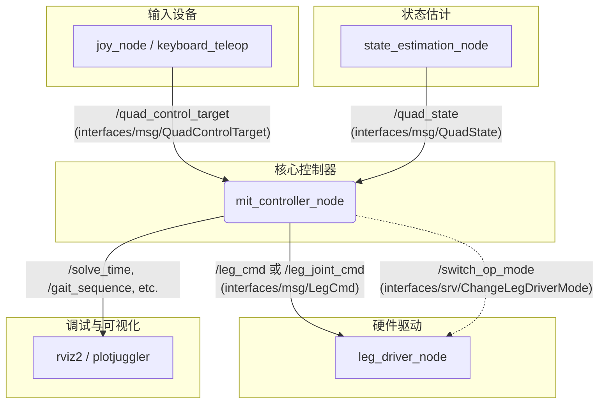

# `mit_controller_node` 节点分析文档

本文档旨在详细分析 `mit_controller_node` 的功能、数据流、与其他节点的交互及其核心控制策略。

## 1. 节点功能与方法解析

`mit_controller_node` 是四足机器人运动控制的核心节点，它实现了基于模型预测控制（MPC）、全身控制（WBC）和摆动腿控制（SLC）的混合控制架构。该节点负责接收高层指令和机器人状态，计算并下发底层的腿部控制指令。

### 主要方法功能

- **`MITController(const std::string& nodeName)` (构造函数)**
  - **功能**: 初始化 `MITController` 节点。
  - **过程**:
    1.  声明和加载大量 ROS 参数，包括控制器增益（Kp, Kd）、MPC权重、步态参数、模型文件路径等。
    2.  根据 `leg_control_mode` 参数，选择并配置腿部控制模式（如关节力矩控制、笛卡尔空间控制等）。
    3.  初始化机器人模型 (`QuadModelPino`)、状态 (`QuadState`) 和控制目标 (`Target`)。
    4.  根据参数实例化核心控制模块：
        - **步态序列器 (`gs_`)**: `SimpleGaitSequencer` 或 `AdaptiveGaitSequencer`。
        - **模型预测控制器 (`mpc_`)**: `MPC`。
        - **摆动腿控制器 (`slc_`)**: `SwingLegController`。
        - **全身控制器 (`wbc_`)**: `WBCInterface` 的具体实现。
        - **模型自适应模块 (`ma_`)**: `KFModelAdaptation` 或 `LeastSquaresModelAdaptation`。
    5.  创建 ROS 通信接口：订阅者、发布者、客户端以及用于周期性任务的定时器。
    6.  设置多线程回调组，以允许 MPC、SLC 等循环并行执行。

- **`QuadStateUpdateCallback(interfaces::msg::QuadState::SharedPtr quad_state_msg)`**
  - **功能**: 接收并更新机器人的当前状态。
  - **过程**:
    1.  此回调函数由 `quad_state_subscription_` 触发，接收来自状态估计节点（`state_estimation`）的 `QuadState` 消息。
    2.  使用互斥锁 `quad_state_lock_` 保护共享资源，将接收到的消息数据更新到节点的 `quad_state_` 成员变量中。
    3.  更新内部的机器人模型 `quad_model_`，使其与当前状态同步。

- **`QuadControlTargetUpdateCallback(interfaces::msg::QuadControlTarget::SharedPtr quad_target_msg)`**
  - **功能**: 接收并更新机器人的高层运动目标。
  - **过程**:
    1.  此回调函数由 `quad_control_target_subscription_` 触发，接收来自用户输入（如手柄、键盘）或自主导航模块的 `QuadControlTarget` 消息。
    2.  使用互斥锁 `targets_lock_` 保护共享资源，将期望的线速度、角速度、身体高度等信息更新到节点的 `target_` 成员变量中。

- **`MPCLoopCallback()`**
  - **功能**: 模型预测控制（MPC）的核心计算循环。
  - **过程**:
    1.  由 `mpc_loop_timer_` 定时触发。
    2.  从步态序列器 `gs_` 获取当前的步态序列（支撑相和摆动相的计划）。
    3.  基于当前机器人状态 `quad_state_` 和运动目标 `target_`，运行 MPC 求解器。
    4.  MPC 计算出未来一个预测时域内的最优地面反作用力序列 (`wrench_sequence_`) 和身体姿态轨迹 (`mpc_prediction_`)。
    5.  将计算结果用互斥锁 `gs_wrench_sequence_lock_` 保护，供 WBC 模块使用。

- **`SLCLoopCallback()`**
  - **功能**: 摆动腿控制（SLC）的核心计算循环。
  - **过程**:
    1.  由 `slc_loop_timer_` 定时触发，频率通常高于 MPC。
    2.  获取最新的步态序列和 MPC 预测结果。
    3.  为处于摆动相（Swing Phase）的腿规划期望的足端轨迹。
    4.  计算出摆动腿的目标位置、速度和加速度，存放在 `feet_targets_` 中，供 WBC 模块使用。

- **`ControlLoopCallback()`**
  - **功能**: 主控制循环，集成了全身控制（WBC）并下发最终指令。
  - **过程**:
    1.  由 `control_loop_timer_` 定时触发，通常是系统最高频的控制循环。
    2.  **数据集成**: 汇集来自 MPC 的地面反作用力、来自 SLC 的摆动腿轨迹以及当前机器人状态。
    3.  **WBC 计算**: 运行全身控制器 `wbc_`。WBC 将 MPC 和 SLC 的任务作为优化目标，同时考虑机器人动力学约束（如关节限制、摩擦锥等），计算出实现这些任务所需的最优关节力矩、位置或速度。
    4.  **指令发布**:
        - 根据 `leg_control_mode_`，将 WBC 的计算结果打包成 `LegCmd` (笛卡尔空间指令) 或 `JointCmd` (关节空间指令)。
        - 通过 `leg_cmd_publisher_` 或 `leg_joint_cmd_publisher_` 将指令发布出去，由底层的驱动节点接收并执行。

- **`ModelAdaptationCallback()`**
  - **功能**: 模型自适应循环，用于在线估计和补偿模型参数的误差。
  - **过程**:
    1.  由 `model_adaptation_loop_timer_` 定时触发。
    2.  运行模型自适应算法（如卡尔曼滤波），根据实际运动和期望运动的差异，估计模型参数（如身体惯量、CoM 位置偏差等）。
    3.  更新内部的 `quad_model_`，以提高控制精度。

- **`HartbeatCallback()`**
  - **功能**: 定期发布控制器心跳信息，表明节点正在正常运行。
  - **过程**: 由 `heartbeat_loop_timer_` 触发，发布 `ControllerInfo` 消息。

## 2. 数据流变化与传输过程

`mit_controller_node` 内部的数据流是一个典型的分层控制结构：

1.  **输入**:
    - **机器人状态 (`QuadState`)**: 从 `state_estimation` 节点流入，通过 `QuadStateUpdateCallback` 更新到 `quad_state_`。这是所有控制计算的基础。
    - **控制目标 (`QuadControlTarget`)**: 从外部（如手柄节点）流入，通过 `QuadControlTargetUpdateCallback` 更新到 `target_`。

2.  **内部处理**:
    - **步态规划**: `GaitSequencer` (`gs_`) 根据 `target_` 中的速度指令生成步态序列 `gait_sequence_`。
    - **MPC 计算**: `MPCLoopCallback` 使用 `quad_state_`、`target_` 和 `gait_sequence_`，计算出期望的地面反作用力 `wrench_sequence_` 和身体轨迹 `mpc_prediction_`。
    - **SLC 计算**: `SLCLoopCallback` 使用 `gait_sequence_` 和 `mpc_prediction_`，为摆动腿生成足端轨迹 `feet_targets_`。
    - **WBC 计算**: `ControlLoopCallback` 是数据汇集点。它获取 `wrench_sequence_` (支撑腿任务) 和 `feet_targets_` (摆动腿任务)，结合 `quad_state_`，通过 `wbc_` 模块求解出最终的关节指令。

3.  **输出**:
    - **腿部指令 (`LegCmd` / `JointCmd`)**: WBC 的计算结果被打包并通过 `leg_cmd_publisher_` 或 `leg_joint_cmd_publisher_` 发送给底层驱动节点。
    - **调试信息**: 节点还会发布大量中间数据用于调试和监控，如 MPC 求解时间、WBC 目标、步态序列等。

## 3. 与其他节点的交互

`mit_controller_node` 是控制系统的核心，与多个节点进行数据交换。

### 交互流程文字表述

1.  **`state_estimation` 节点**: 发布机器人当前状态 (`/quad_state`)，`mit_controller_node` 订阅此话题以获取姿态、速度、关节角度等信息。
2.  **`joy_node` / `keyboard_teleop` 等输入节点**: 发布用户的高层控制指令 (`/quad_control_target`)，`mit_controller_node` 订阅此话题以确定机器人的运动意图（如前进、转向）。
3.  **`leg_driver` 节点 (或其他硬件驱动)**:
    - `mit_controller_node` 发布计算出的腿部指令 (`/leg_cmd` 或 `/leg_joint_cmd`)，驱动节点订阅这些指令并控制电机执行。
    - `mit_controller_node` 可能会调用驱动节点提供的服务（如 `/switch_op_mode`）来更改腿部控制器的操作模式（例如，从位置控制切换到力矩控制）。
4.  **`rviz2` / `plotjuggler` 等可视化/调试工具**: `mit_controller_node` 发布大量调试话题（如 `/solve_time`, `/gait_sequence`, `/swing_leg_trajs`），这些工具可以订阅这些话题以实现状态监控和性能分析。

### Mermaid 交互图

## 4. 其他有价值的信息

- **分层控制思想**: 该节点完美体现了现代足式机器人控制中常见的分层思想：
  - **高层**: 步态序列器（GS）决定何时以及哪条腿应该摆动。
  - **中层**: 模型预测控制器（MPC）在简化的线性模型上优化全身的运动，计算地面反作用力。
  - **底层**: 全身控制器（WBC）在完整的非线性刚体模型上，将高层和中层的任务转化为具体的关节指令，同时处理各种物理约束。

- **多线程与实时性**: 通过为 MPC、SLC 和主控制循环分配不同的回调组，实现了任务的并行化。这对于满足实时性要求至关重要，因为 MPC 计算耗时较长，不能阻塞高频的 WBC 和指令下发循环。

- **腿部控制模式 (`LEGControlMode`)**:
  - `JOINT_TORQUE_CONTROL`: 直接控制关节力矩，适用于高性能的力矩控制关节。
  - `CARTESIAN_STIFFNESS_CONTROL`: 控制足端在笛卡尔空间中的刚度，类似于阻抗控制。
  - `JOINT_CONTROL` / `CARTESIAN_JOINT_CONTROL`: 控制关节或足端的位置/速度，适用于位置控制接口的电机。
  这种灵活性使得控制器能够适配不同类型的硬件。

- **模型自适应**: `use_model_adaptation` 参数和 `ModelAdaptationCallback` 的存在表明，该控制器具备在线学习和补偿模型不确定性的能力，这对于提高机器人在复杂环境中的鲁棒性至关重要。

## 关键函数
### ControlLoopCallback 函数功能详细说明

`ControlLoopCallback` 是 `MITController` 类中的主控制循环回调函数，它在 ROS2 多线程执行器中以固定频率（`CONTROL_DT`）运行，负责集成全身控制（WBC）、腿部状态管理、下发最终控制指令，并处理调试信息。该函数确保四足机器人控制的实时性和稳定性。

#### 1. 数据获取与同步
- **获取共享数据**：从线程安全的锁（如 `gs_wrench_sequence_lock_`、`targets_lock_`、`quad_state_lock_`）中复制最新的数据，包括：
  - `wrench_sequence_temp`：MPC 计算的力序列（用于 WBC）。
  - `gait_sequence_temp`：步态序列（接触计划、足部位置等）。
  - `feet_targets_temp`：足部目标（位置、速度、加速度）。
  - `quad_state_temp`：机器人当前状态（关节位置、接触状态等）。
- **目的**：避免竞态条件，确保数据一致性。

#### 2. WBC 更新
- **更新 WBC 状态**：调用 `wbc_->UpdateState(quad_state_temp)` 更新 WBC 的机器人状态。
- **更新 WBC 目标**：使用 MPC 的第一个预测步（`mpc_prediction_temp.orientation[1]` 等）作为目标姿态、位置、线速度和角速度。
- **更新足部目标和接触**：传递 `feet_targets_temp` 和 `gait`（接触序列）给 WBC。
- **更新力矩**：传递 `wrenches`（力序列）给 WBC。
- **目的**：为 WBC 提供最新的控制输入，计算关节命令。

#### 3. 腿部状态管理
- **状态机处理**：为每条腿（`N_LEGS`）维护状态（`STANCE`、`SWING`、`EARLY_CONTACT`、`LATE_CONTACT`、`LOST_CONTACT`），根据接触检测和步态计划动态调整：
  - **STANCE**：支撑相，设置足部目标为步态计划位置。
  - **SWING**：摆动相，设置力矩为零，保持足部目标。
  - **EARLY_CONTACT**：提前接触，保持当前位置，调整力矩。
  - **LATE_CONTACT** / **LOST_CONTACT**：延迟或丢失接触，保持相对位置，设置力矩为零。
- **检测逻辑**：
  - 使用 `early_contact_detection_`、`late_contact_detection_`、`lost_contact_detection_` 标志检测异常。
  - 根据 `feet_swing_progress_temp` 和 `quad_state_temp.GetFeetContacts()` 判断状态转换。
- **目的**：处理实际接触与计划步态的偏差，提高鲁棒性（如应对地面不平或滑动）。

#### 4. PD 增益设置
- **根据腿部状态和控制模式设置增益**：
  - 对于 `STANCE` 和 `SWING` 相，根据 `leg_control_mode_`（如 `CARTESIAN_JOINT_CONTROL`、`JOINT_CONTROL`）选择相应的 Kp 和 Kd 值（从参数加载，如 `cartesian_joint_control_stance_Kp_`）。
  - 映射到命令消息（如 `leg_cmd_.kp` 或 `leg_joint_cmd_.kp`）。
- **目的**：调整控制刚度，确保支撑相稳定、摆动相灵活。

#### 5. WBC 计算与指令下发
- **计算关节命令**：
  - 根据 `leg_control_mode_` 调用 WBC 的 `GetJointCommand` 方法，获取位置、速度、力或扭矩命令。
  - 对于笛卡尔控制模式，发布到 `leg_cmd_publisher_`。
  - 对于关节控制模式，发布到 `leg_joint_cmd_publisher_`。
- **时间戳**：为消息添加当前时间戳。
- **目的**：生成并下发低级控制指令到腿部驱动器。

#### 6. 调试与监控
- **求解时间测量**：记录 WBC 求解时间（`wbc_solve_time`），如果超过阈值（`WBC_CYCLE_DT`）记录超时。
- **发布调试信息**：
  - 如果 `PUBLISH_WBC_SOLVE_TIME`，发布 WBC 求解时间和成功状态。
  - 如果 `PUBLISH_WBC_TARGET`，发布 WBC 目标（姿态、力矩等）。
  - 如果 `swing_leg_trajs_publisher_` 启用，发布摆动腿轨迹（起点、向量）。
- **错误处理**：记录 WBC 求解失败或超时。
- **心跳更新**：更新 `controller_heartbeat_` 的计数器（如超时、失败次数）。

#### 7. 其他功能
- **线程安全**：使用锁（如 `wbc_lock_`）保护 WBC 操作。
- **条件发布**：仅在启用相应标志时发布消息，减少开销。
- **实时性**：函数设计为高效，避免阻塞，确保控制循环稳定运行。

该函数是控制系统的核心，桥接高层规划（MPC、步态）和低层执行（WBC），通过状态机和检测机制增强适应性。有关更多细节，请参考代码注释或 ROS2 文档。

### MPCLoopCallback 函数功能详细说明

`MPCLoopCallback` 是 `MITController` 类中的 MPC（模型预测控制）循环回调函数，它在 ROS2 多线程执行器中以固定频率（`MPC_CONTROL_DT`）运行，负责集成步态规划、MPC 求解、结果发布，并协调其他控制循环。该函数是控制系统的核心，桥接高层规划和低层执行，确保实时性和稳定性。

#### 1. 数据获取与状态更新
- **获取四足状态**：从线程安全的锁（如 `quad_state_lock_`）中复制最新的机器人状态（`quad_state_temp`）。
- **更新组件状态**：
  - 调用 `gs_->UpdateTarget(target_)` 和 `gs_->UpdateState(quad_state_temp)` 更新步态序列器（GS）。
  - 调用 `mpc_->UpdateState(quad_state_temp)` 更新 MPC。
  - 调用 `slc_->UpdateState(quad_state_temp)` 更新摆动腿控制器（SLC）。
- **目的**：确保所有组件使用最新的状态数据，避免竞态条件。

#### 2. 步态序列处理
- **获取步态序列**：调用 `gs_->GetGaitSequence(gait_sequence_temp)` 获取当前的步态计划（接触序列、足部位置等）。
- **更新 MPC**：调用 `mpc_->UpdateGaitSequence(gait_sequence_temp)` 将步态序列传递给 MPC。
- **权重切换**：根据步态模式（`sequence_mode`）切换 MPC 状态权重：
  - `KEEP` 模式：使用 `state_weights_stand_`（站立权重）。
  - `MOVE` 模式：使用 `state_weights_move_`（移动权重）。
  - 更新心跳标志（如 `keep_pose_active`）。
- **目的**：根据运动模式调整 MPC 的优化目标，提高控制适应性。

#### 3. MPC 求解
- **计算力序列和预测**：调用 `mpc_->GetWrenchSequence(ws_temp, mpc_prediction_temp, solver_info)` 执行 MPC 求解，生成力序列（`ws_temp`）、状态预测（`mpc_prediction_temp`）和求解信息（`solver_info`）。
- **时间测量**：记录求解时间（`mpc_solve_time`）。
- **求解器检查**：
  - 如果未收敛，记录错误日志（`RCLCPP_ERROR_EXPRESSION`）。
  - 如果求解时间超过 `MPC_CONTROL_DT`，记录警告。
  - 调试日志输出求解代码、时间和成功状态。
- **目的**：计算未来预测步的力分布和状态轨迹，为 WBC 提供输入。

#### 4. 结果更新与共享
- **更新共享数据**：使用 `gs_wrench_sequence_lock_` 锁，将 `wrench_sequence_`、`gait_sequence_` 和 `mpc_prediction_` 更新为最新结果。
- **标记更新**：设置 `gs_updated_` 标志，通知其他循环（如 SLC）。
- **目的**：线程安全地共享 MPC 输出给控制循环和 SLC。

#### 5. 循环启动
- **条件启动定时器**：如果这是第一次运行（`control_loop_timer_ == nullptr`），启动：
  - `slc_loop_timer_`：摆动腿控制循环（`SWING_LEG_DT`）。
  - `control_loop_timer_`：主控制循环（`CONTROL_DT`）。
- **目的**：确保 MPC 先运行一次后，其他循环才开始，避免依赖未初始化的数据。

#### 6. 调试与监控信息发布
- **发布求解时间**：如果 `PUBLISH_SOLVE_TIME`，发布 `MPCDiagnostics` 消息，包括总时间、QP 求解时间、迭代次数等。
- **发布开放环轨迹**：如果 `PUBLISH_OPEN_LOOP_TRAJECTORY`，发布 `PositionSequence` 消息，包含 MPC 预测的位置和姿态。
- **发布步态状态**：如果 `PUBLISH_GAIT_STATE`，发布 `GaitState` 消息。
- **发布步态序列**：如果 `PUBLISH_GAIT_SEQUENCE`，发布 `GaitSequence` 消息。
- **心跳更新**：更新 `controller_heartbeat_` 的计数器（如求解失败、超时次数）。
- **调试打印**：在 `DEBUG_PRINTS` 模式下，打印接触计划和力分布。
- **目的**：提供实时监控和调试信息，便于系统调优和故障排查。

#### 7. 其他功能
- **线程安全**：使用锁（如 `mpc_lock_`、`gait_sequencer_lock_`）保护共享资源。
- **错误处理**：记录求解失败或超时，提高系统鲁棒性。
- **实时性**：函数设计为高效，确保 MPC 循环稳定运行。

该函数是控制系统的规划层核心，生成力序列和预测轨迹，为 WBC 和 SLC 提供基础。有关更多细节，请参考代码注释或 ROS2 文档。