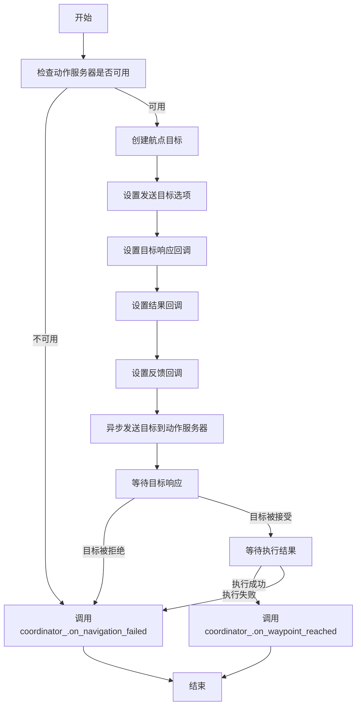

# 1
我来对这个机器人巡检任务中枢的需求进行深入分析和建议。

## 📋 当前需求的评估

**当前设计涵盖的核心要素：**
1. ✅ 路线与导航点管理（YAML驱动）
2. ✅ 任务编排与依赖关系
3. ✅ 多节点状态监控
4. ✅ 日志持久化

**对生产环保的适配性分析：**

| 需求维度 | 当前设计 | 生产风险 | 优先级 |
|---------|--------|--------|--------|
| **可靠性** | 状态监控有，但缺乏故障恢复 | 任务失败是否支持重试？节点掉线如何处理？ | 🔴 高 |
| **可观测性** | 日志记录有，但缺乏实时监控 | 巡检过程中无法实时看到进度；事后排查困难 | 🔴 高 |
| **扩展性** | YAML配置好，但任务编排固定 | 复杂条件分支（如"根据检测结果分支"）不支持 | 🟡 中 |
| **安全性** | 缺乏紧急制停、权限控制 | 无法紧急停止；谁能修改路线/任务？ | 🔴 高 |
| **运维友好性** | 基础支持 | 无动态任务加载、无在线编辑、无任务冲突检测 | 🟡 中 |

---

## 🎯 我的实现方案（如果由我设计）

### **1. 整体架构** → **事件驱动 + 状态机**

```
┌─────────────────────────────────────────────────────────┐
│          Task Coordination Hub (任务中枢)               │
├─────────────────────────────────────────────────────────┤
│ ┌─ Route Manager                  路线/导航点管理      │
│ ├─ Task State Machine              单个任务的状态机    │
│ ├─ Execution Pipeline              管道式任务执行      │
│ ├─ Event Bus                        发布/订阅事件      │
│ ├─ Recovery & Retry Logic           故障恢复与重试     │
│ ├─ Real-time Dashboard              Web界面实时监控    │
│ └─ Persistent Storage               SQLite + 日志文件  │
└─────────────────────────────────────────────────────────┘
          ↓        ↓        ↓        ↓
    [导航节点] [检测节点] [巡检节点] [其他任务节点]
```

### **2. 关键改进方案**

#### **A. 可靠性** —— 自我修复
- **故障恢复框架**：
  - 任务失败自动触发 `retry_count` 重试（配置最多 N 次，指数退避）
  - 节点连接超时（5s）→ 标记为"离线"，暂停相关任务，待恢复后续接
  - 任务"卡住"检测：设置超时值，超时未完成 → 主动查询状态/强制结束
  
- **状态持久化**：
  - SQLite 实时记录任务执行状态（每次状态变更落库）
  - 重启时可从上次中断点恢复（"checkpoint"机制）

#### **B. 可观测性** —— 多层级监控
- **事件发射点**（Event Bus）：
  - `route_started` / `waypoint_reached` / `task_issued` / `task_completed` / `task_failed` ...
  - 统一订阅点，便于实时更新 Web Dashboard

- **Dashboard 设计**：
  - 实时显示：当前导航点、任务队列、各节点连接状态
  - 历史回放：查看某次巡检的完整执行轨迹
  - 告警窗口：任务失败、节点离线立即告知

#### **C. 灵活编排** —— 支持条件分支与动态任务
- **任务DAG**（有向无环图）而不是简单列表：
  ```yaml
  waypoints:
    - id: wp1
      position: [10, 20, 0]
      tasks:
        - id: task1
          type: navigation
          required: true  # 必须完成
        - id: task2_detection
          type: detection
          condition: "check_for_obstacles"  # 条件执行
          depends_on: [task1]
        - id: task3a
          type: report
          condition: "if detection_result == 'safe'"
        - id: task3b
          type: alert
          condition: "if detection_result == 'danger'"
  ```

#### **D. 安全性** —— 权限与保护
- **任务中枢状态迁移**：
  - `IDLE` → `ARMED` （需授权）→ `RUNNING` → `PAUSED` / `STOPPED` / `COMPLETED`
  - 紧急制停指令（`E-STOP`）：广播停止所有任务节点

- **权限模型**：
  - 配置只读 / 修改 / 执行任务 的不同权限
  - 操作审计日志

#### **E. 运维友好** —— 工具与接口
- **ROS2 Services**：
  - `start_route(route_id)` / `pause_route()` / `resume_route()` / `cancel_route()`
  - `get_current_status()` / `get_route_history(route_id)`
  - `upload_route(yaml_content)` 动态加载新路线
  
- **CLI 工具**：
  - `task-hub-cli start-inspection route_name`
  - `task-hub-cli show-status`
  - `task-hub-cli list-routes`

---

## 🏗️ 建议的技术栈

| 模块 | 技术选择 | 理由 |
|-----|--------|------|
| 状态管理 | `transitions` 库（Python状态机）或 SMCL | 明确的状态转移，易于调试 |
| 事件总线 | ROS2 Topic（为每个事件类型创建专用 msg）+ 内存事件队列（本地快速处理） | 分布式 + 低延迟 |
| 任务编排 | DAG 执行框架（自写轻量级或用 `airflow-like` 概念） | 灵活支持条件分支 |
| 数据存储 | SQLite（单机简单）+ CSV 日志（备份） | 轻量、可靠、易移植 |
| Web Dashboard | FastAPI + Vue.js（WebSocket 实时推送） | 实时性强，前后端解耦 |
| 配置管理 | YAML（开发）+ 数据库（生产运行时） | 既可版本控制，又能热更新 |

---

## 🚀 生产化建议的实施顺序

**Phase 1（MVP）- 2 周**
- ✅ 基础状态机（IDLE → RUNNING → COMPLETED/FAILED）
- ✅ YAML 路线加载与导航点序列化
- ✅ 简单任务依赖（串联）
- ✅ 基础日志记录

**Phase 2（增强可靠性）- 2 周**
- ✅ 故障重试机制（3 次重试，指数退避）
- ✅ SQLite 持久化与检查点恢复
- ✅ 节点健康检查（定期心跳）

**Phase 3（可观测性）- 2 周**
- ✅ 事件总线与 ROS2 消息发送
- ✅ 简化版 Web Dashboard（Flask/FastAPI）

**Phase 4（灵活编排）- 1 周**
- ✅ 任务 DAG 支持条件分支

**Phase 5（生产化）- 1 周**
- ✅ 权限控制与审计日志
- ✅ E-STOP 紧急制停
- ✅ 完整单元测试 + 集成测试

---

## ⚠️ 当前设计的主要缺陷

| 缺陷 | 后果 | 我的解决方案 |
|-----|-----|-----------|
| **无故障恢复** | 任务失败中断整条路线 | 自动重试 + 检查点恢复 |
| **无实时监控** | 巡检变"黑盒"，事后排查困难 | 事件总线 + Web Dashboard |
| **任务顺序固定** | 不支持条件分支（如"检测失败就不继续"） | 任务 DAG + 条件表达式 |
| **无权限控制** | 谁都能启动巡检，操作不可追溯 | RBAC + 操作审计日志 |
| **无紧急制停** | 巡检异常无法立即中断 | E-STOP 指令 + 广播停止 |
| **单点故障** | 中枢进程崩溃，无法恢复 | 进程守护（systemd）+ 状态恢复 |

---

## 📌 总结

**当前设计的评价：**
- 📍 **概念清晰**，符合基础功能需求
- ⚠️ **生产就绪程度：50%** —— 适合原型演示，不适合24/7实际部署

**我的建议方案的优势：**
- ✅ **容错能力强**：自动重试、故障恢复、检查点机制
- ✅ **可观测性好**：实时监控 + 事后追溯
- ✅ **灵活可扩展**：支持条件分支、动态任务加载
- ✅ **安全合规**：权限控制、操作审计、紧急制停
- ✅ **易于维护**：清晰的分层架构、完整的工具链

---

**下一步建议：** 
您是否希望我基于上述方案，先设计和实现 **Phase 1（MVP）**，包括完整的架构代码框架、消息类型定义、以及一个测试用例？这样可以快速验证方案的可行性。


