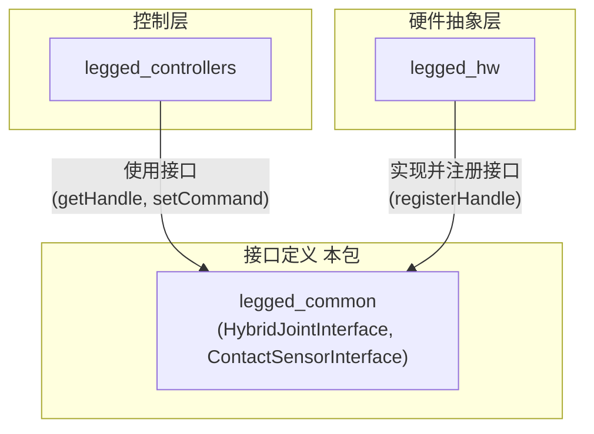

# `legged_common` 包代码分析

## 1. 功能与节点关系

### 1.1. 核心功能

`legged_common` 包是一个基础工具库，它为整个 `legged_control` 项目提供了**自定义的硬件接口**和**共享的数据结构**。它本身不包含任何ROS节点或控制器插件，其主要作用是定义一套标准的通信约定，让上层的控制器 (`legged_controllers`) 能够与底层的硬件 (`legged_hw`) 进行高效、统一的数据交换。

该包的核心功能可以概括为以下两点：

1.  **定义混合关节接口 (`HybridJointInterface`)**: 这是此包最重要的贡献。标准的 `ros_control` 接口通常只允许单独控制关节的位置、速度或力矩。而 `HybridJointInterface` 定义了一个“混合”模式，允许控制器**同时**为一个关节设置期望的位置、速度、前馈力矩以及PD增益。这对于需要精确力控制的腿式机器人至关重要。

2.  **定义接触传感器接口 (`ContactSensorInterface`)**: 定义了一个简单的布尔型接口，用于表示足底是否与地面接触。

### 1.2. 节点关系

`legged_common` 包本身没有节点。它定义的是**接口规范**，作为其他两个包（`legged_controllers` 和 `legged_hw`）之间的“契约”。

**关系说明**:

-   `legged_common` 包定义了 `HybridJointHandle` 和 `ContactSensorHandle` 等接口。
-   硬件抽象层 `legged_hw` **实现**这些接口。它负责从物理硬件（或仿真器）读取真实数据，并将这些数据注册到接口中；同时，它也负责获取接口中的指令数据，并将其发送给物理硬件。
-   控制层 `legged_controllers` **使用**这些接口。它通过 `getHandle` 获取接口的句柄，然后通过句柄读取传感器数据（如关节位置、接触状态），并通过 `setCommand` 将计算出的控制指令（位置、速度、力矩）写入接口。

---

## 2. 各个类/接口中主要方法的功能

### 2.1. `HybridJointInterface` 和 `HybridJointHandle`

这是最核心的接口，用于实现关节的混合控制。

-   `HybridJointHandle(const JointStateHandle& js_handle, ...)`
    -   **功能**: 构造函数。一个 `HybridJointHandle` 实际上聚合了一个标准的 `JointStateHandle` (用于读取关节状态) 和一组用于写入指令的成员变量。
-   `void setCommand(double pos_des, double vel_des, double kp, double kd, double ff)`
    -   **功能**: **核心指令方法**。控制器通过此方法下达一个完整的混合指令，包括：
        -   `pos_des`: 期望的关节位置。
        -   `vel_des`: 期望的关节速度。
        -   `kp`, `kd`: 该关节的PD控制器增益。
        -   `ff`: 前馈力矩 (feedforward torque)。
-   `getPosition()`, `getVelocity()`, `getEffort()`
    -   **功能**: 读取关节的当前状态（位置、速度、力矩）。这些数据由底层的 `legged_hw` 包更新。
-   `get...()` (获取指令值)
    -   **功能**: `getPosDes()`, `getVelDes()`, `getKp()`, `getKd()`, `getFeedforward()`。这些方法允许底层硬件实现读取控制器下达的指令。

### 2.2. `ContactSensorInterface` 和 `ContactSensorHandle`

这是一个简单的传感器接口，用于传递足底的接触信息。

-   `ContactSensorHandle(const std::string& name, const bool* is_contact)`
    -   **功能**: 构造函数。接收一个传感器名称和一个指向布尔型变量的指针，该变量代表接触状态。
-   `bool isContact() const`
    -   **功能**: 控制器通过此方法查询足底是否接触地面。
-   `getName() const`
    -   **功能**: 返回传感器的名称。

### 2.3. `hardware_interface/ImuSensorInterface.h`

虽然这个头文件直接放在 `hardware_interface` 目录下，但它是由 `legged_common` 包提供的，用于定义标准的IMU传感器接口。它遵循了 `ros_control` 的标准模式，提供了读取IMU数据（姿态、角速度、线加速度及其协方差）的方法。

---

## 3. 其他需要说明的内容

-   **`ros_control` 的胶水**: `legged_common` 的本质是 `ros_control` 框架的“胶水”或“扩展包”。它利用 `ros_control` 的机制，定义了一套非标准的、但更适用于腿式机器人控制的接口。这使得上层控制算法的设计可以与具体的硬件实现解耦。
-   **PD + 前馈力矩**: `HybridJointInterface` 的设计思想是**PD控制 + 前馈力矩**。`pos_des`, `vel_des`, `kp`, `kd` 用于计算PD反馈控制力矩 `kp * (pos_des - pos_real) + kd * (vel_des - vel_real)`，而 `ff` 则是模型（如WBC）计算出的前馈力矩。最终施加到关节的总力矩是这两者之和。这种模式结合了反馈控制的鲁棒性和前馈控制的精确性。
-   **与 `legged_hw` 的关系**: 要完全理解 `legged_common` 的作用，必须结合 `legged_hw` 包一起看。`legged_hw` 是这些接口的**实现者**，它负责填充 `getPosition()` 等方法返回的数据，并使用 `getCommand()` 的数据去驱动电机。
