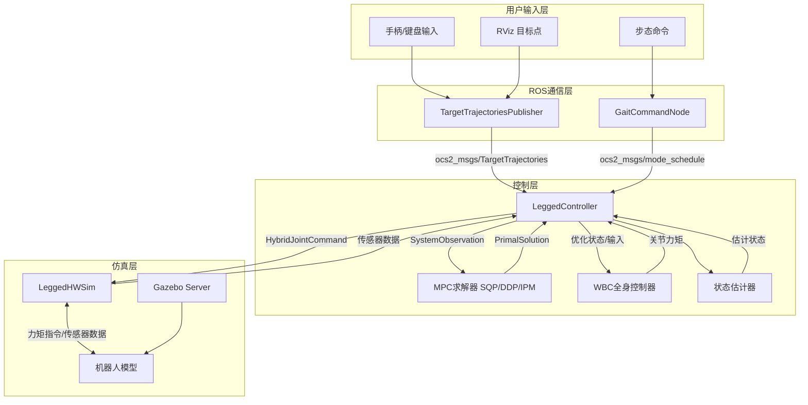
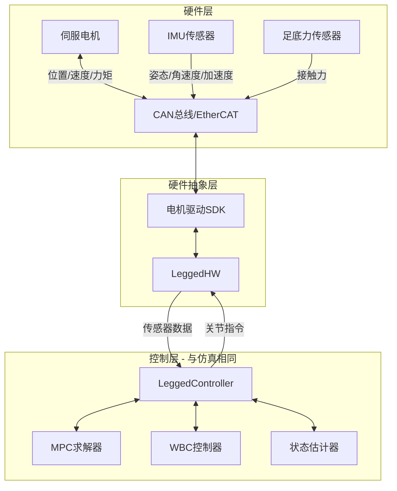
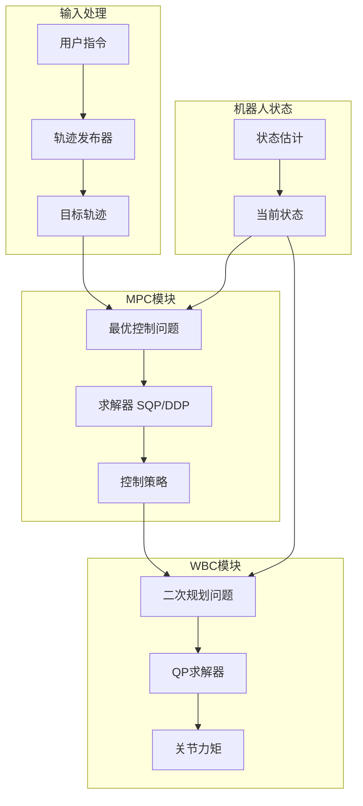

# Legged Control 系统总体分析文档

## 概述

本文档对 legged_control 系统进行总体分析，详细说明了 Gazebo 仿真和实际硬件下的数据流传递，以及从指令/期望轨迹到 MPC 再到 WBC 的完整控制流程。

## 1. Gazebo 仿真环境下的数据流

### 1.1 数据流架构图



### 1.2 关键接口详解

#### 1.2.1 用户指令接口
- **话题**: `/cmd_vel` (geometry_msgs/Twist)
- **话题**: `/move_base_simple/goal` (geometry_msgs/PoseStamped)
- **话题**: `/legged_robot_mpc_mode_schedule` (ocs2_msgs/mode_schedule)
- **功能**: 接收用户的速度指令、目标位置和步态切换命令

#### 1.2.2 MPC通信接口
- **话题**: `/legged_robot_target_trajectories` (ocs2_msgs/mpc_target_trajectories)
- **话题**: `/legged_robot_mpc_observation` (ocs2_msgs/mpc_observation)
- **话题**: `/legged_robot_mpc_policy` (ocs2_msgs/mpc_flattened_controller)
- **功能**: MPC求解器的输入输出通信

#### 1.2.3 硬件抽象接口
- **接口**: `HybridJointInterface`
- **接口**: `ContactSensorInterface`
- **接口**: `ImuSensorInterface`
- **功能**: 提供统一的硬件访问接口

### 1.3 Gazebo仿真数据流程

1. **传感器数据读取** (`LeggedHWSim::readSim()`)
   ```cpp
   // 从Gazebo读取关节状态
   for (unsigned int j = 0; j < n_dof_; ++j) {
     joint_position_[j] = joint_->Position();
     joint_velocity_[j] = joint_->GetVelocity();
   }
   
   // 读取IMU数据
   auto link_pose = link->WorldPose();
   auto angular_vel = link->WorldAngularVel();
   auto linear_accel = link->WorldLinearAccel();
   ```

2. **状态估计更新** (`LeggedController::updateStateEstimation()`)
   ```cpp
   stateEstimate_->updateJointStates(jointPos, jointVel);
   stateEstimate_->updateContact(contactFlag);
   stateEstimate_->updateImu(quat, angularVel, linearAccel, ...);
   measuredRbdState_ = stateEstimate_->update(time, period);
   ```

3. **控制指令写入** (`LeggedHWSim::writeSim()`)
   ```cpp
   // PD+前馈控制计算
   tau = kp * (posDes - pos_actual) + kd * (velDes - vel_actual) + ff;
   // 指令延迟模拟
   cmdBuffer_.push_back(currentCmd);
   auto delayedCmd = cmdBuffer_.front();
   // 施加力矩到Gazebo关节
   joint_->SetForce(0, tau);
   ```

## 2. 实际硬件环境下的数据流

### 2.1 硬件数据流架构图



### 2.2 硬件接口实现

#### 2.2.1 数据读取 (`LeggedHW::read()`)
```cpp
void LeggedHW::read(const ros::Time& time, const ros::Duration& period) {
  // 通过SDK读取关节状态
  for (int i = 0; i < joint_num_; ++i) {
    joint_position_[i] = motor_sdk->getPosition(i);
    joint_velocity_[i] = motor_sdk->getVelocity(i);
    joint_effort_[i] = motor_sdk->getTorque(i);
  }
  
  // 读取IMU数据
  auto imu_data = imu_sdk->getData();
  imu_data_.orientation = imu_data.quaternion;
  imu_data_.angular_velocity = imu_data.gyro;
  imu_data_.linear_acceleration = imu_data.accel;
  
  // 读取足底接触状态
  for (int i = 0; i < contact_num_; ++i) {
    contact_state_[i] = force_sensor_sdk->getContact(i);
  }
}
```

#### 2.2.2 指令写入 (`LeggedHW::write()`)
```cpp
void LeggedHW::write(const ros::Time& time, const ros::Duration& period) {
  for (int i = 0; i < joint_num_; ++i) {
    // 获取混合控制指令
    double pos_des = hybrid_joint_[i].getPositionCommand();
    double vel_des = hybrid_joint_[i].getVelocityCommand();
    double kp = hybrid_joint_[i].getKpCommand();
    double kd = hybrid_joint_[i].getKdCommand();
    double ff = hybrid_joint_[i].getEffortCommand();
    
    // 计算最终力矩 (可在硬件层或控制器层实现)
    double tau = ff + kp * (pos_des - joint_position_[i]) + 
                     kd * (vel_des - joint_velocity_[i]);
    
    // 发送到电机
    motor_sdk->setTorque(i, tau);
  }
}
```

### 2.3 实际硬件与仿真的差异

| 方面 | Gazebo仿真 | 实际硬件 |
|------|------------|----------|
| **通信方式** | Gazebo API调用 | CAN/EtherCAT总线 |
| **延迟模拟** | 软件缓冲区实现 | 真实通信延迟 |
| **传感器噪声** | 可配置噪声模型 | 真实传感器噪声 |
| **动力学模型** | 理想刚体模型 | 包含柔性、摩擦等 |
| **安全机制** | 软件限制 | 硬件保护电路 |

## 3. 指令/期望轨迹 → MPC → WBC 控制流程

### 3.1 完整控制流程图



### 3.2 MPC计算过程详解

#### 3.2.1 最优控制问题构建

MPC求解的核心是最优控制问题 (OCP)：

```
minimize   ∫[t₀,tf] l(x(t), u(t), t) dt + φ(x(tf), tf)
subject to ẋ(t) = f(x(t), u(t), t)
           c(x(t), u(t), t) = 0     (等式约束)
           h(x(t), u(t), t) ≤ 0     (不等式约束)
```

其中：
- `x(t)`: 状态向量 (基座位置、姿态、关节角度等)
- `u(t)`: 输入向量 (接触力、关节速度)
- `l(·)`: 阶段代价函数
- `φ(·)`: 终端代价函数
- `f(·)`: 系统动力学
- `c(·), h(·)`: 约束条件

#### 3.2.2 SQP求解过程

Sequential Quadratic Programming 的迭代过程：

```cpp
void SqpMpc::calculateController(scalar_t initTime, const vector_t& initState, scalar_t finalTime) {
  // 1. 初始化或热启动
  if (settings().coldStart_) {
    solverPtr_->reset();
  }
  
  // 2. 运行SQP求解
  solverPtr_->run(initTime, initState, finalTime);
  
  // 3. 获取最优解
  auto solution = solverPtr_->getPrimalSolution();
  auto performance = solverPtr_->getPerformanceIndices();
}
```

每次SQP迭代求解如下二次规划子问题：

```
minimize   ½ δx^T H δx + g^T δx
subject to A δx = b         (线性化等式约束)
           C δx ≤ d         (线性化不等式约束)
```

#### 3.2.3 MPC输出

MPC求解器输出包含：
- **状态轨迹**: `x*(t)` 
- **输入轨迹**: `u*(t)`
- **反馈策略**: `K(t)` (线性反馈增益)

```cpp
// MPC求解后的策略评估
mpcMrtInterface_->evaluatePolicy(currentObservation_.time, 
                                currentObservation_.state, 
                                optimizedState, 
                                optimizedInput, 
                                plannedMode);
```

### 3.3 WBC计算过程详解

#### 3.3.1 全身控制问题构建

WBC将MPC的高层指令转换为具体关节力矩，求解以下优化问题：

```
minimize   Σᵢ wᵢ ||Aᵢx - bᵢ||²
subject to M q̈ + h = S^T τ + J^T F     (动力学约束)
           τ_min ≤ τ ≤ τ_max            (力矩限制)
           ||F_t|| ≤ μ F_n              (摩擦锥约束)
           J_contact q̇ = 0               (接触约束)
```

其中：
- `x = [q̈; F; τ]`: 决策变量 (加速度、接触力、关节力矩)
- `M`: 质量矩阵
- `h`: 非线性项 (科氏力、重力)
- `S`: 选择矩阵
- `J`: 接触雅可比矩阵

#### 3.3.2 WBC求解实现

```cpp
vector_t WbcBase::update(const vector_t& stateDesired, const vector_t& inputDesired, 
                        const vector_t& rbdStateMeasured, size_t mode, scalar_t period) {
  // 1. 更新测量状态的动力学模型
  updateMeasured(rbdStateMeasured);
  
  // 2. 更新期望状态的动力学模型  
  updateDesired(stateDesired, inputDesired);
  
  // 3. 构建QP任务
  auto floatingBaseEomTask = formulateFloatingBaseEomTask();
  auto torqueLimitsTask = formulateTorqueLimitsTask();
  auto frictionConeTask = formulateFrictionConeTask();
  auto baseAccelTask = formulateBaseAccelTask(stateDesired, inputDesired);
  auto swingLegTask = formulateSwingLegTask(stateDesired, mode);
  auto contactForceTask = formulateContactForceTask(inputDesired);
  
  // 4. 求解QP问题
  vector_t solution = solveQP(tasks);
  
  // 5. 提取关节力矩
  vector_t jointTorques = solution.tail(numActuatedJoints);
  return solution;
}
```

#### 3.3.3 分层vs加权WBC

**分层WBC** (HierarchicalWbc):
```
Priority 0: 动力学约束、力矩限制     (硬约束)
Priority 1: 运动任务               (高优先级软任务)  
Priority 2: 力任务                 (低优先级软任务)
```

**加权WBC** (WeightedWbc):
```
minimize Σᵢ wᵢ ||Aᵢx - bᵢ||²
```

### 3.4 控制流程时序

```
时刻 t:
├─ 1. 传感器数据读取 (1-2ms)
├─ 2. 状态估计更新 (0.5ms)  
├─ 3. MPC策略评估 (0.1ms)
├─ 4. WBC优化求解 (1-3ms)
├─ 5. 关节指令发送 (0.1ms)
└─ 总计: ~5ms (200Hz控制频率)

并行线程:
└─ MPC求解线程 (10-50ms, 20-100Hz)
```

### 3.5 关键公式和参数

#### 3.5.1 质心动力学模型
```
ṗ = v                          (位置积分)
v̇ = (1/m)(Σ Fᵢ) + g            (牛顿第二定律)
İ ω̇ + ω × (I ω) = Σ (rᵢ × Fᵢ)  (欧拉方程)
```

#### 3.5.2 摩擦锥约束
```
||F_tangential|| ≤ μ * F_normal
等价于: √(Fx² + Fy²) ≤ μ * Fz
```

#### 3.5.3 PD+前馈控制律
```
τ = τ_ff + Kp(q_des - q) + Kd(q̇_des - q̇)
```

## 4. 系统性能分析

### 4.1 计算性能

| 模块 | 计算时间 | 频率 | 备注 |
|------|----------|------|------|
| 状态估计 | 0.5ms | 1000Hz | 卡尔曼滤波 |
| MPC求解 | 10-50ms | 20-100Hz | 取决于求解器类型 |
| WBC求解 | 1-3ms | 1000Hz | QP问题规模 |
| 硬件通信 | 0.1ms | 1000Hz | CAN/EtherCAT |

### 4.2 系统延迟分析

```
总延迟 = 传感器延迟 + 状态估计延迟 + 控制计算延迟 + 通信延迟 + 执行器延迟
       ≈ 0.5ms + 0.5ms + 5ms + 0.1ms + 1ms = 7.1ms
```

### 4.3 关键配置参数

```ini
# MPC设置
mpcDesiredFrequency = 100.0    # MPC求解频率
mrtDesiredFrequency = 1000.0   # 控制器运行频率
solutionTimeWindow = 1.0       # 预测时域

# SQP求解器设置  
sqpIteration = 1               # 每次MPC的SQP迭代次数
dt = 0.015                     # 离散化时间步长
nThreads = 3                   # 并行线程数

# WBC设置
frictionCoefficient = 0.7      # 摩擦系数
torqueLimit = 80.0             # 关节力矩限制 (Nm)
```

## 5. 故障处理和安全机制

### 5.1 安全检查器

```cpp
class SafetyChecker {
  bool check(const SystemObservation& observation, 
             const vector_t& optimizedState, 
             const vector_t& optimizedInput) {
    // 1. 姿态检查
    if (!checkOrientation(observation)) return false;
    
    // 2. 速度检查  
    if (!checkVelocity(observation)) return false;
    
    // 3. 力矩检查
    if (!checkTorque(optimizedInput)) return false;
    
    return true;
  }
};
```

### 5.2 错误恢复机制

1. **MPC求解失败**: 使用上一次有效策略
2. **WBC求解失败**: 切换到PD控制模式
3. **通信中断**: 紧急制动
4. **传感器故障**: 降级状态估计
5. **姿态翻倒**: 立即停止所有电机

## 6. 总结

Legged Control 系统通过分层的控制架构实现了复杂的腿式机器人控制：

1. **用户层**: 提供直观的速度和位置指令接口
2. **规划层**: MPC求解器生成最优的运动轨迹和接触力
3. **执行层**: WBC控制器将高层指令转换为具体关节力矩
4. **硬件层**: 统一的硬件抽象接口支持仿真和实物切换

系统设计的核心优势在于：
- **模块化**: 各层相对独立，便于开发和调试
- **实时性**: 满足1000Hz控制频率要求
- **鲁棒性**: 完善的安全检查和错误恢复机制
- **通用性**: 支持多种腿式机器人平台
