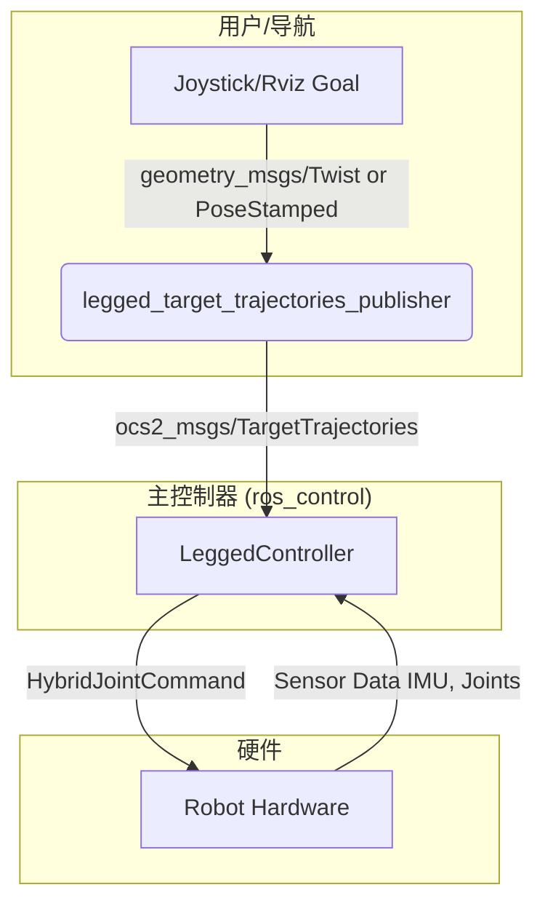
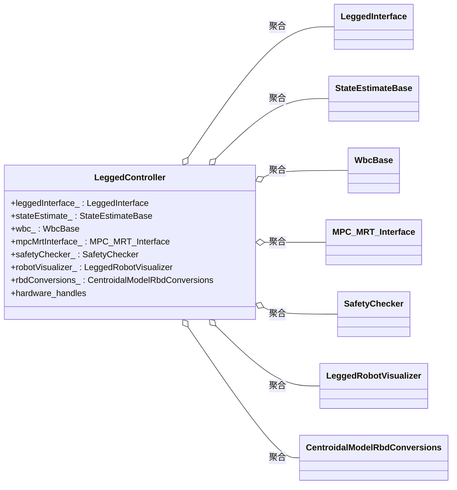

# `legged_controllers` 包代码分析

## 1. 功能与节点关系

### 1.1. 核心功能

`legged_controllers` 包是整个腿式机器人控制框架的顶层协调器和执行器。它以 `ros_control` 控制器插件的形式运行在主控制循环中，负责：

1.  **整合模块**: 将状态估计 (`legged_estimation`)、最优控制问题定义 (`legged_interface`)、模型预测控制 (`ocs2`) 和全身控制 (`legged_wbc`) 等模块有机地整合在一起。
2.  **硬件交互**: 通过 `ros_control` 的硬件接口，读取传感器数据（IMU、关节编码器、足底接触传感器）并向关节发送指令（期望的位置、速度和力矩）。
3.  **执行控制循环**: 在每个控制周期 (`update`函数) 中，执行“感知-规划-行动”的完整流程：
    *   **感知**: 调用状态估计模块更新机器人当前状态。
    *   **规划**: 将当前状态发送给MPC求解器，并获取最新的最优策略（状态和输入）。
    *   **行动**: 将MPC的输出传递给WBC，计算出最终的关节力矩，并通过硬件接口发送给电机。
4.  **接收外部指令**: 通过 `TargetTrajectoriesPublisher` 节点接收来自用户（如手柄）或导航系统的指令，并将其转换为MPC可以理解的目标轨迹。

### 1.2. 节点关系

**关系说明**:

-   `legged_target_trajectories_publisher` 节点是一个独立的ROS节点。它订阅 `/cmd_vel` (来自手柄) 或 `/move_base_simple/goal` (来自Rviz) 话题，将这些高级指令转换成详细的**目标轨迹** (`TargetTrajectories` 消息)，然后发布出去。
-   `LeggedController` 是一个 `ros_control` 插件，运行在实时控制循环中。它订阅 `legged_target_trajectories_publisher` 发布的目标轨迹。
-   `LeggedController` 从机器人硬件 (`RobotHW`) 读取传感器数据，经过一系列计算后，将最终的关节指令（位置、速度、力矩）发送给硬件。

---

## 2. 主要类和方法的功能

### 2.1. `LeggedController`

这是一个 `controller_interface::MultiInterfaceController`，是控制逻辑的核心。

-   `bool init(...)`
    -   **功能**: 初始化所有模块。包括加载配置文件、设置 `LeggedInterface`、初始化MPC和WBC、设置状态估计器、并获取硬件接口的句柄。
-   `void starting(...)`
    -   **功能**: 在控制器启动时调用。它获取机器人的初始状态，设置MPC的第一个目标，并等待MPC计算出初始策略，确保平稳启动。
-   `void update(...)`
    -   **功能**: **主控制循环**。在每个控制周期被 `ros_control` 管理器调用。
        1.  调用状态估计模块更新当前状态。
        2.  将当前状态传递给MPC/MRT接口 (`mpcMrtInterface_`)。
        3.  获取MPC计算出的当前时刻的最优状态和输入。
        4.  将MPC的结果传递给WBC进行精细计算，得到最终的关节力矩。
        5.  执行安全检查。
        6.  通过硬件接口将指令发送给所有关节。
        7.  更新并发布可视化数据。

### 2.2. `TargetTrajectoriesPublisher`

这是一个独立的ROS节点，作为用户指令和MPC之间的接口。

-   `TargetTrajectoriesPublisher(...)`
    -   **功能**: 构造函数。初始化ROS的订阅者和发布者。
        -   **订阅**: `/cmd_vel` (速度指令), `/move_base_simple/goal` (目标点指令), 以及 `..._mpc_observation` (获取机器人当前状态)。
        -   **发布**: `.../target_trajectories`。
-   `goalToTargetTrajectories(...)` / `cmdVelToTargetTrajectories(...)`
    -   **功能**: 这是两个核心的回调函数或函数对象。它们负责将简单的用户指令（如“向前走”、“向左转”）转换成一个包含时间、状态和输入的完整轨迹序列 (`TargetTrajectories`)。这个轨迹序列会作为参考，引导MPC进行优化。

---

## 3. `LeggedController` 内部对象/成员变量分析

`LeggedController` 类是整个控制系统的中枢，它聚合了来自其他模块的对象来实现复杂的控制逻辑。

-   `leggedInterface_ : LeggedInterface`
    -   **作用**: **最优控制问题 (OCP) 的定义者**。这是连接机器人模型和OCS2求解器的桥梁。它从配置文件中加载机器人的动力学、运动学、成本函数权重（Q, R矩阵）和各种物理约束（摩擦锥、自碰撞等），并将它们组装成一个 OCS2 框架能理解的 `OptimalControlProblem` 对象。它是MPC进行优化的“蓝图”。

-   `stateEstimate_ : StateEstimateBase`
    -   **作用**: **状态估计器**。它负责融合来自硬件的原始传感器数据（IMU、关节编码器、足端接触力），并估计出机器人的完整状态（如 `KalmanFilterEstimate`）。在仿真中，可以切换为 `FromTopicStateEstimate` 来直接订阅“真实”状态。其输出是 `measuredRbdState_`。

-   `wbc_ : WbcBase`
    -   **作用**: **全身控制器**。它接收来自MPC的、基于简化模型的优化结果（期望状态和输入），然后利用**完整的刚体动力学模型**，通过求解一个QP问题，计算出最终施加到每个关节的精确力矩。它相当于MPC的“执行增强器”，确保在满足所有物理约束的前提下，精确地执行上层指令。

-   `mpcMrtInterface_ : MPC_MRT_Interface`
    -   **作用**: **MPC的实时接口**。MPC的计算非常耗时，不能在实时控制循环中同步执行。因此，MPC在一个单独的后台线程 (`mpcThread_`) 中运行。`mpcMrtInterface_` 扮演了主控制线程和MPC后台线程之间的“信使”角色。主线程通过它发送最新的机器人状态，并异步地获取MPC计算出的最新策略，从而避免了控制循环的阻塞。

-   `rbdConversions_ : CentroidalModelRbdConversions`
    -   **作用**: **状态表示的转换器**。状态估计器输出的是传统的**刚体动力学 (RBD)** 状态（基座姿态+关节角度）。而OCS2的MPC求解器使用的是**质心动力学**状态（质心动量+基座姿态+关节角度）。这个对象的作用就是在这两种状态表示之间进行转换。

-   `safetyChecker_ : SafetyChecker`
    -   **作用**: **安全监视器**。这是一个简单的保护模块，用于检查机器人是否处于危险状态（例如，姿态倾覆）。如果检测到危险，它会立即停止控制器，防止对机器人造成损害。

-   `robotVisualizer_ / selfCollisionVisualization_`
    -   **作用**: **可视化工具**。这些对象负责将控制器内部的状态、MPC的规划结果、WBC的计算结果、自碰撞检测距离等信息发布为ROS消息，以便在Rviz等工具中进行三维可视化，方便调试和监控。

-   `hybridJointHandles_ / contactHandles_ / imuSensorHandle_`
    -   **作用**: **硬件接口句柄**。这些是 `ros_control` 提供的标准接口，是控制器与物理硬件（或Gazebo仿真环境）之间通信的唯一途径。控制器通过它们读取传感器数据，并下发最终的控制指令。

---

## 4. 其他相关类和文件补充

### 4.1. `LeggedCheaterController`

这是一个派生自 `LeggedController` 的特殊控制器。它与主控制器的唯一区别在于 `setupStateEstimate` 方法的实现。它不使用 `KalmanFilterEstimate` 进行状态估计，而是使用 `FromTopicStateEstimate`。

-   **用途**: "Cheater"（作弊）控制器主要用于**仿真环境**。它可以直接从仿真器（如Gazebo）发布 `/ground_truth/state` 话题中订阅到完美、无噪声的机器人状态，从而绕过了复杂的状态估计过程。这使得开发者可以专注于调试和验证控制算法本身（MPC和WBC），而不用担心状态估计可能引入的误差。

### 4.2. `SafetyChecker`

这是一个简单的安全检查类。

-   `bool checkOrientation(...)`: 目前实现的核心检查。它获取机器人基座的姿态，并判断其俯仰角或翻滚角是否超出了安全阈值（默认为 ±90度）。如果超出，意味着机器人可能已经摔倒或即将倾覆，此时应停止控制器。

### 4.3. `LeggedSelfCollisionVisualization`

这是一个用于可视化的辅助类。

-   `void update(...)`: 它接收最新的机器人状态，使用 `PinocchioGeometryInterface` 计算预定义的碰撞体对之间的最短距离，并将这些距离信息发布为 `visualization_msgs/MarkerArray`，可以在Rviz中显示为连线或球体，直观地展示机器人肢体间的接近程度。

### 4.4. 配置文件 (`config/`)

-   `controllers.yaml`: 为 `controller_manager` 定义了可用的控制器插件，将字符串名称（如 `legged/LeggedController`）映射到实际的C++类。
-   `joy.yaml`: 配置手柄遥控。定义了手柄的哪个轴/按钮控制机器人的哪个方向的线速度或角速度。
-   `gait.info`: **步态库**。定义了各种步态（trot, pace, stance等）的模式序列和持续时间。`GaitReceiver` 模块会读取此文件，并根据指令切换步态。
-   `reference.info`: 定义了默认的参考值，如默认的质心高度、默认的关节站立姿态等。
-   `task.info`: **核心配置文件**。这个文件极为重要，它定义了最优控制问题（OCP）的几乎所有参数，包括：
    -   MPC、DDP/SQP求解器的参数（迭代次数、容差等）。
    -   成本函数中的权重矩阵 `Q` 和 `R`。
    -   各种约束的参数（如摩擦系数）。
    -   WBC中各个任务的权重。
    -   状态估计器（卡尔曼滤波器）的噪声参数。

### 4.5. 启动文件 (`launch/`)

-   `load_controller.launch`: 主启动文件。它负责将URDF和所有 `.info` 配置文件加载到ROS参数服务器，然后启动 `controller_manager` 并加载 `LeggedController`。同时，它也启动了 `legged_target_trajectories_publisher` 节点和 `legged_robot_gait_command` 节点（用于接收和处理步态切换指令）。
-   `joy_teleop.launch`: 启动手柄驱动和遥控节点的便捷工具。
