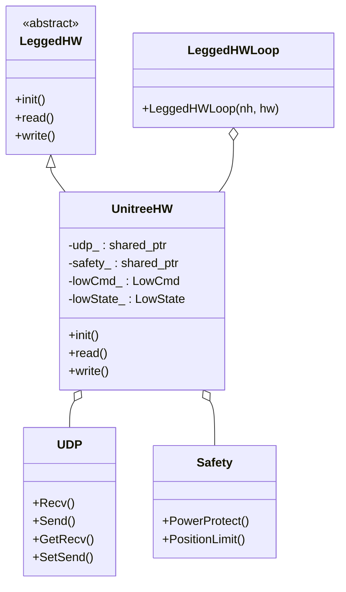

### `legged_examples` 包分析

`legged_examples` 包提供了一个具体的示例，展示了如何将 `legged_control` 框架应用于特定的机器人硬件，这里以宇树科技（Unitree）的四足机器人为例。它主要包含两个子包：`legged_unitree_description` 用于机器人模型描述，`legged_unitree_hw` 用于与真实硬件的接口。

#### 1. 功能与类间关系

**功能说明**

*   **`legged_unitree_description`**: 这个包负责定义宇树系列机器人（A1, Aliengo, Go1, Go2）的物理模型。它使用URDF (Unified Robot Description Format) 和 xacro (XML Macros) 来描述机器人的连杆、关节、惯性参数、碰撞模型和视觉模型。这些模型文件是进行Gazebo仿真和在RViz中进行可视化的基础。
*   **`legged_unitree_hw`**: 这个包是连接`ros_control`框架和宇树机器人硬件的桥梁，即硬件接口（Hardware Interface）。它通过宇树官方提供的SDK，读取真实机器人的传感器数据（如关节状态、IMU数据），并将上层控制器计算出的指令发送给机器人电机。

**类间关系**

`legged_unitree_hw` 包中的核心是 `UnitreeHW` 类，它与 `legged_hw` 包以及Unitree SDK中的类紧密协作。

**关系说明:**

1.  `UnitreeHW` 类继承自 `legged_hw` 包中的抽象基类 `LeggedHW`。它必须实现 `init`, `read`, `write` 这三个纯虚函数，这是 `ros_control` 对硬件接口的标准要求。
2.  `legged_unitree_hw` 的主程序会创建一个 `UnitreeHW` 的实例，并将其传递给 `legged_hw` 包中的 `LeggedHWLoop` 类。`LeggedHWLoop` 负责管理一个实时的控制循环，周期性地调用 `UnitreeHW` 的 `read` 和 `write` 方法。
3.  在 `UnitreeHW` 内部，它会创建并持有两个来自Unitree SDK的关键对象：`UDP` 和 `Safety`。
    *   `UDP` 对象负责与机器人硬件进行底层的UDP网络通信。
    *   `Safety` 对象则用于在发送指令前对指令进行安全检查，如功率和关节位置限制。
4.  `UnitreeHW` 通过 `UDP` 对象接收机器人的状态数据（`LowState`），并发送控制指令（`LowCmd`）。

#### 2. 各个类中各个方法的功能

##### `legged_unitree_description` 包

这个包主要由配置文件（URDF/xacro）和启动文件（launch）组成，不包含自定义的类。

*   **`urdf/robot.xacro`**: 主xacro文件，通过 `robot_type` 参数来包含不同型号机器人的常数文件（`const.xacro`）和通用模块（如`leg.xacro`），从而生成完整的机器人URDF模型。
*   **`urdf/common/leg.xacro`**: 定义了一个通用的腿部宏，包括髋关节（HAA）、大腿关节（HFE）和小腿关节（KFE）的连杆和关节。通过参数（如`prefix`, `mirror`）可以实例化为四条不同的腿（LF, RF, LH, RH）。
*   **`launch/empty_world.launch`**: 用于启动一个空的Gazebo世界，并使用 `spawn_model` 节点将 `robot.xacro` 生成的机器人模型加载到仿真环境中。
*   **`launch/legged_unitree_hw.launch`**: 用于启动真实机器人的硬件接口。它同样通过 `robot_type` 参数加载对应的配置文件和启动文件。

##### `legged_unitree_hw` 包

*   **`UnitreeHW` 类 (`UnitreeHW.h`, `UnitreeHW.cpp`)**
    *   `bool init()`:
        1.  从ROS参数服务器读取配置，如机器人型号（`robot_type`）、功率限制（`power_limit`）等。
        2.  调用 `setupJoints()`, `setupImu()`, `setupContactSensor()` 方法，注册`ros_control`所需的硬件接口（`HybridJointInterface`, `ImuSensorInterface`, `ContactSensorInterface`）。
        3.  根据机器人型号和SDK版本宏（`UNITREE_SDK_3_3_1` 或 `UNITREE_SDK_3_8_0`）初始化 `UDP` 和 `Safety` 对象。
        4.  初始化ROS发布者，用于发布遥控器和接触力信息。
    *   `void read()`:
        1.  调用 `udp_->Recv()` 和 `udp_->GetRecv(lowState_)` 从机器人硬件接收最新的状态数据。
        2.  解析 `lowState_` 结构体，将12个关节的位置、速度、力矩数据，以及IMU的姿态、角速度、线加速度数据，更新到`ros_control`接口对应的成员变量中。
        3.  根据足底力传感器的数据（`lowState_.footForce`）和设定的阈值（`contactThreshold_`）更新接触状态。
        4.  调用 `updateJoystick()` 和 `updateContact()` 将遥控器和足底力数据发布到ROS话题。
    *   `void write()`:
        1.  从`ros_control`的 `hybridJointInterface_` 获取上层控制器计算出的指令（期望位置、速度、前馈力矩、Kp、Kd）。
        2.  将这些指令填充到 `lowCmd_` 结构体中。
        3.  调用 `safety_->PositionLimit(lowCmd_)` 和 `safety_->PowerProtect(lowCmd_, ...)` 对指令进行安全限制。
        4.  调用 `udp_->SetSend(lowCmd_)` 和 `udp_->Send()` 将最终的指令通过UDP发送给机器人。

*   **`legged_unitree_hw.cpp` 中的 `main()` 函数**
    *   作为ROS节点的入口点。
    *   创建一个 `legged::UnitreeHW` 类的实例。
    *   调用该实例的 `init()` 方法进行初始化。
    *   创建一个 `legged::LeggedHWLoop` 类的实例，并将 `UnitreeHW` 实例传递给它。`LeggedHWLoop` 会启动一个高优先级的实时线程，以设定的频率（如500Hz）循环调用 `read()` 和 `write()` 方法，从而驱动整个`ros_control`流程。

#### 3. SDK 的作用

SDK（Software Development Kit，软件开发工具包）在这里特指宇树科技为其机器人产品提供的、用于二次开发的库。它的核心作用是**封装和简化与机器人硬件的底层通信**。

1.  **封装通信协议**: 机器人硬件通过UDP协议与外部计算机进行通信。SDK将这个过程封装起来，开发者无需手动处理socket编程、数据打包、CRC校验等复杂的细节。
2.  **定义数据接口**: SDK以C++结构体（如 `LowState`, `LowCmd`）的形式，清晰地定义了可以从机器人读取哪些状态数据，以及可以向机器人发送哪些控制指令。这为开发提供了统一、规范的接口。
3.  **提供高级功能**: 除了基础的收发功能，SDK还可能包含一些高级功能，例如 `Safety` 类提供的安全保护机制，这极大地降低了开发门槛，并提高了开发的安全性。
4.  **跨平台与版本管理**: SDK通常会处理不同硬件版本或固件版本之间的差异，为上层应用提供一个相对稳定的API。如此例中，通过宏来适配3.3.1和3.8.0两个版本的SDK。

总之，SDK是硬件制造商提供给开发者的“驱动程序”和“API集合”，使得开发者可以专注于上层算法的开发，而无需深入了解硬件通信的底层实现。在这个项目中，`legged_unitree_hw` 包正是基于Unitree SDK，将机器人硬件接入了更通用的`ros_control`生态系统。

#### 4. 补充说明

*   **代码的灵活性与可扩展性**: 该包通过 `robot_type` 参数和独立的配置文件，实现了对多种不同型号机器人的支持，展示了良好的代码组织结构。当需要支持新的Unitree机器人时，只需添加新的`const.xacro`和`config.yaml`文件，并对代码进行少量修改即可。
*   **SDK版本处理**: 使用C++的预处理宏（`#ifdef`）来处理不同版本的SDK是一个常见的兼容性处理手段。这使得同一套源代码可以编译出适用于不同硬件（如A1和Go1）的可执行文件，避免了代码库的分裂。
*   **仿真与实物的分离**: `legged_unitree_description` 和 `legged_unitree_hw` 两个包的分离，体现了仿真与实物代码分离的良好实践。上层的控制器代码可以无缝地在Gazebo仿真和真实机器人上切换，只需在启动时加载不同的底层节点（仿真节点或硬件接口节点）。
