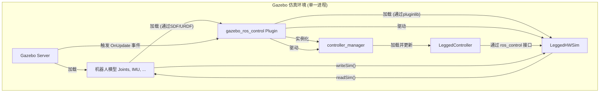

# `legged_gazebo` 包代码分析

## 1. 功能与节点关系

### 1.1. 核心功能

`legged_gazebo` 包是整个控制系统在 **Gazebo 仿真环境**中的硬件抽象层 (HAL) 实现。它的核心作用是**为标准的 `gazebo_ros_control` 插件提供一个针对腿式机器人的、定制化的 `RobotHWSim` 实现**。

此包并不创建一个全新的Gazebo插件，而是扩展了 `ros_control` 在Gazebo中的标准工作模式。其核心功能可以概括为：

1.  **实现 `RobotHWSim`**: 包的核心是一个名为 `LeggedHWSim` 的C++类，它继承自 `gazebo_ros_control::DefaultRobotHWSim`。它重载了父类的 `initSim`, `readSim`, `writeSim` 等关键方法，以加入对自定义接口的支持。
2.  **扩展硬件接口**: 在 `DefaultRobotHWSim` 提供的标准关节接口基础上，`LeggedHWSim` 额外注册并实现了 `legged_common` 中定义的 `HybridJointInterface`、`ContactSensorInterface` 和 `ImuSensorInterface`。
3.  **模拟传感器**: 在 `readSim` 方法中，它通过调用Gazebo的API来直接读取仿真模型中连杆（link）的状态，从而模拟IMU数据；并通过查询Gazebo的接触管理器 (`ContactManager`) 来模拟足底接触传感器。
4.  **执行混合控制指令**: 在 `writeSim` 方法中，它获取上层控制器通过 `HybridJointInterface` 下达的混合指令，并根据 `PD+前馈` 的公式计算出最终应施加到仿真关节上的力矩。
5.  **模拟指令延迟**: `writeSim` 中实现了一个指令缓冲区，可以模拟真实世界中存在的通信延迟，使仿真更接近现实。

### 1.2. 节点关系

在仿真环境中，所有与硬件抽象层相关的逻辑都运行在Gazebo的进程中，由标准的 `gazebo_ros_control` 插件进行调度。

**关系说明**:

1.  Gazebo启动时，会加载机器人模型，模型文件中指定的**标准 `gazebo_ros_control` 插件**被加载。
2.  `gazebo_ros_control` 插件根据SDF/URDF中的 `<plugin>` 标签参数，通过 `pluginlib` 查找并加载名为 `legged_gazebo/LeggedHWSim` 的 `RobotHWSim` 实现，并创建 `LeggedHWSim` 的实例 `H`。
3.  `gazebo_ros_control` 插件同时创建 `controller_manager` 的实例 `CM`。
4.  在每个仿真周期，Gazebo的更新事件会触发 `gazebo_ros_control` 插件的 `update()` 方法。
5.  在该 `update()` 方法内部，会严格按照顺序调用：
    *   `H.readSim()`: 从Gazebo读取传感器数据。
    *   `CM.update()`: 触发 `LeggedController` 等所有活动控制器的计算。
    *   `H.writeSim()`: 将控制器计算出的指令写入Gazebo。

---

## 2. 各个节点类中各个方法的功能

### 2.1. `LeggedHWSim` (仿真硬件抽象类)

-   `bool initSim(...) override`
    -   **功能**: **初始化并扩展接口**。
        1.  首先调用父类 `DefaultRobotHWSim::initSim` 来完成标准关节接口的注册。
        2.  **注册 `HybridJointInterface`**: 遍历所有已注册的标准关节句柄，为每个句柄额外创建一个 `HybridJointHandle`，并将其注册到 `hybridJointInterface_` 中。
        3.  **注册 `ImuSensorInterface`**: 调用 `parseImu` 方法，根据 `config/default.yaml` 中的配置，找到对应的link，并注册IMU传感器句柄。
        4.  **注册 `ContactSensorInterface`**: 调用 `parseContacts` 方法，根据配置注册足底接触传感器句柄。
        5.  获取Gazebo的接触管理器 `contactManager_`。

-   `void readSim(...) override`
    -   **功能**: **从Gazebo读取数据**。
        1.  重写了父类的 `readSim`，手动计算关节速度以避免偏差。
        2.  **读取IMU**: 遍历 `imuDatas_`，直接从Gazebo的 `link` 对象获取世界坐标系下的姿态、角速度和线加速度，并更新到IMU句柄中。
        3.  **读取接触状态**: 遍历 `contactManager_` 返回的所有接触点，检查碰撞体名称是否与已注册的接触传感器名称匹配，以此更新接触状态。
        4.  **清空指令**: 在每次读取的最后，将所有指令相关的变量（包括 `HybridJoint` 的期望值）清零，以避免在没有控制器加载时机器人出现异常行为。

-   `void writeSim(...) override`
    -   **功能**: **向Gazebo写入指令**。
        1.  **处理延迟**: 将当前收到的 `HybridJoint` 指令存入一个缓冲区 `cmdBuffer_`。如果配置了延迟 `delay_`，则取出缓冲区中对应延迟时间的旧指令来执行。
        2.  **计算最终力矩**: 根据取出的（可能是延迟后的）指令，应用 `PD+前馈` 公式计算最终力矩：
            `tau = kp * (posDes - pos_actual) + kd * (velDes - vel_actual) + ff`
        3.  将计算出的力矩 `tau` 写入标准 `joint_effort_command_` 数组中。
        4.  最后调用父类 `DefaultRobotHWSim::writeSim`，由父类将 `joint_effort_command_` 中的力矩施加到Gazebo的关节上。

---

## 3. 其他需要说明的内容

-   **`gazebo_ros_control` 的插件机制**: 理解 `legged_gazebo` 的关键在于理解 `gazebo_ros_control` 的工作模式。它定义了一个 `gazebo_ros_control::RobotHWSim` 的基类，开发者可以编写自己的派生类（如 `LeggedHWSim`）来实现特定的硬件行为，然后通过 `pluginlib` 将其注册。`gazebo_ros_control` 插件在加载时，会根据URDF中的配置，动态加载用户指定的 `RobotHWSim` 实现。这是一种非常灵活和强大的扩展机制。
-   **仿真延迟模拟**: `LeggedHWSim::writeSim` 中通过一个 `std::deque` 作为指令缓冲区，并结合 `delay_` 参数，巧妙地模拟了真实世界中从控制器发出指令到执行器实际响应之间的延迟。这对于开发对时间敏感的鲁棒控制器非常有帮助。
-   **与 `legged_hw` 的一致性**: 尽管 `LeggedHWSim` 的内部实现完全基于Gazebo的API，但它对外暴露的 `ros_control` 接口与 `legged_hw` 包中的 `LeggedHW` 完全一致。这保证了上层 `LeggedController` 的代码可以不经修改地在仿真和现实之间切换，是本框架设计的精髓所在。