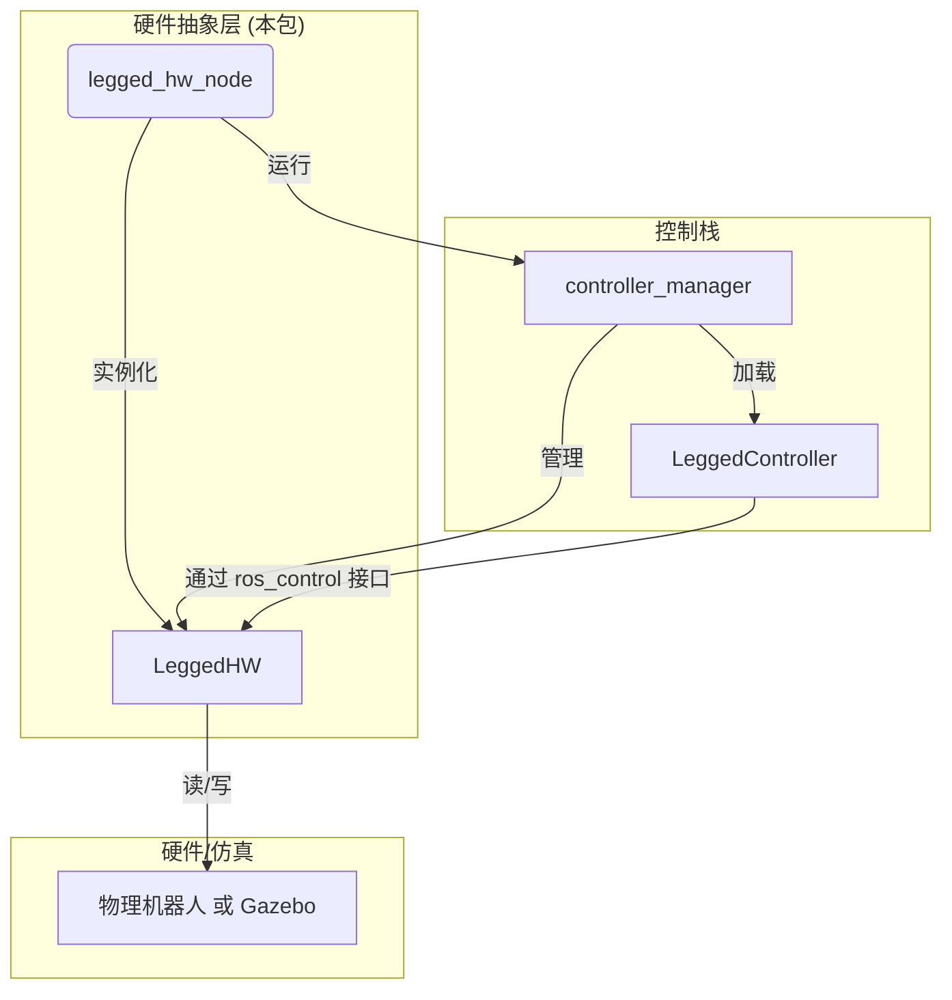

# `legged_hw` 包代码分析

## 1. 功能与节点关系

### 1.1. 核心功能

`legged_hw` 包是整个控制框架的**硬件抽象层 (Hardware Abstraction Layer, HAL)**。它位于控制栈的最底层，直接与机器人硬件或Gazebo仿真环境进行通信。其核心功能是**将 `ros_control` 的标准化接口与具体的硬件/仿真器实现进行对接**。

具体来说，它负责：

1.  **实现标准接口**: 它**实现**了在 `legged_common` 包中定义的自定义硬件接口，特别是 `HybridJointInterface` 和 `ContactSensorInterface`。
2.  **数据读取 (read)**: 从机器人硬件（通过CAN总线、EtherCAT或SDK）或Gazebo中读取真实的传感器数据，例如每个关节的实际位置、速度、力矩，IMU的姿态和角速度，以及足底的接触状态。
3.  **指令写入 (write)**: 将上层控制器 (`LeggedController`) 通过 `HybridJointInterface` 下达的混合指令（期望位置、速度、PD增益、前馈力矩）解析并发送给机器人硬件或Gazebo。
4.  **提供控制循环**: 包内包含一个ROS节点 (`legged_hw_node`)，它以高频率运行一个控制循环，驱动 `ros_control` 的 `read-update-write` 流程。

### 1.2. 节点关系

**关系说明**:

-   `legged_hw_node` 是一个独立的ROS节点，是硬件通信的入口。它在 `main` 函数中创建了 `controller_manager` 和 `LeggedHW` 的实例。
-   `LeggedHW` 是一个继承自 `hardware_interface::RobotHW` 的类，是硬件抽象的核心。
-   `controller_manager` 负责管理 `LeggedHW` 和上层加载的控制器（如 `LeggedController`）之间的交互，并以固定的频率驱动 `read-update-write` 的控制循环。
-   `LeggedHW` 负责与物理机器人或Gazebo进行双向数据通信。它对上层控制器屏蔽了底层硬件的实现细节。

---

## 2. 各个节点类中各个方法的功能

### 2.1. `LeggedHW` (硬件抽象类)

-   `bool init(ros::NodeHandle& root_nh, ros::NodeHandle& robot_hw_nh)`
    -   **功能**: 初始化。
        1.  解析来自ROS参数服务器的配置（例如，是连接到仿真还是真实硬件）。
        2.  建立与硬件或Gazebo的通信连接。
        3.  **注册接口**: 遍历所有关节和传感器，创建对应的 `HybridJointHandle`、`ImuSensorHandle` 和 `ContactSensorHandle`，并将它们注册到 `ros_control` 的资源管理器中。这是让上层控制器能够找到并使用这些硬件资源的关键一步。

-   `void read(const ros::Time& time, const ros::Duration& period)`
    -   **功能**: **读取数据**。在每个控制周期的开始被 `controller_manager` 调用。
        1.  从硬件或Gazebo获取最新的传感器数据包。
        2.  解析数据包，提取出每个关节的实际位置、速度、力矩，以及IMU和接触传感器的数据。
        3.  将这些读取到的新数据更新到 `init` 阶段注册的各个 `Handle` 的内部状态变量中。

-   `void write(const ros::Time& time, const ros::Duration& period)`
    -   **功能**: **写入指令**。在每个控制周期的末尾被 `controller_manager` 调用。
        1.  遍历所有 `HybridJointHandle`。
        2.  从每个 `Handle` 中获取由 `LeggedController` 写入的指令值，即 `pos_des`, `vel_des`, `kp`, `kd`, `ff`。
        3.  **计算最终力矩**: 在这里，它将上层的混合指令转化为电机能够理解的最终指令。通常，最终力矩 `tau` 的计算公式为：
            `tau = ff + kp * (pos_des - pos_actual) + kd * (vel_des - vel_actual)`
        4.  将计算出的最终力矩 `tau` 打包并通过SDK或Gazebo插件发送给相应的电机。

### 2.2. `legged_hw_node` (主节点)

-   `int main(...)`
    -   **功能**: ROS节点的主函数。
        1.  初始化ROS节点。
        2.  创建一个 `LeggedHW` 的实例。
        3.  调用 `hw.init()` 进行初始化。
        4.  创建一个 `controller_manager::ControllerManager` 的实例，并将其与 `LeggedHW` 实例关联。
        5.  启动一个异步的ROS spinner (`ros::AsyncSpinner`) 来处理ROS消息回调。
        6.  进入一个高频的、死循环的**控制循环 (control loop)**。
        7.  在循环中，严格按照 `hw.read()` -> `cm.update()` -> `hw.write()` 的顺序执行。`cm.update()` 会触发所有活动控制器（如 `LeggedController`）的 `update` 方法。

---

## 3. 其他需要说明的内容

-   **仿真与现实的切换**: `LeggedHW` 的设计关键在于其**可替代性**。通常，项目中会有一个 `LeggedHW.cpp` 用于与真实机器人通信，以及一个 `LeggedHWSim.cpp` 用于与Gazebo通信。通过在launch文件中设置参数或使用编译宏，用户可以选择加载其中一个版本，而上层控制器代码完全不需要改变。这是实现“仿真-现实”无缝切换的核心。
-   **`ros_control` 的生命周期**: `legged_hw_node` 中的 `main` 函数完美地展示了 `ros_control` 的标准工作模式。`controller_manager` 就像一个调度器，它确保了数据流的正确时序：先从硬件读取状态 (`read`)，然后让控制器根据最新状态进行计算 (`update`)，最后将计算出的指令写入硬件 (`write`)。
-   **`HybridJointInterface` 的最终归宿**: `legged_common` 定义了接口，`legged_controllers` 使用接口下达指令，而 `legged_hw` 则是这个接口的最终**实现者和消费者**。它在 `write` 方法中真正地解释并执行了“PD+前馈”混合控制策略的含义。
