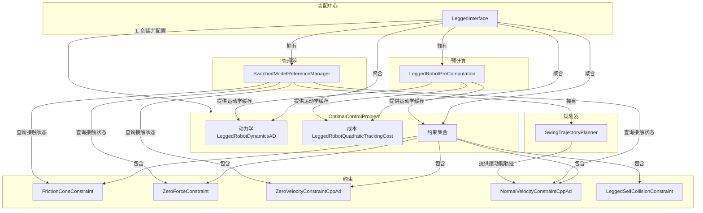

# `legged_interface` 包代码分析

## 1. 功能与节点关系

### 1.1. 核心功能

`legged_interface` 是连接机器人物理模型与 OCS2 最优控制求解器的核心桥梁。它本身不包含任何直接运行的ROS节点，而是以一个C++库的形式存在。其核心功能是**构建和配置一个完整的 dla 腿式机器人的最优控制问题 (Optimal Control Problem, OCP)**。

这个OCP对象封装了解决模型预测控制（MPC）所需的所有元素，包括：

1.  **动力学模型**: 描述机器人如何运动。
2.  **成本函数**: 定义了控制目标，例如跟踪期望的身体姿态和速度。
3.  **约束条件**: 定义了物理和任务限制，例如：
    *   足端与地面的摩擦力不能超过摩擦锥。
    *   支撑腿的速度必须为零。
    *   摆动腿的接触力必须为零。
    *   摆动腿需要遵循预定的轨迹。
    *   机器人不能自碰撞。

最终，由这个包组装好的 OCP 对象会被传递给上层的 MPC 求解器（如 DDP、SQP），计算出最优的控制指令（关节力矩等）。

### 1.2. 类之间的关系 (Mermaid 图)

下图展示了 `legged_interface` 包中主要类之间的协作关系。

**关系说明**:

-   `LeggedInterface` 是所有组件的**装配中心**。它创建并持有 `OptimalControlProblem` (OCP) 对象。
-   `LeggedInterface` 负责将具体的**动力学**、**成本**和各种**约束**类实例化，并添加到 OCP 中。
-   `SwitchedModelReferenceManager` 负责管理**步态**和**参考轨迹**。所有的约束类都需要向它查询当前的**接触模式**（`getContactFlags`），以决定自己是否应该被激活。
-   `SwingTrajectoryPlanner` 被 `SwitchedModelReferenceManager` 持有，专门为**摆动腿**规划轨迹。
-   `NormalVelocityConstraintCppAd` 约束从 `SwingTrajectoryPlanner` 获取期望的摆动腿轨迹。
-   `LeggedRobotPreComputation` 在求解前被调用，用于**缓存**运动学计算结果，供所有其他组件高效使用。

---

## 2. 各个类中主要方法的功能

### 2.1. `LeggedInterface`

-   `LeggedInterface(...)`
    -   **功能**: 构造函数。加载任务、URDF和参考文件路径，并读取MPC、DDP等求解器的配置参数。
-   `void setupOptimalControlProblem(...)`
    -   **功能**: **核心方法**。按顺序调用其他 `setup...` 函数，将动力学、成本、约束等所有组件组装成一个完整的 `OptimalControlProblem` 对象。
-   `void setupModel(...)`
    -   **功能**: 初始化 `PinocchioInterface`（用于运动学/动力学计算）和 `CentroidalModelInfo`（质心模型信息）。
-   `void setupReferenceManager(...)`
    -   **功能**: 创建 `SwitchedModelReferenceManager`，并加载步态调度计划。
-   `void setupPreComputation(...)`
    -   **功能**: 创建 `LeggedRobotPreComputation` 模块。
-   `std::unique_ptr<StateInputCost> getBaseTrackingCost(...)`
    -   **功能**: 创建一个二次型成本函数，用于惩罚机器人状态与期望轨迹的偏差。
-   `std::unique_ptr<StateInputConstraint> getFrictionConeConstraint(...)`
    -   **功能**: 创建摩擦锥约束。
-   `std::unique_ptr<StateInputConstraint> getZeroVelocityConstraint(...)`
    -   **功能**: 创建足端零速约束。

### 2.2. `SwitchedModelReferenceManager`

-   `void setModeSchedule(const ModeSchedule& modeSchedule)`
    -   **功能**: 设置或更新步态的模式序列（Mode Schedule）。
-   `contact_flag_t getContactFlags(scalar_t time) const`
    -   **功能**: **关键查询接口**。根据给定时间，返回一个布尔数组，表示每个脚当前是否处于接触状态。
-   `void modifyReferences(...)`
    -   **功能**: 在MPC每次迭代前被调用，用于更新未来的目标轨迹和模式序列。

### 2.3. `SwingTrajectoryPlanner`

-   `void update(...)`
    -   **功能**: 根据最新的模式序列（Mode Schedule），为每个摆动腿重新规划三次样条曲线轨迹。
-   `scalar_t getZvelocityConstraint(size_t leg, scalar_t time) const`
    -   **功能**: 返回在给定时间，指定摆动腿在Z轴上的**期望速度**。
-   `scalar_t getZpositionConstraint(size_t leg, scalar_t time) const`
    -   **功能**: 返回在给定时间，指定摆动腿在Z轴上的**期望位置**。

### 2.4. 约束类 (以 `ZeroVelocityConstraintCppAd` 为例)

-   `bool isActive(scalar_t time) const`
    -   **功能**: 通过查询 `SwitchedModelReferenceManager` 判断当前是否为支撑相。如果是，约束被激活，返回 `true`。
-   `vector_t getValue(...) const`
    -   **功能**: 计算约束的值。对于零速约束，它会计算足端的实际速度，这个值应该被优化为零。
-   `VectorFunctionLinearApproximation getLinearApproximation(...) const`
    -   **功能**: 计算约束值关于状态和输入的**一阶导数（雅可比矩阵）**。这是线性化模型和求解所必需的。

### 2.5. `LeggedRobotPreComputation`

-   `void request(RequestSet request, scalar_t t, const vector_t& x, const vector_t& u) override`
    -   **功能**: 在控制器每次迭代开始时被调用。它使用 `Pinocchio` 计算并缓存当前状态下的正向运动学、雅可比矩阵、质心动力学等。后续的成本和约束计算将直接从这个缓存中读取数据，避免重复计算。

---

## 3. 其他需要说明的内容

-   **OCS2 框架**: 整个 `legged_interface` 包是基于 OCS2 (Optimal Control for Switched Systems) 框架构建的。OCS2 是一个为混合系统（如腿式机器人，其接触模式会切换）设计的先进的MPC框架。`legged_interface` 的主要作用就是将腿式机器人的问题“翻译”成 OCS2 能理解的格式。
-   **自动微分 (AD)**: 包中的很多类名都带有 `AD` 或 `CppAd` 后缀（如 `LeggedRobotDynamicsAD`），这意味着它们使用 CppAD 库进行自动微分来计算复杂的导数。这极大地简化了开发，因为开发者只需要定义函数本身（如动力学方程），而不需要手动推导和实现其雅可比和海森矩阵。
-   **配置驱动**: 几乎所有的参数，如成本权重、约束参数、求解器设置等，都是通过 `.info` 配置文件加载的。这使得算法的调试和调优非常灵活，不需要重新编译代码。
-   **硬约束 vs 软约束**: 对于摩擦锥等约束，代码提供了两种实现方式。硬约束（`StateInputConstraint`）是求解器必须严格满足的。软约束（`StateInputSoftConstraint`）则是通过一个惩罚函数（`RelaxedBarrierPenalty`）加入到成本函数中，允许在一定程度上被违反，这通常能提高求解的鲁棒性。
