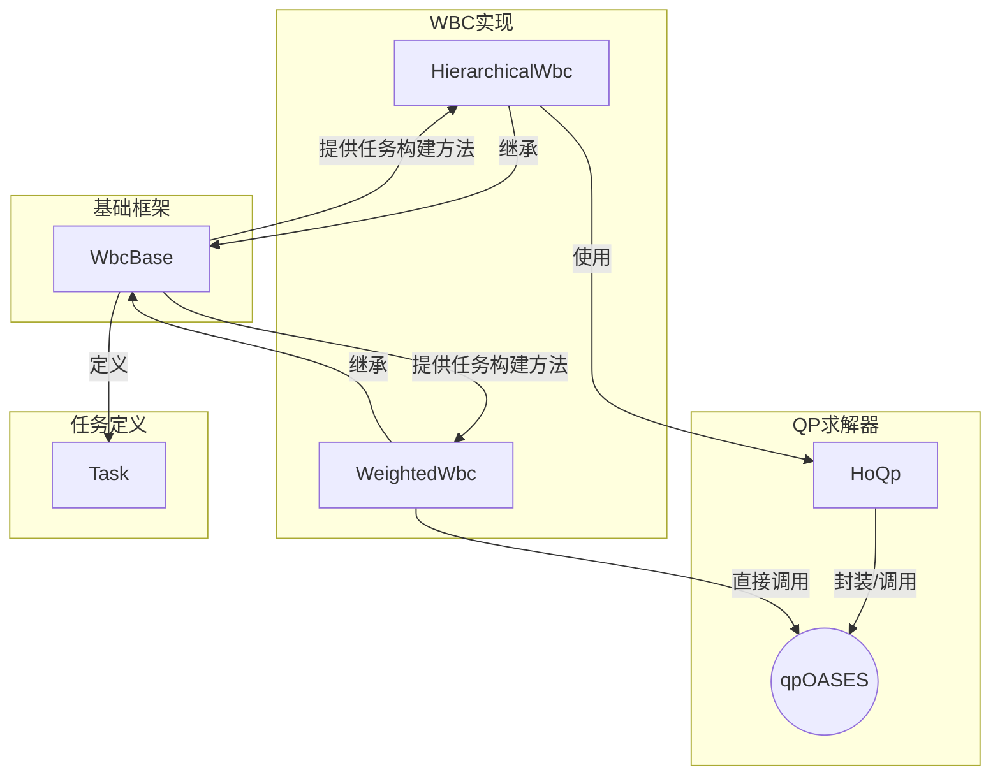

# `legged_wbc` 包代码分析

## 1. 功能与节点关系

### 1.1. 核心功能

`legged_wbc` (Whole-Body Control, 全身控制) 包是腿式机器人控制栈的底层核心之一。它的主要功能是接收上层MPC（模型预测控制）模块计算出的期望运动轨迹和接触力，并将其转化为机器人每个关节应输出的精确力矩。

与MPC使用简化模型（如质心模型）不同，WBC使用机器人的**完整刚体动力学模型**，考虑了所有连杆的惯性、科氏力、重力等效应。它通过求解一个**二次规划 (Quadratic Program, QP)** 问题，来实时地计算出满足物理约束（如力矩限制、摩擦锥）并能最优地跟踪期望运动和力的关节力矩。

这个包本身不包含ROS节点，它是一个C++库，提供了两种WBC的实现方法：

1.  **`HierarchicalWbc` (分层WBC)**: 将控制任务按优先级排序，依次求解。
2.  **`WeightedWbc` (加权WBC)**: 将不同任务加权后放入一个单一的优化问题中求解。

### 1.2. 类之间的关系

#### Mermaid 关系图

#### 节点关系

1.  **`WbcBase`** 是一个抽象基类，它定义了WBC问题的通用框架。它提供了将各种物理约束和控制目标**公式化 (formulate)** 为标准QP任务（`Task`）的方法。这些方法包括构建浮动基座动力学方程、力矩限制、摩擦锥约束等。

2.  **`HierarchicalWbc`** 和 **`WeightedWbc`** 都继承自 `WbcBase`，它们是WBC的两种具体实现。它们都调用基类提供的 `formulate...` 方法来构建各自需要的QP问题。

3.  **`HierarchicalWbc`** 使用 **`HoQp`** 类来求解其构建的分层QP问题。`HoQp` 内部封装了对 `qpOASES` 求解器的调用，并通过零空间投影法来处理任务的优先级。

4.  **`WeightedWbc`** 则不使用 `HoQp`，它将所有任务加权后构建成一个标准的QP问题，然后**直接调用 `qpOASES`** 求解器进行求解。

5.  **`Task`** 是一个数据结构类，用于以 `Ax=b` (等式约束) 和 `d <= Dx <= f` (不等式约束) 的标准形式来描述一个QP任务。

---

## 2. 各个类中主要方法的功能

### 2.1. `WbcBase` (基类)

-   `WbcBase(...)`
    -   **功能**: 构造函数。初始化Pinocchio接口、质心模型信息、末端执行器运动学等核心组件。
-   `virtual vector_t update(...)`
    -   **功能**: 纯虚函数，由派生类实现。这是WBC的入口，接收期望状态、期望输入和测量状态，最终返回计算出的最优决策变量（包含关节力矩）。
-   `void updateMeasured(const vector_t& rbdStateMeasured)`
    -   **功能**: 使用 `Pinocchio` 库，根据测量的机器人状态（关节位置、速度）更新机器人的完整动力学模型，计算出质量矩阵 `M`、非线性效应（科氏力、重力） `nle`、以及接触点的雅可比矩阵 `J` 和其导数 `dJ`。
-   `void updateDesired(const vector_t& stateDesired, const vector_t& inputDesired)`
    -   **功能**: 根据期望的状态和输入，更新用于计算前馈加速度等期望值的动力学模型。
-   `Task formulate...Task()`
    -   **功能**: 这一系列 `formulate` 开头的方法是WBC的核心。每个方法都将一项物理约束或控制目标转换成一个标准的 `Task` 对象（即 `Ax=b` 和 `Dx<=f` 的形式）。
        -   `formulateFloatingBaseEomTask`: **(硬约束)** 构建完整的刚体动力学方程 `M \ddot{q} + h = S^T \tau + J^T F`。
        -   `formulateTorqueLimitsTask`: **(硬约束)** 构建关节力矩的上下限约束。
        -   `formulateFrictionConeTask`: **(硬约束)** 构建接触力的摩擦锥约束。
        -   `formulateNoContactMotionTask`: **(硬约束)** 支撑脚的速度必须为零 `J \dot{q} + \dot{J} \dot{q} = 0`。
        -   `formulateBaseAccelTask`: **(软任务)** 期望的基座加速度（来自MPC）。
        -   `formulateSwingLegTask`: **(软任务)** 期望的摆动腿加速度（通常由一个PD控制器生成）。
        -   `formulateContactForceTask`: **(软任务)** 期望的接触力（来自MPC）。

### 2.2. `HierarchicalWbc` (派生类)

-   `vector_t update(...) override`
    -   **功能**: 实现分层WBC的逻辑。
        1.  调用基类的 `update` 方法更新模型。
        2.  将任务分为三个优先级：
            -   **Task 0 (最高优先级)**: 动力学、力矩/摩擦锥限制等硬约束。
            -   **Task 1 (次高优先级)**: 运动任务（基座和摆动腿加速度）。
            -   **Task 2 (最低优先级)**: 力任务（接触力）。
        3.  创建一个 `HoQp` 对象，将这三个任务按优先级顺序传入。
        4.  调用 `hoQp.getSolutions()` 获取求解结果并返回。

### 2.3. `WeightedWbc` (派生类)

-   `vector_t update(...) override`
    -   **功能**: 实现加权WBC的逻辑。
        1.  调用 `formulateConstraints()` 将所有硬约束组合起来。
        2.  调用 `formulateWeightedTasks()` 将所有软任务乘以各自的权重后相加，形成QP的目标函数。
        3.  将约束和目标函数传递给 `qpOASES` 求解器。
        4.  获取求解结果并返回。
-   `void loadTasksSetting(...) override`
    -   **功能**: 从配置文件中加载各个软任务的权重系数。

### 2.4. `HoQp` (分层QP求解器)

-   `HoQp(Task task, HoQpPtr higherProblem)`
    -   **功能**: 构造函数。接收当前层次的任务和指向更高优先级问题的指针。它会递归地构建和求解问题。
-   `void formulateProblem()`
    -   **功能**: 将当前任务投影到上层任务的零空间，构建新的QP问题。
-   `void solveProblem()`
    -   **功能**: 调用 `qpOASES` 求解当前层次的QP问题。
-   `vector_t getSolutions()`
    -   **功能**: 将当前层次的解与上层问题的解叠加，得到最终的完整解。

---

## 3. 其他需要说明的内容

-   **决策变量**: WBC求解的QP问题中的决策变量 `x` 通常是一个包含了**广义加速度** `\ddot{q}`、所有**接触力** `F` 和所有**关节力矩** `\tau` 的长向量。求解出的 `\tau` 就是最终发送给电机的指令。
-   **分层 vs 加权**:
    -   **分层WBC** 的优点是任务优先级严格，可以确保在任何情况下都首先满足高优先级的任务（如物理约束）。缺点是计算相对复杂。
    -   **加权WBC** 的优点是实现简单，计算效率高。缺点是所有任务都在同一个目标函数中权衡，当任务间存在冲突时，可能会为了一个权重很高的软任务而略微违反一个权重较低的软任务，无法保证严格的优先级。权重的调整也比较困难。
-   **QP求解器**: `qpOASES` 是一个非常高效的开源QP求解器，特别适用于模型预测控制这类需要反复求解相似QP问题的场景。
