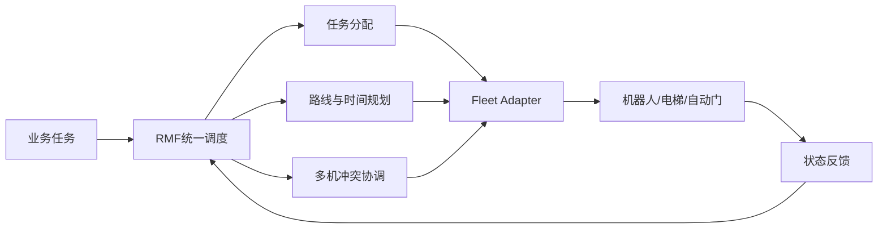
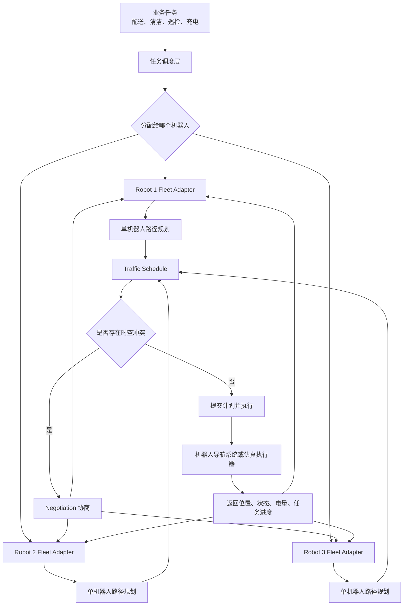
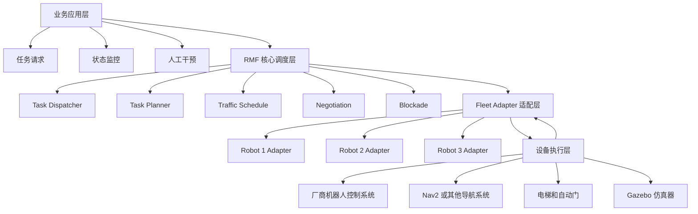

# rmf 是如何处理多楼层地图问题的，坐标、地图切换、跨楼层等
• RMF 对多楼层的处理核心是：

> 每个楼层是一个独立的二维 map；跨楼层不是坐标系里直接沿 Z 轴移动，而是在导航图中通过“电梯/楼梯等连接事件”从一个 map 切换到另一个 map。

因此，RMF Traffic Schedule 不是一个完整的三维碰撞系统。
```
L1: (x, y, yaw)
L2: (x, y, yaw)
L3: (x, y, yaw)
```
即使 L1 与 L2 都有坐标 (3.0, 5.0)，它们也不是同一个物理位置，因为 map 名不同：
```
("L1", 3.0, 5.0) != ("L2", 3.0, 5.0)
```
这也解释了你之前看到的 Node.cpp 判断：
```
if (route->map() != vc->route->map())
continue;
```
不同楼层的普通路线不会被 DetectConflict::between() 直接拿来做几何冲突检测。

## 1. 地图与坐标

RMF Building Map 中定义多个 level，例如 hotel demo：
```
levels:
L1:
L2:
L3:

lifts:
Lift1:
    reference_floor_name: L1
    level_doors:
    L1: [lift1_door]
    L2: [lift1_door]
    L3: [lift1_door]
```
可参见 rmf_demos_maps/maps/hotel/hotel.building.yaml:17 和 rmf_demos_maps/maps/hotel/hotel.building.yaml:1027。

RMF 的导航图 Graph 中，每个 waypoint 本身都有：
```
map_name
Eigen::Vector2d location
```
见 /home/jazzy/rmf_ws/src/rmf/rmf_traffic/rmf_traffic/include/rmf_traffic/agv/Graph.hpp:114。

所以内部语义是：
```
Waypoint 17:
map = "L1"
position = (12.1, 8.3)

Waypoint 42:
map = "L2"
position = (12.1, 8.3)
```
它们可以坐标相同，但代表不同楼层。

对于真实机器人，Fleet Adapter 还必须解决“机器人自身定位坐标系”到 RMF level 坐标系的转换：
```
robot/map 或 SLAM 坐标
    -- 标定的平移、旋转、比例变换 -->
RMF building map 的 L1 / L2 坐标
```
机器人报告位置时，不能只报 (x, y, yaw)；adapter 还必须知道它当前属于哪个 RMF map，例如 L1。跨层完成后，它将位置状态切换为 L2。

## 2. 规划时如何跨楼层

rmf_traffic::agv::Planner 使用的是一张逻辑上连通的导航图，而不是为每层单独运行一次规划器。

例如：
```
L1 办公室
-> L1 走廊
-> L1 电梯入口
-> Lift1 移动到 L2
-> L2 电梯出口
-> L2 走廊
-> L2 目标房间
```
导航图中的节点带 map 名；lane 可以连接不同 map 的 waypoint。普通跨 map lane 在模型上可存在，但工程上应通过电梯、楼梯或坡道等真实设施事件来表达，不应把两个楼层“直接连一条普通线”。

电梯 lane 会带事件，而不只是“从 L1 坐标插值飞到 L2 坐标”。RMF 定义了：
```
LiftSessionBegin  获取并锁定电梯会话
LiftMove          电梯移动到目标楼层
LiftDoorOpen      开门
LiftSessionEnd    结束/释放电梯会话
```
定义在 /home/jazzy/rmf_ws/src/rmf/rmf_traffic/rmf_traffic/include/rmf_traffic/agv/Graph.hpp:312。

规划器会把这些事件和预计耗时纳入路径成本。例如典型跨层 plan 是：
```
t=00  L1：驶向电梯
t=20  L1：申请 Lift1，进入轿厢
t=28  Lift1：从 L1 移动至 L2
t=38  L2：开门、驶出轿厢
t=45  L2：继续驶向目标
```
RMF 的 Planner 单元测试也明确构造了：
```
LiftSessionBegin(lift_name, L1, ...)
LiftMove(lift_name, L2, ...)
LiftSessionEnd(lift_name, L2, ...)
```
见 /home/jazzy/rmf_ws/src/rmf/rmf_traffic/rmf_traffic/test/unit/agv/test_Planner.cpp:3085。

## 3. itinerary 会被拆成多个 Route

一项跨层计划不会是一条标记为 L1 的长 trajectory，而是按地图拆开：
```
Itinerary
├─ Route(map="L1")
│   └─ 从起点到 Lift1 门口/轿厢的 2D trajectory
├─ 电梯相关事件
│   └─ 请求、占用、移动、开门、释放
└─ Route(map="L2")
    └─ 从 Lift1 门口到目标点的 2D trajectory
```
每个 Route 都有一个 map 字符串和一条 trajectory，见 /home/jazzy/rmf_ws/src/rmf/rmf_traffic/rmf_traffic/src/rmf_traffic/Route.cpp:114。

因此：
- L1 走廊中的冲突，在 map="L1" 的 Route 间检测；
- L2 走廊中的冲突，在 map="L2" 的 Route 间检测；
- 电梯资源竞争，不应只依赖 L1/L2 的几何冲突检测。

## 4. 电梯如何防止两台机器人同时使用

电梯是一个共享、容量有限、会改变楼层位置的资源，不能仅靠 DetectConflict::between() 处理。

Fleet Adapter 执行到 LiftSessionBegin 时，会创建 RequestLift phase，请求电梯并保存当前计划状态，见 /home/jazzy/rmf_ws/src/rmf/rmf_ros2/rmf_fleet_adapter/src/rmf_fleet_adapter/events/ExecutePlan.cpp:243。

rmf_lift_supervisor 按 lift 名维护 active session；一个电梯已有不同 session 时，不会直接接管该会话。相关实现见 /home/jazzy/rmf_ws/src/rmf/rmf_ros2/rmf_fleet_adapter/src/lift_supervisor/Node.cpp:45。

所以要分开理解：

Traffic Schedule：
协调同一楼层 map 上机器人预计的时空占用。

Lift Supervisor / Lift Manager：
协调 Lift1 这个设备的会话、目标楼层、门状态与独占控制。

Fleet Adapter：
把计划中的电梯事件变成对真实电梯或仿真电梯的请求，并在获得正确的电梯状态后命令机器人进出轿厢。

实际集成时，Lift Manager 必须可靠实现 session ID、门状态、当前楼层和权限控制。默认 rmf_lift_supervisor 是会话协调组件，源码中也明确留有“更智能地调度电梯”的 TODO；复杂电梯群的调度策略通常应在真实 Lift Manager 或上层系统实现。

## 5. 机器人如何“切换地图”

机器人不应在轿厢移动期间假装在 L1 或 L2 走廊中移动。通常状态机是：
```
当前 map = L1
-> 到达 L1 电梯门前
-> 获得 Lift1 session
-> 进入轿厢
-> 电梯到达 L2 且门已打开
-> 更新当前 map = L2
-> 从 L2 电梯门口继续导航
```
切换时机应基于电梯反馈，而不是只依据计划中的预计时间。因为电梯可能延迟、被人工占用、门未打开或实际停在非预期楼层。

若实际进度偏离原 itinerary，adapter 应更新 itinerary、延迟或触发重新规划/协商。否则 Schedule 仍会以为机器人已按时抵达 L2，而真实机器人可能仍困在 L1 电梯门前。

一句话总结：
```
RMF 用 map 名隔离楼层二维坐标；
用一个跨 map 的导航图寻找可达路径；
用电梯/门等 lane event 表达跨层动作；
用设备会话控制电梯资源；
用 itinerary 的分段 Route 在各楼层进行 Traffic Schedule 协调。
```

# task1
问题:
## 1. @/home/jazzy/rmf_ws/src/demonstrations/rmf_demos/rmf_demos_maps/maps/office 中为什么有 scan.png 和 png 两种地图样式，而 @/home/jazzy/rmf_ws/src/demonstrations/rmf_demos/rmf_demos_maps/maps/hotel 只有一种
2. scan 是给 nav2 用的？为什么 hotel 这个场景没有用？rmf 底层导导航没有用 nav2 吗？

• 1. office 的两张图片不是两套 RMF 导航地图，而是 Building Map Editor 中的两类图层：
```
office.png       L1 的 drawing（底图/建筑平面图）
office_scan.png  名为 office_laserscan 的附加图层
office_scan.png 是灰度激光扫描地图，并且 YAML 给了它相对 RMF 楼层坐标的标定变换：

layers:
office_laserscan:
    filename: office_scan.png
    transform:
    scale: ...
    translation_x: ...
    translation_y: ...
    yaw: ...
```
见 rmf_demos_maps/maps/office/office.building.yaml:90。

office.png 是 3047×1717 的 RGBA 平面图；office_scan.png 是 335×447 的灰度栅格图。后者的用途是把实机激光 SLAM/定位所用的环境地图，对齐到 RMF 的 Building Map，以便人工绘制 navigation graph 时可参考真实障碍物和墙体。

Hotel 不是“没有 layer 机制”，而是它的每个 level 没有额外图层：
```
layers: {}
```
见 rmf_demos_maps/maps/hotel/hotel.building.yaml:100。

它只有各层的 drawing：
```
hotel_L1.png
hotel_L2.png
hotel_L3.png
```
原因很简单：hotel demo 是以 Gazebo 建筑模型和多楼层/电梯调度为重点构造的仿真场景，没有配套导入一张真实机器人采集的 laser scan 栅格图；office demo 则额外演示了“将实机扫描地图与 RMF 建筑图对齐”的工作流。

2. office_scan.png 可以作为 Nav2 静态地图的源素材，但在你运行的 RMF demos 中，它并没有被 Nav2 的 map_server 或 Nav2 navigation stack 消费。

如果是 Nav2 标准静态地图，通常还需要一个 map YAML，例如：
```
image: office_scan.png
resolution: 0.05
origin: [x, y, yaw]
negate: 0
occupied_thresh: 0.65
free_thresh: 0.25
```
然后启动：
```
nav2_map_server / map_server
AMCL
planner_server
controller_server
```
当前 demo 中搜索不到 Nav2 / map_server 的 launch 或配置；office_scan.png 只在 building YAML 的 layer 中出现。因此不能说“office demo 使用 scan.png 驱动 Nav2”。

RMF 也不“底层必须使用 Nav2”。职责关系是：
```
RMF：
用 nav graph 的 waypoint/lane 做任务级路径规划、交通时刻表与多机协调。

Nav2：
某台机器人自身的定位、局部避障、
栅格全局路径和底盘控制。
```
RMF 的 rmf_traffic::agv::Planner 使用的是从 Building Map 导出的拓扑导航图，而不是 office_scan.png 的占据栅格。它生成的结果是：
```
waypoint/lane 序列
+ 预计通过时间
+ Route / Trajectory
```
例如 office launch 向 fleet adapter 提供的是：
```
.../maps/office/nav_graphs/0.yaml
```
见 rmf_demos/launch/office.launch.xml:18。

在当前 Gazebo demo 中，adapter 最终把目标点和楼层名发给 mock fleet manager：
```
api.navigate(robot_name, cmd_id, pose, map_name)
```
它再发布 robot_path_requests，见 rmf_demos_fleet_adapter/rmf_demos_fleet_adapter/fleet_manager.py:232。这条执行链不是 Nav2。

真实部署时，常见架构则是：
```
Building Map / nav graph
-> RMF：任务分配、跨楼层、电梯、交通协调
-> Fleet Adapter：把 RMF waypoint 目标转换为厂商命令
-> Nav2 或厂商导航栈：基于 scan/地图定位、避障、行驶到目标
```
所以 hotel 即使没有 hotel_L1_scan.png，RMF 仍然可正常规划和协调；只要其 fleet adapter 能在真实系统中把 L1/L2/L3 的 RMF 坐标与机器人自身导航地图/定位系统对应起来即可。

问题:
1. 也就是在 demo 里没有实际导航，而是 mock 导航(假装到达点位)
2. @/home/jazzy/rmf_ws/src/demonstrations/rmf_demos/rmf_demos_maps/maps/hotel/hotel.building.yaml 是什么用途，是如何得到的？
3. @/home/jazzy/rmf_ws/src/demonstrations/rmf_demos/rmf_demos_maps/maps/hotel/hotel_L1.png 是如何得到的？

• 1. 对，但更准确说是“仿真执行器”，不是纯粹瞬移或只回报到达。

在 rmf_demos_gz 中，机器人使用 RMF 的 slotcar 仿真插件，而不是 Nav2：
```
RMF Fleet Adapter
-> Fleet Manager
-> /robot_path_requests
-> Gazebo slotcar plugin
-> 仿真机器人按给定路径/速度移动
```
slotcar 订阅 /robot_path_requests，源码见 /home/jazzy/rmf_ws/src/rmf/rmf_simulation/rmf_robot_sim_common/src/slotcar_common.cpp:227。

所以机器人在 Gazebo 中确实会连续地移动、转向、占据空间，也会报告状态；但它不做真实机器人常见的：
```
激光 SLAM / AMCL 定位
栅格代价地图
Nav2 全局规划
Nav2 局部避障与恢复行为
```
它接受的是 RMF 侧已经决定好的 path request，按“轨道车（slotcar）”式的简化运动模型执行。这就是为何 demo 能突出展示 Traffic Schedule、任务调度、协商和电梯流程，而不需要引入一整套 Nav2。

2. hotel.building.yaml 是 hotel 场景的源设计文件，可以理解成 RMF Building Map 的“工程源文件”。

它包含：
```
楼层：L1、L2、L3
各层底图、比例尺、坐标、墙、门、地面区域
家具/模型的放置位置
电梯的尺寸、门、可达楼层、初始楼层
各 fleet 的 navigation graph waypoint 和 lane
lane 的单向、速度限制、holding point、门/电梯事件等
```
例如它在 YAML 中定义了：
```
levels:
L1:
L2:
L3:

lifts:
Lift1:
    level_doors:
    L1: [lift1_door]
    L2: [lift1_door]
    L3: [lift1_door]
```
见 rmf_demos_maps/maps/hotel/hotel.building.yaml:17 与 rmf_demos_maps/maps/hotel/hotel.building.yaml:1027。

它通常由 Traffic Editor 创建和编辑：
```
导入/选择楼层图
-> 标定尺寸和坐标
-> 绘制墙、门、楼板
-> 放置 Gazebo 模型
-> 标注电梯和各层出口
-> 绘制 waypoint、lane 和 fleet graph
-> 保存为 *.building.yaml
```
它不是运行时由 Gazebo 自动生成的，也不是由 Nav2 地图生成的。

编译 rmf_demos_maps 时，CMake 以每个 .building.yaml 为输入自动生成两个关键产物：
```
hotel.building.yaml
├─ building_map_generator gazebo
│    -> hotel.world + models/
└─ building_map_generator nav
        -> nav_graphs/0.yaml、1.yaml、2.yaml ...
```
具体构建规则在 rmf_demos_maps/CMakeLists.txt:22。

其中：
- hotel.world 用于启动 Gazebo；
- nav_graphs/*.yaml 供不同 fleet adapter 做 RMF 路线规划；
- 原始 hotel.building.yaml 也会被 rmf_demos 用于 RViz/Building Map 可视化和任务地点信息。


3. hotel_L1.png 是 Hotel 一层的平面设计底图，不是 building_map_generator 从 YAML 生成出来的。

它先作为 Traffic Editor 的 drawing 输入被导入：
```
levels:
L1:
    drawing:
    filename: hotel_L1.png
```
见 rmf_demos_maps/maps/hotel/hotel.building.yaml:24。

然后人在这张图之上标定真实尺度、绘制墙体、门、楼板、家具、导航点和 lane，最终保存为 hotel.building.yaml。

关系应理解为：
```
hotel_L1.png
= 人工准备的楼层平面底图

hotel.building.yaml
= 在底图上补充的可机读建筑与交通语义

building_map_generator
= 从 YAML 生成 Gazebo world 和 RMF nav graph
```
它不是：
```
hotel.building.yaml -> hotel_L1.png
```
也不是：
```
Gazebo hotel.world -> hotel_L1.png
```
在真实项目中，hotel_L1.png 往往来自 CAD/BIM 平面图导出、建筑设计图、物业提供的楼层图，或人工绘制；然后由集成人员在 Traffic Editor 中建立 RMF 所需的语义地图。


## 用通俗易懂的话语阐述 rmf 的技术路线和内部层次关系

### RMF 简介
RMF（Robotics Middleware Framework）是一个面向多品牌、多类型机器人的统一调度平台。

它不替代机器人底层导航，而是负责全局协调：

### 核心工作流程
```
提交任务
-> 选择合适机器人
-> 规划路线和预计时间
-> 检查多机器人是否冲突
-> 等待、改道或重新协商
-> 下发执行
-> 根据实时状态动态调整
```
### 内部层次

- 任务调度层：决定“哪个机器人做什么任务”。
- 交通协调层：维护全局交通计划，处理机器人之间的路径冲突。
- Fleet Adapter 适配层：把 RMF 指令转换成不同厂商的机器人指令。
- 设备执行层：由机器人自身导航系统、底盘、电梯和自动门完成实际动作。

### RMF 的主要优势

1. 统一管理多品牌机器人
    不要求所有机器人使用同一品牌或同一套控制系统。

2. 支持多机协同
    机器人共享全局交通计划，能够自动处理抢道、会车、窄通道和电梯竞争。

3. 任务与交通分离
    既能安排任务，又能协调执行任务时的路线和时间冲突。

4. 适应动态变化
    机器人延迟、故障、电量不足或新增任务时，可以重新分配和规划。

5. 支持多楼层和共享设施
    可统一管理楼层地图、电梯、自动门、充电站等资源。

6. 保护既有机器人系统投资
    RMF 通过 Adapter 对接现有机器人和 Nav2，不需要重写底盘控制系统。

### 需要明确的边界

RMF 主要负责：
```
任务安排
全局路径和时间协调
多机器人冲突处理
共享设备管理
```
机器人自身系统负责：
```
定位
局部避障
底盘控制
传感器处理
紧急停止
```
因此，RMF 的定位可以概括为：
```
RMF 是机器人的“交通管理和任务调度中心”，而不是机器人的底盘控制器。
```
最终价值是将多个独立机器人系统，整合成一个可统一调度、可扩展、可持续运行的整体。


## 另一种方式阐述
RMF 的目标是让这些设备能够在同一栋建筑内协同工作。

### 整体技术路线

简单地说：
```
收到任务
-> 选择机器人
-> 为机器人规划路线
-> 检查是否与其他机器人冲突
-> 有冲突就等待、改道或重新规划
-> 发送给机器人执行
-> 持续反馈状态并动态调整
```
# 内部层次关系

### 1. 业务应用层

这一层提出“要做什么”。

例如：
```
把药品从药房送到病房
清扫一楼走廊
每隔 30 分钟巡逻一次
把机器人送去充电
```
业务系统不需要直接知道机器人如何转弯、如何避障，只需要提交任务请求。

### 2. 任务调度层

这一层决定：
```
哪个机器人执行任务
任务执行顺序是什么
任务优先级如何处理
是否需要充电
任务是否超时
```
例如有两个配送任务：
```
Robot A 距离药房 10 米
Robot B 距离药房 80 米
```
调度器可能把任务分给 Robot A。

RMF 的 TaskPlanner 可以根据以下因素计算任务分配代价：
- 预计完成时间
- 机器人当前任务数量
- 电量
- 任务优先级
- 机器人能力和限制

注意：这一层主要解决“谁做什么”，不等于交通避碰。

### 3. Fleet Adapter 适配层

Fleet Adapter 是 RMF 和具体机器人车队之间的翻译器。

RMF 使用统一的概念：
```
移动到某个位置
执行某个动作
开始充电
打开电梯门
报告当前位置
```
不同厂商的机器人接口可能完全不同：
```
厂商 A：REST API
厂商 B：ROS 2 Action
厂商 C：专用 TCP 协议
厂商 D：模拟器接口
```
Fleet Adapter 将两者转换：
```
RMF 指令
-> 厂商机器人命令

机器人状态
-> RMF 标准状态
```
因此 RMF 不需要为每个品牌重新修改核心调度逻辑。

## 4. 路径规划层

Fleet Adapter 使用 RMF 的导航图和 rmf_traffic::agv::Planner，为单台机器人规划路线。

导航图由以下内容组成：
```
Waypoint：机器人可以经过或停留的位置
Lane：Waypoint 之间的可行驶连接
地图名称：L1、L2、L3 等
速度限制
单向通行规则
Holding Point
门、电梯等事件
```
规划结果不是简单的“从 A 到 B 的直线”，而是：
```
经过哪些点
每个点什么时候到达
每段路线预计占用多长时间
需要经过哪个电梯或门
```
例如：
```
10:00:00  离开充电站
10:00:12  到达走廊入口
10:00:25  经过走廊
10:00:40  到达病房
```
这就是一条带时间的 itinerary。

## 5. Traffic Schedule

Traffic Schedule 可以理解为全楼宇的“交通计划表”。

它记录：
```
哪台机器人
在什么地图
什么时间
预计占用哪些空间
```
例如：
```
Robot A：
L1 走廊
10:00:10 - 10:00:25

Robot B：
L1 走廊
10:00:18 - 10:00:35
```
两者空间和时间都重叠，就产生冲突。

DetectConflict::between() 负责判断：

两条带时间的轨迹是否在同一时刻过近或相交

它只负责检测，不负责：

- 让机器人停车
- 决定谁优先
- 重新生成路线
- 发送底盘控制命令

## 6. Negotiation

当 Traffic Schedule 发现冲突后，进入协商。

例如：
```
Robot A：按原路线通过
Robot B：在 holding point 等待 10 秒
```
系统会把双方的完整候选 itinerary 放在一起重新检查。

如果仍然冲突：
```
Robot A：等待 10 秒
Robot B：等待 10 秒
```
那么这个方案会被拒绝，因为两台机器人可能只是同时推迟了 10 秒，冲突仍然存在。

协商最终要找到：

所有机器人都有可执行计划
所有计划之间没有未解决冲突
满足门、电梯、道路等资源约束

## 7. Blockade

Blockade 更像是“实时的局部通行控制”。

可以把它理解为：
```
Traffic Schedule：
提前规划未来一段时间的交通占用

Blockade：
机器人快要进入某个关键区域时，实时申请通行
```
例如一条窄走廊只能容纳一台机器人：
```
Robot A 申请进入走廊
-> 获得通行范围
-> Robot A 通过

Robot B 同时申请
-> 暂时不能进入
-> 等待 A 释放走廊
```
两者区别：
```
功能        Traffic Schedule    Blockade
━━━━━━━━━━  ━━━━━━━━━━━━━━━━━━  ━━━━━━━━━━━━━━━━━━━━
主要对象    未来的完整轨迹      当前即将进入的区域
──────────  ──────────────────  ────────────────────
时间尺度    较长                较短、更实时
──────────  ──────────────────  ────────────────────
主要作用    计划和协商          通行授权和占用控制
──────────  ──────────────────  ────────────────────
典型问题    未来是否会冲突      现在能不能进入
```
