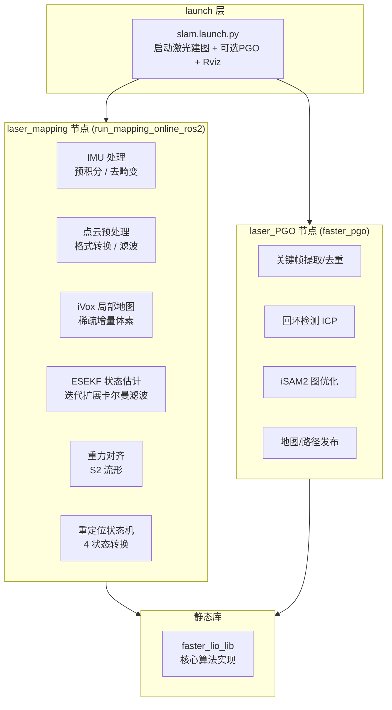
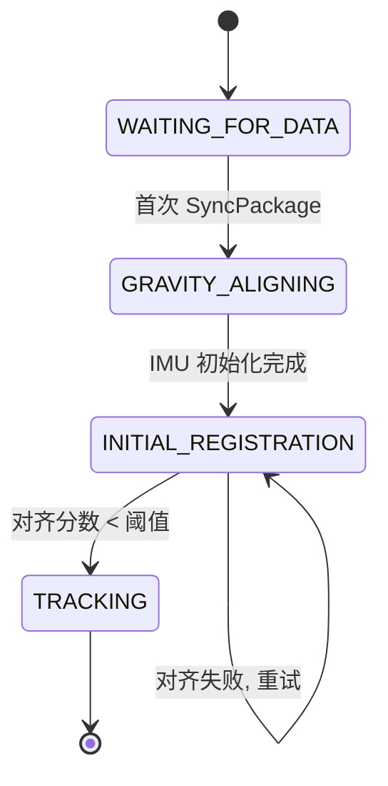
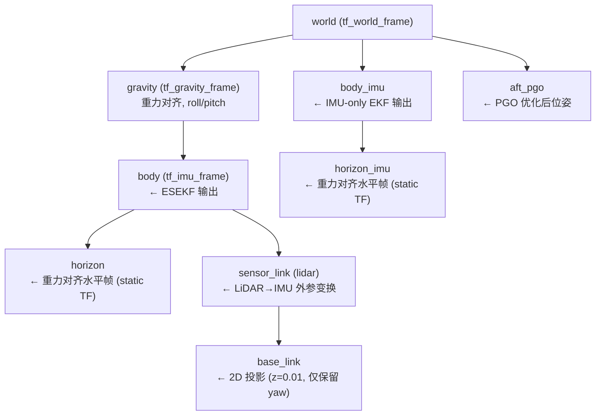
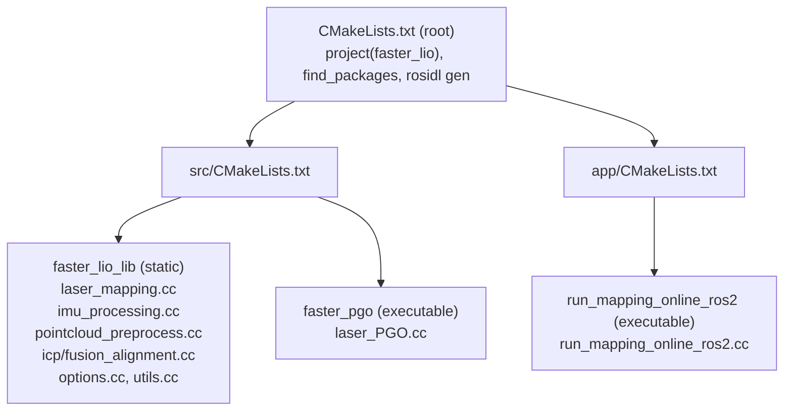
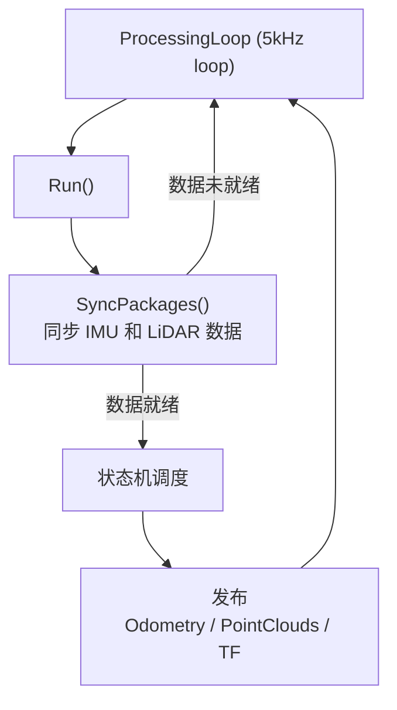
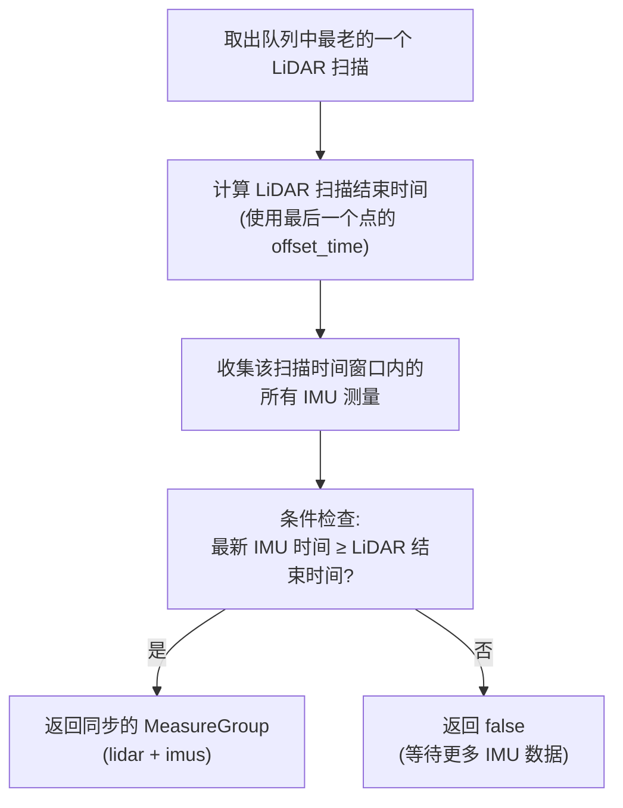
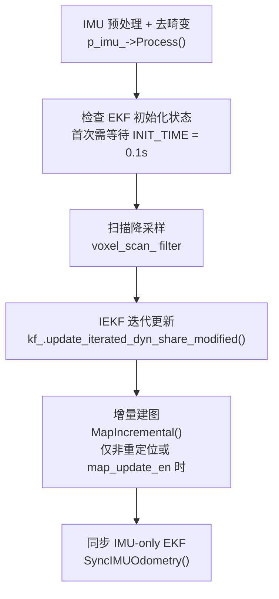
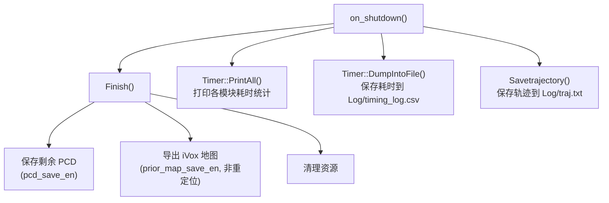

# Faster-LIO 项目详细分析文档

> **项目名称**: `faster_lio` (ROS 2 包名)
> **目录名**: `faster_slam` (存在名称不匹配)
> **基于论文**: *Faster-LIO: Lightweight Tightly Coupled Lidar-inertial Odometry using Parallel Sparse Incremental Voxels* (Chunge Bai et al., IEEE RA-L 2022)
> **平台**: ROS 2 Jazzy (Ubuntu 24.04), C++17
> **作者**: Gao Xiang (高翔)

---

## 一、项目概述

Faster-LIO 是一个**紧耦合激光-惯性里程计 (LIO)** 系统，由 FastLIO2 发展而来。核心创新在于使用 **iVox (Incremental Voxels)** 数据结构替代传统的 kd-tree 来管理局部地图，实现了更高的点云配准速度和更低的内存占用。系统支持**在线建图**、**后端位姿图优化 (PGO)** 以及**重定位 (Relocalization)** 三种工作模式。

### 1.1 系统架构总览



---

## 二、项目目录结构

```
faster_slam/
├── CMakeLists.txt          # 顶层 CMake (项目名: faster_lio)
├── package.xml             # ROS 2 包元数据
├── AGENTS.md               # AI 助手指南
├── README.md               # 项目自述
├── config/
│   └── mid360.yaml         # 主配置文件 (Livox Mid-360 参数)
├── launch/
│   └── slam.launch.py      # 启动文件
├── msg/
│   └── Pose6D.msg          # 自定义ROS消息: 预积分LiDAR状态
├── rviz_cfg/               # Rviz2 可视化配置
├── include/                # 头文件
│   ├── common_lib.h        # 公共类型定义/工具函数
│   ├── laser_mapping_ros2.h # 核心节点类声明
│   ├── imu_processing.hpp  # IMU处理模块
│   ├── pointcloud_preprocess.h # 点云预处理模块
│   ├── use-ikfom.hpp       # ESEKF状态定义与动力学模型
│   ├── options.h           # 全局可调参数
│   ├── so3_math.h          # SO(3)数学工具
│   ├── utils.h             # 计时器类
│   ├── initial_alignment.h # 初始对齐基类接口
│   ├── icp_alignment.h     # ICP对齐实现
│   ├── fusion_alignment.h  # Fusion对齐 (NDT+ICP)实现
│   ├── alignment_factory.h # 对齐方法工厂
│   ├── ivox3d/             # iVox增量体素数据结构
│   │   ├── ivox3d.h        # IVox主类模板
│   │   ├── ivox3d_node.hpp # 体素节点实现 (LINEAR/PHC两种)
│   │   ├── hilbert.hpp     # 希尔伯特空间填充曲线
│   │   └── eigen_types.h   # Eigen类型别名
│   └── IKFoM_toolkit/      # 迭代卡尔曼滤波数学工具库
│       ├── esekfom/        # 等效误差状态扩展卡尔曼滤波
│       └── mtk/            # 流形工具库 (Manifold ToolKit)
├── src/                    # 源文件
│   ├── CMakeLists.txt      # 静态库 + PGO可执行文件
│   ├── laser_mapping.cc    # 核心LIO节点实现 (1576行)
│   ├── laser_PGO.cc        # PGO后端节点实现 (1512行)
│   ├── imu_processing.cc   # IMU预积分与去畸变 (305行)
│   ├── pointcloud_preprocess.cc # 点云格式转换 (200行)
│   ├── icp_alignment.cc    # ICP初始对齐 (53行)
│   ├── fusion_alignment.cc # Fusion初始对齐 (160行)
│   ├── options.cc          # 全局参数默认值 (13行)
│   └── utils.cc            # 计时器静态成员初始化 (11行)
├── app/                    # 应用程序入口
│   ├── CMakeLists.txt
│   └── run_mapping_online_ros2.cc # 在线建图主程序
└── cmake/                  # CMake模块
    ├── FindGlog.cmake
    └── packages.cmake
```

---

## 三、核心算法与数据结构

### 3.1 iVox — 并行稀疏增量体素

**文件**: `include/ivox3d/ivox3d.h`, `include/ivox3d/ivox3d_node.hpp`

iVox 是 Faster-LIO 最核心的创新点，它是一个**3D稀疏体素网格**数据结构，用于高效管理局部地图点云。

#### 3.1.1 数据结构特点

| 特性 | 说明 |
|------|------|
| **维度** | 固定3D (`dim=3`) |
| **节点类型** | 两种: `DEFAULT`(线性体素) 和 `PHC`(Probabilistic Hit Count) |
| **搜索邻域** | `CENTER` / `NEARBY6` / `NEARBY18` / `NEARBY26` |
| **分辨率** | 默认 0.3m (`ivox_grid_resolution`) |
| **索引方式** | Eigen多精度整数键 (`KeyType = Eigen::Matrix<int, 3, 1>`) |
| **底层存储** | `std::unordered_map<KeyType, NodeType>` |

#### 3.1.2 两种节点类型

- **`IVoxNode`** (默认线性): 直接存储点云，计算点到平面的残差进行匹配
- **`IVoxNodePhc`** (PHC): 使用概率命中计数 (Probabilistic Hit Count)，通过统计每个体素的占据概率来提高匹配鲁棒性

编译时通过 CMake 选项选择:
```bash
cmake .. -DWITH_IVOX_NODE_TYPE_PHC=ON   # 使用PHC节点
cmake ..                                  # 使用默认线性节点(默认)
```

代码中通过 `#ifdef IVOX_NODE_TYPE_PHC` 在 `laser_mapping_ros2.h:38-42` 进行条件编译。

#### 3.1.3 iVox 核心操作

```cpp
// 添加点到体素地图
void AddPoints(const PointVector& points_to_add);

// 获取最近点 (用于匹配)
bool GetClosestPoint(const PointType& pt, PointVector& closest_pt, int max_num, double max_range);

// 导出所有地图点
void GetMapPoints(PointVector& map_points);
```

#### 3.1.4 增量建图策略 (`MapIncremental`)

`laser_mapping.cc:835-891` 中的增量建图逻辑:
1. 对每个降采样后的点，将其转换到世界坐标系
2. 计算该点所在的体素中心 `center`
3. 检查最近点的分布：如果所有最近点到中心的距离都大于附近的已有体素点，该点被认为是"需要添加的新区域"
4. 使用 `std::for_each(std::execution::unseq, ...)` 进行并行处理
5. 通过 `ivox_->AddPoints()` 批量插入

---

### 3.2 ESEKF — 等效误差状态扩展卡尔曼滤波

**文件**: `include/use-ikfom.hpp`, `include/IKFoM_toolkit/`

#### 3.2.1 状态向量 (24维)

```
state_ikfom: {
    pos      (3D) — 位置 (世界坐标系)
    rot      (SO3) — 旋转 (四元数)
    offset_R_L_I (SO3) — LiDAR到IMU的旋转外参
    offset_T_L_I (3D) — LiDAR到IMU的平移外参
    vel      (3D) — 速度 (世界坐标系)
    bg       (3D) — 陀螺仪偏置
    ba       (3D) — 加速度计偏置
    grav     (S2)  — 重力方向 (在S2流形上, 模长约9.8)
}
```

#### 3.2.2 输入向量 (6维)

```
input_ikfom: {
    acc  (3D) — 加速度计测量
    gyro (3D) — 陀螺仪测量
}
```

#### 3.2.3 动力学模型 (`get_f`)

基于IMU输入进行状态传播:
- **速度**: $\dot{v} = R_{world\_imu} \cdot (a_{meas} - b_a) + g$
- **旋转**: $\dot{R} = R \cdot [\omega_{meas} - b_g]_{\times}$
- **重力方向**: 通过 $S^2$ 流形上的旋转来更新
- **偏置**: 随机游走模型

#### 3.2.4 观测模型 (`ObsModel`)

`laser_mapping.cc:893-995`:

1. **点投影**: 将所有降采样后的LiDAR点投影到世界坐标系
2. **最近点搜索**: 通过 `ivox_->GetClosestPoint()` 获取最近5个点
3. **平面拟合**: 对每组最近点使用 `common::esti_plane()` 拟合平面，计算平面系数 `[nx, ny, nz, d]`
4. **平面残差**: $r = n \cdot p_w + d = p_{body}^T(R_{wl}^T n)$ (点到平面距离)
5. **雅克比矩阵**: 解析计算残差相对于状态变量的雅克比 `h_x`:
   - 对位置: $[n_x, n_y, n_z]$
   - 对旋转: $A = [p]_{\times} R_t n$
   - 对外参(可选): $B = [p_{body}]_{\times} R_{offset}^T C$
   - 对Z位移: $C = R_t n$

```cpp
// 简化的观测雅克比 (extrinsic_est_en_=true 时)
h_x[i] = [norm_vec[0], norm_vec[1], norm_vec[2],  // d(pos)
          A[0], A[1], A[2],                         // d(rot)
          B[0], B[1], B[2],                         // d(offset_R)
          C[0], C[1], C[2]];                         // d(offset_T)
```

#### 3.2.5 IEKF 迭代更新

使用 `kf_.update_iterated_dyn_share_modified()` 进行迭代更新，迭代次数可配置 (`max_iteration`, 默认3次)。

#### 3.2.6 双EKF设计

项目维护了两个EKF实例:
- **`kf_`**: 主EKF，在每帧LiDAR数据到达后进行完整的预测+更新
- **`kf_imu_`**: IMU-only EKF，在每次IMU回调时进行高频预测 (200Hz+)，发布高频里程计 (`odometry_imu`)

当首次初始化后，通过 `SyncIMUOdometry()` 将主EKF的状态复制给IMU-only EKF。之后IMU-only EKF独立进行预测，实现高频发布。

---

### 3.3 IMU处理模块

**文件**: `src/imu_processing.cc`, `include/imu_processing.hpp`

#### 3.3.1 初始化 (`IMUInit`)

1. **静止检测**: 收集一段时间内 (最多20帧) 的IMU数据
2. **加速度归一化**: 计算平均加速度向量，归一化得到重力方向初始估计
3. **陀螺仪偏置**: 对陀螺仪数据取平均作为偏置初值
4. **初始roll/pitch**: 从重力向量解析姿态
   ```cpp
   roll  = atan2(-g.y, -g.z)
   pitch = -atan2(-g.x, sqrt(g.y² + g.z²))
   ```

#### 3.3.2 IMU预积分与去畸变 (`Process`)

对每个IMU测量进行前向积分:
1. 计算增量角度和速度变化
2. 更新名义状态 (位置、速度、旋转)
3. 传播协方差 (通过 `df_dx` 和 `df_dw` 矩阵)
4. **点云去畸变**: 根据IMU积分结果，将每个LiDAR点投影到统一的"扫描结束时刻"的IMU坐标系

---

### 3.4 点云预处理

**文件**: `src/pointcloud_preprocess.cc`, `include/pointcloud_preprocess.h`

#### 3.4.1 支持的三类LiDAR

| LiDAR类型 | lidar_type | 处理函数 | 特点 |
|-----------|-----------|---------|------|
| Livox Mid-360 | 1 | `Mid360Handler` | CustomMsg格式, 并行处理, tag位过滤 |
| Velodyne VLP-32 | 2 | `VelodyneHandler` | 标准PointCloud2, ring信息 |
| Ouster OS1-64 | 3 | `Oust64Handler` | 标准PointCloud2, 特殊点结构 |

#### 3.4.2 Mid360处理流程

1. 使用 `std::execution::par_unseq` 并行遍历所有点
2. 过滤条件:
   - `point_filter_num` 降采样 (每隔N个点取1个)
   - tag位检查 (`(tag & 0x30) == 0x10` 或 `(tag & 0x30) == 0x00`)
   - 去除相邻点距离过近的 (去无效/重复点)
   - 自车盒状滤波 (`self_box_filter`): 滤除车身范围内的点
   - 盲区滤波 (`blind`): 距离 < blind 的点滤除
3. 将 `offset_time` 存储到 `curvature` 字段中 (供去畸变使用)

#### 3.4.3 自车盒状滤波

```cpp
bool IsInsideSelfBox(float x, float y, float z) const {
    return |x| <= half_size.x && |y| <= half_size.y && |z| <= half_size.z;
}
```

默认关闭, 可在配置中启用 (`self_box_filter_en: true`)

---

### 3.5 重定位 (Relocalization) 状态机

**文件**: `src/laser_mapping.cc`, `include/laser_mapping_ros2.h:119-126`

通过启动参数 `relocal:=true` 启用。状态机包含四个状态:



#### 3.5.1 状态转换流程

| 状态 | 操作 | 转换条件 |
|------|------|---------|
| WAITING_FOR_DATA | 加载先验地图(PGO.pcd)和关键帧, 构建iVox | 首次SyncPackage后自动进入下一页 |
| GRAVITY_ALIGNING | 运行IMUInit, 估计重力方向 | `imu_need_init_ == false` |
| INITIAL_REGISTRATION | 累积多帧点云, 执行初始对齐 | 对齐分数 < 阈值 |
| TRACKING | 正常LIO跟踪 | 持续运行 |

#### 3.5.2 先验地图加载

```cpp
// 加载PGO全局地图
ivox_->AddPoints(map_points_->points);  // 将先验地图导入iVox

// 加载关键帧 (poses, times, scans)
keyframes_data_ = { (timestamp, pose, cloud) ... }
```

#### 3.5.3 初始对齐方法

支持两种对齐策略 (`initial_alignment.method`):

**1. ICP 对齐** (`ICPAlignment`):
- 直接使用 PCL ICP 将当前扫描与先验地图对齐
- 参数: `max_correspondence_distance=1.0`, `maximum_iterations=100`

**2. Fusion 对齐** (`FusionAlignment`):
- 第一阶段 (粗对齐): 使用NDT (Normal Distributions Transform) 将当前扫描与先验地图对齐，用所有关键帧位姿作为初始猜测种子 (`ndt_omp` 并行多线程)
- 第二阶段 (精对齐): 使用ICP对最优粗对齐结果进行精细优化
- 支持 early exit (如果NDT分数低于阈值则提前退出)
- 输出 Top-10 对齐结果排序

对齐成功后，将EKF状态修正为对齐结果，然后切换到 TRACKING 模式。

---

### 3.6 坐标系与TF树

项目维护了一套完整的TF变换树:



#### 关键TF变换

- **gravity 帧**: 由重力方向估计的 `roll/pitch` 定义, 将世界坐标系绕Z轴旋转使得Z轴对齐重力
- **horizon 帧**: 重力初始化后广播的静态TF (`body→horizon`), 将IMU坐标系旋转到水平面
- **sensor_link → base_link**: 2D投影 (z=0.01, 仅保留yaw), 用于2D导航

---

## 四、后端位姿图优化 (PGO)

**文件**: `src/laser_PGO.cc` (1512行)

`laser_PGO` 节点订阅前端发布的里程计和点云，执行**回环检测**和**iSAM2图优化**。

### 4.1 PGO 工作流程


### 4.2 关键帧策略

**添加条件** (`isNowKeyFrame`):
- 位置变化 > `keyframe_meter_gap` (默认 1.0m)
- 角度变化 > `keyframe_deg_gap` (默认 30°)

**去重** (`performKeyframeDeduplication`):
- 从最新到最旧遍历关键帧
- 如果两个关键帧距离 < `deduplication_meter_gap` (1.0m) 且角度差 < `deduplication_deg_gap` (30°), 则删除较旧的那个
- 避免冗余约束

### 4.3 回环检测

1. **历史帧搜索**: 使用 KD-Tree 在历史关键帧中搜索:
   - 空间范围: `historyKeyframeSearchRadius` (10m)
   - 时间间隔: > `historyKeyframeSearchTimeDiff` (60s)
   - 返回数量: `historyKeyframeSearchNum` (10个)
2. **ICP验证**: 对每个候选回环对执行ICP匹配:
   - 构建当前帧的子图 (相邻帧点云合并)
   - 构建历史帧的子图 (前后各searchNum帧)
   - ICP参数: `maxCorrespondenceDistance=150`, `threshold=0.08`
3. **鲁棒噪声**: 使用 Cauchy M-Estimator 抑制异常回环

### 4.4 iSAM2 因子图

```cpp
// 因子图中包含:
// - PriorFactor: 固定第一帧 (噪声: 1e-12)
// - BetweenFactor: 里程计连续约束 (噪声: 1e-6, 1e-4)
// - BetweenFactor: 回环约束 (噪声: ICP fitness score)
```

iSAM2 配置:
- 优化频率: `graphUpdateFrequency` (20Hz)
- 使用增量求解器, 每添加一个变量后执行 `isam->update()` 多次

### 4.5 PGO 输出

| 输出 | 说明 |
|------|------|
| `odometry_aft_pgo` | 优化后的里程计 (horizon帧) |
| `path_aft_pgo` | 优化后的轨迹路径 |
| `map_aft_pgo` | 全局一致性地图 (PCD格式) |
| `Loop constraint edges` | 回环约束可视化 |
| `data/PGO_output/` | 保存PCD地图、优化位姿、占据栅格地图等 |

### 4.6 话题命名约定

PGO 节点订阅**horizon后缀**的话题:
- 里程计: `odometry_gra_horizon` (而非 `odometry_gra`)
- 点云: `cloud_registered_body_horizon` (而非 `cloud_registered_body`)

---

## 五、ROS 2 通信架构

### 5.1 发布的话题 (laser_mapping 节点)

| 话题名 | 类型 | 说明 |
|--------|------|------|
| `odometry` | Odometry | 主里程计 (world→body) |
| `odometry_horizon` | Odometry | 重力对齐里程计 (world→horizon) |
| `odometry_gra` | Odometry | 重力帧里程计 (gravity→body) |
| `odometry_gra_horizon` | Odometry | 重力对齐帧里程计 (gravity→horizon) |
| `odometry_imu` | Odometry | 高频IMU里程计 (world→body_imu) |
| `odometry_imu_horizon` | Odometry | 高频IMU里程计 (world→horizon_imu) |
| `path` | Path | 轨迹路径 |
| `cloud_registered` | PointCloud2 | 世界系点云 |
| `cloud_registered_body` | PointCloud2 | IMU体轴系点云 |
| `cloud_registered_body_horizon` | PointCloud2 | 水平对齐体轴系点云 |
| `cloud_registered_effect_world` | PointCloud2 | 有效匹配点 (世界系) |
| `cloud_sensor_link` | PointCloud2 | 传感器坐标系点云 |
| `prior_map` | PointCloud2 | 先验地图 (仅重定位模式) |
| `keyframes` | Path | 先验关键帧路径 (仅重定位模式) |
| `scan_from_cloud` | LaserScan | 从点云转换的激光扫描 |
| `self_filter_box` | Marker | 自车滤波盒可视化 |

### 5.2 订阅的话题

| 话题名 | 类型 | 条件 |
|--------|------|------|
| `/livox/lidar` | CustomMsg (Livox) | lidar_type=1 (Mid360) |
| (自定义) | PointCloud2 | lidar_type=2,3 (Velodyne/Ouster) |
| `/imu/data` | Imu | 所有模式 |

### 5.3 PGO 节点话题

| 话题名 | 类型 | 方向 |
|--------|------|------|
| `odometry_gra_horizon` | Odometry | 订阅 |
| `cloud_registered_body_horizon` | PointCloud2 | 订阅 |
| `odometry_aft_pgo` | Odometry | 发布 |
| `path_aft_pgo` | Path | 发布 |
| `map_aft_pgo` | PointCloud2 | 发布 |

---

## 六、启动参数与配置

### 6.1 Launch 参数

```bash
ros2 launch faster_lio slam.launch.py \
    rviz:=false          # 启用 RViz
    relocal:=true        # 启用重定位模式
    pgo:=true            # 启用后端PGO
    prior_dir:=company   # 先验数据目录名
    odom_imu:=true       # 启用高频IMU里程计
    use_sim_time:=false  # 使用仿真时钟
```

### 6.2 核心配置参数 (`config/mid360.yaml`)

| 参数路径 | 默认值 | 说明 |
|---------|--------|------|
| `common.lid_topic` | `/livox/lidar` | LiDAR话题名 |
| `common.imu_topic` | `/imu/data` | IMU话题名 |
| `common.time_sync_en` | false | 外部时间同步 |
| `preprocess.lidar_type` | 1 | 1:Mid360, 2:Velodyne, 3:Ouster |
| `preprocess.blind` | 0.1 | 盲区距离(m) |
| `preprocess.self_box_filter_en` | true | 自车滤波 |
| `preprocess.self_box_half_size` | [0.6,0.3,0.4] | 滤波盒半尺寸 (x,y,z) |
| `mapping.acc_cov` | 0.1 | 加速度计噪声协方差 |
| `mapping.gyr_cov` | 0.1 | 陀螺仪噪声协方差 |
| `mapping.b_acc_cov` | 0.0001 | 加速度计偏置噪声 |
| `mapping.b_gyr_cov` | 0.0001 | 陀螺仪偏置噪声 |
| `mapping.extrinsic_est_en` | false | 是否在线标定外参 |
| `mapping.extrinsic_T` | [0,0,0] | LiDAR→IMU平移外参 |
| `mapping.extrinsic_R` | eye(3) | LiDAR→IMU旋转外参 |
| `max_iteration` | 3 | IEKF最大迭代次数 |
| `filter_size_surf` | 0.3 | 当前扫描降采样分辨率 |
| `filter_size_map` | 0.3 | 地图体素分辨率 |
| `ivox_grid_resolution` | 0.3 | iVox体素分辨率 |
| `ivox_nearby_type` | 18 | 邻域类型 (0/6/18/26) |
| `esti_plane_threshold` | 0.1 | 平面拟合阈值 |
| `point_filter_num` | 4 | 点云降采样比例 |
| `feature_extract_enable` | false | 特征提取开关 |

### 6.3 初始对齐配置

| 参数 | 默认值 | 说明 |
|------|--------|------|
| `initial_alignment.method` | Fusion | ICP / Fusion |
| `initial_alignment.score_threshold` | 0.05 | 对齐分数阈值 |
| `initial_alignment.scan_voxel_size` | 0.3 | 扫描降采样 |
| `initial_alignment.accumulate_frames` | 1 | 累积帧数 |
| `initial_alignment.ICP.max_correspondence_distance` | 1.0 | ICP对应距离 |
| `initial_alignment.Fusion.ndt_coarse_matching_threads` | 6 | NDT线程数 |
| `initial_alignment.Fusion.ndt_resolution` | 1.0 | NDT分辨率 |
| `initial_alignment.Fusion.early_exit_score_threshold` | 0.038 | 提前退出阈值 |

### 6.4 PGO 配置

| 参数 | 默认值 | 说明 |
|------|--------|------|
| `PGO.keyframe_meter_gap` | 1.0 | 关键帧距离间隔 |
| `PGO.keyframe_deg_gap` | 30.0 | 关键帧角度间隔 |
| `PGO.loopFitnessScoreThreshold` | 0.08 | 回环ICP分数阈值 |
| `PGO.loopClosureFrequency` | 5.0 | 回环检测频率 |
| `PGO.historyKeyframeSearchRadius` | 10.0 | 回环搜索半径 |
| `PGO.historyKeyframeSearchNum` | 10 | 搜索候选数量 |

---

## 七、编译系统

### 7.1 CMake 结构



### 7.2 依赖关系

**系统依赖**:
- **GTSAM v4.2.0** (精确版本要求, `4.2.0` 分支)
- Eigen3, PCL >= 1.10
- TBB (并行)
- glog, gflags, yaml-cpp

**ROS 2 依赖**:
- rclcpp, geometry_msgs, nav_msgs, sensor_msgs, std_msgs
- tf2_ros, tf2_geometry_msgs, tf2_eigen
- pcl_conversions, rosidl_default_generators

**ROS 2 包依赖** (自定义):
- `livox_ros_driver2` — Livox LiDAR ROS 2 驱动
- `ndt_omp` — 多线程 NDT 配准库 (pclomp)

### 7.3 构建命令

```bash
# 标准构建
colcon build --packages-select faster_lio \
    --cmake-args -DCMAKE_BUILD_TYPE=Release -Wno-dev \
    --symlink-install

# PHC节点类型
colcon build --packages-select faster_lio \
    --cmake-args -DCMAKE_BUILD_TYPE=Release \
    -DWITH_IVOX_NODE_TYPE_PHC=ON
```

### 7.4 可执行文件

| 可执行文件 | 节点名 | 库依赖 |
|-----------|--------|--------|
| `run_mapping_online_ros2` | `laser_mapping` | `faster_lio_lib` + gflags + glog + TBB + ndt_omp |
| `faster_pgo` | `laser_PGO` | `faster_lio_lib` + GTSAM + PCL + glog + gflags |

---

## 八、运行时行为

### 8.1 处理主循环



### 8.2 数据同步策略 (`SyncPackages`)



### 8.3 常规跟踪帧处理 (`ProcessTrackingFrame`)



### 8.4 退出时操作



---

## 九、关键设计亮点与注意事项

### 9.1 设计亮点

1. **iVox 数据结构**: 使用增量稀疏体素代替kd-tree, 避免了全局重建, 大幅降低建图和最近点搜索的计算开销
2. **双EKF架构**: 主EKF (低频, 高频精度) + IMU-only EKF (高频, 200Hz+), 满足控制需求而不牺牲精度
3. **Fusion 对齐**: 结合NDT粗搜索和ICP精对齐, 利用先验关键帧位姿作为多假设种子, 提高重定位成功率
4. **并行化**: 大量使用 `std::execution::par_unseq` 和 TBB 进行数据并行处理
5. **多帧系发布**: 同时发布world/gravity/horizon/imuhorizon等多种坐标系里程计, 方便下游使用

### 9.2 注意事项

1. **包名不一致**: 目录名为 `faster_slam`, 但ROS包名为 `faster_lio`。所有 `colcon` / `ros2` 命令必须使用 `faster_lio`
2. **PGO话题命名**: PGO订阅 `_horizon` 后缀的话题, 不要随意修改前端话题名
3. **GTSAM版本**: 严格要求 GTSAM v4.2.0, 其他版本可能API不兼容
4. **重力常量**: 硬编码为杭州地区重力加速度 `9.7936 m/s²` (`common_lib.h:43`)
5. **IVOX_NODE_TYPE_PHC**: 编译时选项, 非运行时配置, 影响模板实例化
6. **先验数据路径**: 重定位模式需要 `prior/<prior_dir>/PGO.pcd` 和 `prior/<prior_dir>/keyframes/` 目录
7. **OpenMP 硬编码**: PGO代码中有硬编码的 OpenMP 线程数 (`numberOfCores = 16`, `numberOfCores = 8`)

---

## 十、文件大小统计

| 源文件 | 行数 | 说明 |
|--------|------|------|
| `src/laser_mapping.cc` | 1576 | 核心LIO节点 |
| `src/laser_PGO.cc` | 1512 | PGO后端节点 |
| `src/imu_processing.cc` | 305 | IMU处理 |
| `src/pointcloud_preprocess.cc` | 200 | 点云预处理 |
| `src/fusion_alignment.cc` | 160 | Fusion对齐 |
| `src/icp_alignment.cc` | 53 | ICP对齐 |
| `include/laser_mapping_ros2.h` | 271 | 核心节点声明 |
| `include/common_lib.h` | 334 | 公共工具 |
| `config/mid360.yaml` | 122 | 配置 |
| `launch/slam.launch.py` | 91 | 启动文件 |
| **总计** | **~4624** | |

---

*文档生成时间: 2026年4月*
*分析基于 commit 当前版本*
