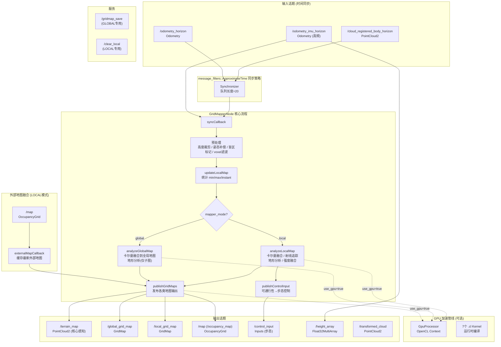
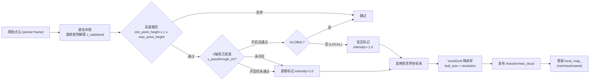
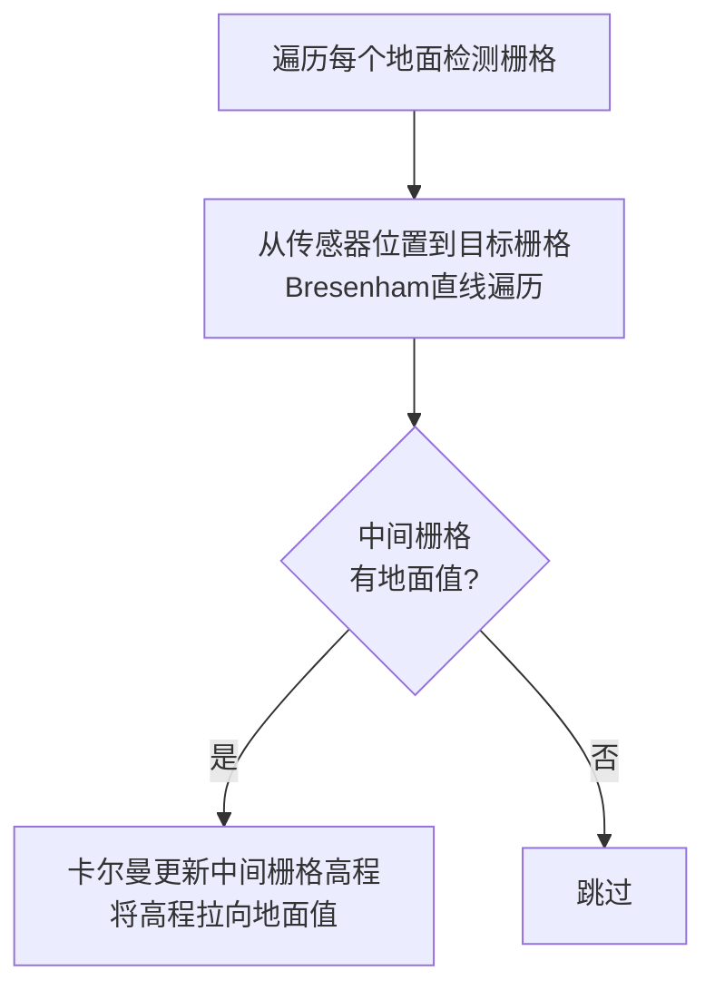
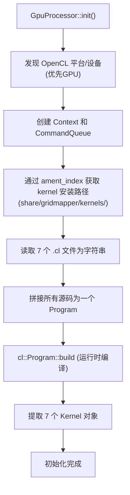
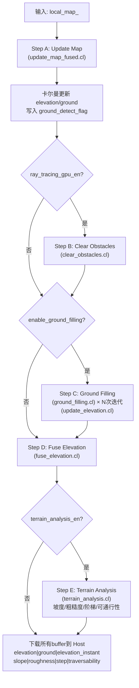
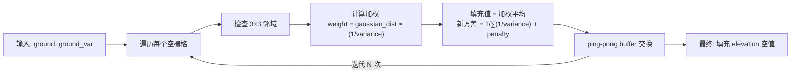
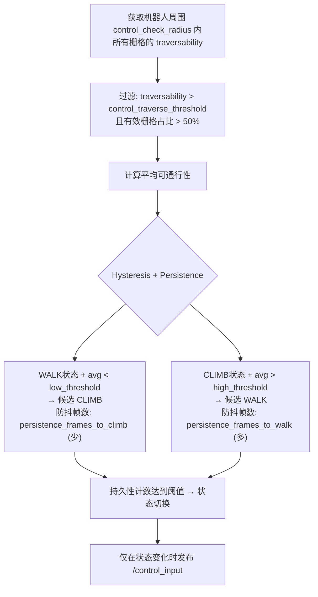
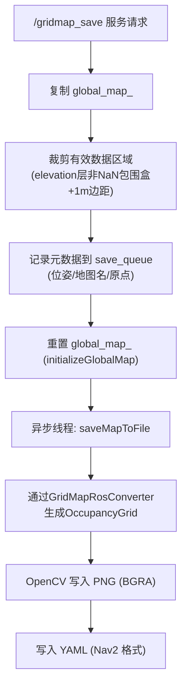
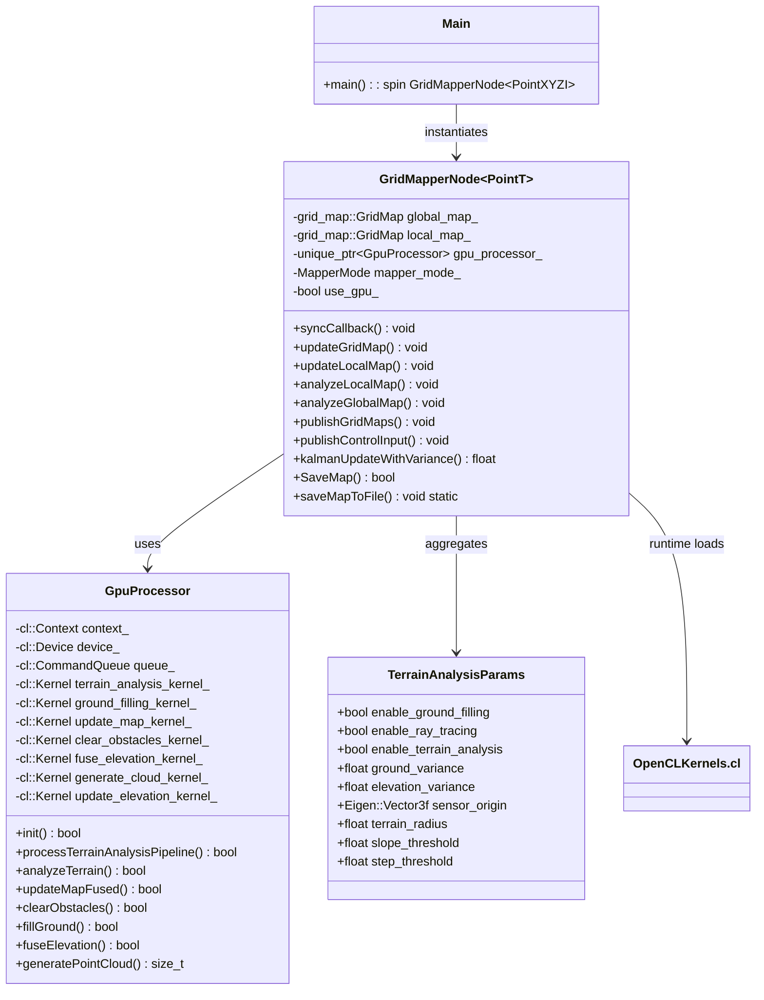

# GridMapper 项目详细分析文档

## 1. 项目概述

`GridMapper` 是一个基于 ROS 2 (Jazzy) 的 **2.5D 高性能网格地图构建框架**，核心目标是从原始 3D 点云中实时提取高程信息，生成包含坡度、粗糙度、阶梯及可通行性等语义信息的 2.5D 网格地图。系统针对嵌入式平台与机器人移动避障进行了深度优化，支持全 GPU (OpenCL) 加速。

- **编程语言**: C++17
- **构建系统**: ament_cmake (ROS 2)
- **GPU 框架**: OpenCL 1.2 (运行时编译, 跨平台)
- **点云库**: PCL (Point Cloud Library)
- **网格地图库**: grid_map (ETH Zurich)
- **模板类架构**: `GridMapperNode<pcl::PointXYZI>`

---

## 2. 项目文件结构

```
gridmapper/
├── CMakeLists.txt                # 构建配置
├── package.xml                   # ROS 2 包清单
├── config/
│   ├── gridmapper_global.yaml    # 全局模式参数
│   └── gridmapper_local.yaml     # 局部模式参数
├── launch/
│   ├── global.launch.py          # 全局模式启动文件
│   └── local.launch.py           # 局部模式启动文件
├── include/gridmapper/
│   ├── gridmapper.hpp            # 主节点模板类声明 (366行)
│   └── gpu_processor.hpp         # GPU处理器类声明 (141行)
├── src/
│   ├── main.cpp                  # 入口: 实例化并spin GridMapperNode
│   ├── gridmapper.cpp            # 主节点实现 (1446行)
│   ├── gpu_processor.cpp         # GPU处理器实现 (784行)
│   └── kernels/                  # OpenCL 内核源码 (运行时编译)
│       ├── terrain_analysis.cl   # 地形分析: 坡度/粗糙度/可通行性
│       ├── update_map_fused.cl   # 融合卡尔曼更新
│       ├── clear_obstacles.cl    # GPU射线追踪清理
│       ├── ground_filling.cl     # 智能地面空洞填充
│       ├── fuse_elevation.cl     # 高程层融合(盲区+卡尔曼)
│       ├── update_elevation.cl   # 地面填充后更新高程
│       └── generate_point_cloud.cl # 栅格→点云生成(可视化)
├── rviz_cfg/
│   └── gridmapper_config.rviz
├── README.md                     # 用户文档 (中文)
└── READMElocal.md                # 局部模式补充文档 (有参数名过时)
```

---

## 3. 系统整体架构与数据流



---

## 4. 双模式架构详解

### 4.1 模式对比

| 维度 | GLOBAL 模式 | LOCAL 模式 |
|------|-----------|-----------|
| **目标** | 持久融合, 全局建图 | 实时避障, 滑动窗口 |
| **`mapper_mode`** | `"global"` | `"local"` |
| **地图对象** | `global_map_` (大尺寸持久) | `local_map_` (小尺寸滑动) |
| **数据融合** | 卡尔曼滤波持续累积 | 卡尔曼滤波 + 盲区直接映射 |
| **地形分析范围** | 仅分析 `local_map_` 重叠子图 | 分析 `local_map_` 全图 |
| **地图持久化** | 支持保存/记录拓扑连接 | 不支持 |
| **专属服务** | `/gridmap_save` | `/clear_local` |
| **步态控制** | 支持 | 支持 (默认关闭) |
| **外部地图融合** | 不支持 | `fuse_external_map_en` |
| **优雅关闭时间** | `sigterm_timeout=60s` | 默认 |

### 4.2 全局地图层 (GLOBAL)

```
global_map_:
├── elevation           # 卡尔曼滤波后的高程 (来自 local map 的 max)
├── elevation_var       # 高程方差
├── ground              # 卡尔曼滤波后的地面 (来自 local map 的 min)
├── ground_var          # 地面方差
├── slope               # 坡度 (rad)
├── roughness           # 粗糙度 (m)
├── step                # 阶梯高度 (m)
├── traversability      # 可通行性概率 [0,1]
```

### 4.3 局部地图层 (LOCAL)

```
local_map_:
├── min                 # 本帧每个cell的最小z值
├── max                 # 本帧每个cell的最大z值
├── instant             # 盲区标记 (intensity==-1 → true)
├── elevation           # 卡尔曼滤波后的高程
├── elevation_instant   # 融合后的瞬时高程
├── elevation_var       # 高程方差
├── ground              # 卡尔曼滤波后的地面
├── ground_var          # 地面方差
├── slope               # 坡度 (rad)
├── roughness           # 粗糙度 (m)
├── step                # 阶梯高度 (m)
├── traversability      # 可通行性概率 [0,1]
```

---

## 5. 数据预处理管线



### 关键预处理细节

1. **姿态补偿 (重力对齐)**: `z_stabilized` 通过旋转矩阵将点云 Z 分量投影到重力方向, 消除机器人横滚/俯仰影响。

2. **动态传感器高度估计 (LOCAL 模式)**: 当 `x_passthrough_en` 开启时, 通过 `CircleIterator` 在机器人周围 2×resolution 半径内取地面值的 **中位数**, 实时更新 `sensor_height_current`。该值用于缩放 X 轴滤波阈值:
   ```
   x_passthrough_min * (sensor_height_current / sensor_height_origin)
   ```

3. **盲区标记策略**: 凡满足 X 轴滤波丢弃条件的点, 在 LOCAL 模式下标记 `intensity=-1.0` (盲区点)。盲区点不经过卡尔曼滤波器, 直接映射到 `elevation_instant` 层——确保零延迟避障响应。

4. **Voxel 降采样**: 使用体素大小等于地图分辨率的 `VoxelGrid` 滤波器, 在变换后进行降采样。

---

## 6. 核心算法详解

### 6.1 卡尔曼滤波更新

每个网格单元的对偶高度 (地面 `ground` + 高程 `elevation`) 使用带方差的一维卡尔曼滤波器维护:

```math
K = \frac{\sigma^2_{t-1}}{\sigma^2_{t-1} + \sigma^2_z}
```

```math
h_t = h_{t-1} + K \cdot (z_t - h_{t-1})
```

```math
\sigma^2_t = \max\left(\sigma^2_{min},\; \frac{\sigma^2_{t-1} \cdot \sigma^2_z}{\sigma^2_{t-1} + \sigma^2_z}\right)
```

- **地面观测值**: `local_map_` 的 `min` 层
- **高程观测值**: `local_map_` 的 `max` 层
- **异常值剔除**: 马氏距离 > `mahalanobis_threshold` (默认 3.0) 的观测被拒绝
- **地面检测条件**: `max < min + resolution` → 认为是地面, 触发射线追踪

### 6.2 强度感应高程融合

```
elevation_instant = {
    max_height,      if instant == 1.0 (盲区)
    elevation,       otherwise (正常区)
}
```

盲区障碍物不进入滤波器, 直接渲染到分析层, 实现零延迟响应。

### 6.3 射线追踪 (Ray Tracing)

用于清理已被移除的虚假障碍物。流程为:



CPU 实现为 `performRayTracing()`, GPU 实现为 `clear_obstacles.cl`。GPU 版本使用 `ground_detect_flag` 标志位数组, 由 `update_map_fused` kernel 写入, 只处理触发地面检测的栅格。

### 6.4 地形分析

#### GPU 实现 (`terrain_analysis.cl`)

1. **采样**: 在每个栅格的 `terrain_radius` 半径圆内收集邻域点 (最多256个)。
2. **平面拟合**: 使用最小二乘法解析解 (Normal Equations), 通过 3×3 矩阵解析求逆得到平面法向量:
   - 法向量 $n = (a, b, -1)$, 归一化后计算坡度:
     $$slope = \arccos(|n_z|)$$
3. **粗糙度**: 各点到拟合平面的残差均方根 (RMS):
   $$roughness = \sqrt{\frac{\sum residuals^2}{N}}$$
4. **阶梯**: 邻域内最大高差:
   $$step = \max_{i\in neighbor} |h_{center} - h_i|$$
5. **Kernel 融合**: 地形特征和可通行性在 **同一个 kernel** 中计算, 避免中间结果写回全局内存。

#### CPU 实现

CPU 使用 Eigen 库的 `colPivHouseholderQr` 进行 QR 分解做平面拟合 (精确但较慢)。

### 6.5 可通行性概率模型

```math
P_{total} = \exp(-\lambda \cdot slope) \cdot \exp(-\sigma_r \cdot roughness)
```

**硬约束**: 若 $slope > slope\_threshold$ 或 $step > step\_threshold$ → $P_{total} = 0$

**盲区惩罚**: 盲区点的 `traversability` 乘以 `instant_penalty` (默认 0.2)。

---

## 7. GPU 加速管线详解

### 7.1 初始化流程



### 7.2 GPU 处理管线 (`processTerrainAnalysisPipeline`)



**关键优化**: 所有 kernel 参数只上传一次, 中间结果保持在 GPU 显存中, 最后批量下载。

### 7.3 地面智能填充 (`ground_filling.cl`)

这是一种 **迭代概率扩散滤波器**:



方差倒数加权的意义: 可信度越高的邻域点 (方差越小) 对填充贡献越大。每次迭代添加 `filling_penalty` 使填充在可靠数据边界处自动停止。

---

## 8. 步态控制逻辑



控制模式:
| 模式 | 值 | 含义 |
|------|-----|---------|
| REST | 1 | 静止 |
| STAND | 2 | 站立 |
| WALK | 3 | 正常行走 |
| CLIMB | 5 | 爬坡/爬梯 |

**非对称防抖**: 切换到 CLIMB 很快 (安全优先), 切换回 WALK 较慢 (稳定优先)。

---

## 9. 地图持久化

### 9.1 保存流程 (`SaveMap`)



### 9.2 拓扑连接记录

析构函数 (`~GridMapperNode`) 在 GLOBAL 模式下自动记录 `map_connections.txt`:

```
FROM_MAP,TO_MAP,FROM_X,FROM_Y,TO_X,TO_Y,Z
map_01.png,map_02.png,5.2,0.1,10.3,0.2,0.5
...
```

并在关闭时自动调用同步保存 `SaveMap("map", 0.0f, 1.0f, false)`。

---

## 10. 所有 ROS 接口汇总

### 10.1 输入话题

| 话题 | 类型 | QoS | 说明 |
|------|------|-----|------|
| `/cloud_registered_body_horizon` | PointCloud2 | SensorData | 畸变校正后点云 (时间同步) |
| `/odometry_horizon` | Odometry | SensorData | 核心里程计 (时间同步) |
| `/odometry_imu_horizon` | Odometry | SensorData | 高频辅助里程计 |
| `/map` | OccupancyGrid | 默认(10) | 外部地图 (仅 fuse_external_map_en) |

### 10.2 输出话题

| 话题 | 类型 | 说明 |
|------|------|------|
| `/terrain_map` | PointCloud2 | **核心感知视图**: 垂直3D还原, 颜色=可通行性 |
| `/global_grid_map` | GridMap | 全局多层网格地图 |
| `/local_grid_map` | GridMap | 局部多层网格地图 |
| `/map` (/occupancy_map) | OccupancyGrid | 标准导航占据栅格 |
| `/control_input` | Inputs | 步态控制建议 |
| `/height_array` | Float32MultiArray | 机器人前方高度切片 |
| `/height_array_viz` | PointCloud2 | 高度切片可视化 |
| `/transformed_cloud` | PointCloud2 | 预处理后世界坐标点云 |
| `/mode_trajectory_markers` | Marker | 模式变化轨迹 (可选) |

### 10.3 服务

| 服务 | 类型 | 模式 | 说明 |
|------|------|------|------|
| `/gridmap_save` | nav2_msgs/srv/SaveMap | GLOBAL | 保存地图, 重置缓存, 记录拓扑 |
| `/clear_local` | example_interfaces/srv/SetBool | LOCAL | 清空局部地图 |

---

## 11. 构建与运行

### 11.1 依赖安装

```shell
# OpenCL 运行时
sudo apt install opencl-headers ocl-icd-opencl-dev

# 自定义 ROS 包 (需先构建)
git clone -b jazzy https://github.com/ggbond-control/control_input_msgs.git
colcon build --packages-select control_input_msgs --cmake-args -Wno-dev --symlink-install
```

### 11.2 构建

```shell
# 从工作空间根目录 /home/jazzy/nav_t_ws
colcon build --packages-select gridmapper --cmake-args -Wno-dev -DCMAKE_EXPORT_COMPILE_COMMANDS=1 --symlink-install
```

### 11.3 启动

```shell
# 局部模式 (避障)
ros2 launch gridmapper local.launch.py

# 全局模式 (建图)
ros2 launch gridmapper global.launch.py

# 带 GPU 加速 (默认 true, 可关闭)
ros2 launch gridmapper local.launch.py use_gpu:=false
```

### 11.4 服务调用

```shell
# 保存地图 (GLOBAL专用)
ros2 service call /gridmap_save nav2_msgs/srv/SaveMap "{map_url: 'my_map', free_thresh: 0.0, occupied_thresh: 1.0}"

# 清空局部地图 (LOCAL专用)
ros2 service call /clear_local example_interfaces/srv/SetBool
```

---

## 12. 关键参数速查表

| 类别 | 参数 | 默认 | 说明 |
|------|------|------|------|
| **模式** | `mapper_mode` | global | `"local"` 或 `"global"` (字符串) |
| | `use_gpu` | false | OpenCL 加速 (launch参数覆盖为 true) |
| **地图** | `resolution` | 0.1 | m/栅格 |
| | `local_map_size` | 20.0 | 局部窗口跨度 (m) |
| | `global_map_width/height` | 100.0 | 全局画布 (m) |
| **预处理** | `min_point_height` | -2.0 | 最低高度 (相对传感器) |
| | `max_point_height` | 2.0 | 最高高度 |
| | `enable_x_passthrough` | false | 前方过滤开关 |
| **卡尔曼** | `ground_variance` | 0.2 | 地面初始方差 |
| | `elevation_variance` | 1.0 | 高程初始方差 |
| | `mahalanobis_threshold` | 3.0 | 异常值剔除阈值 |
| **GPU分析** | `ray_tracing_gpu_en` | false | GPU射线追踪 |
| | `enable_ground_filling` | false | 地面填充 |
| | `filling_iterations` | 5 | 填充迭代次数 |
| | `filling_penalty` | 0.01 | 置信度衰减 |
| **地形** | `terrain_radius` | 0.3 | 分析半径 (m) |
| | `slope_threshold` | 30° | 爬坡硬阈值 |
| | `step_threshold` | 0.2m | 阶梯硬阈值 |
| | `traversability_lambda` | 2.0 | 坡度负权重 |
| **步态控制** | `control_en` | true | 控制发布开关 |
| | `control_persistence_frames_to_climb` | 2 | CLIMB防抖 (快) |
| | `control_persistence_frames_to_walk` | 10 | WALK防抖 (慢) |
| **外部融合** | `fuse_external_map_en` | false | LOCAL模式外部地图融合 |
| **保存** | `save_map_path` | "" | 地图保存根路径 |

---

## 13. 设计亮点与关键约束

### 设计亮点

1. **双层高程架构**: `ground` (地面) 和 `elevation` (高程/障碍物) 独立卡尔曼滤波, 分别用 `min` 和 `max` 值更新。射线追踪利用地面检测触发清理。

2. **盲区零延迟**: `intensity=-1` 标记的点不经过滤波器, 直接覆盖到 `elevation_instant`, 确保传感器盲区障碍物瞬间呈现在可通行性分析中。

3. **GPU Kernel 融合**: 地形分析核将坡度、粗糙度、阶梯和可通行性计算融合在同一个 kernel 中, 避免中间结果写回全局内存。

4. **运行时 GPU 编译**: .cl 文件以文本形式安装, 运行时编译为当前硬件优化的二进制。修改 kernel 后无需重新构建 C++ 代码。

5. **共享标志位缓冲**: `ground_detect_flag_buffer_` 在 `update_map` kernel 中写入, 在 `clear_obstacles` kernel 中读取, 实现跨 kernel 的数据传递 (保持在 GPU 显存中)。

### 关键约束

1. **.cl 文件运行时定位**: 优先通过 `ament_index_cpp::get_package_share_directory("gridmapper")` 定位安装路径, 若失败则回退到编译时的 `ROOT_DIR` 宏。

2. **无单元测试**: CMakeLists.txt 仅有 ament lint 桩代码, 无实际测试用例。

3. **模板实例化限制**: `GridMapperNode` 以 `pcl::PointXYZI` 模板参数显式实例化, 修改点类型需同时修改 `main.cpp:6` 和 `gridmapper.cpp:1446`。

4. **`READMElocal.md` 部分过时**: 文档中引用的 `localization_mode_en` 参数已不存在, 当前使用 `mapper_mode: "local"`。

5. **线程安全**: 仅通过 `grid_map_mutex_` 保护地图操作, `external_map_mutex_` 保护外部地图数据。

---

## 14. 类关系图



### 14.1 GpuProcessor 功能矩阵

| GPU Kernel | 对应 .cl 文件 | 对应 GpuProcessor 方法 | 功能 | 维度 |
|------------|--------------|----------------------|------|------|
| `update_map_fused` | update_map_fused.cl | `updateMapFused()` | 融合卡尔曼更新+标志位写入 | 2D |
| `clear_obstacles` | clear_obstacles.cl | `clearObstacles()` | 射线追踪清除虚障碍 | 2D |
| `ground_fill_iteration` | ground_filling.cl | `fillGround()` | 迭代地面填充 | 2D |
| `update_elevation_from_ground` | update_elevation.cl | fillGround 内部调用 | 填充后同步高程 | 1D |
| `fuse_elevation` | fuse_elevation.cl | `fuseElevation()` | 盲区/正常高程融合 | 2D |
| `analyze_terrain` | terrain_analysis.cl | `analyzeTerrain()` | 地形分析+可通行性 | 2D |
| `generate_point_cloud` | generate_point_cloud.cl | `generatePointCloud()` | 栅格→3D点云输出 | 2D→3D |

---

*文档基于 commit 当前版本, 最后更新: 2026-04-27*
