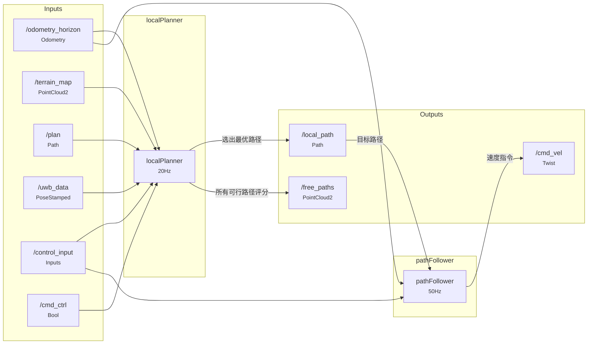
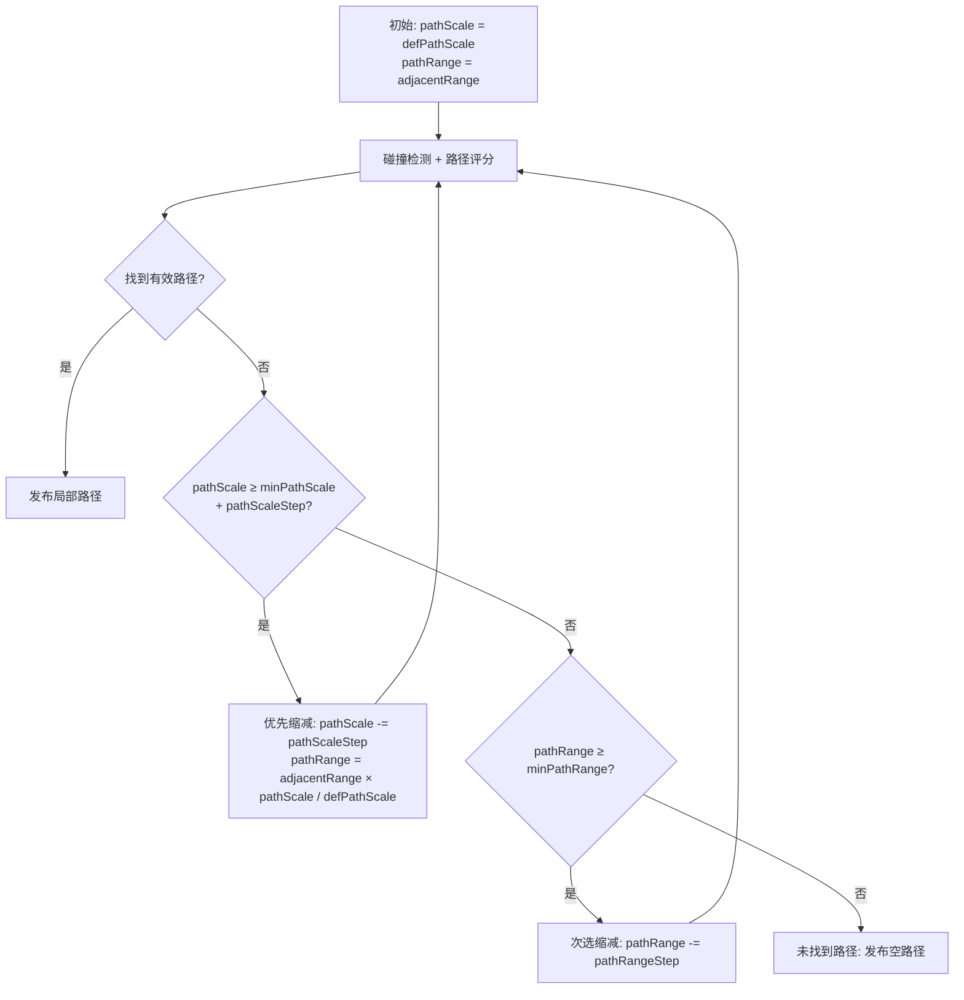
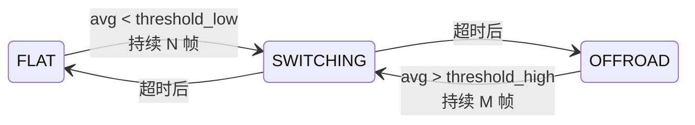
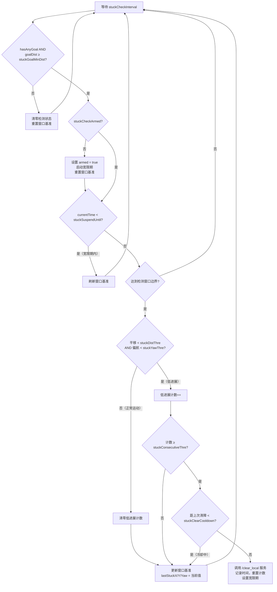

# Local Planner 项目详细分析文档

## 1. 项目概述

`local_planner` 是一个基于 ROS 2 的局部路径规划与跟踪包，主要用于地面移动机器人（如四足机器狗、轮式底盘）的自主导航。其核心功能包括：基于地形点云的障碍物检测与路径评分、多模式导航策略、全向运动控制以及自主步态模式切换。

该项目包含两个独立节点，通过 ROS 2 话题串联工作：

| 节点 | 功能 | 运行频率 |
|------|------|----------|
| `localPlanner` | 地形感知路径评分与局部路径生成 | 20 Hz（可配置） |
| `pathFollower` | 路径跟踪与速度指令生成 | 50 Hz（可配置） |

## 2. 系统架构

### 2.1 数据流图



### 2.2 话题接口

#### localPlanner 订阅话题

| 话题 | 消息类型 | QoS | 说明 |
|------|----------|-----|------|
| `/odometry_horizon` | `nav_msgs/msg/Odometry` | SensorDataQoS | 里程计位姿 |
| `/terrain_map` | `sensor_msgs/msg/PointCloud2` | SensorDataQoS | 带可通行性强度的地形点云 |
| `/plan` | `nav_msgs/msg/Path` | 队列5 | 全局规划路径 |
| `/uwb_data` | `geometry_msgs/msg/PoseStamped` | 队列10 | UWB目标定位（NavType=1） |
| `/control_input` | `control_input_msgs/msg/Inputs` | 队列10 | 遥控器输入（NavType=2，目标方向） |
| `/cmd_ctrl` | `std_msgs/msg/Bool` | 队列10 | 模型自动切换使能/失能开关 |

#### localPlanner 发布话题

| 话题 | 消息类型 | QoS | 说明 |
|------|----------|-----|------|
| `/local_path` | `nav_msgs/msg/Path` | 队列5 | 选出的局部路径 |
| `/free_paths` | `sensor_msgs/msg/PointCloud2` | SensorDataQoS | 所有无碰撞路径的可视化评分 |
| `/planner_cloud_crop` | `sensor_msgs/msg/PointCloud2` | SensorDataQoS | 裁剪后的规划用点云 |
| `/local_goal` | `geometry_msgs/msg/PointStamped` | SensorDataQoS | 世界坐标系下的局部目标点 |
| `/local_goal_body` | `geometry_msgs/msg/PointStamped` | SensorDataQoS | 车体坐标系下的局部目标点 |
| `/footprint` | `geometry_msgs/msg/PolygonStamped` | SensorDataQoS | 车辆足迹矩形 |
| `/control_input` | `control_input_msgs/msg/Inputs` | 队列5 | 模型切换指令 |

#### localPlanner 服务客户端

| 服务 | 类型 | 说明 |
|------|------|------|
| `/clear_local` | `example_interfaces/srv/SetBool` | 卡住恢复：触发局部代价地图清障 |

#### pathFollower 订阅话题

| 话题 | 消息类型 | QoS | 说明 |
|------|----------|-----|------|
| `/odometry_horizon` | `nav_msgs/msg/Odometry` | SensorDataQoS | 里程计位姿 |
| `/local_path` | `nav_msgs/msg/Path` | 队列5 | localPlanner 输出的局部路径 |
| `/control_input` | `control_input_msgs/msg/Inputs` | 队列5 | 模型切换指令 |

#### pathFollower 发布话题

| 话题 | 消息类型 | QoS | 说明 |
|------|----------|-----|------|
| `/cmd_vel` | `geometry_msgs/msg/Twist` | 队列5 | 线速度X/Y + 角速度Z |
| `/path_follower/debug` | `std_msgs/msg/Float32MultiArray` | SensorDataQoS | 调试信息（9维浮点数组） |
| `/look_ahead` | `geometry_msgs/msg/PointStamped` | 队列5 | 预瞄点可视化 |

### 2.3 TF 变换

启动文件中包含一个 `static_transform_publisher`，发布 `map → gravity` 的零变换，用于坐标系锚定。

## 3. 核心算法详解

### 3.1 localPlanner：路径评分与选择

#### 3.1.1 预处理：路径模板库

系统在启动时从 `paths/` 目录加载四个文件构成路径模板库：

| 文件 | 内容 | 格式 |
|------|------|------|
| `startPaths.ply` | 7 组起始路径模板（每组对应一个方向分组） | PLY: x y z groupID |
| `paths.ply` | 343 条路径模板（采样间隔30） | PLY: x y z pathID intensity |
| `pathList.ply` | 343 条路径到 7 组的映射 + 终点坐标 | PLY: endX endY endZ pathID groupID |
| `correspondences_x30.txt` 或 `correspondences_dog.txt` | 网格体素到路径的映射（65×181=11765个体素） | 文本: voxelID pathID1 pathID2 ... -1 |

网格体素系统的参数为 MATLAB 离线生成的常量：
- 网格范围: X方向 65 点, Y方向 181 点
- 体素大小: 0.05m，偏移 X=3.2m, Y=4.5m

这些参数是硬编码常量（`gridVoxelSize`, `gridVoxelOffsetX/Y`, `gridVoxelNumX/Y`），与 MATLAB 脚本 `paths/` 目录中的 `.m` 文件对应。不同机器人配置使用不同的 `correspondences_*.txt` 文件。

#### 3.1.2 局部目标点计算（LocalGoal_callback）

采用定时器回调（频率由 `localGoalFreq` 控制，默认 5Hz），分四阶段从全局路径中提取局部目标：

1. **最近点搜索**：遍历全局路径找距离车辆最近的点 `closest_idx`
2. **前向积分搜索**：从 `closest_idx` 向前累积路径长度，收集满足预瞄距离的候选点，记录每个点的积分距离与欧氏距离
3. **反向回溯验证**：从候选点末端回溯，找到满足 "路径积分 / 欧氏距离 ≤ goalRatioThre" 的最远有效目标点，确保路径不会过度扭曲
4. **兜底逻辑**：若无满足条件的点，采用路径末端点

关键参数：
- `lookaheadScale`（默认0.6）：预瞄距离 = `adjacentRange × lookaheadScale`
- `goalRatioThre`（默认1.1）：路径扭曲度阈值

#### 3.1.3 碰撞检测与评分循环

主循环以 `localPlannerFreq`（20Hz）运行，在有新地形数据时执行规划。规划采用逐步降级策略：



对于每个 `(pathScale, pathRange)` 组合，执行三阶段评分：

**阶段一：碰撞检测（OpenMP 并行）**

- 遍历 36 个方向角（每 10° 一个，范围 -180° ~ +170°）
- 对裁剪点云中的每个点，计算其旋转后在网格体素中的位置
- 通过 `correspondences` 映射查找该体素关联的路径
- 对每条路径分类统计：
  - 不可通行点（`traversity < obstacleTraversityThre`）→ `clearPathList++`
  - 成本区域（`obstacleTraversityThre ≤ traversity ≤ costTraversityThre`）→ `pathPenaltyList` 取最大惩罚

使用 OpenMP 的 `parallel for schedule(dynamic)` 并行化 36 个方向的碰撞检测，内层使用线程私有缓存避免数据竞争，最后归约合并。

**阶段二：路径评分**

对碰撞点数 < `pointPerPathThre` 的路径，计算综合评分：

```
score = (1 - (0.02 × dirDiff)^dirWeight) × rotDirW^rotWeight × (exp(obsWeight × penaltyScore) - 1)
```

其中：
- `dirDiff`：路径终点方向与目标角度的偏差
- `rotDirW`：旋转方向权重（优先选择中间方向，减少极端转向）
- `penaltyScore = 1 - pathPenalty`：基于地形可通行性的分数

NavType=2（RC安全导航）时简化为仅方向分数：`score = 1 - (0.02 × dirDiff)^dirWeight`

评分时对上一周期选中的路径组给予滞后奖励（`scoreAdvantage`），防止频繁跳变。

**阶段三：路径选择与输出**

从所有 36×7=252 个方向×组评分中选择最高分对应的路径组，将其起始路径模板经旋转和缩放后生成局部路径消息，同时为每条路径点编码四元数朝向信息。

#### 3.1.4 自主模型切换状态机

路径选择后，对选出路径的每一点做 KD-Tree 半径搜索评估可通行性（`control_en=true`时启用）：



- 切换期间发送空路径使机器人停车，经过一半 `control_switch_timeout` 后发送模型指令
- `cmd_ctrl_active` 可通过 `/cmd_ctrl` 话题动态失能自动切换

#### 3.1.5 卡住检测与恢复

周期性检测机器人是否卡住：



### 3.2 pathFollower：路径跟踪与全向控制

#### 3.2.1 全向运动控制模型

pathFollower 实现了全向（Holonomic）运动控制，输出 `cmd_vel` 包含 `linear.x`（前进）、`linear.y`（横移）和 `angular.z`（旋转）三个分量。

核心控制流程：

1. **动态预瞄距离**：`dynamicLookahead = clamp(lookaheadTime × currentSpeed, minLookaheadDis, maxLookaheadDis)`
2. **最近点搜索**：在路径上找距离车辆最近的点
3. **预瞄点获取**：从当前位置沿路径前移 `dynamicLookahead` 距离
4. **曲率减速**：由最近点、中间点、预瞄点三点拟合圆弧计算曲率，`targetSpeed /= (1 + curvature × curvatureDecelGain)`
5. **终点减速**：`stopSpeed = sqrt(1.55 × maxAccelX × max(endDis - stopDisThre, 0))`
6. **航向误差减速**：`targetSpeed × max(0.2, 1 - |dirDiff|/π)`
7. **移动方向计算**：路径切线方向 + 横向纠偏（`lateralGain` 加权）
8. **体坐标系转换**：`relativeMoveDir = pathMoveDir - (vehicleYaw - vehicleYawRec)`
9. **独立加速度爬升**：X/Y 方向各自的加速度限制
10. **停止条件**：距终点 < `stopDisThre` 且航向偏差 < `approveYawDeg`

#### 3.2.2 特殊导航模式

- **NavType=0**：标准全局路径导航
- **NavType=1**：UWB 目标点导航，从 `/uwb_data` 获取目标偏移，到达 `UWBStopDis` 范围即停
- **NavType=2**：RC 安全导航，遥控器方向映射为目标，`orientation.w > 10` 标记为 RC 直控模式，角速度直接由遥控器拨杆映射，路径为空时直接发布遥控器速度指令

#### 3.2.3 模型切换机制

pathFollower 订阅 `/control_input`，当收到与某个模型 `modelCommand` 匹配的指令时，自动切换物理参数（maxSpeed, maxSpeedY, maxYawRate, maxAccelX, maxAccelY, maxAccelYawRate），不同模型对应不同运动性能限制。

## 4. 三种导航模式详解

| NavType | 名称 | 目标来源 | 特点 |
|---------|------|----------|------|
| 0 | 全局路径导航 | `/plan` 话题 | 标准 ROS 导航栈模式，有全局路径 |
| 1 | UWB 目标导航 | `/uwb_data` 话题 | 无地图，UWB 定位直接指目标 |
| 2 | RC 安全导航 | `/control_input` 遥控器 | 遥控器给出方向，系统自动避障 |

选择方式：在 YAML 配置文件的 `/**: ros__parameters:` 部分设置 `NavType` 参数。

## 5. 配置体系

### 5.1 三种机器人配置

| 配置文件 | 机器人 | 车身尺寸(L×W) | 通信域文件 | 特点 |
|----------|--------|---------------|-----------|------|
| `local_planner_x30.yaml` | X30（默认） | 1.0m × 0.47m | `correspondences_x30.txt` | 标准四足 |
| `local_planner_dog.yaml` | Dog | 0.50m × 0.36m | `correspondences_dog.txt` | 紧凑四足，NavType=2 |
| `local_planner_dog_rcnav.yaml` | Dog（RC导航） | 0.50m × 0.36m | `correspondences_dog.txt` | NavType=1，UWB模式 |

切换方式：修改 `local_planner.launch.py` 中第17行的 `params_file` 路径。

### 5.2 关键参数分类

#### localPlanner 参数

| 类别 | 参数 | 默认值(X30) | 说明 |
|------|------|-------------|------|
| **车辆尺寸** | vehicleLength | 1.0 | 车身长度(m) |
| | vehicleWidth | 0.47 | 车身宽度(m) |
| **地形处理** | terrainVoxelSize | 0.05 | 地形降采样体素尺寸(m) |
| | adjacentRange | 3.5 | 规划搜索范围(m) |
| | obstacleTraversityThre | 0.2 | 障碍物可通行性阈值 |
| | minRelZ / maxRelZ | -1.0 / 1.0 | 高度裁剪范围(m) |
| **路径评分** | dirWeight | 0.25 | 方向权重 |
| | rotWeight | 2.0 | 旋转权重 |
| | obsWeight | 7.0 | 障碍权重 |
| | dirThre | 90.0 | 方向剪枝角度(°) |
| | scoreAdvantage | 1.1 | 滞后奖励因子 |
| **路径缩放** | defPathScale | 1.25 | 默认路径缩放 |
| | minPathScale | 0.75 | 最小缩放 |
| | pathScaleStep | 0.25 | 缩放步进 |
| **卡住恢复** | stuckCheckInterval | varies | 检测间隔(s) |
| | stuckConsecutiveThre | varies | 连续触发次数 |
| **自动切换** | control_en | false(X30) | 是否启用自动模型切换 |
| | control_avg_threshold_high | 0.85 | 切换到flat的可通行性阈值 |
| | control_avg_threshold_low | 0.75 | 切换到offroad的可通行性阈值 |

#### pathFollower 参数

| 类别 | 参数 | 默认值(X30) | 说明 |
|------|------|-------------|------|
| **预瞄** | lookaheadTime | 1.0 | 预瞄时间系数 |
| | minLookaheadDis | 0.1 | 最小预瞄距离(m) |
| | maxLookaheadDis | 1.0 | 最大预瞄距离(m) |
| **控制增益** | yawRateGain | 1.5 | 角速度P增益 |
| | curvatureDecelGain | 0.75 | 曲率减速因子 |
| | lateralGain | 2.0 | 横向纠偏增益 |
| | yawRateDecelRatio | 0.2 | 角速度随线速度衰减比 |
| **停止** | stopDisThre | 0.2 | 终点停止距离(m) |
| | approveYawDeg | 10.0 | 终点航向容差(°) |

## 6. 外部依赖

### 6.1 非标准 ROS 2 包

| 包名 | 说明 | 使用方式 |
|------|------|----------|
| `control_input_msgs` | 自定义外部包，非 ROS 2 标准 | 定义 `Inputs.msg`，包含 `command`(int32)、`lx`/`ly`/`rx`/`ry`(float32) 字段 |
| `example_interfaces` | ROS 2 标准示例接口包 | 使用 `srv/SetBool` 服务类型 |

### 6.2 核心库依赖

| 库 | 用途 |
|-----|------|
| PCL (pcl_ros, pcl_conversions) | 点云处理、VoxelGrid 降采样、KD-Tree 半径搜索 |
| OpenMP | 多线程并行碰撞检测 |
| tf2 | 四元数与欧拉角转换 |
| Eigen (隐式) | 矩阵运算 |

## 7. 路径模板文件说明

`paths/` 目录中的文件是离线生成的路径库：

- `.ply` 文件由 MATLAB 脚本生成，在运行时被 C++ 代码读取，**不可随意修改**
- `.m` 文件是 MATLAB 路径生成脚本，仅在离线使用，**不参与运行时**
- `correspondences_*.txt` 是网格体素到路径的映射索引，不同机器人因尺寸不同使用不同的对应文件

**重要**：若需重新生成路径库，需运行 MATLAB 脚本，并确保 C++ 代码中的硬编码常量（`gridVoxelSize`, `gridVoxelOffsetX/Y`, `gridVoxelNumX/Y`）与 MATLAB 参数一致。

## 8. 运行与调试

### 8.1 构建与运行

```bash
# 从工作空间根目录构建
colcon build --packages-select local_planner --cmake-args -Wno-dev -DCMAKE_EXPORT_COMPILE_COMMANDS=1 --symlink-install

# 启动（仿真时间模式）
ros2 launch local_planner local_planner.launch.py use_sim_time:=true start_rviz:=true debug_info:=true

# 录制 bag
ros2 bag record -o <name> /clock /tf_static /tf /odometry_horizon /terrain_map /plan /local_path /free_paths /cmd_vel
```

### 8.2 调试话题

| 话题 | 说明 |
|------|------|
| `/free_paths` | 可视化所有无碰撞路径的评分（强度=总分，normal_x/y/z=方向/旋转/障碍分数） |
| `/planner_cloud_crop` | 裁剪后的规划点云 |
| `/local_goal` | 世界坐标系下的局部目标点 |
| `/local_goal_body` | 车体坐标系下的局部目标点 |
| `/footprint` | 车辆足迹矩形 |
| `/path_follower/debug` | [dynamicLookahead, pathMoveDir, relativeMoveDir, curvature, targetSpeed, dirDiff, endDis, targetYawRate, stopSpeed] |

### 8.3 关键注意事项

1. **坐标系约定**：所有路径在 `horizon`（车体）坐标系下表示，pathFollower 接收的路径坐标也是相对于路径接收时刻车辆位姿的局部坐标
2. **`use_sim_time` 必须同步**：launch 文件将 `use_sim_time` 传给所有节点，仿真时必须设为 `true`
3. **路径方向编码**：pathFollower 通过路径点的 `orientation.w` 字段传递特殊标记——`w > 10` 表示 RC 直控模式
4. **OpenMP 线程数**：默认 4 线程，通过 `ompNumThreads` 参数配置
5. **点云可通行性**：`/terrain_map` 点云的 `intensity` 字段表示可通行性（1.0=完全可通行，0.0=不可通行），这是与上游地形分析节点的关键接口约定
6. **`control_input_msgs` 缺失将导致编译失败**：该包不在标准 ROS 2 发行版中，需单独编译

## 9. 代码风格与设计模式

### 9.1 代码风格特点

- 全局变量广泛使用（两个源文件均采用全局状态 + 回调函数 + 主循环的模式，未使用类封装）
- 参数声明与获取采用冗长的 `declare_parameter` + `get_parameter` 成对模式
- 中文注释混合英文命名
- ROS 2 节点使用 `rclcpp::Node::make_shared()` 裸指针模式

### 9.2 设计模式

- **回调驱动 + 定时器**：里程计、点云、路径等使用回调更新全局状态，localPlanner 的局部目标选择使用 `wall_timer`，pathFollower 使用 `rclcpp::Rate` 主循环
- **线程安全**：仅全局路径使用 `std::mutex` 保护（`path_mutex_`），其他全局变量无同步保护（依赖单线程执行语义）
- **降级策略**：路径搜索采用逐步降级（缩小 scale → 缩小 range），保证在狭窄环境中也能找到可行路径
- **滞后效应**：路径选择对上一周期选中的路径组给予加分，避免路径跳变

## 10. 可能的改进方向

1. **类封装**：当前两个节点的全局变量过多，建议重构为类以提升可维护性
2. **参数管理**：大量参数硬编码为全局变量后通过 `declare/get_parameter` 双写，可考虑使用 `rclcpp::NodeOptions` 的参数回调或 `param` 事件机制
3. **路径库常量**：`gridVoxelSize/OffsetX/OffsetY/NumX/NumY` 和 `pathNum/groupNum` 等硬编码常量应参数化或从文件读取
4. **测试**：当前仅有 ament_lint_auto，缺少单元测试和集成测试
5. **线程安全**：localPlanner 中 `newTerrainCloud`、全局变量等无锁保护，在高频回调场景下可能存在数据竞争