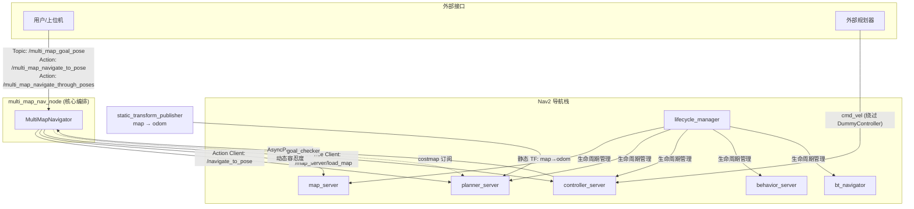
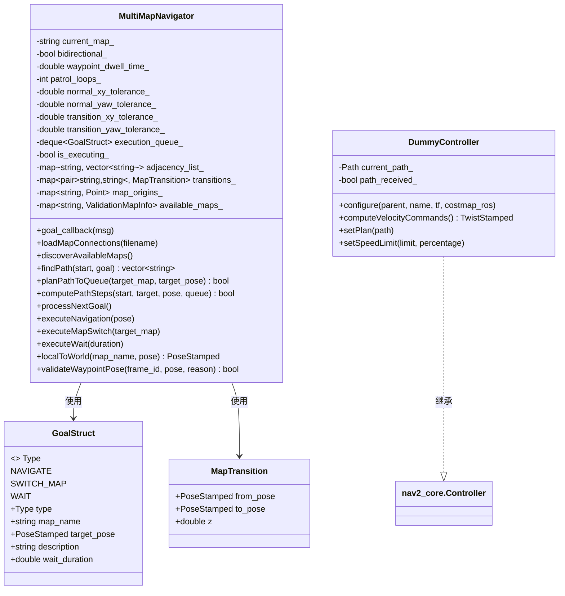
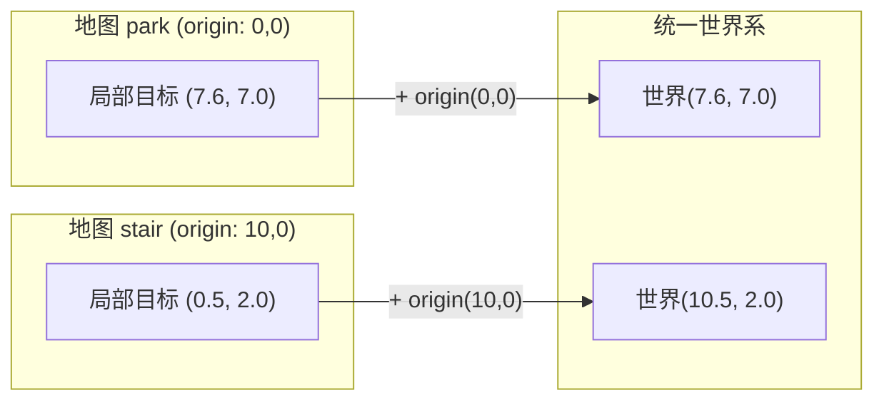
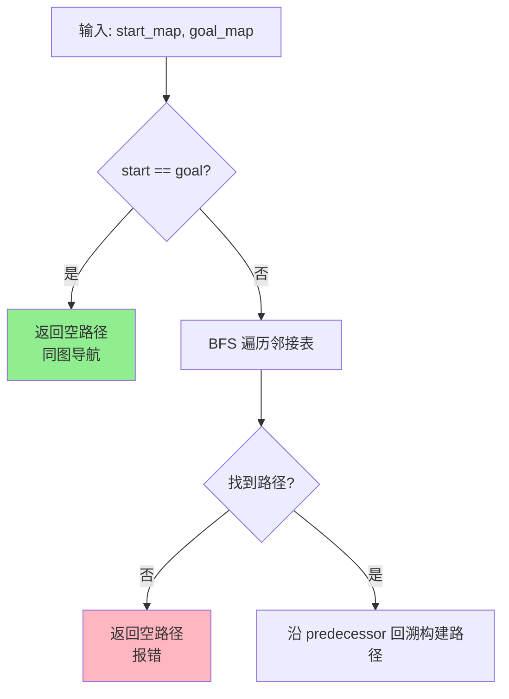
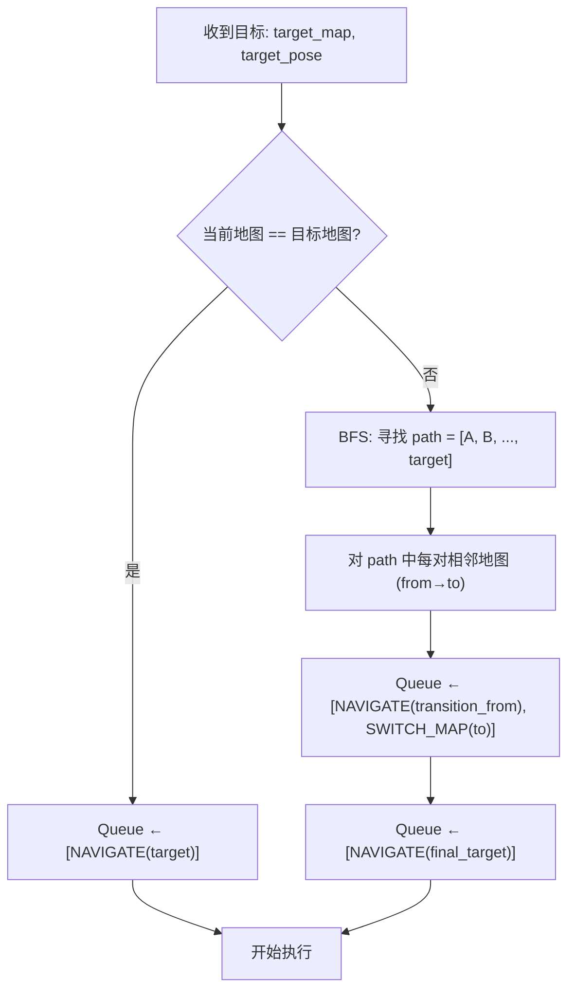
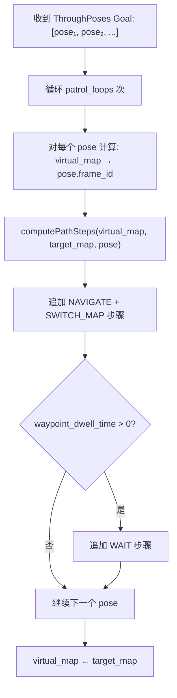
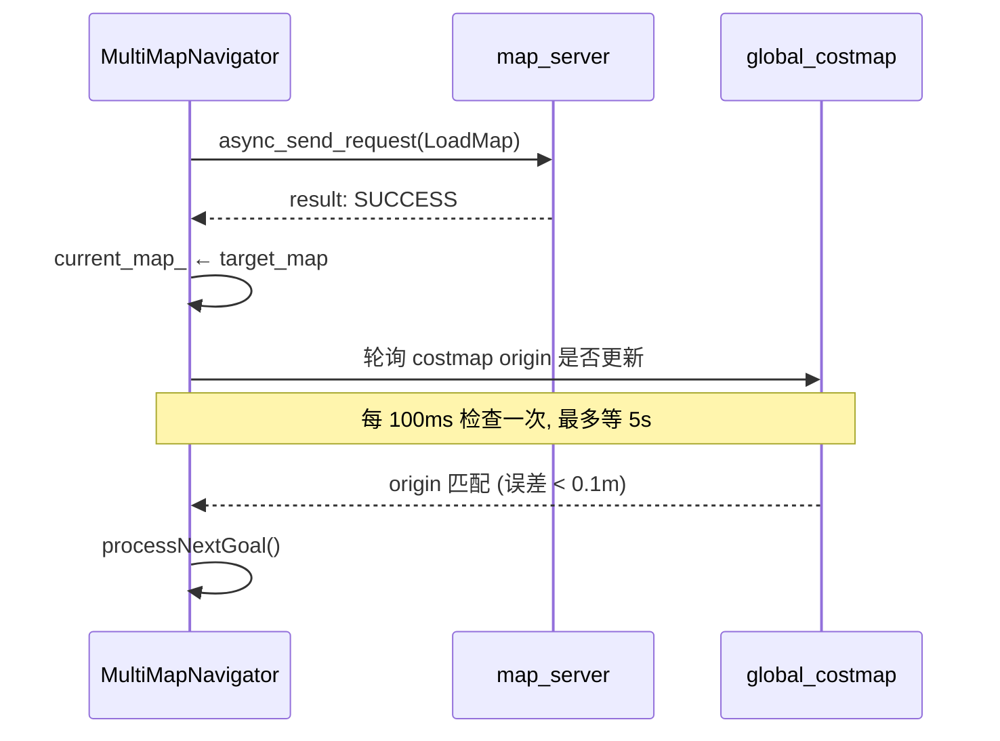
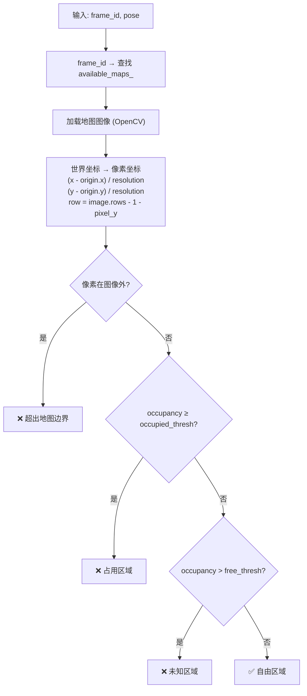
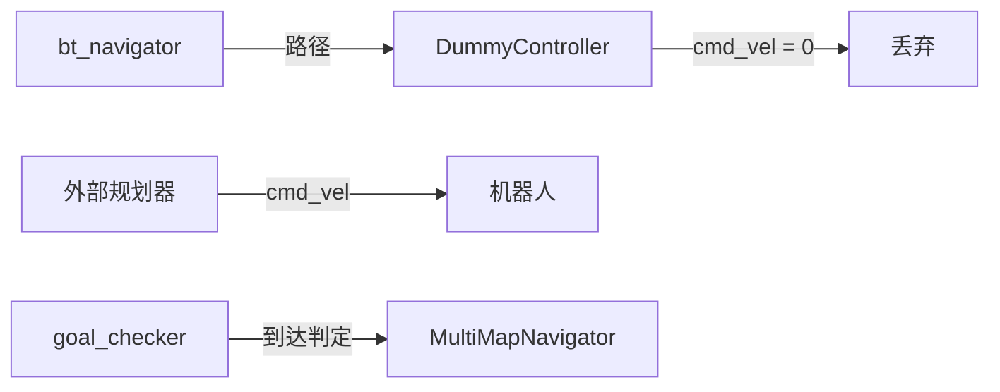
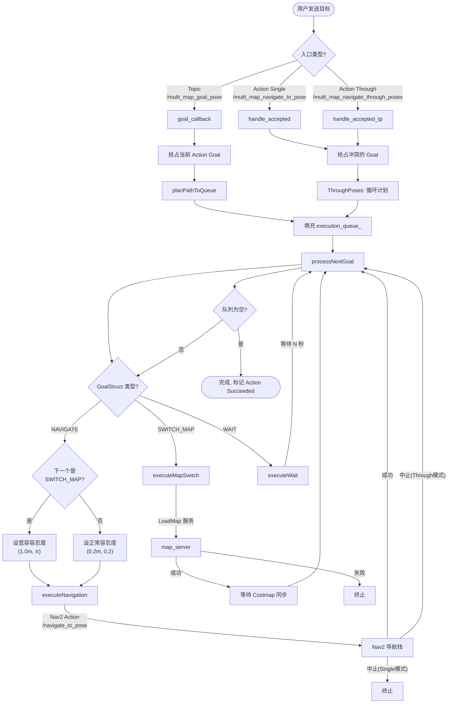

# Multi-Map Navigation ROS2 — 项目分析文档

## 1. 项目概述

`multi_map_nav_ros2` 是一个 ROS 2 跨地图导航框架，专为**动态裁剪地图** 场景设计。当大场景被拆分为多个具有独立原点的子地图时，本系统通过拓扑偏移映射技术，使机器人在切换地图时保持全局世界坐标系的物理连续性，无需重置定位。

---

## 2. 项目结构

```
multi_map_nav_ros2/
├── src/
│   ├── multi_map_nav.cpp        # 核心节点，1238 行，全部导航逻辑
│   └── dummy_controller.cpp     # Nav2 控制器插件，零速度输出版
├── include/multi_map_nav/
│   ├── multi_map_nav.hpp        # 核心节点类声明
│   └── dummy_controller.hpp     # 插件类声明
├── launch/
│   └── multi_map_nav.launch.py  # 唯一启动文件，编排所有节点
├── params/
│   ├── normal.yaml              # Nav2 参数配置（DWB 控制器）
│   └── new_local.yaml           # Nav2 参数配置（新规划器）
├── maps/                        # [gitignored] 运行时地图数据
│   ├── *.yaml + *.pgm/png       # 地图 YAML + 图像对
│   └── map_connections.txt      # 拓扑连接定义
├── rviz/
│   └── r20_nav2.rviz            # RViz 可视化配置
├── CMakeLists.txt               # 构建配置
├── package.xml                  # ROS 2 包清单
└── dummy_controller_plugin.xml  # 插件描述文件
```

---

## 3. 构建与运行

```sh
# 必须从工作空间根目录运行
colcon build --packages-select multi_map_nav --cmake-args -Wno-dev -DCMAKE_EXPORT_COMPILE_COMMANDS=1 --symlink-install

# 典型启动命令
ros2 launch multi_map_nav multi_map_nav.launch.py \
    initial_map:=park \
    map_connections_file:=map_connections \
    params_file:=normal \
    use_sim_time:=true \
    use_fake_cmdvel:=false
```

**关键约束：**
- `--symlink-install` 必须使用，否则 launch/params 修改后需重新编译
- 构建必须从 `~/nav_t_ws` 执行，不能在包目录内
- 依赖外部包 `inspection_task_hub` 和 OpenCV

---

## 4. 系统架构

### 4.1 节点拓扑



### 4.2 核心类图



---

## 5. 核心技术逻辑详解

### 5.1 坐标转换：世界坐标系统一

系统最核心的设计思想是：**每张裁剪地图有自己的局部原点 (YAML origin)**，通过 `localToWorld` 将所有局部坐标映射到统一世界系：

```
World_pose = Local_pose + YAML_origin
```



**关键细节：**
- 用户输入的目标点坐标被视为**局部坐标**，`header.frame_id` 指定该点属于哪张地图
- 跨地图跳转点 (transition point) 的 `from_pose` 和 `to_pose` 同样是局部坐标
- 在 `computePathSteps` 中，只有跨地图跳转点需要 `localToWorld` 转换，最终目标坐标在 `planPathToQueue` 中设 `frame_id = "map"` 后直接使用

### 5.2 地图连接拓扑与路径搜索

**连接定义** (`maps/map_connections.txt`)：

```
FROM_MAP,TO_MAP,FROM_X,FROM_Y,TO_X,TO_Y,Z
```

| 字段 | 含义 |
|------|------|
| `FROM_X/Y` | 源地图中跳转点的**局部坐标** |
| `TO_X/Y` | 目标地图中同一物理位置的**局部坐标** |
| `Z` | 高度层级（元数据字段） |

系统在启动时通过 `loadMapConnections` 读取此文件，当 `bidirectional_connections=true` 时自动生成反向边（避免手动编写双向连接）。

**路径搜索**使用 BFS (`findPath`)，从当前地图到目标地图寻找最短拓扑路径：



### 5.3 执行队列与三种 Goal 类型

导航计划被拆解为由 `GoalStruct` 组成的执行队列 `execution_queue_`：

| 类型 | 用途 | 说明 |
|------|------|------|
| `NAVIGATE` | 导航到目标点 | 调用 Nav2 的 `NavigateToPose` Action |
| `SWITCH_MAP` | 切换地图 | 调用 `map_server/load_map` 加载新地图 |
| `WAIT` | 航点停留 | 等待指定秒数（`waypoint_dwell_time`） |

**单目标导航** (`planPathToQueue`) 的计划生成流程：



**多点巡逻** (`handle_accepted_tp`) 的计划生成流程：



### 5.4 地图切换流程

`executeMapSwitch` 是最复杂的步骤，涉及服务调用和代价地图同步等待：



**关键细节：** 地图切换后会开启一个分离线程轮询 `latest_costmap_info_`，确认代价地图的 origin 已与目标地图的 YAML origin 对齐（阈值 0.1m），超时 5 秒后仍强制继续。

### 5.5 动态容忍度机制

系统在导航过程中动态调整 `controller_server` 的 `goal_checker` 容忍度：

| 场景 | xy 容忍度 | yaw 容忍度 | 说明 |
|------|----------|------------|------|
| 正常目标 (`NAVIGATE`) | 0.2m | 0.2rad | 精确到达 |
| 跳转点 (`NAVIGATE` 后接 `SWITCH_MAP`) | 1.0m | 3.14rad | 宽容到达，确保跨地图跳转时不过分要求位姿精度 |

实现方式：通过 `AsyncParametersClient` 向 `/controller_server` 动态设置 `goal_checker.xy_goal_tolerance` 和 `goal_checker.yaw_goal_tolerance`。

### 5.6 坐标一致性规则

`computePathSteps` 中对目标坐标的处理遵循以下规则：

- **最终目标点**：用户的 `target_pose` 坐标直接作为世界坐标使用，仅将 `frame_id` 设为 `"map"`。**不做任何偏移**
- **跨地图跳转点**：调用 `localToWorld(map_name, from_pose)` 将局部坐标转换为世界坐标

这意味着用户发送目标时，坐标值必须已经考虑了该地图的 origin 偏移，或者系统在单图内导航时坐标与局部图一致。这是一个潜在的设计约束，在跨地图使用时需特别注意。

---

## 6. 接口详述

### 6.1 订阅的话题

| 话题 | 消息类型 | 说明 |
|------|---------|------|
| `/multi_map_goal_pose` | `geometry_msgs/msg/PoseStamped` | 单目标导航，`header.frame_id` 必须是目标地图名 |
| `/global_costmap/costmap` | `nav_msgs/msg/OccupancyGrid` | 用于地图切换后同步检测 |

### 6.2 提供的 Action Server

| Action | 类型 | 说明 |
|--------|------|------|
| `/multi_map_navigate_to_pose` | `nav2_msgs/action/NavigateToPose` | 单目标导航 |
| `/multi_map_navigate_through_poses` | `nav2_msgs/action/NavigateThroughPoses` | 多航点巡逻（空 poses = 停止命令） |

### 6.3 调用的 Action/Service Client

| 接口 | 类型 | 说明 |
|------|------|------|
| `/navigate_to_pose` (Action Client) | `nav2_msgs/action/NavigateToPose` | 向 Nav2 发送导航目标 |
| `/map_server/load_map` (Service Client) | `nav2_msgs/srv/LoadMap` | 切换地图时加载新地图 |
| `/controller_server` (AsyncParamClient) | — | 动态修改 goal_checker 容忍度 |

### 6.4 提供的 Service

| Service | 类型 | 说明 |
|---------|------|------|
| `/validate_route_waypoints` | `inspection_task_hub/srv/ValidateRouteWaypoints` | 验证航点是否在自由区域 |

### 6.5 航点验证逻辑

`validateWaypointPose` 使用 OpenCV 加载地图图像，将 Pose 位置转换为像素坐标，然后检查该像素的占Occupancy值：



---

## 7. DummyController 插件

`DummyController` 是一个 Nav2 `Controller` 插件，**不输出任何速度指令**（全部为零）。其设计目的是：

1. 让 Nav2 的 BT Navigator 正常工作（需要 controller 插件）
2. 让外部规划器直接发布 `cmd_vel` 控制机器人
3. 利用 Nav2 的 `goal_checker` 判断是否到达目标



当 `use_fake_cmdvel=true` 时，launch 文件将 `cmd_vel` 重映射为 `cmd_vel_fake`，实现干跑测试。

---

## 8. 完整导航执行流程



---

## 9. 并发与线程安全

系统的并发模型值得注意：

| 机制 | 位置 | 说明 |
|------|------|------|
| `mutex_state_` | 全局状态锁 | 保护 `current_map_`, `execution_queue_`, `is_executing_`, Action handles |
| 分离线程 (`std::thread`) | `handle_accepted`, `handle_accepted_tp`, `executeMapSwitch`, `executeWait` | Action Server 回调在 ROS executor 线程，业务逻辑跑在分离线程避免阻塞 |
| 抢占式调度 | `goal_callback` / `handle_accepted_tp` | 新目标会中止当前执行中的 Goal，清空队列后重新规划 |

**潜在风险**：`processNextGoal` 在多个分离线程中被回调调用（Nav2 Action 结果回调、Costmap 同步线程、Wait 线程），虽然使用了 `mutex_state_`，但 `processNextGoal` 本身内部也有锁，存在嵌套锁和线程安全风险。当前设计在正常使用场景下可工作，但极端并发情况需注意。

---

## 10. Launch 参数参考

| 参数 | 默认值 | 说明 |
|------|--------|------|
| `initial_map` | `park` | 启动加载的初始地图名 |
| `map_connections_file` | `map_connections` | 连接文件名（不含 `.txt`，从 `maps/` 解析） |
| `params_file` | `normal` | Nav2 参数文件名（不含 `.yaml`，从 `params/` 解析） |
| `use_sim_time` | `true` | 是否使用仿真时钟 |
| `use_fake_cmdvel` | `false` | 将 `cmd_vel` 重映射为 `cmd_vel_fake` |
| `bidirectional_connections` | `true` | 自动生成反向连接边 |
| `waypoint_dwell_time` | `2.0` | 航点等待时间（秒） |
| `patrol_loops` | `3` | ThroughPoses 巡逻循环次数 |

**动态节点参数**（在代码中 declare）：

| 参数 | 默认值 | 说明 |
|------|--------|------|
| `normal_xy_tolerance` | 0.2 | 正常目标 xy 容忍度 |
| `normal_yaw_tolerance` | 0.2 | 正常目标 yaw 容忍度 |
| `transition_xy_tolerance` | 1.0 | 跳转点 xy 容忍度 |
| `transition_yaw_tolerance` | 3.14 | 跳转点 yaw 容忍度 |

---

## 11. 依赖关系

```
multi_map_nav
├── rclcpp, rclcpp_action          # ROS 2 核心
├── nav2_msgs                       # Nav2 Action/Service 消息
├── nav2_core                       # Controller 插件接口
├── nav2_costmap_2d                 # 代价地图 (DummyController 依赖)
├── nav2_util                       # Nav2 工具库
├── pluginlib                       # 插件加载
├── tf2_ros                         # TF 变换
├── inspection_task_hub             # [外部] 自定义 srv 包
├── OpenCV                          # 图像处理（航点验证）
├── nav_msgs, geometry_msgs, std_msgs # 基础消息
└── (exec) nav2_map_server          # 地图服务
    nav2_lifecycle_manager          # 生命周期管理
    nav2_controller/planner/behaviors/bt_navigator # Nav2 导航栈
```

---

## 12. 设计特点与潜在问题

### 优势
1. **统一世界系**：用户只需指定目标地图名 + 局部坐标，系统自动处理跨地图转换
2. **自动双向连接**：减少配置冗余
3. **动态容忍度**：跳转点宽容、目标点精确
4. **多种入口**：Topic / Action 单点 / Action 多点三种使用方式
5. **航点验证**：通过 OpenCV 检查目标是否在自由区域

### 需注意的设计约束
1. **目标坐标语义不一致**：`computePathSteps` 中最终目标点不做 `localToWorld` 转换，而是直接加 `frame_id="map"` 使用。这意味着用户输入的目标坐标必须是**世界坐标系下的值**，而不是严格的局部坐标。这与跳转点的处理方式不同（跳转点经过了 `localToWorld`），可能造成混淆。
2. **Costmap 同步轮询**：地图切换后用 100ms 轮询等待代价地图更新，超时 5s 后强制继续，无法保证后续导航在正确的代价地图上规划。
3. **线程模型**：分离线程 + 互斥锁的设计较为脆弱，`processNextGoal` 可能从多个线程上下文被调用。
4. **maps/ 目录被 gitignore**：运行时地图数据不在版本控制中，需手动部署。
5. **地图验证在启动时执行**：如果 YAML 文件缺失，节点直接抛出异常退出。

---

## 13. 典型使用场景示例

### 13.1 单目标跨地图导航

```bash
ros2 action send_goal /multi_map_navigate_to_pose nav2_msgs/action/NavigateToPose \
  "{pose: {header: {frame_id: 'company'}, pose: {position: {x: 6.0, y: 7.0}}}}"
```

### 13.2 多航点巡逻

```bash
ros2 action send_goal --feedback /multi_map_navigate_through_poses \
  nav2_msgs/action/NavigateThroughPoses \
  "{poses: [ \
    {header: {frame_id: 'park'}, pose: {position: {x: 7.6, y: 7.0}}},
    {header: {frame_id: 'stair'}, pose: {position: {x: 10.5, y: 2.0}}},
    {header: {frame_id: 'ground'}, pose: {position: {x: 7.5, y: 10.0}}}]}"
```

### 13.3 干跑测试（不发送真实速度命令）

```bash
ros2 launch multi_map_nav multi_map_nav.launch.py \
    use_fake_cmdvel:=true params_file:=new_local
```

### 13.4 停止当前巡逻

发送空的 poses 列表至 `NavigateThroughPoses` Action 即可停止当前执行中的巡逻任务。