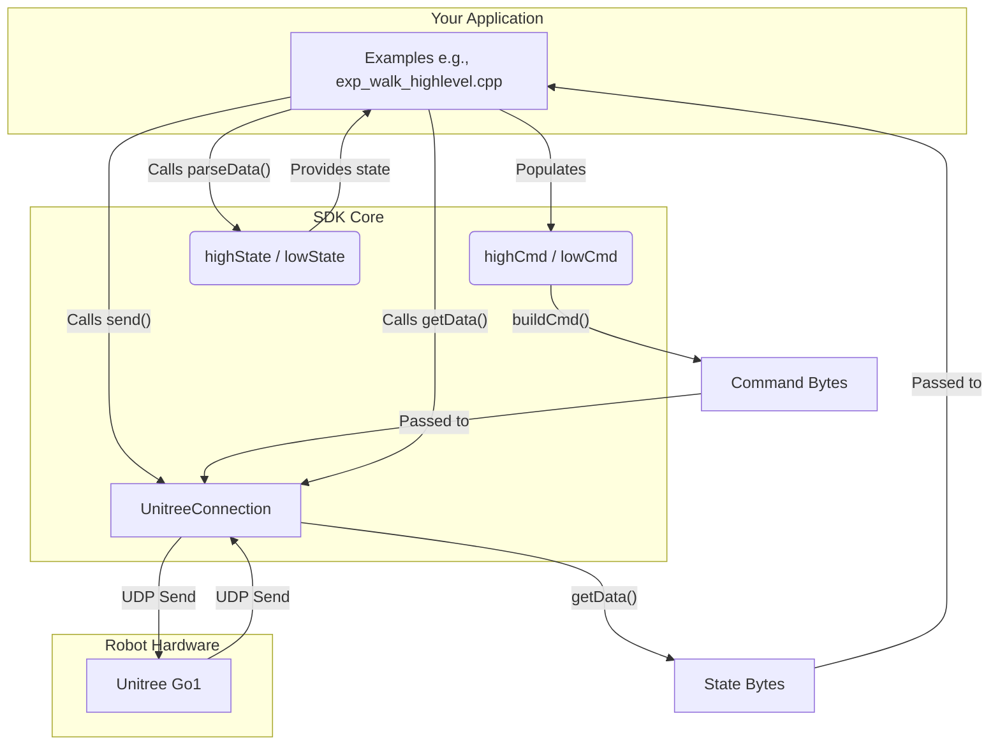

# free_dog_sdk_cpp 项目分析

## 1. 项目模块功能与交互

`free_dog_sdk_cpp` 是一个用于与宇树科技（Unitree）的机器狗（如 Go1）进行通信的 C++ SDK。它允许开发者通过网络发送控制指令并接收机器狗的状态数据。该项目主要可以分为以下几个核心模块：

*   **通信模块 (`UnitreeConnection`)**:
    *   **功能**: 这是整个 SDK 的通信核心，负责通过 UDP 协议与机器狗建立网络连接。它封装了底层的 socket 编程（提供了标准库 socket 和 Boost.Asio 两种实现），使得发送和接收数据变得简单。
    *   **交互**:
        *   **初始化**: 在创建 `UnitreeConnection` 对象时，可以根据传入的字符串（如 `"HIGH_WIFI_DEFAULTS"`, `"LOW_WIRED_DEFAULTS"`）来配置通信模式，包括高/低层控制、有线/无线连接以及仿真模式。这些配置决定了目标 IP 地址和端口号。
        *   **数据发送**: 其他模块（如应用层示例）通过调用 `conn.send()` 方法，将序列化后的指令字节流发送给机器狗。
        *   **数据接收**: 该模块内部会启动一个独立的接收线程 (`recvThread`)，持续监听来自机器狗的 UDP 数据包，并将接收到的数据存储在一个缓冲区中。应用层通过 `conn.getData()` 来获取这些数据。

*   **指令模块 (`highCmd`, `lowCmd`)**:
    *   **功能**: 这两个类分别定义了高层控制指令和低层控制指令的数据结构。
        *   `highCmd`: 用于发送高级指令，如行走、站立、调整身体姿态（欧拉角）、设置移动速度等。用户只需关心运动学的目标，而无需关心具体的电机控制。
        *   `lowCmd`: 用于发送底层指令，直接控制每个关节电机。用户可以设置每个电机的目标位置（q）、速度（dq）、前馈力矩（tau）、以及刚度（Kp）和阻尼（Kd）系数。
    *   **交互**: 应用层代码创建 `highCmd` 或 `lowCmd` 对象，填充所需的控制参数（如 `robotmode_`, `velocity`, `motorCmd`），然后调用 `buildCmd()` 方法。这个方法会将数据结构按照机器狗的通信协议序列化成一个 `std::vector<uint8_t>` 字节流，以供通信模块发送。

*   **状态模块 (`highState`, `lowState`)**:
    *   **功能**: 这两个类定义了与指令模块相对应的状态数据结构，用于解析和存储从机器狗接收到的数据。
        *   `highState`: 包含机器狗的综合状态信息，如 IMU 数据（四元数、角速度、加速度）、关节状态（位置、速度、力矩）、足端力、机身位置和速度等。
        *   `lowState`: 与 `highState` 类似，但数据包结构和内容略有不同，主要用于低层控制模式。
    *   **交互**: 通信模块接收到原始的 `uint8_t` 数据包后，应用层代码会调用 `highState` 或 `lowState` 对象的 `parseData()` 方法。该方法会根据协议格式，从字节流中解析出各个字段（如 IMU 数据、电机状态等），并填充到类的成员变量中，供开发者使用。

*   **应用/示例模块 (`examples/`)**:
    *   **功能**: 提供如何使用 SDK 的具体范例，是理解整个 SDK 工作流程的最佳入口。
        *   `exp_walk_highlevel.cpp`: 演示了如何使用高层指令控制机器狗行走和改变姿态。
        *   `exp_joint_position_control_lowlevel.cpp`: 演示了如何使用低层指令直接控制每个关节的位置。
    *   **交互**: 这些示例完整地展示了“**接收状态 -> 决策 -> 发送指令**”的闭环控制流程。它们首先初始化 `UnitreeConnection`，在主循环中获取并解析状态数据 (`hstate`/`lstate`)，然后根据预设逻辑（或用户输入）填充指令对象 (`hcmd`/`lcmd`)，最后构建并发送指令。

#### 模块交互图 (Mermaid)

## 2. 数据流传输与转换

该 SDK 的数据交互完全基于 UDP 协议，其核心数据流如下：

1.  **指令发送（本地 -> 机器狗）**:
    *   **数据生成**: 开发者在应用层代码中创建一个 `highCmd` 或 `lowCmd` 对象，并设置其成员变量，例如 `hcmd.robotmode_ = ROBOTModeHigh::WALK;` 或 `mCmdArr.motorCmd[0].q = 1.0;`。
    *   **序列化**: 调用 `buildCmd()` 方法。该方法按照宇树的通信协议，将 `Cmd` 对象中的所有字段（包括 `head`, `levelFlag`, `SN`, `version`, `bandWidth` 以及各种控制参数）依次转换为字节，并拼接成一个 `std::vector<uint8_t>`。这个过程包括将 `float`, `int` 等类型转换为 `uint8_t` 数组（通常是小端模式）。最后，它会计算 CRC 校验和并附加到字节流的末尾。
    *   **网络传输**: `UnitreeConnection::send()` 方法将这个最终的字节向量作为 UDP 数据包的内容，发送到在初始化时配置好的机器狗的 IP 地址和端口。

2.  **状态接收（机器狗 -> 本地）**:
    *   **网络监听**: `UnitreeConnection` 在一个后台线程 (`recvThread`) 中持续监听指定的本地端口。当收到来自机器狗的 UDP 数据包时，它将数据包内容（一个原始字节流）存入一个共享的数据缓冲区 `data_all`。
    *   **数据获取**: 应用层代码在主循环中通过 `getData()` 方法从缓冲区中取出这些原始字节流。
    *   **反序列化**: 调用 `highState` 或 `lowState` 的 `parseData()` 方法。该方法接收原始字节流作为输入，然后严格按照协议定义的数据包结构，从字节流的特定偏移位置提取数据。例如，它会从第 22 字节开始解析 IMU 数据，从第 75 字节开始循环解析 20 个电机的状态。这个过程涉及将字节数组转换回 `float`, `int`, `uint8_t` 等原始数据类型，并填充到 `State` 对象的相应成员变量中。
    *   **数据使用**: 解析完成后，开发者可以直接访问 `State` 对象的成员变量，如 `hstate.imu_quaternion` 或 `lstate.motorState[i].q`，以获取机器狗的实时状态。

**与外部数据交互**:
这个 SDK 本身不直接与“外部数据”（如文件、数据库）交互，它是一个纯粹的通信中间件。它与“外部”的交互就是指与**机器狗硬件**通过 UDP 网络进行的数据交换。所有的数据格式都由宇树的私有通信协议严格规定。

## 3. 应当说明的内容

*   **两种实现方式**: 项目中包含了 `unitreeConnect.hpp` (基于 C++ 标准库 `sys/socket.h`) 和 `unitreeConnectBoost.hpp` (基于 `Boost.Asio`) 两种网络实现。`Boost.Asio` 版本是更推荐的，因为它提供了跨平台、异步、更健壮的现代 C++ 网络编程接口，代码也更简洁。
*   **高层 vs. 低层控制**: SDK 明确区分了两种控制模式。高层控制适合快速入门和实现上层应用（如自主导航），开发者只需关注机器人的运动学行为。低层控制则面向需要直接操作关节的研究者（如步态规划、强化学习），提供了更精细的控制能力，但难度也更高。
*   **数据结构的重要性**: `highCmd`, `lowCmd`, `highState`, `lowState` 这四个文件是使用此 SDK 的关键。开发者必须熟悉这些类中的成员变量，才能正确地发送指令和解析状态。
*   **非阻塞数据接收**: `UnitreeConnection` 将网络接收放在一个独立的线程中，这是一种很好的设计。它避免了主控制循环因为等待网络数据而被阻塞，保证了控制指令可以以较高的频率发送。
*   **安全性**: 低层控制具有一定的危险性，不正确的指令（如过大的力矩或超出关节限位的角度）可能会损坏机器人硬件。在进行低层控制开发时，务必小心谨慎。

## 4. 迁移至 ROS2-Jazzy 的方案与注意事项

将此 SDK 封装成一个 ROS2 节点是一个非常实用的方案，可以方便地将机器狗集成到更广泛的机器人系统中。

### 方案

1.  **创建 ROS2 包**: 创建一个名为 `freedog_ros2_driver` 的 ROS2 C++ 包。
2.  **集成 SDK**:
    *   将 `free_dog_sdk_cpp/fdsc_utils` 目录作为子模块或直接复制到 ROS2 包中，并通过 `CMakeLists.txt` 将其编译为一个静态或动态库 (`freedog_sdk_lib`)。
    *   在 ROS2 节点的 `CMakeLists.txt` 中链接这个库。
3.  **创建驱动节点 (`DriverNode`)**:
    *   **节点类**: 创建一个继承自 `rclcpp::Node` 的 `DriverNode` 类。
    *   **成员变量**: 在类中包含 `UnitreeConnection`, `highCmd`/`lowCmd`, `highState`/`lowState` 的实例。
    *   **参数化**: 使用 ROS2 参数服务器来配置连接设置（如 `control_level`, `comm_type`, `robot_ip` 等），而不是在代码中硬编码。
    *   **发布者 (Publishers)**:
        *   `~/joint_states` (`sensor_msgs::msg::JointState`): 发布机器狗所有关节的角度、速度和力矩。
        *   `~/imu` (`sensor_msgs::msg::Imu`): 发布 IMU 数据。
        *   `~/foot_contacts` (`std_msgs::msg::Bool` 数组或自定义消息): 发布足底接触信息。
    *   **订阅者 (Subscribers)**:
        *   `~/cmd_vel` (`geometry_msgs::msg::Twist`): 订阅此话题，用于高层控制模式下的速度控制。
        *   `~/joint_commands` (`sensor_msgs::msg::JointState` 或自定义消息): 订阅此话题，用于低层控制模式下的关节指令。
    *   **主循环**:
        *   在构造函数中初始化 `UnitreeConnection` 并调用 `startRecv()`。
        *   创建一个周期性的 ROS2 Timer (`wall_timer_`) 作为主控制循环（例如，以 200Hz 的频率）。
        *   在 Timer 的回调函数 `timer_callback()` 中：
            1.  调用 `conn.getData()` 获取状态数据。
            2.  调用 `lstate.parseData()` 或 `hstate.parseData()` 解析数据。
            3.  将解析后的状态数据填充到 ROS2 消息中（`JointState`, `Imu` 等）并发布。
            4.  根据订阅到的话题数据，填充 `lowCmd` 或 `highCmd` 对象。
            5.  调用 `buildCmd()` 和 `conn.send()` 发送指令。

### 注意事项

*   **依赖管理**: `free_dog_sdk_cpp` 依赖 `Boost`。你需要在 `package.xml` 和 `CMakeLists.txt` 中正确声明对 `Boost` 的依赖。
*   **坐标系**: 务必搞清楚机器狗本体坐标系和 ROS 标准坐标系（如 `base_link`）之间的对应关系，并在发布数据时进行必要的转换，以符合 ROS 的 REP-105 规范。
*   **线程安全**: `UnitreeConnection` 已经在 `getData` 方法中使用了 `std::mutex`，这使得从 ROS2 的 Timer 线程中访问是安全的。但如果你在多个回调中访问它，仍需注意线程安全问题。
*   **生命周期管理**: 在节点的析构函数或 `on_shutdown` 回调中，确保调用 `conn.stopRecv()` 来优雅地停止接收线程和关闭 socket。
*   **实时性**: 为了保证控制的实时性，驱动节点应该在一个高优先级的线程中运行，并且避免在控制循环中执行耗时操作。使用 ROS2 的 `rclcpp::executors::MultiThreadedExecutor` 可能有助于处理回调。
*   **URDF 模型**: 为了在 RViz2 等工具中实现可视化，你需要为机器狗创建一个 URDF 模型，并由 `robot_state_publisher` 节点根据发布的 `~/joint_states` 来广播 TF 变换。