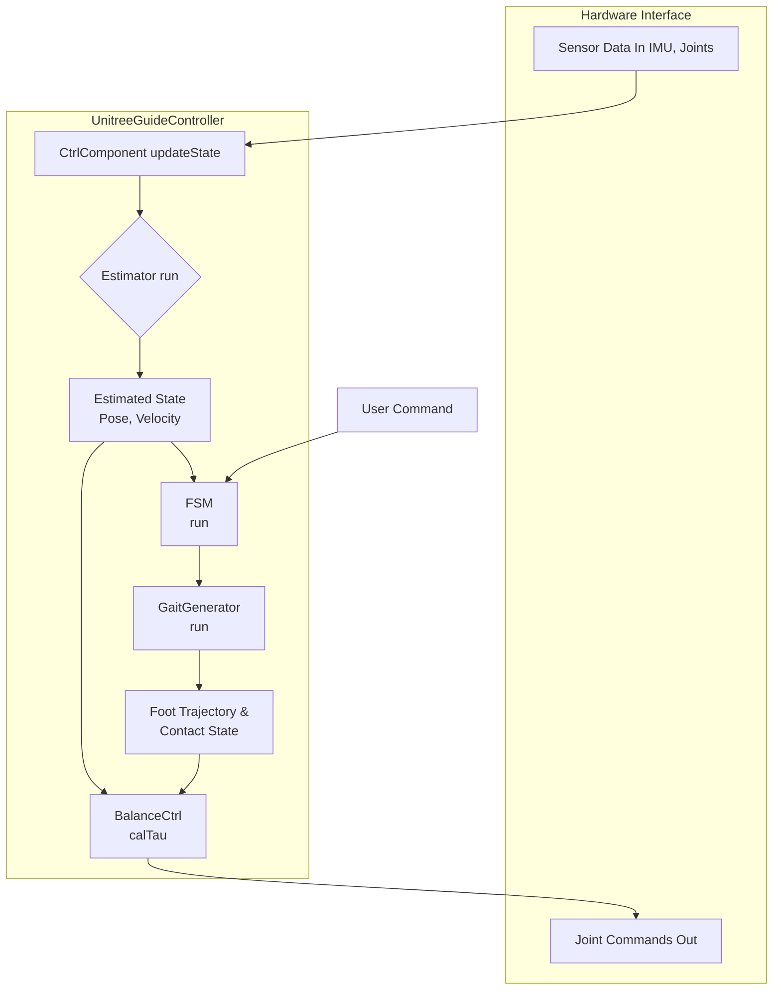

# Unitree Guide Controller 分析文档

## 1. 概述

`unitree_guide_controller` 是一个为四足机器人设计的全身控制器（Whole-Body Controller, WBC）。它不依赖于特定的运动规划器（如 OCS2 或 RL 策略），而是通过有限状态机（FSM）来管理机器人的行为（如站立、行走），并利用全身动力学模型计算关节指令，以实现期望的运动和姿态。

该控制器主要适用于需要稳定、可靠的运动控制，但对复杂动态运动要求不高的场景。

## 2. 核心模块功能及重要方法

`unitree_guide_controller` 的核心逻辑可以分为以下几个模块：

### a. `UnitreeGuideController` (主控类)
- **功能**: 作为 ROS2 Control 的插件，是整个控制器的入口和调度中心。它负责与硬件接口交互，管理其他所有模块的生命周期和执行顺序。
- **文件**: `UnitreeGuideController.h`, `UnitreeGuideController.cpp`
- **重要方法**:
    - `on_init()`: 初始化所有控制组件，包括状态估计器、FSM、步态生成器等。
    - `update()`: 控制器的核心循环，以固定频率被 `ros2_control` 调用。它负责调用其他模块的 `run()` 方法，实现从状态估计到指令计算的完整流程。
    - `on_activate()` / `on_deactivate()`: 激活或停用控制器，管理硬件资源。

### b. `CtrlComponent` (控制组件)
- **功能**: 数据中心和状态管理模块。它聚合了来自硬件接口的传感器数据（IMU、关节状态），调用 `Estimator` 更新机器人状态，并为其他模块提供统一的数据访问接口。
- **文件**: `CtrlComponent.h`
- **重要方法**:
    - `updateState()`: 从硬件接口读取原始数据，调用 `Estimator::run()` 进行状态估计，并更新内部的机器人状态变量（如 `_est->getResult()`）。
    - `setCommand()`: 接收来自外部（如手柄）的控制指令，并将其传递给 FSM。

### c. `Estimator` (状态估计器)
- **功能**: 负责估计机器人的姿态、速度和位置。它融合 IMU 数据和腿部运动学信息，提供比原始传感器数据更可靠的状态估计。
- **文件**: `Estimator.h`, `Estimator.cpp`
- **重要方法**:
    - `run()`: 执行状态估计算法。它接收 IMU 数据和足端接触状态作为输入，通过卡尔曼滤波器（或类似算法）更新机器人的姿态（`_result.rpy`）、位置（`_result.pos`）和速度（`_result.vel`）。

### d. `FSM` (有限状态机)
- **功能**: 机器人的行为决策中心。它管理着机器人的一系列离散状态（如站立、行走），并根据外部指令和内部状态决定何时切换。
- **文件**: `FSM/` 目录下的 `State_xxx.h` 和 `State_xxx.cpp`
- **重要方法**:
    - `checkTransition()`: 在每个状态类中实现，用于检查是否满足切换到其他状态的条件（例如，用户发出“行走”指令）。
    - `run()`: 执行当前状态下的控制逻辑。例如，在 `StateTrotting` 中，它会调用步态生成器和平衡控制器来计算实现对角小跑所需的关节指令。

### e. `GaitGenerator` (步态生成器)
- **功能**: 根据 FSM 指定的步态模式（如 Trotting），生成足端的期望轨迹和接触序列。
- **文件**: `gait/GaitGenerator.h`, `gait/GaitGenerator.cpp`
- **重要方法**:
    - `setGait()`: 设置当前的步态模式（如 `GaitType::TROT`）。
    - `run()`: 计算当前时刻每个足端的期望位置、速度以及接触状态（摆动相或支撑相）。

### f. `BalanceCtrl` (平衡控制器)
- **功能**: 核心的动力学计算模块。它接收来自身体姿态和足端轨迹的期望值，通过求解一个优化问题来计算实现这些期望所需的关节力矩、加速度等。
- **文件**: `control/BalanceCtrl.h`, `control/BalanceCtrl.cpp`
- **重要方法**:
    - `calTau()`: 计算关节力矩。这是 WBC 的核心，它将控制问题构建为一个二次规划（Quadratic Programming, QP）问题，并使用 `QuadProg++` 求解器进行求解。

### g. `QuadrupedRobot` (机器人模型)
- **功能**: 提供机器人的运动学和动力学模型。
- **文件**: `robot/QuadrupedRobot.h`, `robot/QuadrupedRobot.cpp`
- **重要方法**:
    - `forwardKinematics()`: 正向运动学，根据关节角度计算足端位置。
    - `calJacobian()`: 计算雅可比矩阵，用于力矩和速度的转换。

## 3. 模块交互与数据流

`unitree_guide_controller` 的数据流是一个清晰的“感知-决策-执行”循环，在 `UnitreeGuideController::update()` 方法中被周期性触发。

### a. Mermaid 流程图

### b. 文字表述流程

1.  **数据读取与状态估计**:
    - `UnitreeGuideController::update()` 首先调用 `CtrlComponent::updateState()`。
    - `CtrlComponent` 从硬件接口读取原始传感器数据（关节角度、IMU 数据）。
    - `CtrlComponent` 调用 `Estimator::run()`，融合传感器数据，计算出机器人更精确的姿态、位置和速度（**Estimated State**）。

2.  **行为决策**:
    - `UnitreeGuideController` 接着调用 `FSM::run()`。
    - FSM 首先检查是否有来自用户的**新指令**（`User Command`）或内部条件满足状态切换（`checkTransition()`）。
    - FSM 根据当前状态（如 `StateTrotting`）执行相应的逻辑。

3.  **期望轨迹生成**:
    - 在 `StateTrotting::run()` 等运动状态中，FSM 会调用 `GaitGenerator::run()`。
    - `GaitGenerator` 根据当前步态模式，计算出每个足端的**期望摆动轨迹**和**接触状态**。

4.  **动力学求解**:
    - FSM 调用 `BalanceCtrl::calTau()`。
    - `BalanceCtrl` 收集所有期望值：
        - 期望的身体姿态（来自用户指令或 FSM）。
        - 期望的足端轨迹（来自 `GaitGenerator`）。
        - 当前的机器人状态（来自 `Estimator`）。
    - `BalanceCtrl` 将这些目标构建为一个带约束的二次规划（QP）问题，并调用 `QuadProg++` 求解器求解，计算出最优的**关节力矩**（`Joint Commands`）。

5.  **指令下发**:
    - `UnitreeGuideController` 从 `BalanceCtrl` 获取计算出的关节指令。
    - `UnitreeGuideController` 通过硬件接口将指令下发给机器人执行。

这个循环在 `update()` 方法中不断重复，从而实现对机器人的持续、稳定控制。

## 4. 控制方法

`unitree_guide_controller` 采用的是一种经典的**全身控制（Whole-Body Control, WBC）** 方法，其核心是基于**二次规划（Quadratic Programming, QP）** 的优化。

- **目标**: 同时满足多个控制目标（如保持身体平衡、跟踪足端轨迹）的同时，遵守物理约束（如摩擦力、关节限制）。
- **实现**:
    1.  **构建代价函数 (Cost Function)**: 将控制目标（如“身体姿态误差最小化”、“足端轨迹跟踪误差最小化”）表示为一个二次型函数。
    2.  **构建约束 (Constraints)**: 将物理限制（如“支撑脚速度为零”、“地面反作用力在摩擦锥内”）表示为等式或不等式约束。
    3.  **求解**: `BalanceCtrl` 将上述代价函数和约束传递给 `QuadProg++` 求解器。求解器找到一组最优的地面反作用力和关节加速度，从而计算出最终的关节力矩。

这种方法的优点是能够系统地、最优地协调多个相互冲突的任务，并严格遵守物理约束，从而实现稳定和鲁棒的运动控制。

## 5. 步态切换实现

步态切换是通过**有限状态机（FSM）** 和**步态生成器（GaitGenerator）** 协同实现的。

1.  **状态定义**:
    - 控制器为每种步态或行为定义了一个状态类，如 `StateFixedStand`（站立）、`StateTrotting`（对角小跑）。
    - 所有状态都继承自一个基类 `FSMState`，并实现了 `run()` 和 `checkTransition()` 方法。

2.  **切换触发**:
    - 在每个控制周期，当前状态的 `checkTransition()` 方法会被调用。
    - 该方法会检查是否有来自用户的**新指令**。例如，如果用户通过手柄发送了“开始行走”的指令，`StateFixedStand::checkTransition()` 会检测到这个变化。

3.  **状态转移**:
    - 当 `checkTransition()` 返回一个新的目标状态（如 `FSMStateName::TROT`）时，FSM 会执行状态转移。
    - FSM 会调用当前状态的 `onExit()` 方法（用于清理），然后实例化新的状态对象（如 `StateTrotting`），并调用其 `onEnter()` 方法。

4.  **步态参数更新**:
    - 在新状态的 `onEnter()` 方法中，会调用 `GaitGenerator::setGait()` 来更新步态参数。例如，在 `StateTrotting::onEnter()` 中，会设置步态为对角小跑模式，并配置步幅、步高等参数。

5.  **平滑过渡**:
    - `GaitGenerator` 内部包含平滑逻辑。当步态切换时，它不会立即跳变到新的步态模式，而是会生成一个平滑的过渡轨迹，确保机器人运动的连续性和稳定性。

通过这种机制，控制器能够清晰、可靠地管理机器人的不同行为，并实现它们之间的平滑切换。

## 6. 补充说明

- **模块化设计**: 该控制器采用了高度模块化的设计，将状态估计、行为决策、轨迹生成和动力学计算解耦，使得每个模块都可以独立开发和测试，便于维护和扩展。
- **无模型依赖**: 与 OCS2 等基于模型的控制器不同，`unitree_guide_controller` 不依赖于复杂的离线轨迹优化，所有计算都在线实时进行，使其对模型误差不那么敏感。
- **QP 求解器的核心作用**: `QuadProg++` 是实现 WBC 的关键。它的性能和稳定性直接决定了整个控制器的效果。
- **适用性**: 这种控制框架非常经典，适用于多种四足机器人平台。通过修改机器人模型（`QuadrupedRobot`）和调整控制参数，可以方便地将其移植到其他机器人上。