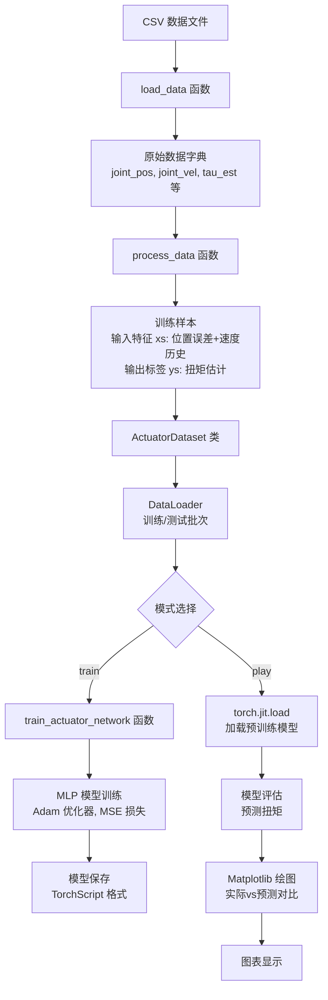

# Actuator Net 模块说明

## 概述

`actuator_net.py` 是一个用于训练和评估执行器网络（Actuator Network）的 Python 脚本。该模块使用 PyTorch 构建多层感知机（MLP）模型，用于预测四足机器人关节的扭矩（torque）。网络基于关节位置误差和速度的历史数据进行预测，帮助改善机器人控制的准确性。

该模块支持两种模式：
- **train**：训练新的执行器网络模型
- **play**：加载预训练模型进行评估和可视化

## 数据传输和交互

### 文字表述

1. **数据输入**：模块从 CSV 文件加载机器人关节数据，包括关节位置、目标位置、速度、估计扭矩和计算扭矩。数据通过 `load_data` 函数解析，转换为 NumPy 数组格式。

2. **数据处理**：`process_data` 函数将原始数据转换为训练样本。输入特征包括关节位置误差（当前、前两步）和关节速度（当前、前两步）的历史值，共6个特征。输出是对应的扭矩估计值。

3. **数据集和加载器**：处理后的数据包装成 `ActuatorDataset` 对象，然后通过 PyTorch 的 `DataLoader` 进行批量加载，支持训练和测试数据的划分（4:1比例）。

4. **模型训练/评估**：在训练模式下，数据流经 MLP 模型，计算损失并更新参数。模型使用 Adam 优化器，损失函数为均方误差（MSE）。在评估模式下，加载预训练模型进行预测。

5. **输出和可视化**：训练完成后保存 TorchScript 模型文件。评估时生成预测结果，并使用 Matplotlib 绘制实际扭矩、计算扭矩和预测扭矩的对比图表。

6. **交互方式**：模块通过命令行参数控制行为。训练模式下从头训练模型并保存；评估模式下加载模型、进行预测并显示图表。

### Mermaid 图



## 各函数功能

### Config 类
- `__init__`：初始化训练配置参数，包括学习率、批大小、模型架构等。

### ActuatorDataset 类
- `__init__`：初始化数据集，存储处理后的数据字典。
- `__len__`：返回数据集大小。
- `__getitem__`：根据索引返回单个训练样本。

### Act 类
- `__init__`：初始化激活函数类型和参数。
- `forward`：实现多种激活函数的前向传播，包括 ReLU、SoftPlus、ELU、Tanh、SoftSign 等。

### build_mlp 函数
- 构建多层感知机模型。根据配置创建线性层和激活函数层，返回 nn.Sequential 模型。

### load_data 函数
- 从 CSV 文件加载数据，解析列名，提取关节数量，返回数据字典和关节数。

### process_data 函数
- 处理原始数据，计算位置误差，提取速度和扭矩，生成滑动窗口特征，返回输入特征和输出标签的张量。

### train_actuator_network 函数
- 执行模型训练过程，包括数据分割、模型构建、优化器设置、前向传播、损失计算、反向传播和模型保存。

### train_actuator_network_and_plot_predictions 函数
- 主逻辑函数。根据模式选择训练或评估，处理数据，训练/加载模型，生成预测并绘制图表。

### main 函数
- 命令行接口，解析参数（mode, data, output），调用主函数。

## 其他应当说明的内容

### 依赖项
- **PyTorch**：深度学习框架，用于模型构建和训练
- **NumPy**：数值计算，用于数据处理
- **Pandas**：数据处理，用于 CSV 文件读取
- **Matplotlib**：可视化，用于绘制预测结果图表
- **TorchScript**：模型序列化，用于保存和加载模型

### 数据格式要求
- CSV 文件必须包含以下列（针对每个关节 i）：
  - `tau_est_i`：估计扭矩
  - `tau_cal_i`：计算扭矩
  - `joint_pos_i`：关节位置
  - `joint_pos_target_i`：关节目标位置
  - `joint_vel_i`：关节速度
- 数据长度至少为3（用于滑动窗口特征提取）

### 网络架构
- **输入维度**：6（位置误差当前、前1、前2步 + 速度当前、前1、前2步）
- **隐藏层**：2层，每层32个单元
- **输出维度**：1（预测扭矩）
- **激活函数**：SoftSign
- **优化器**：Adam，学习率 8e-4
- **损失函数**：均方误差（MSE）

### 训练参数
- **Epochs**：200
- **Batch Size**：128
- **数据分割**：80% 训练，20% 测试
- **评估指标**：测试损失和平均绝对误差（MAE）

### 使用方法
```bash
# 训练模式
python actuator_net.py --mode train --data <data_file.csv> --output <model_output.pt>

# 评估模式
python actuator_net.py --mode play --data <data_file.csv> --output <model_input.pt>
```

### 输出文件
- **模型文件**：TorchScript 格式的 `.pt` 文件
- **可视化**：Matplotlib 图表，显示12个关节的扭矩对比（针对12关节机器人）

### 注意事项
- 模型假设关节数量为12（GO1等四足机器人标准配置）
- 数据预处理包括2步延迟的滑动窗口，确保特征对齐
- 训练过程会打印每个 epoch 的损失和测试指标
- 图表仅显示前1000个时间步的数据用于可视化