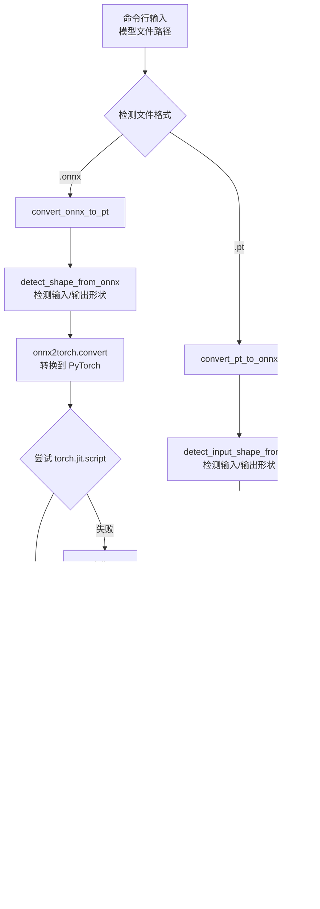

# Convert Policy 模块说明

## 概述

`convert_policy.py` 是一个用于在 PyTorch TorchScript (.pt) 和 ONNX (.onnx) 格式之间转换深度学习模型的 Python 脚本。该模块支持双向自动转换，能够自动检测输入文件格式并转换为另一种格式，同时提供转换验证功能。

主要功能包括：
- **自动格式检测**：根据文件扩展名判断输入格式
- **双向转换**：.pt ↔ .onnx
- **形状检测**：自动推断模型的输入/输出维度
- **转换验证**：比较转换前后模型的输出一致性

## 数据传输和交互

### 文字表述

1. **输入处理**：脚本通过命令行参数接收模型文件路径。自动检测文件扩展名（.pt 或 .onnx）来确定转换方向。

2. **形状检测**：对于 .pt 文件，使用 TorchScript 图信息或参数推断输入/输出维度；对于 .onnx 文件，直接从 ONNX 模型元数据读取形状信息。

3. **模型加载**：根据输入格式加载相应模型（torch.jit.load 或 onnx.load）。

4. **转换执行**：
   - .pt → .onnx：使用 torch.onnx.export 导出，创建虚拟输入进行转换
   - .onnx → .pt：使用 onnx2torch 转换，然后通过 torch.jit.script 或 trace 保存为 TorchScript

5. **验证过程**：转换完成后，使用相同的虚拟输入分别运行原始和转换后的模型，比较输出差异，确保转换正确性。

6. **输出保存**：转换后的模型保存到新文件（扩展名替换），并打印转换结果和验证信息。

7. **交互方式**：纯命令行工具，无图形界面。错误处理包括文件不存在、格式不支持、转换失败等情况。

### Mermaid 图



## 各函数功能

### detect_input_shape_from_pt 函数
- 从 TorchScript .pt 模型自动检测输入/输出维度
- 优先从模型图的类型信息读取，否则从参数推断
- 返回 (input_size, output_size) 元组

### detect_shape_from_onnx 函数
- 从 ONNX 模型自动检测输入/输出维度
- 直接读取 ONNX 图的输入/输出张量形状
- 返回 (input_size, output_size) 元组

### convert_pt_to_onnx 函数
- 执行 .pt 到 .onnx 的转换
- 加载 TorchScript 模型，创建虚拟输入，使用 torch.onnx.export 导出
- 包含转换验证，比较 PyTorch 和 ONNX 的输出差异

### convert_onnx_to_pt 函数
- 执行 .onnx 到 .pt 的转换
- 使用 onnx2torch 将 ONNX 转换为 PyTorch 模型
- 优先使用 torch.jit.script 保存（保留结构），失败时回退到 torch.jit.trace
- 包含转换验证和警告信息

### verify_conversion 函数
- 验证转换正确性
- 使用虚拟输入分别运行原始和转换模型，计算输出最大差异
- 差异小于 1e-5 视为转换成功

### convert_model 函数
- 主转换函数，根据文件扩展名自动选择转换方向
- 处理文件不存在、格式不支持等错误情况
- 打印转换进度和结果信息

## 其他应当说明的内容

### 依赖项
- **PyTorch**：深度学习框架，支持 TorchScript
- **ONNX**：开放神经网络交换格式
- **ONNX Runtime**：ONNX 模型推理引擎，用于验证
- **onnx2torch**：ONNX 到 PyTorch 转换库（需额外安装）

### 支持的格式和转换
- **输入格式**：.pt (TorchScript), .onnx
- **输出格式**：自动转换为另一种格式
- **转换方向**：
  - .pt → .onnx：完整支持，保留参数和结构
  - .onnx → .pt：支持，但可能丢失原始模块结构

### 使用方法
```bash
# 基本用法
python convert_policy.py <model_file_path>

# 示例
python convert_policy.py policy/go2/himloco/himloco.pt    # 转换为 .onnx
python convert_policy.py policy/go2/himloco/himloco.onnx  # 转换为 .pt
```

### 转换特性
- **自动形状检测**：无需手动指定输入维度
- **固定批大小**：转换后的模型批大小固定为1
- **ONNX Opset**：使用版本11，确保兼容性
- **优化**：启用常量折叠优化

### 验证机制
- **输出比较**：使用相同输入比较转换前后的输出
- **容差检查**：最大差异 < 1e-5 视为通过
- **警告提示**：差异过大时发出警告

### 注意事项
- **结构丢失**：ONNX → PT 转换可能丢失原始模型的命名模块结构
- **依赖安装**：ONNX → PT 需要 `pip install onnx2torch`
- **性能影响**：转换可能改变模型的推理性能
- **兼容性**：确保 PyTorch 和 ONNX 版本兼容
- **备份建议**：转换前备份原始模型文件

### 错误处理
- 文件不存在：提示错误并退出
- 格式不支持：列出支持的格式
- 转换失败：显示异常信息和堆栈跟踪
- 库缺失：提示安装所需依赖

### 输出信息
- 转换模式和进度
- 检测到的输入/输出维度
- 验证结果（最大差异）
- 成功/失败状态
- 警告和建议信息