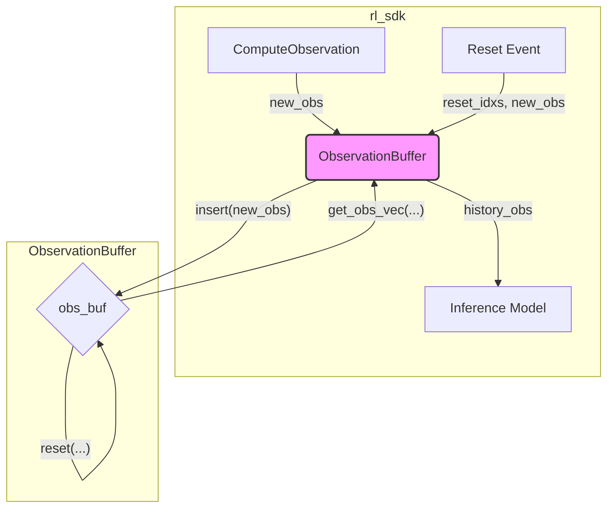

# `observation_buffer` 模块分析

`observation_buffer` 是一个核心数据管理模块，专门用于存储和管理强化学习中的历史观测数据。它实现了一个高效的循环缓冲区，能够为多个并行的环境（environments）维护一段固定长度的历史状态，这对于需要时序信息（Temporal Information）的强化学习策略至关重要。

## 1. 功能与数据流

`observation_buffer` 的主要功能是记录一系列连续的观测数据，并在需要时按照特定格式提供给策略网络。

### 数据交互流程

1.  **初始化**:
    *   `rl_sdk` 模块根据配置文件中的参数（如 `num_envs`, `obs_dims`, `history_length`）创建一个 `ObservationBuffer` 实例。

2.  **数据插入**:
    *   在每个控制周期，`rl_sdk` 的 `RunModel` (或类似函数) 会调用 `ComputeObservation` 来获取当前时刻的观测数据。
    *   这个新的观测数据通过 `history_obs_buf.insert(new_obs)` 方法被推入缓冲区。此时，缓冲区会自动丢弃最旧的数据，以维持固定的历史长度。

3.  **数据重置**:
    *   当一个或多个环境的 episode 结束并需要重置时，`rl_sdk` 会调用 `history_obs_buf.reset(reset_idxs, new_obs)`。该函数会将指定环境的历史记录全部替换为新的初始观测值。

4.  **数据获取**:
    *   在将数据送入推理模型之前，`rl_sdk` 会调用 `history_obs_buf.get_obs_vec(obs_ids)` 来提取格式化的历史观测数据。
    *   `get_obs_vec` 根据初始化时设定的 `priority`（"time" 或 "term"）参数，将历史数据拼接成一个一维向量，以匹配策略网络输入张量的期望形状。

### Mermaid 数据流图

## 2. 各函数功能

### `ObservationBuffer` 类

*   **`ObservationBuffer()` (默认构造函数)**
    *   创建一个空的 `ObservationBuffer` 对象。通常不直接使用，除非后续会重新初始化。

*   **`ObservationBuffer(int num_envs, const std::vector<int>& obs_dims, int history_length, const std::string& priority)` (构造函数)**
    *   **功能**: 初始化观测缓冲区。
    *   **参数**:
        *   `num_envs`: 并行环境的数量。
        *   `obs_dims`: 一个向量，描述了每个观测分量（如 `lin_vel`, `ang_vel` 等）的维度。
        *   `history_length`: 需要存储的历史观测步数。
        *   `priority`: 输出数据排列的优先级，可以是 `"time"` 或 `"term"`，这决定了 `get_obs_vec` 的输出格式。
    *   **内部逻辑**: 根据参数分配一个三维的 `obs_buf` 缓冲区 (`[env][time][obs]`)，并用零进行初始化。

*   **`void reset(std::vector<int> reset_idxs, const std::vector<float>& new_obs)`**
    *   **功能**: 重置指定环境的观测历史。
    *   **参数**:
        *   `reset_idxs`: 需要重置的环境索引列表。
        *   `new_obs`: 用于填充历史记录的新的观测数据。
    *   **内部逻辑**: 遍历 `reset_idxs`，将对应环境的所有历史时刻 (`history_length`) 的观测数据都设置为 `new_obs`。

*   **`void insert(const std::vector<float>& new_obs)`**
    *   **功能**: 插入一个新的观测数据，并使历史数据前移。
    *   **参数**:
        *   `new_obs`: 当前时刻的最新观测数据。
    *   **内部逻辑**:
        1.  对于每个环境，将历史数据向后移动一个时间步（`obs_buf[t] = obs_buf[t-1]`）。
        2.  将 `new_obs` 插入到时间步 `0` 的位置，作为最新的观测。

*   **`std::vector<float> get_obs_vec(std::vector<int> obs_ids)`**
    *   **功能**: 从缓冲区中提取并拼接历史观测数据，生成一个扁平化的一维向量。
    *   **参数**:
        *   `obs_ids`: 一个整数向量，指定需要从历史中提取哪些时间步的数据。`0` 代表最新，`history_length - 1` 代表最旧。
    *   **内部逻辑**:
        *   根据构造时设置的 `priority` 模式进行数据排列：
            *   `priority == "time"`: 按 `[env, time, obs]` 的顺序拼接。
            *   `priority == "term"`: 按 `[env, obs_term, time]` 的顺序拼接。
        *   返回拼接后的一维 `std::vector<float>`，可直接用于模型推理。

## 3. 其他说明

*   **`priority` 参数的重要性**: 这个参数看似不起眼，但对性能和与深度学习框架的集成至关重要。它决定了输出向量的内存布局，不同的布局在送入模型时可能会有不同的性能表现，或者需要进行额外的 `reshape` 或 `permute` 操作。选择正确的 `priority` 可以避免这些开销。
*   **效率**: 该模块使用 `std::vector` 实现了一个循环缓冲区的功能。对于高性能场景，特别是当 `history_length` 和 `num_envs` 很大时，其 `insert` 操作中的数据拷贝可能会成为性能瓶颈。
*   **通用性**: `ObservationBuffer` 的设计是通用的，不与任何特定的机器人或环境绑定，仅通过维度参数进行配置，具有很好的可重用性。
