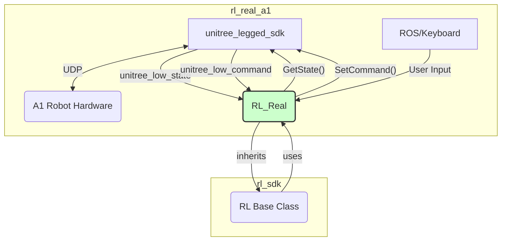

# `rl_real_a1` 模块分析

`rl_real_a1` 是一个将 `rl_sdk` 框架应用于宇树科技（Unitree）A1 机器狗的真实世界部署（Real-World Deployment）的执行模块。它继承了 `rl_sdk` 中的 `RL` 基类，并实现了与A1机器人硬件通信的具体逻辑。

## 1. 功能与数据流

`rl_real_a1` 的核心职责是作为 `rl_sdk` 与 `unitree_legged_sdk`（A1的官方SDK）之间的桥梁。

### 数据交互流程

1.  **初始化 (`RL_Real` 构造函数)**:
    *   **ROS/CMake 环境选择**: 通过预处理器宏 (`USE_ROS1`, `USE_ROS2`, `USE_CMAKE`)，代码在编译时决定是创建一个ROS节点（用于接收`/cmd_vel`指令）还是一个纯CMake应用。
    *   **加载配置**: 调用 `ReadYaml` 加载特定于A1的配置文件（如 `a1/base.yaml`），这些配置覆盖或补充了 `rl_sdk` 的通用配置。
    *   **FSM 初始化**: 根据机器人名称（"a1"）加载对应的有限状态机（`FSMManager::GetInstance().IsTypeSupported(...)`）。
    *   **硬件接口初始化**: 初始化 `unitree_udp`，这是与A1机器人进行底层UDP通信的接口。
    *   **多线程循环**: 创建并启动多个独立的线程（`LoopFunc`），分别用于：
        *   `loop_udpSend`: 周期性地向机器人发送指令。
        *   `loop_udpRecv`: 周期性地从机器人接收状态数据。
        *   `loop_control`: 主控制循环，执行状态获取、决策和命令设置。
        *   `loop_rl`: 强化学习模型推理循环。
        *   `loop_keyboard`: 键盘输入处理。

2.  **状态获取 (`GetState`)**:
    *   此函数是 `RL` 基类中纯虚函数的具体实现。
    *   它调用 `unitree_udp.GetRecv(this->unitree_low_state)` 从硬件SDK获取最新的底层状态数据 (`LowState`)。
    *   它解析 `unitree_low_state`，将IMU数据（四元数、角速度）和电机数据（位置、速度）填充到 `rl_sdk` 要求的 `RobotState` 结构体中。
    *   同时，它还解析遥控器（`unitree_joy`）的按键状态，并将其映射为 `rl_sdk` 中的 `control` 指令（如 `control.x`, `control.y`, `control.yaw`）。

3.  **命令下发 (`SetCommand`)**:
    *   此函数同样是 `RL` 基类纯虚函数的实现。
    *   它接收由 `rl_sdk` 的 `StateController` 和 `ComputeOutput` 计算出的 `RobotCommand`。
    *   它将 `RobotCommand` 中的目标关节位置、速度、力矩、KP、KD值，转换并填充到 `unitree_low_command`（`LowCmd`）结构体中。
    *   在发送前，它会调用 `unitree_safe.PowerProtect` 等安全函数，对指令进行检查和保护，防止不安全的指令损害硬件。
    *   最后，调用 `unitree_udp.SetSend(this->unitree_low_command)` 将指令打包并通过UDP发送给机器人。

4.  **主控制逻辑 (`RobotControl` & `RunModel`)**:
    *   `RobotControl` 函数在 `loop_control` 线程中被周期性调用。它 orchestrates 了一个完整的控制步骤：
        1.  调用 `GetState` 获取最新状态。
        2.  调用 `StateController`（继承自 `rl_sdk`）运行FSM并计算出高层决策。
        3.  调用 `SetCommand` 将最终指令发送出去。
    *   `RunModel` 函数在 `loop_rl` 线程中被周期性调用。它负责执行计算密集型的模型推理任务，与 `rl_sdk` 中的 `Forward` 方法紧密协作。

### Mermaid 数据流图

**文字表述**:
`rl_real_a1` 模块中的 `RL_Real` 类继承自 `rl_sdk` 的 `RL` 基类。它通过 `unitree_legged_sdk` 与A1机器人硬件进行双向UDP通信。`GetState` 方法从硬件获取状态，填充 `rl_sdk` 的 `RobotState`；`SetCommand` 方法则将 `rl_sdk` 计算出的 `RobotCommand` 转换为硬件指令并发送。用户输入可以通过ROS话题 (`/cmd_vel`) 或直接的键盘/手柄接口进入 `RL_Real`，进而影响 `rl_sdk` 中的 `StateController`。整个系统通过多个并发循环（UDP收发、控制、RL推理）高效运行。

## 2. 各函数功能

### `RL_Real` 类

*   **`RL_Real(int argc, char **argv)` (构造函数)**
    *   **功能**: 模块的核心初始化。根据编译宏设置ROS或CMake环境，加载参数，初始化FSM，初始化Unitree SDK的UDP通信，并创建所有后台运行的线程（`LoopFunc`）。

*   **`~RL_Real()` (析构函数)**
    *   **功能**: 安全地关闭所有后台线程，确保程序平稳退出。

*   **`void GetState(RobotState<float> *state)`**
    *   **功能**: 实现 `RL` 基类的纯虚函数。从 `unitree_low_state` 读取硬件状态，并将其转换为 `rl_sdk` 使用的 `RobotState` 格式。同时处理手柄输入。

*   **`void SetCommand(const RobotCommand<float> *command)`**
    *   **功能**: 实现 `RL` 基类的纯虚函数。将 `rl_sdk` 计算出的 `RobotCommand` 转换为 `unitree_low_command` 格式，并调用安全保护函数后，通过UDP发送给机器人。

*   **`void RobotControl()`**
    *   **功能**: 主控制循环的执行体。在一个控制周期内，依次调用 `GetState`、`StateController` 和 `SetCommand`，完成一次“感知-决策-行动”的闭环。

*   **`void RunModel()`**
    *   **功能**: RL模型推理循环的执行体。此函数被设计为在独立的线程中运行，以处理耗时的神经网络前向传播计算。它调用 `rl_sdk` 的 `Forward` 方法来获取动作。

*   **`std::vector<float> Forward()`**
    *   **功能**: 实现 `RL` 基类的 `Forward` 接口。它整合了观测计算、历史数据处理和模型推理的完整流程，并返回模型输出的动作。

*   **`void UDPSend()` / `void UDPRecv()`**
    *   **功能**: 分别是UDP发送和接收线程的执行体，直接调用 `unitree_udp` 的相应方法。

*   **`void CmdvelCallback(...)`**
    *   **功能**: ROS订阅者的回调函数。当 `USE_ROS` 被定义时，此函数会监听 `/cmd_vel` 话题，并将接收到的 `Twist` 消息转换为 `control.x`, `control.y`, `control.yaw` 指令。

*   **`main(int argc, char **argv)`**
    *   **功能**: 程序的入口点。根据编译宏初始化ROS环境（如果需要），创建 `RL_Real` 对象实例，并进入一个循环等待程序结束（例如，通过 `ros::spin()` 或一个简单的 `while(1)`）。

## 3. 其他说明

*   **多线程架构**: `rl_real_a1` 采用了基于 `LoopFunc` 的多线程架构。这种设计将高频率的硬件I/O（UDP收发）、中等频率的控制循环和低频率（但耗时）的RL推理分离开来，确保了系统的实时性和响应性。例如，UDP通信可能需要以500Hz运行，而RL策略推理可能只需要以50Hz运行。
*   **硬件抽象的体现**: 这个模块是 `rl_sdk` 设计理念的最佳实践。所有与A1机器人硬件相关的代码都被封装在此模块内。如果想将这套RL算法移植到另一款机器人（比如Go1），理论上只需要重写一个 `rl_real_go1` 模块，实现 `GetState` 和 `SetCommand`，并提供相应的配置文件即可，而无需改动 `rl_sdk` 中的核心逻辑。
*   **ROS 集成**: `rl_real_a1` 提供了与ROS集成的选项。这使得机器人可以轻松地融入更庞大的ROS系统中，例如，由一个上层的全局路径规划器发布 `/cmd_vel` 指令来引导机器人行走。
*   **安全性**: 代码中多处体现了对硬件安全的考虑，例如 `unitree_safe.PowerProtect`，它可以在发送指令前进行检查，防止因指令异常（如力矩过大）而损坏机器人。这是真实世界部署中至关重要的一环。
