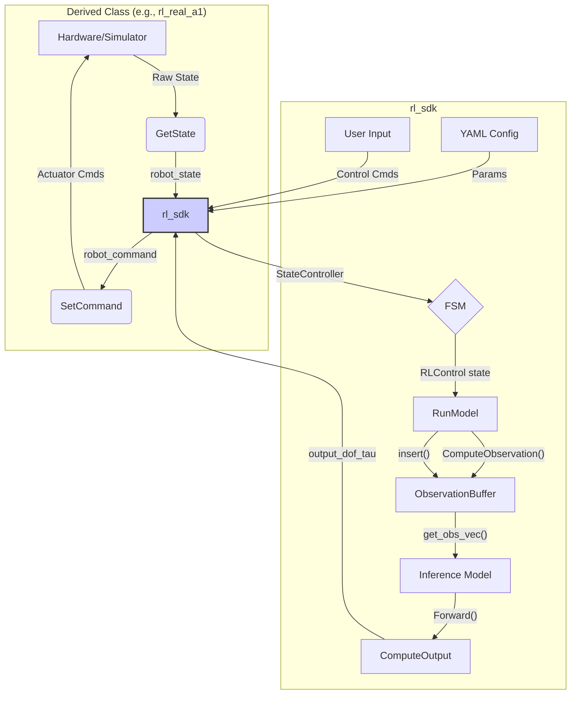

# `rl_sdk` 模块分析

`rl_sdk` 是一个通用的强化学习软件开发工具包（SDK），它为机器人强化学习应用的开发提供了一个核心框架。该模块定义了RL算法与具体硬件/仿真环境交互的抽象接口和通用逻辑，使得算法可以轻松地在不同机器人平台上复用。`rl_real_a1` 就是基于这个SDK实现的具体应用。

## 1. 功能与数据流

`rl_sdk` 的核心是 `RL` 基类，它封装了状态管理、观测计算、模型推理、动作输出和有限状态机（FSM）等通用功能。

### 数据交互流程

1.  **初始化 (`InitRL`)**:
    *   `rl_sdk` 从指定的 `config.yaml` 文件中读取所有配置参数，例如观测（observations）列表、动作缩放（action scale）、PD控制器增益（rl_kp, rl_kd）等。
    *   根据配置初始化各个组件，包括观测向量、历史观测缓冲区 (`ObservationBuffer`)、以及加载策略模型（Inference Model）。

2.  **状态获取**:
    *   派生类（如 `rl_real_a1`）通过硬件接口（如 `unitree_legged_sdk`）获取机器人的底层状态（IMU、电机角度/速度等）。
    *   派生类调用 `GetState` 方法，将这些原始数据填充到 `rl_sdk` 的 `robot_state` 结构体中。

3.  **状态控制与决策 (`StateController` & `RunModel`)**:
    *   `StateController` 是一个高层状态管理器，它运行一个有限状态机（FSM）。FSM根据当前的用户输入（键盘/手柄）或内部逻辑决定机器人应该执行哪种行为（如站立、行走、执行特定技能）。
    *   当FSM切换到 `RLControl` 状态时，系统开始执行基于强化学习的控制。
    *   `RunModel` 函数被周期性调用，它执行以下步骤：
        a.  调用 `ComputeObservation`，根据 `robot_state` 和配置文件，生成当前时刻的观测向量 `obs`。
        b.  将 `obs` 插入到 `history_obs_buf` 中。
        c.  从 `history_obs_buf` 中获取拼接好的历史观测数据。
        d.  将历史观测数据送入已加载的**推理模型** (`model->Forward()`)，得到原始的动作输出 `actions`。

4.  **动作处理与输出 (`ComputeOutput`)**:
    *   `ComputeOutput` 函数接收模型输出的 `actions`。
    *   它将归一化的 `actions` 通过动作缩放（`action_scale`）和偏移（`default_dof_pos`）转换为目标关节角度。
    *   然后，它使用一个PD控制器，根据目标关节角度和当前关节状态（`obs.dof_pos`, `obs.dof_vel`）计算出最终的**关节力矩** (`output_dof_tau`)。
    *   计算出的力矩会经过安全限制（`clamp`）和保护逻辑（`TorqueProtect`）。

5.  **命令下发**:
    *   计算出的目标关节位置、速度、力矩等被存放在 `robot_command` 结构体中。
    *   `rl_sdk` 调用由派生类实现的 `SetCommand` 虚函数，将 `robot_command` 传递给派生类。
    *   派生类负责将这些指令格式化并发送给机器人硬件或仿真器。

### Mermaid 数据流图

## 2. 各函数功能

### `RL` 类

*   **`void InitRL(std::string robot_config_path)`**:
    *   **功能**: 核心初始化函数。加载配置文件，初始化观测、输出、控制器、历史缓冲区和推理模型。

*   **`void InitJointNum(size_t num_joints)`**:
    *   **功能**: 根据关节数量重设 `RobotState` 和 `RobotCommand` 中与关节相关的向量大小。

*   **`void ReadYaml(const std::string& file_path, const std::string& file_name)`**:
    *   **功能**: 读取 YAML 配置文件并将其内容加载到 `params` 成员中，供后续使用。

*   **`std::vector<float> ComputeObservation()`**:
    *   **功能**: 从 `robot_state` 中提取数据，并根据配置文件中 `observations` 列表的定义，构建并返回一个扁平化的观测向量。这个向量是模型进行决策的直接输入。

*   **`void ComputeOutput(...)`**:
    *   **功能**: 将推理模型输出的 `actions` 转换为实际的关节力矩。它内部实现了一个PD控制器，并应用了力矩限制。

*   **`void StateController(...)`**:
    *   **功能**: 高层状态控制器。它运行FSM，并根据用户输入（如键盘'W','A','S','D'）更新控制指令（`control.x`, `control.y`, `control.yaw`）。

*   **`void KeyboardInterface()`**:
    *   **功能**: 通过非阻塞方式读取键盘输入，并将其映射为 `Input::Keyboard` 枚举，用于控制机器人行为。

*   **`virtual std::vector<float> Forward() = 0`**:
    *   **功能**: 纯虚函数，应由派生类实现。定义了执行一次完整的模型前向传播的逻辑。

*   **`virtual void GetState(RobotState<float> *state) = 0`**:
    *   **功能**: 纯虚函数，由派生类实现，用于从硬件或仿真器获取状态并填充 `state`。

*   **`virtual void SetCommand(const RobotCommand<float> *command) = 0`**:
    *   **功能**: 纯虚函数，由派生类实现，用于将计算出的 `command` 发送给硬件或仿真器。

*   **`void TorqueProtect(...)` / `void AttitudeProtect(...)`**:
    *   **功能**: 安全保护函数。`TorqueProtect` 监控输出力矩是否超限，`AttitudeProtect` 监控机身姿态（俯仰/滚转角）是否超过安全阈值，并在异常时发出警告或采取措施。

### `RLFSMState` 类

这是一个继承自 `FSMState` 的特殊状态类，专门用于执行RL控制。

*   **`bool Interpolate(...)`**:
    *   **功能**: 实现一个平滑的关节位置插值。常用于机器人从一个姿态（如趴下）过渡到另一个姿态（如站立）的过程，以避免电机突变。

*   **`void RLControl()`**:
    *   **功能**: `RLFSMState` 的核心逻辑。当FSM处于此状态时，该函数被周期性调用，它会调用 `rl.Forward()` 来执行一次完整的“观测->决策->输出”流程。

### 数据结构

*   **`RobotState<T>`**: 存储机器人状态的结构体，包括IMU数据（四元数、角速度等）和电机状态（位置、速度等）。
*   **`RobotCommand<T>`**: 存储发送给机器人的指令的结构体，包括电机模式和目标关节位置、速度、力矩、KP、KD值。
*   **`Control`**: 存储用户控制意图的结构体，如前向速度 `x`、侧向速度 `y` 和转向速度 `yaw`。
*   **`YamlParams`**: YAML配置文件的封装，提供 `Get<T>()` 方法来方便地获取配置项。
*   **`Observations<T>`**: 封装了策略模型所需的所有观测分量。

## 3. 其他说明

*   **抽象与实现分离**: `rl_sdk` 完美体现了“抽象与实现分离”的设计原则。`RL` 基类定义了“做什么”（What），而像 `rl_real_a1` 这样的派生类则负责“怎么做”（How）。这使得核心的RL逻辑可以独立于任何特定的硬件。
*   **有限状态机 (FSM)**: FSM的引入使得机器人可以拥有多种行为模式。例如，机器人可以有一个“站立”状态、一个“行走”状态和一个“趴下”状态。用户可以通过简单的指令在这些状态间切换，而只有在“行走”状态时，RL策略才会被激活。这大大增强了系统的鲁棒性和实用性。
*   **线程安全**: `InitRL` 函数使用了 `std::lock_guard<std::mutex>` 来保护模型的加载过程，这表明该SDK考虑到了在多线程环境下的使用场景，例如在一个独立的线程中运行模型推理。
*   **代码可移植性**: 通过 `USE_ROS1`, `USE_ROS2`, `USE_CMAKE` 等宏定义，代码库可以在ROS1、ROS2和纯CMake环境中编译，展示了其良好的可移植性。
