# RAI 框架功能详解

## 目录

- [1. 项目概述](#1-项目概述)
- [2. 整体架构](#2-整体架构)
- [3. 核心模块详解](#3-核心模块详解)
  - [3.1 Agent 体系](#31-agent-体系)
  - [3.2 LLM 抽象层](#32-llm-抽象层)
  - [3.3 通信系统](#33-通信系统)
  - [3.4 ROS 2 工具系统](#34-ros-2-工具系统)
  - [3.5 聚合器系统](#35-聚合器系统)
  - [3.6 多模态消息](#36-多模态消息)
- [4. 扩展模块](#4-扩展模块)
  - [4.1 语音交互 (S2S)](#41-语音交互-s2s)
  - [4.2 自我认知 (WhoAmI)](#42-自我认知-whoami)
  - [4.3 视觉感知 (Perception)](#43-视觉感知-perception)
  - [4.4 导航集成 (NoMaD)](#44-导航集成-nomad)
  - [4.5 模拟器与基准测试](#45-模拟器与基准测试)
  - [4.6 模型微调 (Finetune)](#46-模型微调-finetune)
- [5. 配置系统](#5-配置系统)
- [6. 部署与运行](#6-部署与运行)

---

## 1. 项目概述

RAI (RobotecAI) 是一个面向 **具身智能 (Embodied AI)** 的 Python 多智能体框架，核心目标是将生成式 AI（大语言模型）与 ROS 2 机器人系统集成，实现：

- **多智能体协作**：支持 ReAct、状态驱动、对话式等多种智能体范式
- **人机交互 (HRI)**：文本、语音、图像多模态交互
- **ROS 2 原生集成**：通过 Topic/Service/Action 与机器人底层通信
- **多供应商 LLM 支持**：OpenAI、AWS Bedrock、Ollama、Google 统一抽象
- **可观测性**：Langfuse / LangSmith 追踪

### 技术栈

| 维度 | 技术 |
|------|------|
| Python 版本 | 3.10 / 3.12 |
| ROS 2 发行版 | Humble / Jazzy |
| 包管理 | `uv` (workspace) |
| LLM 框架 | LangChain 1.x + LangGraph |
| 包构建 | `uv_build` (Python) + `colcon` (ROS 2) |
| 代码规范 | Ruff + Prettier + Shellcheck |

---

## 2. 整体架构

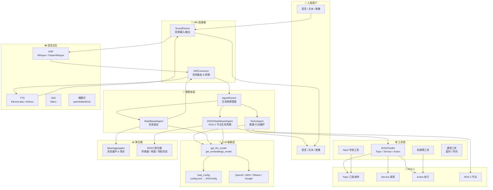
```mermaid
graph TB
    subgraph Human["👤 人类用户"]
        UserInput["语音 / 文本 / 图像"]
        UserOutput["语音 / 文本 / 图像"]
    end

    subgraph HRI["📡 HRI 连接器"]
        HRIConnector["HRIConnector<br/>消息路由 & 转换"]
        SoundDev["SoundDevice<br/>音频输入/输出"]
    end

    subgraph AgentLayer["🤖 智能体层"]
        AgentRunner["AgentRunner<br/>生命周期管理"]
        ReAct["ReActAgent<br/>推理-行动循环"]
        StateBased["StateBasedAgent<br/>状态驱动"]
        ROS2Agent["ROS2StateBasedAgent<br/>ROS 2 节点生命周期"]
    end

    subgraph LLM["🧠 LLM 抽象层"]
        ConfigLoader["load_config<br/>config.toml → RAIConfig"]
        ModelInit["get_llm_model<br/>get_embeddings_model"]
        Vendors["OpenAI / AWS / Ollama / Google"]
    end

    subgraph Tools["🛠️ 工具层"]
        ROS2Toolkit["ROS2Toolkit<br/>Topic / Service / Action"]
        NavTools["Nav2 导航工具"]
        ManipTools["机械臂工具"]
        GenericTools["通用工具<br/>超时 / 时间"]
    end

    subgraph Aggregators["📊 聚合器"]
        StateAgg["BaseAggregator<br/>消息缓冲 & 聚合"]
        ROS2Agg["ROS2 聚合器<br/>传感器 / 地图 / 导航状态"]
    end

    subgraph ROS2["🔧 ROS 2"]
        Topics["Topic 订阅/发布"]
        Services["Service 调用"]
        Actions["Action 执行"]
        Node["ROS 2 节点"]
    end

    subgraph S2S["🔊 语音交互"]
        ASR["ASR<br/>Whisper / FasterWhisper"]
        TTS["TTS<br/>ElevenLabs / Kokoro"]
        VAD["VAD<br/>Silero"]
        WakeWord["唤醒词<br/>openWakeWord"]
    end

    UserInput --> SoundDev
    SoundDev --> ASR
    ASR --> HRIConnector
    HRIConnector --> AgentRunner
    AgentRunner --> ReAct
    AgentRunner --> StateBased
    AgentRunner --> ROS2Agent
    ReAct --> ModelInit
    StateBased --> ModelInit
    ROS2Agent --> ModelInit
    ModelInit --> ConfigLoader
    ModelInit --> Vendors
    ReAct --> ROS2Toolkit
    StateBased --> StateAgg
    ROS2Agent --> ROS2Agg
    ROS2Toolkit --> Topics
    ROS2Toolkit --> Services
    ROS2Toolkit --> Actions
    ROS2Agent --> Node
    ReAct --> UserOutput
    StateBased --> HRIConnector
    HRIConnector --> TTS
    TTS --> SoundDev
    SoundDev --> UserOutput
    NavTools --> Topics
    ManipTools --> Actions
```

---

## 3. 核心模块详解

### 3.1 Agent 体系

RAI 提供分层的智能体抽象，从基础接口到 ROS 2 集成：

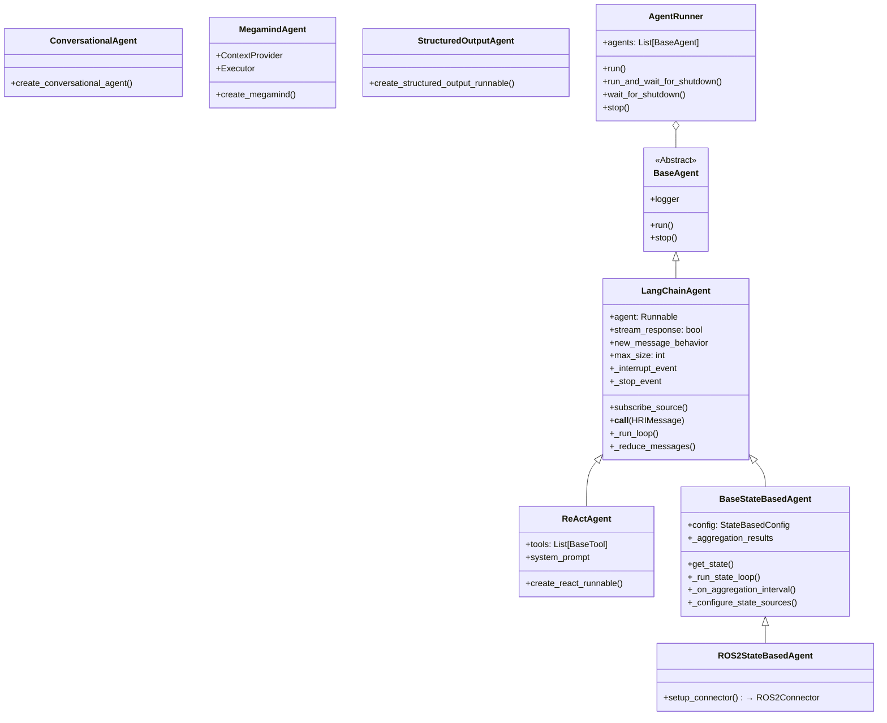
```mermaid
classDiagram
    class BaseAgent {
        <<Abstract>>
        +run()
        +stop()
        +logger
    }

    class LangChainAgent {
        +agent: Runnable
        +stream_response: bool
        +new_message_behavior
        +max_size: int
        +subscribe_source()
        +__call__(HRIMessage)
        +_run_loop()
        +_reduce_messages()
        +_interrupt_event
        +_stop_event
    }

    class ReActAgent {
        +tools: List[BaseTool]
        +system_prompt
        +create_react_runnable()
    }

    class BaseStateBasedAgent {
        +config: StateBasedConfig
        +get_state()
        +_run_state_loop()
        +_on_aggregation_interval()
        +_aggregation_results
        +_configure_state_sources()
    }

    class ROS2StateBasedAgent {
        +setup_connector() → ROS2Connector
    }

    class ConversationalAgent {
        +create_conversational_agent()
    }

    class MegamindAgent {
        +ContextProvider
        +Executor
        +create_megamind()
    }

    class StructuredOutputAgent {
        +create_structured_output_runnable()
    }

    class AgentRunner {
        +agents: List[BaseAgent]
        +run()
        +run_and_wait_for_shutdown()
        +wait_for_shutdown()
        +stop()
    }

    BaseAgent <|-- LangChainAgent
    LangChainAgent <|-- ReActAgent
    LangChainAgent <|-- BaseStateBasedAgent
    BaseStateBasedAgent <|-- ROS2StateBasedAgent
    AgentRunner o-- BaseAgent
```

#### 智能体类型对比

| 类型 | 特点 | 适用场景 |
|------|------|----------|
| **ReActAgent** | Reason + Act 循环，LLM 自主决定调用工具 | 通用任务推理、工具调用 |
| **StateBasedAgent** | 周期性聚合传感器状态，注入 LLM 上下文 | 需要持续感知环境的场景 |
| **ROS2StateBasedAgent** | 状态驱动 + ROS 2 节点生命周期 | 部署到实际机器人 |
| **ConversationalAgent** | 多轮对话管理 | 自然语言交互 |
| **MegamindAgent** | 上下文提供者 + 执行者分离架构 | 复杂规划任务 |
| **StructuredOutputAgent** | 强制结构化输出 | 需要确定性响应的场景 |

#### AgentRunner 生命周期

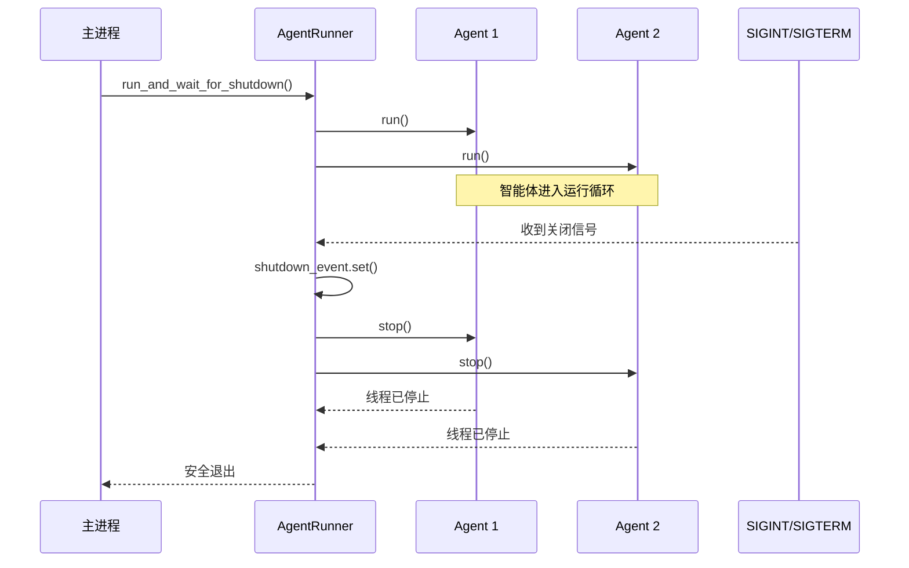
```mermaid
sequenceDiagram
    participant Main as 主进程
    participant Runner as AgentRunner
    participant Agent1 as Agent 1
    participant Agent2 as Agent 2
    participant Signal as SIGINT/SIGTERM

    Main->>Runner: run_and_wait_for_shutdown()
    Runner->>Agent1: run()
    Runner->>Agent2: run()
    Note over Agent1,Agent2: 智能体进入运行循环
    Signal-->>Runner: 收到关闭信号
    Runner->>Runner: shutdown_event.set()
    Runner->>Agent1: stop()
    Runner->>Agent2: stop()
    Agent1-->>Runner: 线程已停止
    Agent2-->>Runner: 线程已停止
    Runner-->>Main: 安全退出
```

#### 消息处理策略 (`new_message_behavior`)

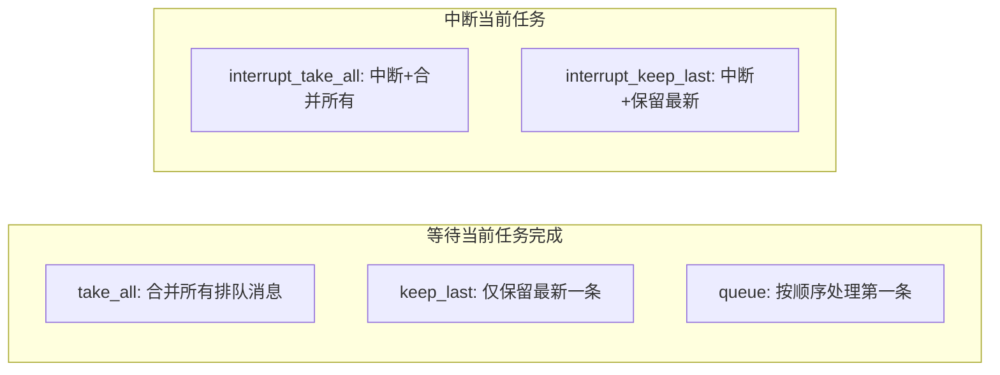
```mermaid
graph LR
    subgraph Wait["等待当前任务完成"]
        take_all["take_all: 合并所有排队消息"]
        keep_last["keep_last: 仅保留最新一条"]
        queue["queue: 按顺序处理第一条"]
    end

    subgraph Interrupt["中断当前任务"]
        int_take_all["interrupt_take_all: 中断+合并所有"]
        int_keep_last["interrupt_keep_last: 中断+保留最新"]
    end
```

### 3.2 LLM 抽象层

RAI 通过 `config.toml` 统一抽象多个 LLM 供应商：

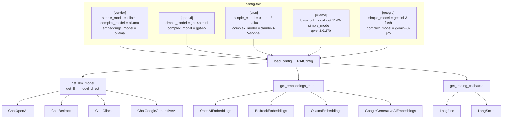
```mermaid
graph TB
    subgraph Config["config.toml"]
        Vendor["[vendor]<br/>simple_model = ollama<br/>complex_model = ollama<br/>embeddings_model = ollama"]
        OpenAISection["[openai]<br/>simple_model = gpt-4o-mini<br/>complex_model = gpt-4o"]
        AWSSection["[aws]<br/>simple_model = claude-3-haiku<br/>complex_model = claude-3-5-sonnet"]
        OllamaSection["[ollama]<br/>base_url = localhost:11434<br/>simple_model = qwen3.6:27b"]
        GoogleSection["[google]<br/>simple_model = gemini-3-flash<br/>complex_model = gemini-3-pro"]
    end

    ConfigLoader["load_config → RAIConfig"]
    GetLLM["get_llm_model<br/>get_llm_model_direct"]
    GetEmbed["get_embeddings_model"]
    GetTracing["get_tracing_callbacks"]

    Vendor --> ConfigLoader
    OpenAISection --> ConfigLoader
    AWSSection --> ConfigLoader
    OllamaSection --> ConfigLoader
    GoogleSection --> ConfigLoader

    ConfigLoader --> GetLLM
    ConfigLoader --> GetEmbed
    ConfigLoader --> GetTracing

    GetLLM --> ChatOpenAI["ChatOpenAI"]
    GetLLM --> ChatBedrock["ChatBedrock"]
    GetLLM --> ChatOllama["ChatOllama"]
    GetLLM --> ChatGoogle["ChatGoogleGenerativeAI"]

    GetEmbed --> OpenAIEmbed["OpenAIEmbeddings"]
    GetEmbed --> BedrockEmbed["BedrockEmbeddings"]
    GetEmbed --> OllamaEmbed["OllamaEmbeddings"]
    GetEmbed --> GoogleEmbed["GoogleGenerativeAIEmbeddings"]

    GetTracing --> Langfuse["Langfuse"]
    GetTracing --> LangSmith["LangSmith"]
```

**核心 API**：

| 函数 | 作用 | 返回类型 |
|------|------|----------|
| `get_llm_model(type)` | 根据配置获取 LLM 实例 | `ChatOpenAI \| ChatBedrock \| ChatOllama \| ChatGoogleGenerativeAI` |
| `get_llm_model_direct(name, vendor)` | 直接指定模型名和供应商 | 同上 |
| `get_embeddings_model()` | 获取嵌入模型 | `Embeddings` 实例 |
| `get_tracing_callbacks()` | 获取追踪回调 | `List[BaseCallbackHandler]` |
| `load_config(path)` | 加载并解析 TOML 配置 | `RAIConfig` 数据类 |

### 3.3 通信系统

通信系统是 RAI 的核心枢纽，负责 ROS 2 节点与智能体之间的消息传递：

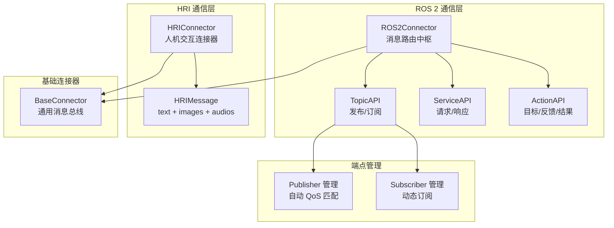
```mermaid
graph TB
    subgraph ROS2Comm["ROS 2 通信层"]
        ROS2Connector["ROS2Connector<br/>消息路由中枢"]
        ROS2TopicAPI["TopicAPI<br/>发布/订阅"]
        ROS2SvcAPI["ServiceAPI<br/>请求/响应"]
        ROS2ActAPI["ActionAPI<br/>目标/反馈/结果"]
    end

    subgraph HRIComm["HRI 通信层"]
        HRIConnector["HRIConnector<br/>人机交互连接器"]
        HRIMessage["HRIMessage<br/>text + images + audios"]
    end

    subgraph BaseConn["基础连接器"]
        BaseConnector["BaseConnector<br/>通用消息总线"]
    end

    subgraph Endpoints["端点管理"]
        Publishers["Publisher 管理<br/>自动 QoS 匹配"]
        Subscribers["Subscriber 管理<br/>动态订阅"]
    end

    ROS2Connector --> ROS2TopicAPI
    ROS2Connector --> ROS2SvcAPI
    ROS2Connector --> ROS2ActAPI
    ROS2TopicAPI --> Publishers
    ROS2TopicAPI --> Subscribers
    HRIConnector --> HRIMessage
    HRIConnector --> BaseConnector
    ROS2Connector --> BaseConnector
```

#### 消息类型体系

| 类型 | 字段 | 说明 |
|------|------|------|
| `HRIMessage` | `text`, `images`, `audios`, `message_author`, `communication_id`, `seq_no`, `seq_end` | 框架内核心消息类型 |
| `ROS2Message` | ROS 2 标准消息包装 | ROS 2 Topic 消息 |
| `HumanMultimodalMessage` | `content`(text+image_url), `images`(base64) | 多模态人类消息 |
| `SystemMultimodalMessage` | 同上 + System 角色 | 系统级多模态消息 |
| `ToolMultimodalMessage` | 同上 + `tool_call_id` | 工具返回的多模态结果 |
| `AIMultimodalMessage` | 同上 + AI 角色 | AI 多模态回复 |

#### 通信流程

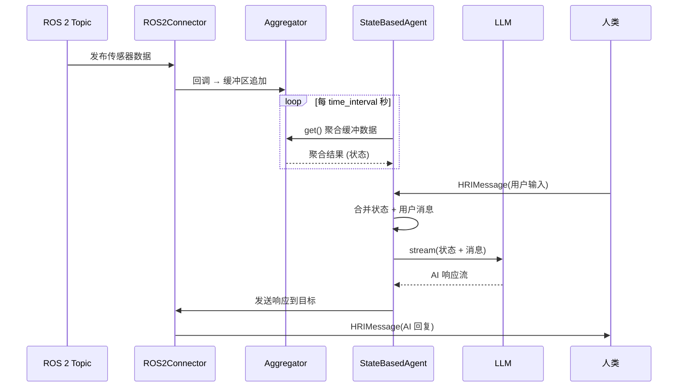
```mermaid
sequenceDiagram
    participant ROS as ROS 2 Topic
    participant Connector as ROS2Connector
    participant Agg as Aggregator
    participant Agent as StateBasedAgent
    participant LLM as LLM
    participant Human as 人类

    ROS->>Connector: 发布传感器数据
    Connector->>Agg: 回调 → 缓冲区追加
    loop 每 time_interval 秒
        Agent->>Agg: get() 聚合缓冲数据
        Agg-->>Agent: 聚合结果 (状态)
    end
    Human->>Agent: HRIMessage(用户输入)
    Agent->>Agent: 合并状态 + 用户消息
    Agent->>LLM: stream(状态 + 消息)
    LLM-->>Agent: AI 响应流
    Agent->>Connector: 发送响应到目标
    Connector->>Human: HRIMessage(AI 回复)
```

### 3.4 ROS 2 工具系统

RAI 将 ROS 2 的 Topic、Service、Action 抽象为 LangChain 工具，使 LLM 能够自主调用机器人能力：

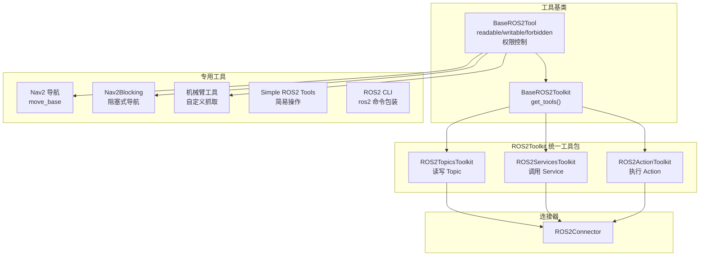
```mermaid
graph TB
    subgraph Toolkit["ROS2Toolkit 统一工具包"]
        TopicsToolkit["ROS2TopicsToolkit<br/>读写 Topic"]
        ServicesToolkit["ROS2ServicesToolkit<br/>调用 Service"]
        ActionsToolkit["ROS2ActionToolkit<br/>执行 Action"]
    end

    subgraph ToolBase["工具基类"]
        BaseROS2Tool["BaseROS2Tool<br/>readable/writable/forbidden<br/>权限控制"]
        BaseROS2Toolkit["BaseROS2Toolkit<br/>get_tools()"]
    end

    subgraph Connector["连接器"]
        ROS2Conn["ROS2Connector"]
    end

    subgraph Specialized["专用工具"]
        Nav2Tool["Nav2 导航<br/>move_base"]
        Nav2Blocking["Nav2Blocking<br/>阻塞式导航"]
        ManipTools["机械臂工具<br/>自定义抓取"]
        SimpleTools["Simple ROS2 Tools<br/>简易操作"]
        CLITools["ROS2 CLI<br/>ros2 命令包装"]
    end

    BaseROS2Tool --> BaseROS2Toolkit
    BaseROS2Toolkit --> TopicsToolkit
    BaseROS2Toolkit --> ServicesToolkit
    BaseROS2Toolkit --> ActionsToolkit
    TopicsToolkit --> ROS2Conn
    ServicesToolkit --> ROS2Conn
    ActionsToolkit --> ROS2Conn
    BaseROS2Tool --> Nav2Tool
    BaseROS2Tool --> Nav2Blocking
    BaseROS2Tool --> ManipTools
```

**工具权限控制**：每个工具支持三级访问控制

| 属性 | 说明 |
|------|------|
| `readable` | 允许读取的 Topic 白名单 |
| `writable` | 允许写入的 Topic/Service/Action 白名单 |
| `forbidden` | 禁止访问的资源黑名单（优先级最高） |

### 3.5 聚合器系统

聚合器负责从 ROS 2 Topic 持续收集消息，按需聚合并提供给智能体作为上下文状态：

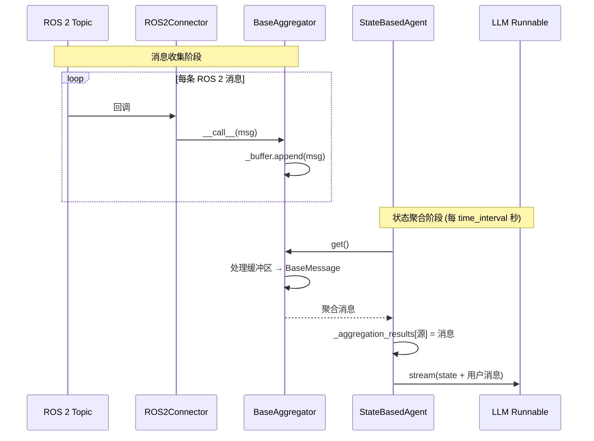
```mermaid
sequenceDiagram
    participant Topic as ROS 2 Topic
    participant Connector as ROS2Connector
    participant Agg as BaseAggregator
    participant Agent as StateBasedAgent
    participant LLM as LLM Runnable

    Note over Topic,Agg: 消息收集阶段
    loop 每条 ROS 2 消息
        Topic->>Connector: 回调
        Connector->>Agg: __call__(msg)
        Agg->>Agg: _buffer.append(msg)
    end

    Note over Agent,LLM: 状态聚合阶段 (每 time_interval 秒)
    Agent->>Agg: get()
    Agg->>Agg: 处理缓冲区 → BaseMessage
    Agg-->>Agent: 聚合消息
    Agent->>Agent: _aggregation_results[源] = 消息
    Agent->>LLM: stream(state + 用户消息)
```

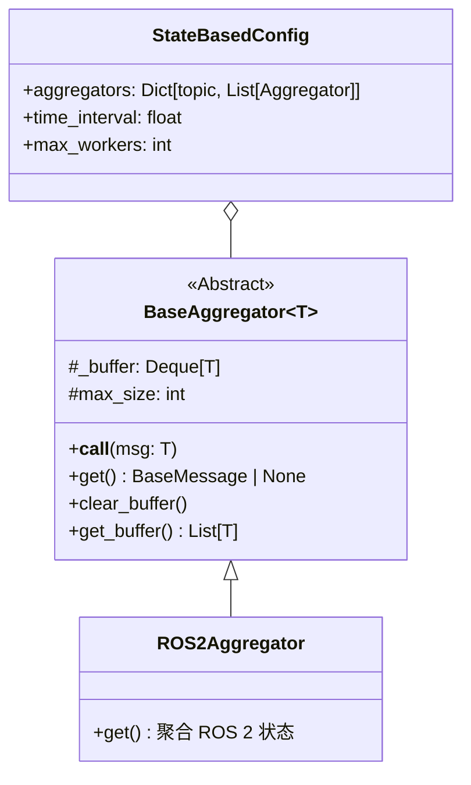
```mermaid
classDiagram
    class BaseAggregator~T~ {
        <<Abstract>>
        #_buffer: Deque[T]
        #max_size: int
        +__call__(msg: T)
        +get() BaseMessage | None
        +clear_buffer()
        +get_buffer() List[T]
    }

    class ROS2Aggregator {
        +get() 聚合 ROS 2 状态
    }

    class StateBasedConfig {
        +aggregators: Dict[topic, List[Aggregator]]
        +time_interval: float
        +max_workers: int
    }

    BaseAggregator <|-- ROS2Aggregator
    StateBasedConfig o-- BaseAggregator
```

### 3.6 多模态消息

RAI 原生支持多模态交互（文本 + 图像 + 音频）：

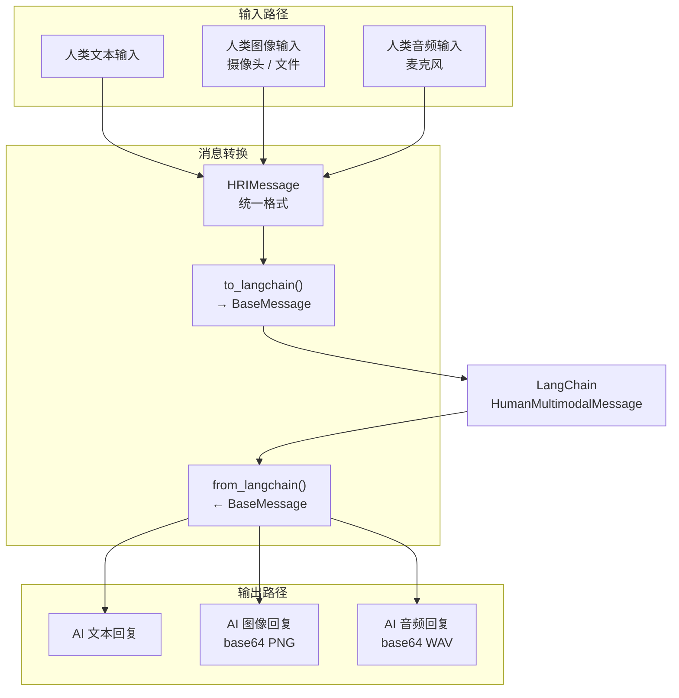
```mermaid
graph TB
    subgraph Input["输入路径"]
        UserText["人类文本输入"]
        UserImage["人类图像输入<br/>摄像头 / 文件"]
        UserAudio["人类音频输入<br/>麦克风"]
    end

    subgraph Conversion["消息转换"]
        HRIMsg["HRIMessage<br/>统一格式"]
        ToLangchain["to_langchain()<br/>→ BaseMessage"]
        FromLangchain["from_langchain()<br/>← BaseMessage"]
    end

    subgraph Output["输出路径"]
        AI_TEXT["AI 文本回复"]
        AI_IMG["AI 图像回复<br/>base64 PNG"]
        AI_AUDIO["AI 音频回复<br/>base64 WAV"]
    end

    UserText --> HRIMsg
    UserImage --> HRIMsg
    UserAudio --> HRIMsg
    HRIMsg --> ToLangchain
    ToLangchain --> Multimodal["LangChain<br/>HumanMultimodalMessage"]
    Multimodal --> FromLangchain
    FromLangchain --> AI_TEXT
    FromLangchain --> AI_IMG
    FromLangchain --> AI_AUDIO
```

---

## 4. 扩展模块

### 4.1 语音交互 (S2S)

`rai_s2s` 模块提供完整的语音到语音管道：

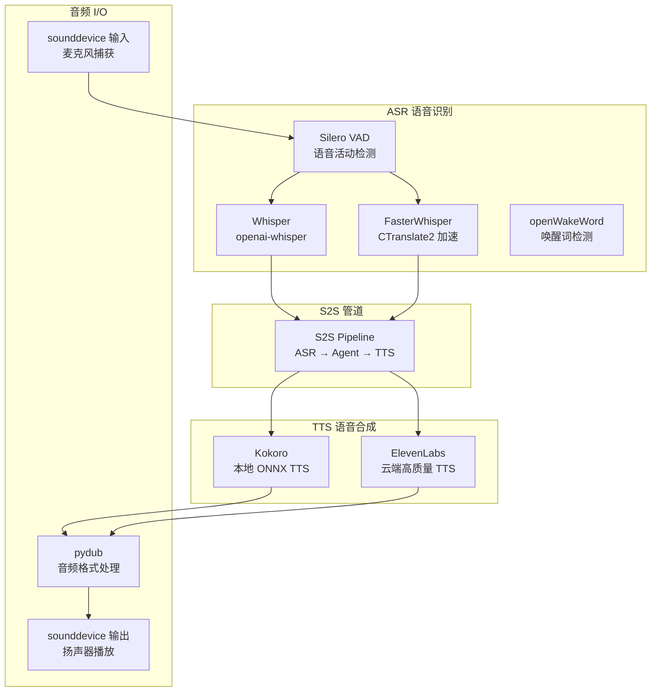
```mermaid
graph TB
    subgraph ASR["ASR 语音识别"]
        Whisper["Whisper<br/>openai-whisper"]
        FasterWhisper["FasterWhisper<br/>CTranslate2 加速"]
        VADSilero["Silero VAD<br/>语音活动检测"]
        WakeWord["openWakeWord<br/>唤醒词检测"]
    end

    subgraph TTS["TTS 语音合成"]
        ElevenLabs["ElevenLabs<br/>云端高质量 TTS"]
        Kokoro["Kokoro<br/>本地 ONNX TTS"]
    end

    subgraph AudioIO["音频 I/O"]
        SoundIn["sounddevice 输入<br/>麦克风捕获"]
        SoundOut["sounddevice 输出<br/>扬声器播放"]
        PyDub["pydub<br/>音频格式处理"]
    end

    subgraph Pipeline["S2S 管道"]
        S2S["S2S Pipeline<br/>ASR → Agent → TTS"]
    end

    SoundIn --> VADSilero
    VADSilero --> Whisper
    VADSilero --> FasterWhisper
    Whisper --> S2S
    FasterWhisper --> S2S
    S2S --> Kokoro
    S2S --> ElevenLabs
    Kokoro --> PyDub
    ElevenLabs --> PyDub
    PyDub --> SoundOut
```

**配置项**（`config.toml`）：

| 配置项 | 说明 |
|--------|------|
| `asr.recording_device_name` | 录音设备 |
| `asr.transcription_model` | 转录模型 (`LocalWhisper`) |
| `asr.vad_model` | VAD 模型 (`SileroVAD`) |
| `asr.use_wake_word` | 是否启用唤醒词 |
| `tts.vendor` | TTS 供应商 (`ElevenLabs`) |
| `tts.speaker_device_name` | 扬声器设备 |

### 4.2 自我认知 (WhoAmI)

`rai_whoami` 模块使机器人能够从文档、URDF 和图像中提取自身能力信息：

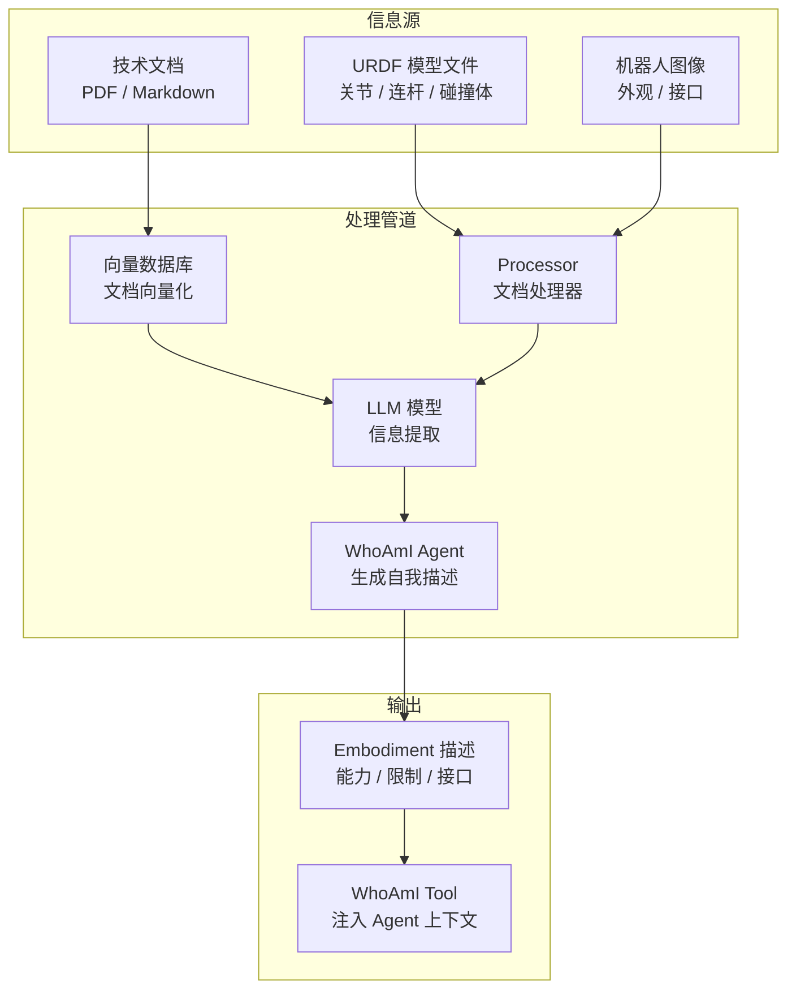
```mermaid
graph TB
    subgraph Sources["信息源"]
        Docs["技术文档<br/>PDF / Markdown"]
        URDF["URDF 模型文件<br/>关节 / 连杆 / 碰撞体"]
        Images["机器人图像<br/>外观 / 接口"]
    end

    subgraph Pipeline["处理管道"]
        VectorDB["向量数据库<br/>文档向量化"]
        Processor["Processor<br/>文档处理器"]
        Model["LLM 模型<br/>信息提取"]
        AgentWhoAmI["WhoAmI Agent<br/>生成自我描述"]
    end

    subgraph Output["输出"]
        Embodiment["Embodiment 描述<br/>能力 / 限制 / 接口"]
        ToolWhoAmI["WhoAmI Tool<br/>注入 Agent 上下文"]
    end

    Docs --> VectorDB
    URDF --> Processor
    Images --> Processor
    VectorDB --> Model
    Processor --> Model
    Model --> AgentWhoAmI
    AgentWhoAmI --> Embodiment
    Embodiment --> ToolWhoAmI
```

### 4.3 视觉感知 (Perception)

`rai_perception` 提供基于开放集模型的物体检测能力：

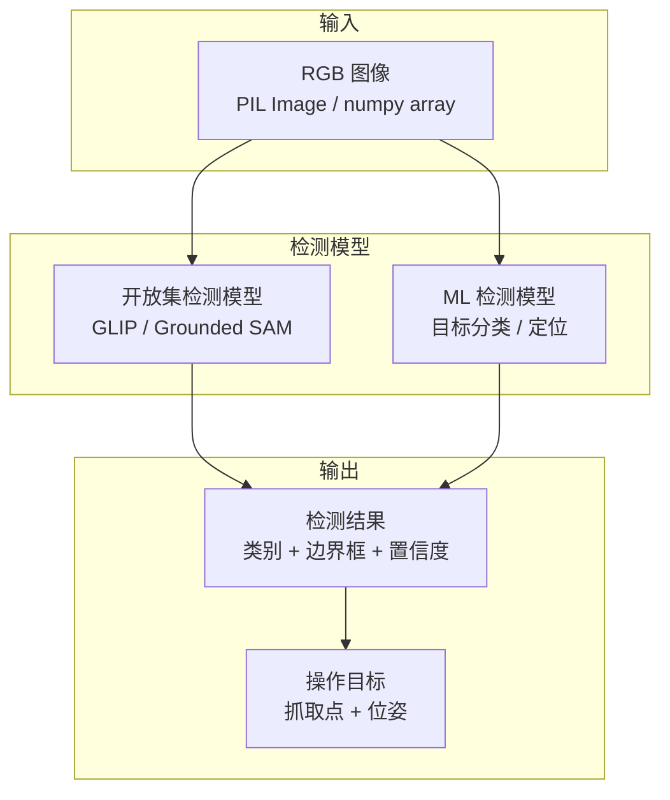
```mermaid
graph TB
    subgraph Input["输入"]
        ImageInput["RGB 图像<br/>PIL Image / numpy array"]
    end

    subgraph Models["检测模型"]
        OpenSet["开放集检测模型<br/>GLIP / Grounded SAM"]
        MLModels["ML 检测模型<br/>目标分类 / 定位"]
    end

    subgraph Output["输出"]
        Detections["检测结果<br/>类别 + 边界框 + 置信度"]
        ManipTarget["操作目标<br/>抓取点 + 位姿"]
    end

    ImageInput --> OpenSet
    ImageInput --> MLModels
    OpenSet --> Detections
    MLModels --> Detections
    Detections --> ManipTarget
```

### 4.4 导航集成 (NoMaD)

`rai_nomad` 集成 NoMaD (No Man Ahead) 导航系统：

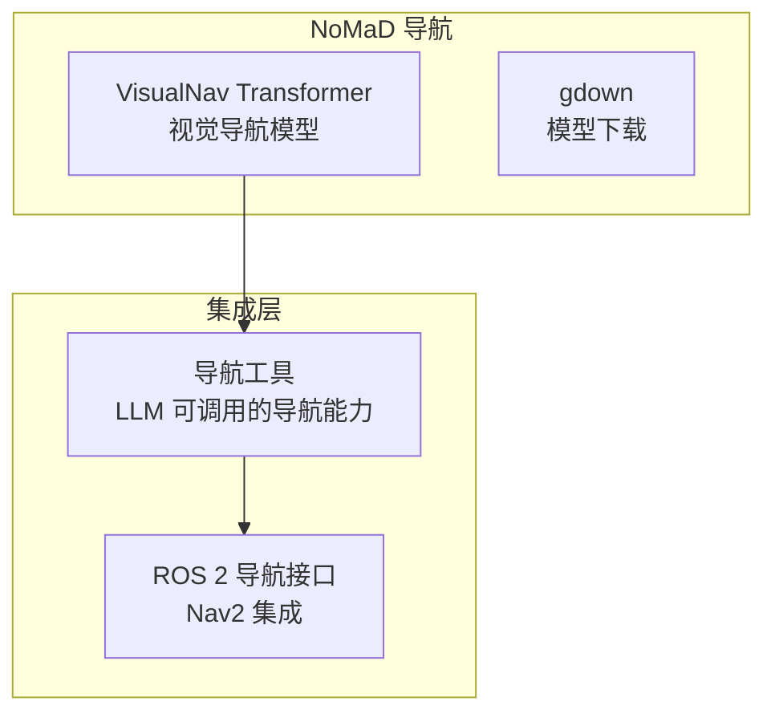
```mermaid
graph TB
    subgraph NoMaD["NoMaD 导航"]
        VisualNav["VisualNav Transformer<br/>视觉导航模型"]
        GDown["gdown<br/>模型下载"]
    end

    subgraph Integration["集成层"]
        NavTool["导航工具<br/>LLM 可调用的导航能力"]
        ROS2Nav["ROS 2 导航接口<br/>Nav2 集成"]
    end

    VisualNav --> NavTool
    NavTool --> ROS2Nav
```

### 4.5 模拟器与基准测试

| 模块 | 功能 |
|------|------|
| `rai_sim` | 模拟器连接器，支持将 Agent 部署到仿真环境 |
| `rai_bench` | 基准测试套件，评估 Agent、模型、工具的性能 |

### 4.6 模型微调 (Finetune)

`rai_finetune`（alpha 阶段，仅 Python 3.10）提供基于 Unsloth 的高效微调能力：

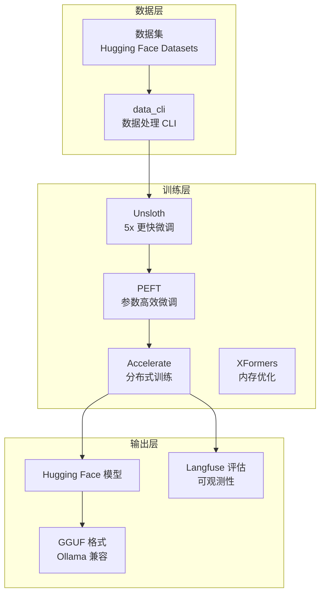
```mermaid
graph TB
    subgraph Data["数据层"]
        Dataset["数据集<br/>Hugging Face Datasets"]
        DataCLI["data_cli<br/>数据处理 CLI"]
    end

    subgraph Training["训练层"]
        Unsloth["Unsloth<br/>5x 更快微调"]
        PEFT["PEFT<br/>参数高效微调"]
        Accelerate["Accelerate<br/>分布式训练"]
        XFormers["XFormers<br/>内存优化"]
    end

    subgraph Output["输出层"]
        HFModel["Hugging Face 模型"]
        GGUF["GGUF 格式<br/>Ollama 兼容"]
        LangfuseEval["Langfuse 评估<br/>可观测性"]
    end

    Dataset --> DataCLI
    DataCLI --> Unsloth
    Unsloth --> PEFT
    PEFT --> Accelerate
    Accelerate --> HFModel
    HFModel --> GGUF
    Accelerate --> LangfuseEval
```

---

## 5. 配置系统

配置集中管理在 `config.toml`，支持多供应商和多模型：

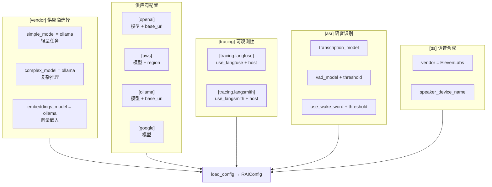
```mermaid
graph TB
    subgraph VendorSection["[vendor] 供应商选择"]
        Simple["simple_model = ollama<br/>轻量任务"]
        Complex["complex_model = ollama<br/>复杂推理"]
        Embed["embeddings_model = ollama<br/>向量嵌入"]
    end

    subgraph VendorConfigs["供应商配置"]
        OpenAICfg["[openai]<br/>模型 + base_url"]
        AWSCfg["[aws]<br/>模型 + region"]
        OllamaCfg["[ollama]<br/>模型 + base_url"]
        GoogleCfg["[google]<br/>模型"]
    end

    subgraph TracingCfg["[tracing] 可观测性"]
        LangfuseCfg["[tracing.langfuse]<br/>use_langfuse + host"]
        LangSmithCfg["[tracing.langsmith]<br/>use_langsmith + host"]
    end

    subgraph ASCfg["[asr] 语音识别"]
        ASRModel["transcription_model"]
        VADCfg["vad_model + threshold"]
        WakeCfg["use_wake_word + threshold"]
    end

    subgraph TTSCfg["[tts] 语音合成"]
        TTSVendor["vendor = ElevenLabs"]
        TTSDevice["speaker_device_name"]
    end

    VendorSection --> LoadConfig["load_config → RAIConfig"]
    VendorConfigs --> LoadConfig
    TracingCfg --> LoadConfig
    ASCfg --> LoadConfig
    TTSCfg --> LoadConfig
```

---

## 6. 部署与运行

### 部署架构

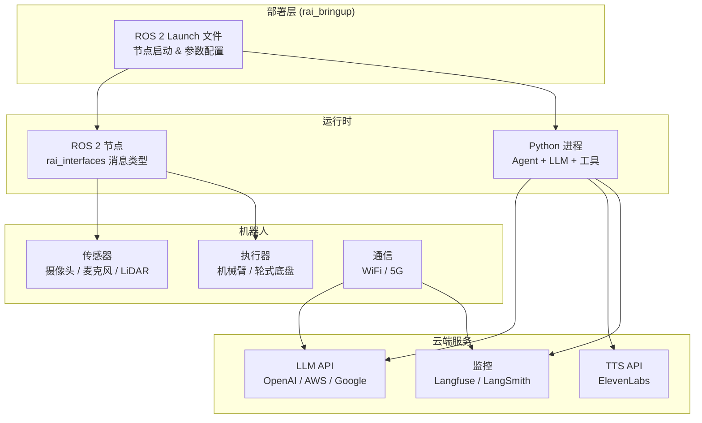
```mermaid
graph TB
    subgraph Deploy["部署层 (rai_bringup)"]
        LaunchFiles["ROS 2 Launch 文件<br/>节点启动 & 参数配置"]
    end

    subgraph Runtime["运行时"]
        ROS2Node["ROS 2 节点<br/>rai_interfaces 消息类型"]
        PythonProc["Python 进程<br/>Agent + LLM + 工具"]
    end

    subgraph Robot["机器人"]
        Sensors["传感器<br/>摄像头 / 麦克风 / LiDAR"]
        Actuators["执行器<br/>机械臂 / 轮式底盘"]
        Comms["通信<br/>WiFi / 5G"]
    end

    subgraph Cloud["云端服务"]
        LLMCloud["LLM API<br/>OpenAI / AWS / Google"]
        TTSCloud["TTS API<br/>ElevenLabs"]
        Monitor["监控<br/>Langfuse / LangSmith"]
    end

    LaunchFiles --> ROS2Node
    LaunchFiles --> PythonProc
    ROS2Node --> Sensors
    ROS2Node --> Actuators
    PythonProc --> LLMCloud
    PythonProc --> TTSCloud
    PythonProc --> Monitor
    Comms --> LLMCloud
    Comms --> Monitor
```

### 示例应用

| 场景 | 平台 | 说明 |
|------|------|------|
| 果园导航推理 | 自动驾驶拖拉机 | 障碍物检测 + 路径规划 |
| 语言驱动操作 | Franka Panda 机械臂 | Grounded SAM 2 + 灵活抓取 |
| 移动机器人 | ROSbot XL | 导航 + 人机交互 |
| 移动操作 | RB-KAIROS | 机载执行 |

### 关键数据流

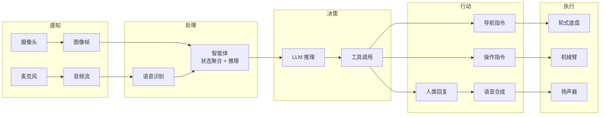
```mermaid
flowchart LR
    subgraph Perception["感知"]
        Cam["摄像头"] --> Img["图像帧"]
        Mic["麦克风"] --> Audio["音频流"]
    end

    subgraph Processing["处理"]
        Img --> Agent["智能体<br/>状态聚合 + 推理"]
        Audio --> ASR["语音识别"]
        ASR --> Agent
    end

    subgraph Decision["决策"]
        Agent --> LLM["LLM 推理"]
        LLM --> ToolUse["工具调用"]
    end

    subgraph Action["行动"]
        ToolUse --> Nav["导航指令"]
        ToolUse --> Manip["操作指令"]
        ToolUse --> Reply["人类回复"]
        Reply --> TTS["语音合成"]
    end

    subgraph Execution["执行"]
        Nav --> Wheels["轮式底盘"]
        Manip --> Arm["机械臂"]
        TTS --> Speaker["扬声器"]
    end
```
