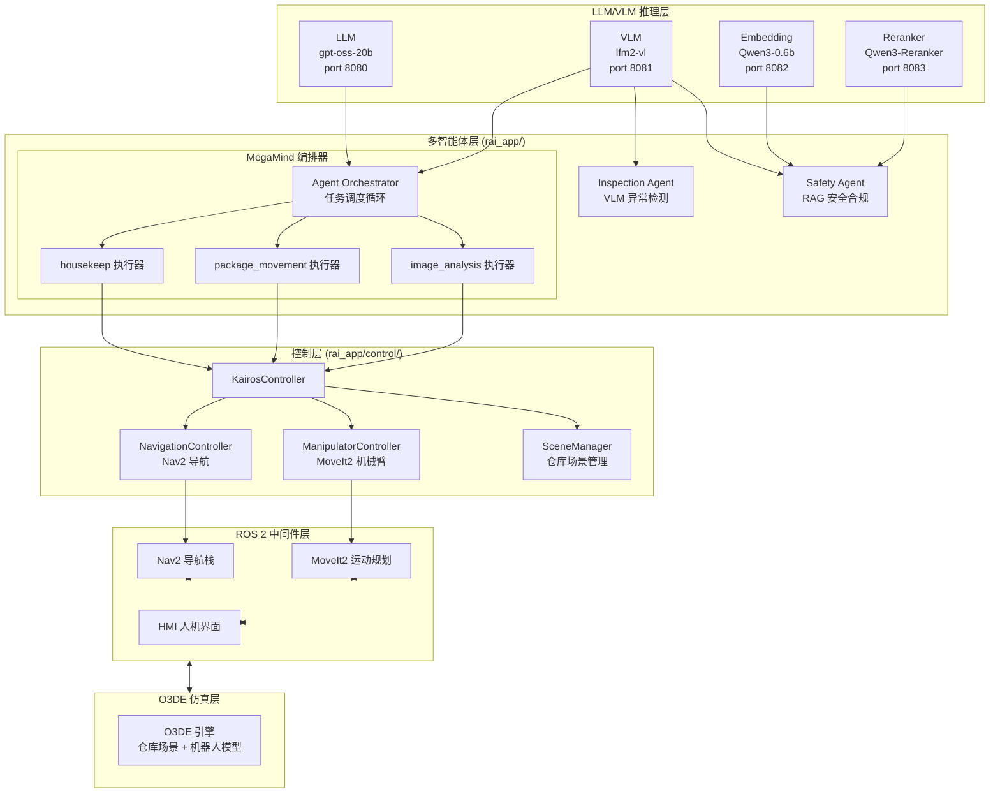
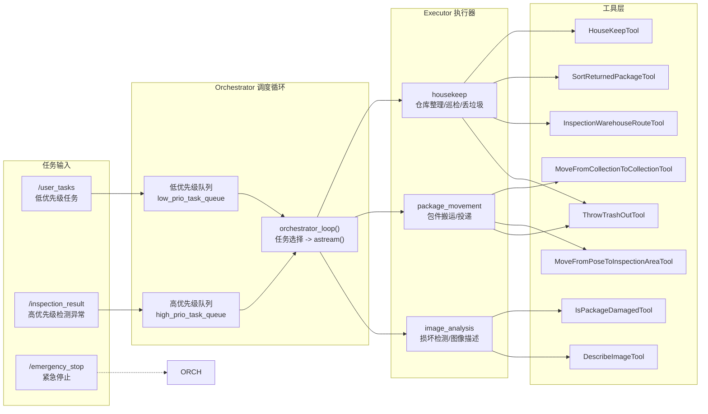
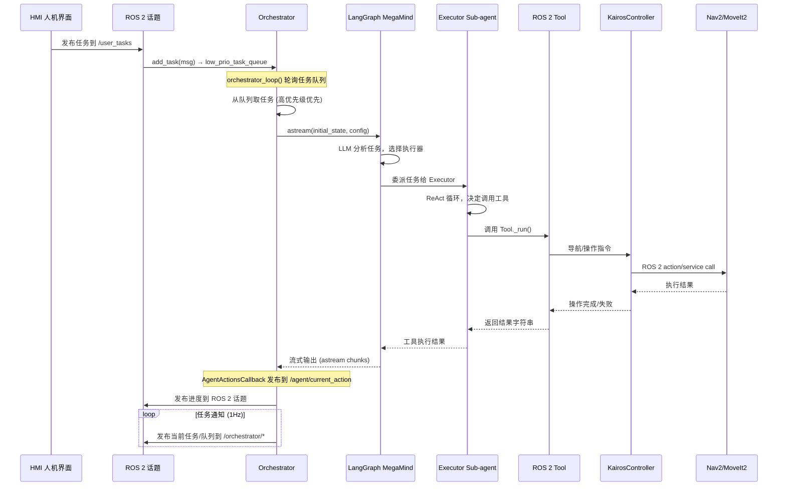
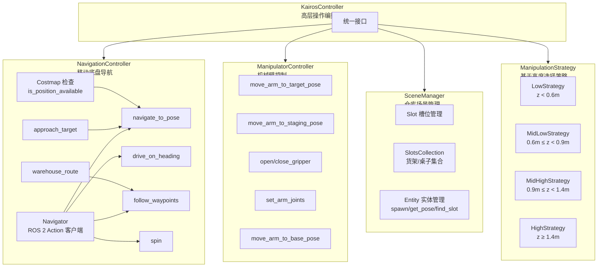
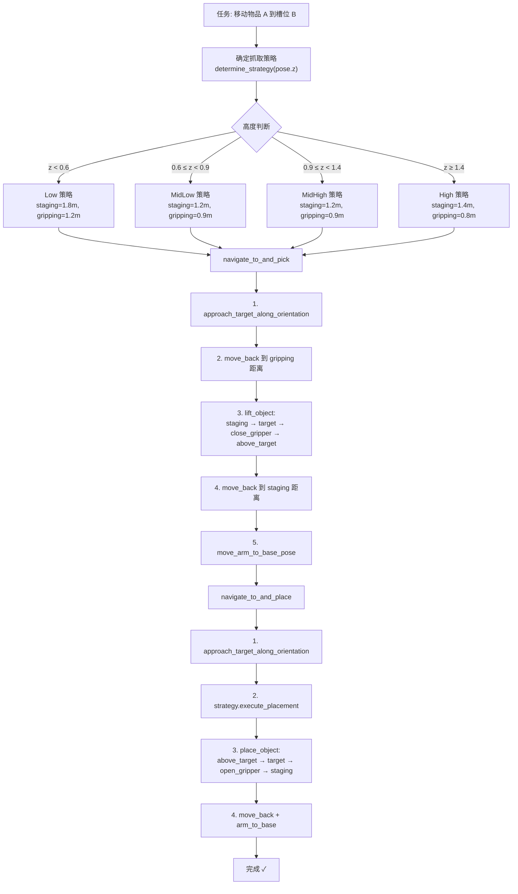
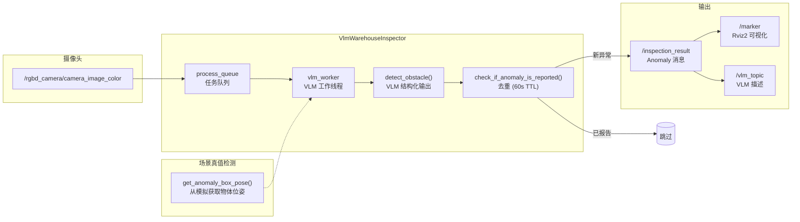
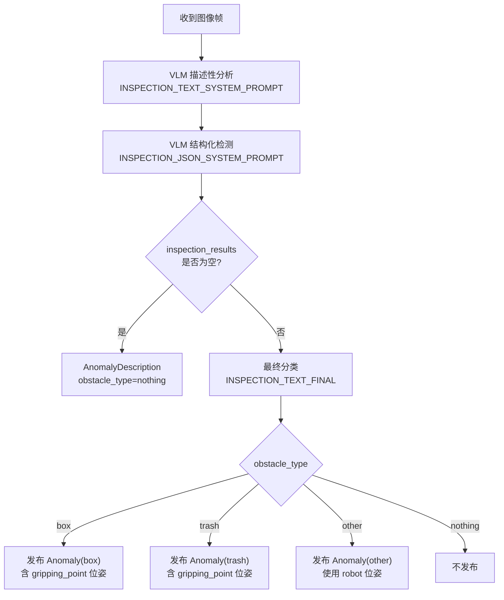
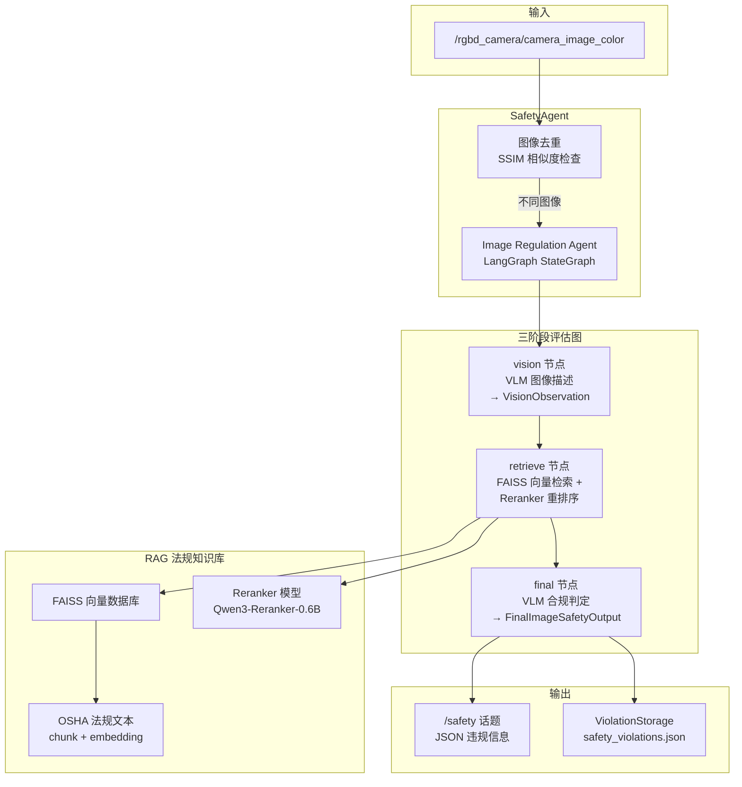
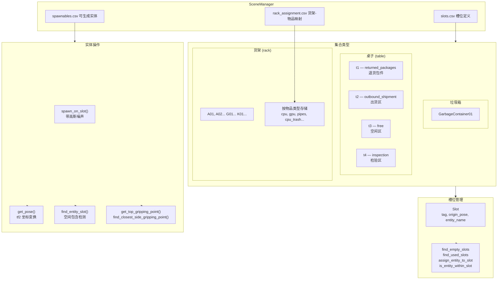
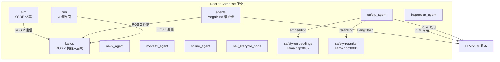

# Mobile Manipulator — 智能仓库机器人架构说明

## 1. 项目概述

这是一个基于 **Robotnik Kairos** 移动操作机器人的仓库自动化演示系统。
系统在 O3DE 模拟环境中运行，通过多智能体系统（LangGraph + LangChain）调度 LLM/VLM 进行感知、规划和任务执行，所有推理均在本地 AMD Ryzen AI 硬件上完成。

**核心技术栈：** ROS 2 (Jazzy) + O3DE + RAI Framework + Python 3.12 + uv + Docker Compose

---

## 2. 系统分层架构

---

## 3. MegaMind 多智能体编排

### 3.1 任务执行流程

---

## 4. 控制层架构

### 4.1 物品搬运核心流程

---

## 5. 巡检智能体 (Inspection Agent)

### 5.1 VLM 检测流程

---

## 6. 安全合规智能体 (Safety Agent)

---

## 7. 仓库场景管理

---

## 8. Docker Compose 服务编排

---

## 9. 关键配置文件

| 文件 | 用途 |
|------|------|
| `config.toml` | 本地模型配置 (llama.cpp 服务端口 8080-8083) |
| `cloud_config.toml` | 云端模型配置 (Docker Compose 默认使用) |
| `scripts/resources/slots.csv` | 仓库槽位布局 (坐标 + 四元数) |
| `scripts/resources/spawnables.csv` | 可生成实体及其 URI 映射 |
| `scripts/resources/rack_assignment.csv` | 货架与物品类型的对应关系 |
| `scripts/resources/warehouse_route.csv` | 巡检路径 waypoints |
| `docker/compose.yaml` | Docker Compose 多服务编排 |

---

## 10. ROS 2 关键话题与服务

### 10.1 话题

| 话题 | 消息类型 | 说明 |
|------|---------|------|
| `/user_tasks` | `std_msgs/msg/String` | 用户任务输入 |
| `/inspection_result` | `robotec_kairos_ur10/msg/Anomaly` | 巡检异常输出 |
| `/emergency_stop` | `std_msgs/msg/String` | 紧急停止信号 |
| `/agent/current_action` | `rai_interfaces/msg/HRIMessage` | 智能体当前动作 |
| `/orchestrator/current_task` | `std_msgs/msg/String` | 当前执行任务 |
| `/orchestrator/tasks_queue` | `std_msgs/msg/String` | 任务队列状态 |
| `/orchestrator/heartbeat` | `std_msgs/msg/Header` | 心跳信号 |
| `/safety` | `std_msgs/msg/String` | 安全违规 JSON |
| `/vlm_topic` | `demo_msgs/msg/VlmDescription` | VLM 描述输出 |

### 10.2 Action

| Action | 类型 | 说明 |
|--------|------|------|
| `/rai/nav2/navigate_to_pose` | `NavigateToPose` | 导航到目标位姿 |
| `/rai/nav2/drive_on_heading` | `DriveOnHeading` | 沿当前航向行驶 |
| `/rai/nav2/follow_waypoints` | `FollowWaypoints` | 跟随路点序列 |
| `/rai/nav2/spin` | `Spin` | 原地旋转 |

### 10.3 Service

| Service | 类型 | 说明 |
|---------|------|------|
| `/rai/moveit2/move_arm` | `MoveArm` | 机械臂位姿控制 |
| `/rai/moveit2/set_arm_joints` | `SetArmJoints` | 设置关节角度 |
| `/spawn_entity` | `SpawnEntity` | 生成仿真实体 |
| `/get_entity_state` | `GetEntityState` | 获取实体状态 |
| `/global_costmap/get_costmap` | `GetCostmap` | 获取全局代价地图 |
