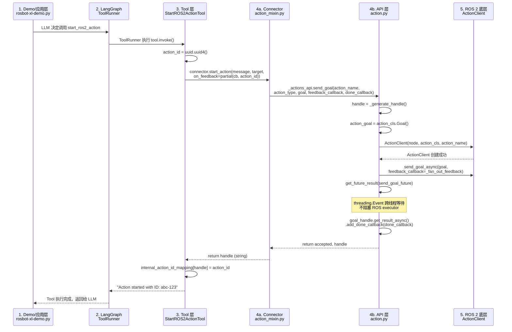
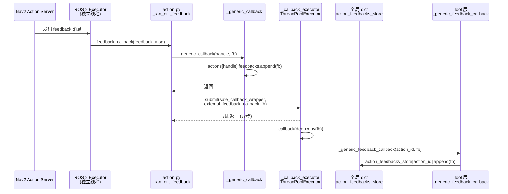
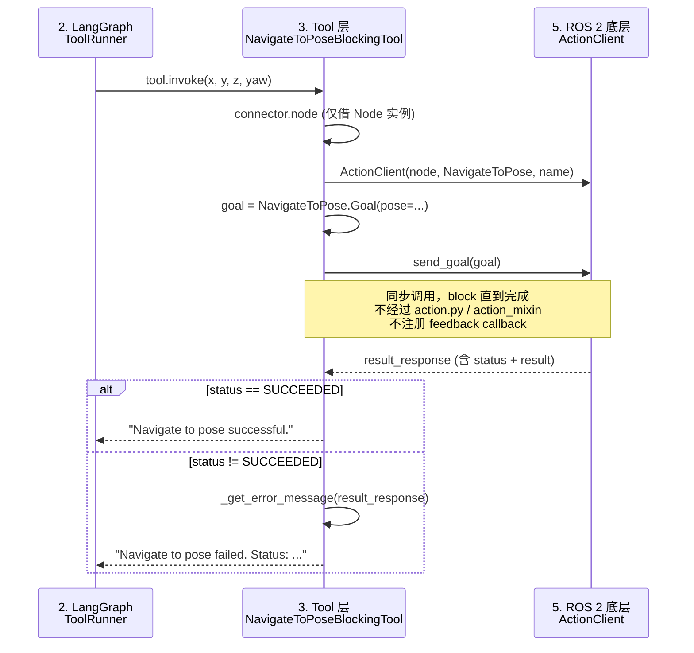
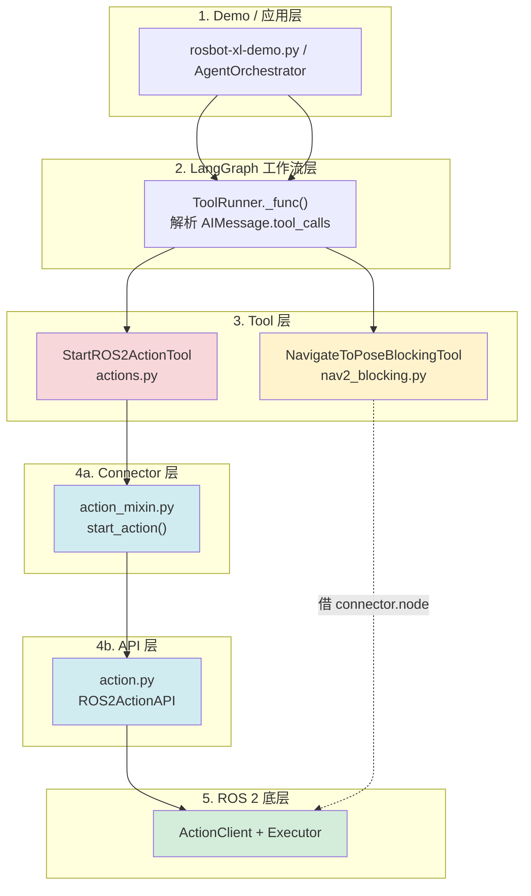

# 关键点

## RAI Agent 分层架构与范式总览

### 两层分离设计：`core/`（工作流）与外层（运行时）

RAI 的 `langchain/` 目录采用**双层架构**，将 LangGraph 工作流定义与机器人运行时分隔：

```
langchain/
├── agent.py                  ← 运行时层（LangChainAgent — 基类）
├── react_agent.py            ← 运行时层（ReActAgent）
├── state_based_agent.py      ← 运行时层（BaseStateBasedAgent）
│
└── core/
    ├── react_agent.py        ← 工作流层（create_react_runnable）
    ├── state_based_agent.py  ← 工作流层（create_state_based_runnable）
    ├── plan_agent.py         ← 工作流层（create_plan_execute_agent）
    ├── megamind.py           ← 工作流层（create_megamind）
    ├── structured_output_agent.py
    ├── conversational_agent.py
    └── tool_runner.py
```

**`core/` = 纯 LangGraph 工作流**（输出 `CompiledStateGraph`）

这些 `create_*` 函数只做一件事：构建 LangGraph state graph。它们**不关心**机器人运行时——没有线程管理、没有消息队列、没有 HRI connector。任何人可以直接 `invoke()` 调用，无需 ROS 2 环境。

**外层（`./`）= 机器人运行时封装**

`LangChainAgent` 提供了运行时需要的一切：线程循环（`_run_loop`）、消息缓冲（`_received_messages`）、中断机制（`_interrupt_event`）、HRI connector 通信、`run()`/`stop()` 生命周期。外层的 `ReActAgent` 和 `BaseStateBasedAgent` 就是把 `core/` 的 runnable 包进去：

```python
class ReActAgent(LangChainAgent):
    def __init__(...):
        runnable = create_react_runnable(llm, tools, prompt)  # ← 从 core/ 来
        super().__init__(runnable=runnable, ...)              # ← 交给运行时
```

**设计意图**：workflows 可以独立开发测试，运行时只负责"带上了路"——加上线程、消息、和 ROS 2 的连接。

### 继承链

```
BaseAgent (抽象基类, 定义 run/stop 接口)
  └── LangChainAgent          ← 通用心跳循环 + 消息队列 + HRI 桥接
        ├── ReActAgent        ← 注入 create_react_runnable
        └── BaseStateBasedAgent ← 注入 create_state_based_runnable + 聚合循环
              └── ROS2StateBasedAgent ← ROS 2 Node 生命周期
```

### 五种 Agent 范式对比

| 范式 | 所在文件 | 核心思路 | 有运行时封装？ |
|------|---------|---------|-------------|
| **ReActAgent** | `core/react_agent.py` + `react_agent.py` | LLM 自主"思考→调用工具→观察结果→再思考"循环 | 是 |
| **StateBasedAgent** | `core/state_based_agent.py` + `state_based_agent.py` | 定时聚合 ROS 2 传感器数据为 state，注入 LLM 上下文后推理 | 是 |
| **PlanAgent** | `core/plan_agent.py` | 规划→执行→重规划三阶段，三颗独立 LLM（planner/executor/replanner）分解多步任务 | 否 |
| **MegamindAgent** | `core/megamind.py` | "大脑" LLM 通过 handoff tool 把子任务委派给多个 Executor 子代理，每步有结构化评估 | 否 |
| **StructuredOutputAgent** | `core/structured_output_agent.py` | 单轮推理，输出通过 Pydantic schema 结构化，不调用工具 | 否 |

> 已废弃的 `ConversationalAgent`（`core/conversational_agent.py`）是最早的 ReAct 手工实现，3.0 版本将被移除。

### 为什么 PlanAgent 和 Megamind 没有运行时封装？

它们停留在"引擎已就绪，车身没装"的阶段——可以直接 `invoke()` 或 `stream()` 调用，但缺少：
- 继承 `LangChainAgent` 获得 `run()`/`stop()` 线程生命周期
- 连接 HRI connector 做 ROS 2 消息收发
- 集成到 `AgentRunner` 的多代理信号安全系统中

`MegamindAgent` 在实际应用中（如 agentic-mobile-manipulator）是通过自定义的 `AgentOrchestrator` 直接 `astream()` 调用的，绕过了标准的 `LangChainAgent` 运行时。

## ros2 action

RAI 提供**两套模式**处理 ROS 2 action 的连续性（goal → feedback stream → result）。

### 调用链路：从顶层入口到 `action.py`

#### 模式 1：异步模式 — 5 层调用链



#### 模式 1 Feedback 到达时的异步分发



#### 模式 2：阻塞模式 — 3 层调用链（跳过 Connector 和 API）



#### 调用层栈总览



> 模式 1 走 5 层（Demo → LangGraph → Tool → Connector → API → ROS 2），模式 2 只走 3 层（Demo → LangGraph → Tool → ROS 2），**跳过 Connector 和 API 两层**。模式 2 的 `connector.node` 仅用于获取 `Node` 实例创建 `ActionClient`，不经过 connector 的任何 action 逻辑。

### 模式 1：异步 fire-and-forget + LLM 主动轮询（通用模式）

这是 `ROS2ActionToolkit`（`actions.py`）的实现，核心思路：**feedback 异步收集 → LLM 主动查询**。

**发送 goal（`action.py:193-248`）：**

1. `send_goal_async()` 立即返回 Future，不阻塞
2. 存储 handle → 把 `goal_future`、`result_future`、`client_goal_handle`、`feedbacks[]` 存在 `self.actions[handle]` dict 里
3. 注册 callback → feedback 回调自动收集到 `feedbacks[]` list；done 回调在 action 完成时触发
4. 返回 handle string

`_callback_executor`（`action.py:76`，`max_workers=10`）把每个 feedback **deepcopy** 后异步 fan-out 到两个存储。这样做是因为 ROS 2 executor 在独立线程运行（`base.py:162`），不能阻塞回调。

**跨线程等待：`get_future_result()` 替代 `spin_until_future_complete`**

```python
def get_future_result(future, timeout_sec=5.0):
    event = threading.Event()
    future.add_done_callback(lambda f: (result := f.result(), event.set()))
    event.wait(timeout=timeout_sec)
    return result
```

`rclpy.spin_until_future_complete` 会 block 整个 executor 线程，所以 RAI 用 `threading.Event` 实现跨线程等待（`ros_async.py:25-43`）。

**LLM 轮询流程 — 5 个 Tool：**

| Tool | 作用 |
|------|------|
| `StartROS2ActionTool` | 发 goal，返回 action ID |
| `GetROS2ActionFeedbackTool` | 轮询 feedback（**取出并清空**，增量读取不重复） |
| `GetROS2ActionResultTool` | 取结果（检查 `result_future.done()`） |
| `CancelROS2ActionTool` | 取消正在进行的 action |
| `GetROS2ActionIDsTool` | 列出所有已启动的 action ID |

**数据存在模块级全局 dict**（`actions.py:29-33`）：

```python
internal_action_id_mapping: Dict[str, str] = {}  # external_id → internal_handle
action_results_store: Dict[str, Any] = {}        # handle → result
action_feedbacks_store: Dict[str, List[Any]] = defaultdict(list)  # handle → [feedbacks]
```

LLM 的典型交互：

```
第 1 轮: start_ros2_action("navigate_to_pose", ...)
         → "Action started with ID: abc-123"

第 2 轮: get_ros2_action_feedback("abc-123")
         → "[Feedback1, Feedback2]"  ← 取出并清空 buffer

第 3 轮: get_ros2_action_feedback("abc-123")
         → "[Feedback3, Feedback4]"  ← 新的 feedback

第 4 轮: get_ros2_action_result("abc-123")
         → "success"

第 5 轮: "到达目标了！"
```

**优势**：LLM 在 tool call 之间可穿插推理、可并发管理多个 action。
**劣势**：LLM 需主动轮询，增加 token 消耗和推理轮数。

### 模式 2：阻塞等待（导航专用）

`NavigateToPoseBlockingTool`（`nav2_blocking.py:90-155`）简单粗暴：

```python
result_response = action_client.send_goal(goal)  # 同步调用，block 直到完成
```

- **不注册 feedback callback** — 导航过程中的 feedback **全部丢弃**
- Tool 的 `_run()` 阻塞，LangGraph 整个停在这一节点
- 导航完成后返回 "Navigate to pose successful/failed"
- LLM 拿到结果后才进入下一步推理

`rosbot-xl-demo.py` 使用的就是这个模式。因为它的任务是串行的（导航→拍摄→分析），不需要监控导航进度。

### 两种模式对比

| 特性 | 异步轮询模式 | 阻塞模式 (demo 用) |
|------|-------------|-------------------|
| **feedback** | 收集到全局 dict，LLM 主动查询 | **丢弃** |
| **LLM 控制权** | 每次 tool call 后可推理、可决策 | 导航期间 LLM **完全等待** |
| **并发** | 可发多个 action，分别轮询 | 一次只能导航一个目标 |
| **复杂性** | 5 个 Tool | 1 个 Tool |
| **调用层数** | 5 层 (Demo → LangGraph → Tool → Connector → API → ROS) | 3 层 (Demo → LangGraph → Tool → ROS) |
| **适用场景** | 需要监控进度、中途取消 | "导航到→再做事"的串行任务 |

## MegaMind 多智能体编排（agentic-mobile-manipulator 应用）

### 整体架构：两层 LangGraph 状态图

```
 AgentOrchestrator (应用层调度)
  ┌─────────────────────────────────────┐
  │  MegaMind LangGraph (框架层编排)      │
  │   START → megamind(规划LLM) ──handoff──► executor(ReAct子图)
  │            ▲                     │
  │            └──────── analyzer ◄──┘
  └─────────────────────────────────────┘
         │ stream (ROS2)          │ ROS2 动作
         ▼                        ▼
       HMI                   机器人执行
```

### 框架层：`create_megamind()`（`megamind.py:296`）

构建一个 LangGraph `StateGraph`，核心状态为 `MegamindState`：

| 字段 | 作用 |
|------|------|
| `original_task` | 用户原始指令 |
| `step` | 当前委派的一步任务 |
| `steps_done` | 已完成步骤列表（含 success + explanation） |
| `step_messages` | 当前 step 的消息历史（handoff 时清空，不跨 step 累积） |

**工作流：**
1. **`plan_step` 节点** — MegaMind LLM 收到 `original_task` + 已完成的 `steps_done`，决定下一步，通过 `handoff tool`（`Command.goto`）将任务委派给 executor 子图
2. **Executor 子图** — `create_react_structured_agent()` 构建的独立 ReAct Agent，执行 `LLM → tools → LLM` 循环
3. **`analyzer_node`** — executor 完成后，LLM 以结构化输出 (`StepSuccess`) 判断 `success: bool` + `explanation: str`，追加到 `steps_done`
4. **回到 megamind** — 带上 `steps_done` 历史，继续规划下一步或结束

关键设计：**每次只委派一步给一个 specialist**，不是一次性下发完整计划。每步都有评估和反馈，支持多步任务的容错和自适应。

### 应用层：三个 Executor 子智能体

`agent_orchestrator.py:552-580` 中定义了三个 executor：

| Executor | 工具 | 职责 |
|----------|------|------|
| **housekeep** | `do_housekeeping`, `sort_returned_package`, `route_around_warehouse`, `throw_out_trash` | 货架整理、退回包裹分拣、巡检、扔垃圾 |
| **package_movement** | `move_object_between_collections`, `move_object_from_pose_to_inspection_area`, `throw_out_trash` | 包裹搬运、移到检验区、发货准备 |
| **image_analysis** | `is_package_damaged_tool`, `describe_image` | VLM 图像分析、包裹损坏检测 |

每个 executor 是独立的 `Executor(name, llm, tools, system_prompt)`，有自己的 LLM（可配不同模型）、System Prompt（`prompts.py` 定义角色边界）、Tool 集合。

### Tool 层：AI → ROS 2 动作桥接

所有 Tool 继承自 `BaseROS2Tool`（`tools.py`），典型流程：

```
LLM 调用 move_object_between_collections(origin="K01", target="t5", item_type="cpu")
  → check_the_target_collection("t5")    # 查询 SceneManager 找空位
  → check_the_origin_collection("K01")   # 找到含 cpu 的包裹
  → kairos_controller.move_object_to_slot()
    → nav_ctrl.approach_target()         # Nav2 导航（阻塞模式）
    → mani_ctrl.grasp_and_place()        # MoveIt2 操作
  → refresh_data()                       # 更新场景状态
```

Tool 内部会过滤机械臂不可达的 slot、处理 rack 两侧接近角度等物理约束。

### 应用层任务调度：`AgentOrchestrator`

在 MegaMind 之上又加了一层调度（`agent_orchestrator.py:157`）：

- **双优先级队列**：`low_prio_task_queue`（`/user_tasks`）和 `high_prio_task_queue`（`/inspection_result` 异常检测）
- **`orchestrator_loop()`**：轮询队列 → `async for chunk in self.agent.astream(...)` 流式执行
- **紧急停止**：监听 `/emergency_stop`，cancel 当前任务

### 反馈与可观测性

`callbacks.py` 中的回调将 MegaMind 内部状态暴露到 ROS 2：

| 回调 | ROS 2 Topic | 作用 |
|------|-------------|------|
| `AgentActionsCallback` | `/agent/current_action` | 流式转发 LLM reasoning、tool 调用到 HMI |
| `AgentProgressCallback` | `/agent/past_steps` | 已完成的步骤历史 |
| `OrchestratorTasksNotifier` | `/orchestrator/current_task`, `/tasks_queue`, `/heartbeat` | 队列状态、心跳 |

### 与 RAI 框架的关系

- RAI 提供 `create_megamind()`、`Executor`、`ContextProvider`、`BaseROS2Tool` 等**通用原语**
- Demo 在此之上叠加了**行业场景**（仓库布局、货架、包裹、OSHA 合规）、**具体机器人适配**（Kairos 控制器）、**任务队列调度**、**完整部署**（Docker Compose）


## `new_message_behavior`：多轮对话的消息处理策略

`LangChainAgent` 构造函数中的 `new_message_behavior` 参数（`agent.py:36-42`）控制**当用户在新消息到达时 Agent 还在处理上一条消息，该如何应对**。

```python
newMessageBehaviorType = Literal[
    "take_all",
    "keep_last",
    "queue",
    "interrupt_take_all",
    "interrupt_keep_last",  # 默认值
]
```

### 五种模式

不中断当前运行的模式（等 Agent 处理完再响应新消息）：

| 模式 | 行为 |
|------|------|
| `take_all` | 把消息队列中**所有**待处理消息拼接成一条，一起送给 LLM |
| `keep_last` | **只保留最新一条**，之前的全部丢弃 |
| `queue` | **每次只取队列第一条**，其余留在队列中等下一轮再处理 |

中断当前运行的模式（立即打断 LLM，优先处理新消息）：

| 模式 | 行为 |
|------|------|
| `interrupt_take_all` | 中断 LLM → 把所有待处理消息拼接后处理 |
| `interrupt_keep_last` | 中断 LLM → 只处理最新一条（**默认值**） |

### 实现机制

1. **消息入队** — 新消息到达时（`__call__`，`agent.py:147`）append 到 `_received_messages` deque，若含 `"interrupt"` 则提交 `_interrupt_agent_and_run()` 协程
2. **中断信号** — 设置 `_interrupt_event`，在 `agent.stream()` 的迭代循环中 `break` 退出（`agent.py:205-206`）
3. **消息缩减** — `_apply_reduction_behavior()`（`agent.py:228-245`）根据 `take_all` / `keep_last` / `queue` 字符串匹配从 deque 中取消息
4. **消息合并** — `_reduce_messages()`（`agent.py:247-264`）将取出的多条 `HRIMessage` 拼接为一条（文字 `\n` 连接，图片/音频合并）

### 典型场景

- **`interrupt_keep_last`（默认）** — 用户说"别说了，换个话题" → 立刻打断当前回复，只处理最新指令
- **`take_all`** — 用户连续发了多条追问 → 等 Agent 空闲后一次性全部处理
- **`queue`** — 每条消息按序排队，不丢失任何输入，但响应有延迟

### 与上下文累积的关系

`max_size=100` 的 deque 仅限制**待处理用户输入队列**，不影响已进入 LLM 上下文（`state["messages"]`）的消息历史。也就是说，`new_message_behavior` 只决定"哪些用户输入会进入 Agent"，不决定"哪些历史消息会被送给 LLM"。后者目前是只增不减的，详见下方[运行时对话历史压缩机制缺失](#rai-上下文工程待完善项)一节。


## `ToolRunner`：ReAct 循环中的工具执行节点

`ToolRunner`（`tool_runner.py:33`）继承自 LangGraph 的 `RunnableCallable`，是 ReAct Agent 的 LangGraph 状态图中负责**执行 LLM 工具调用**的节点。

### 在 ReAct 图中的位置

```
ReAct LangGraph:
  START → llm_node(AIMessage with tool_calls)
         → ToolRunner(_func: 执行工具, 返回 ToolMessage)
         → tools_condition(还有 tool_call 吗？)
         ──yes─→ ToolRunner (继续调用)
         ──no──→ END (返回最终回答)
```

### 执行流程（`_func` 方法）

1. **解析请求** — 从状态 `input["messages"]` 取出最后一条 `AIMessage`，读取其 `tool_calls` 字段（每个调用包含 `name`、`args`、`id`）
2. **分发执行** — 通过 `get_executor_for_config` 获取执行器，按 `max_concurrency=1` 逐个调用 `run_one()` 执行工具
3. **错误处理** — 捕获 `ValidationError`（Pydantic 参数校验失败）和通用 `Exception`，包装为 `ToolMessage(status="error")` 返回给 LLM，让 LLM 自行决定重试或放弃
4. **更新状态** — 将工具执行结果追加到 `input["messages"]`，返回更新后的状态供下一节点使用

### 多模态工具输出支持

`ToolRunner` 支持工具返回图片和音频（`tool_runner.py:116-136`）：

- 当工具的 `output.artifact` 包含 `images` 或 `audios` 时，创建 `ToolMultimodalMessage` 包装
- 由于 OpenAI 的 `ToolMessage` 不支持图片，通过 `postprocess()` 拆分为 `ToolMessage` + `HumanMessage` 组合
- 按消息类型排序，确保消息序列格式正确（交替的 tool/human 模式）

### 子类：`SubAgentToolRunner`

`SubAgentToolRunner`（`tool_runner.py:160-170`）覆写了 `get_messages` 和 `update_input_with_outputs`：
- 从 `step_messages` 字段取消息而非 `messages`（适配 MegaMind 子 Agent 的状态结构）
- 结果同时更新到 `messages` 和 `step_messages` 两个字段，确保父子图状态同步

### 与 `LangChainAgent` 的关系

`ToolRunner` 是 **图内组件**，不直接接触外部消息；而 `LangChainAgent` 是 **图外运行时**，负责从 `HRIConnector` 接收用户输入、管理执行线程、控制中断。两者的关系：

```
LangChainAgent（运行时外壳）
  ├── 接收用户消息 → 缩减 → 追加到 state["messages"]
  ├── 调用 self.agent.stream(state)  ←── 这就是编译后的 LangGraph 图
  │     ├── llm_node
  │     ├── ToolRunner（在图内部执行工具）
  │     └── tools_condition
  └── 通过 HRICallbackHandler 将流式输出推送到 ROS 2 / HMI
```


## LangGraph 图构建：`add_edge` 与 `add_conditional_edges`

`create_react_runnable()`（`react_agent.py:88-133`）中构建 ReAct 图的核心区别：

| 方法 | 含义 | 签名示例 |
|------|------|----------|
| `add_edge` | **固定路由**：A 执行完一定跳到 B | `graph.add_edge("tools", "llm")` |
| `add_conditional_edges` | **动态路由**：A 执行完后根据条件函数返回值决定跳到哪 | `graph.add_conditional_edges("llm", tools_condition)` |

### ReAct 图的完整结构

```
START → llm
        │
        ├──→ tools_condition() 判断 LLM 输出是否包含 tool_calls
        │       │
        │       ├── 有 tool_calls → "tools" 节点（执行工具）
        │       └── 无 tool_calls → "__end__"（结束，返回最终回答）
        │
tools ──→ llm  （固定边，工具执行完一定回到 LLM 做下一轮推理）
```

### 逐行解释

- **`graph.add_node("tools", tool_runner)`** — 注册名为 `"tools"` 的节点
- **`graph.add_conditional_edges("llm", tools_condition)`** — LLM 节点执行完后，`tools_condition`（LangGraph 预置函数）检查最后一条 `AIMessage` 是否有 `tool_calls`：有则返回 `"tools"`，无则返回 `"__end__"`
- **`graph.add_edge("tools", "llm")`** — 工具执行完**无条件**回到 LLM，让 LLM 根据工具结果做下一轮推理
- **`llm.bind_tools(tools)`** — 将工具 schema 绑定到 LLM，使 LLM 知道可用工具及其参数格式
- **`graph.add_node("llm", partial(llm_node, bound_llm, system_prompt))`** — 注册 LLM 节点，`partial` 固化 `bound_llm` 和 `system_prompt` 参数

### 为什么 LLM 用条件边、tools 用固定边？

- **LLM 是决策点** — LLM 可能返回"我要调用工具"，也可能返回"我有最终答案了"，需要条件判断路由
- **工具是执行点** — 工具执行完只有一件事可做：把结果交给 LLM 分析，所以是固定边

这就是 ReAct（Reason → Act → Reason → Act...）循环的核心：**条件边控制"要不要 Act"，固定边保证"Act 完回到 Reason"**。


## `HRICallbackHandler`：LLM 流式输出到 HMI 的桥接

`HRICallbackHandler`（`callback.py:27`）继承自 LangChain 的 `BaseCallbackHandler`，是 **LLM 流式产出到 HMI（人机界面）之间的桥接层**。当 LangGraph 图的 `agent.stream()` 执行时，LLM 逐个 token 产出内容，该 Handler 捕获这些 token 并通过 `HRIConnector` 实时推送到 ROS 2 topic / Web 前端，让用户看到 Agent 的"实时打字"效果。

### 关键回调方法

| 回调 | 触发时机 | 行为 |
|------|----------|------|
| `on_llm_start` | LLM 开始生成 | 设置 `working = True`，标记 Agent 正在工作 |
| `on_llm_new_token` | 每产出新 token | 通过 `_send_all_targets` 发送到所有 target connector |
| `on_llm_end` | LLM 生成完成 | 发送剩余 buffer，标记 `working = False` |

### 两种发送模式

- **实时模式**（`aggregate_chunks=False`） — 每个 token 到达立即发送，最低延迟但网络开销大
- **聚合模式**（`aggregate_chunks=True`，默认） — 把 token 攒到 buffer 中，满足以下任一条件才发送：
  - 遇到分割字符（`\n`、`.`、`!`、`?`）— 按语义断点发送，体验更自然
  - buffer 达到 `max_buffer_size=200` — 防止攒太多导致延迟过高

### 非流式退化保护

如果 LLM 未配置 streaming（`on_llm_new_token` 从未被调用），`on_llm_end` 会检测到 `hit_on_llm_new_token == False`，记录错误日志后把完整回复作为单条消息一次性发送（`callback.py:114-124`）。这保证了即使 LLM 不支持流式，系统也不会崩溃。

### 在整体架构中的位置

```
LangGraph agent.stream(state, config={callbacks: [HRICallbackHandler, ...]})
  │
  ├── LLM 产出 token ──→ on_llm_new_token("我")
  │                        │
  │                        ▼
  │                   HRICallbackHandler
  │                        │
  │                        ▼
  │                   HRIConnector.build_message()
  │                        │
  │                        ▼
  │                   ROS2Connector.send_message("/to_human", msg)
  │                        │
  └────────────────────────┴──────────────────────────┐
                                                       ▼
                                                ROS 2 /to_human topic
                                                       │
                                                       ▼
                                                HMI 前端显示
```

### 与 `ToolRunner` 和 `LangChainAgent` 的关系

三者构成 RAI Agent 的完整数据链路：

```
用户输入 → LangChainAgent（接收、缩减、注入状态）
           ↓
     agent.stream() 启动 LangGraph 图
           ↓
     llm_node → ToolRunner → llm_node（循环推理+执行）
           ↓
     LLM 产出 token
           ↓
     HRICallbackHandler.on_llm_new_token() → HRIConnector → ROS 2 → HMI 显示
```

- `LangChainAgent` — 图外运行时，负责消息生命周期管理
- `ToolRunner` — 图内执行节点，负责工具调用
- `HRICallbackHandler` — 图外回调监听器，负责流式输出分发


# RAI 上下文工程待完善项

## 运行时对话历史压缩机制缺失

### 现状

当前 RAI 的上下文管理策略是 **消息列表只增不减**：

- `LangChainAgent._run_agent()`（`agent.py:198`）每轮 `append` 消息到 `state["messages"]`，永不裁剪
- `max_size=100` 的 deque 仅限制 **待处理用户输入队列**，不影响已进入 LLM 上下文的消息历史
- `CompressorPostProcessor` 仅在构建期压缩 EmbodimentInfo 的 system prompt，与运行时无关
- MegamindAgent 的 `steps_done` 列表记录每步摘要，但 `step_messages` 在 handoff 时清空，不跨 step 累积

### 导致的后果

| 问题 | 严重程度 | 说明 |
|------|----------|------|
| Context window 溢出 | 致命 | 长对话超出模型最大 token 数，直接报错 |
| Token 成本持续增长 | 中等 | 每轮都发送完整历史，费用线性增长 |
| "Lost in the middle" | 中等 | 关键信息被大量中间对话稀释 |

### 建议方案

| 方案 | 简述 | 实现复杂度 | 适用场景 |
|------|------|-----------|----------|
| **滑动窗口** | 保留最近 N 条消息 | 低 | 短中程任务，对历史依赖少 |
| **LLM 摘要压缩** | 定期把旧对话摘要为一段 summary 注入 system prompt | 中 | 长对话，需要保留关键决策 |
| **向量检索（RAG）** | 历史消息 chunk 化存向量库，检索相关片段注入 | 高 | 超长对话，需要精准召回 |
| **LangChain 内置裁剪** | `remove_messages` / `trim_messages` 按 token 数裁剪 | 低-中 | 通用方案 |

### 建议的切入点

1. 在 `ReActAgent` 的 `llm_node` 中增加可选的 `MessageOrchestrator`（LangChain 提供的消息管理接口），在调用 LLM 前对消息列表做 token 感知裁剪
2. 在 `StateBasedAgent` 的 `retriever_wrapper` 后、LLM 调用前插入压缩步骤
3. 在 `LangChainAgent._run_agent` 中增加 `max_context_tokens` 配置项，支持运行时裁剪

