# ROS MCP Server 详细架构分析

## 1. 项目概述

ROS MCP Server 是一个基于 Model Context Protocol (MCP) 的 Python 服务，通过 rosbridge WebSocket 桥接 LLM（Claude、GPT、Gemini 等）与 ROS 系统，提供 **31 个工具**、**6 个资源** 和 **7 个 Prompt**，覆盖 Topic、Service、Action、Parameter、Node 连接、机器人配置、图像分析七大类能力。

**技术栈**: Python 3.10+ | FastMCP | websocket-client | OpenCV | PIL | jsonschema
**运行模式**: stdio（默认）/ HTTP / Streamable-HTTP
**许可**: Apache 2.0

---

## 2. 目录结构

```
ros-mcp-server/
├── ros_mcp/                    # 主包
│   ├── main.py                 # MCP 实例 + CLI 入口
│   ├── tools/                  # 31 个工具
│   │   ├── __init__.py         # register_all_tools() 聚合
│   │   ├── topics.py           # 6 个 (get_topics, get_topic_type, get_topic_details, get_message_details, subscribe_once, subscribe_for_duration, publish_for_durations, publish_once)
│   │   ├── services.py         # 4 个 (get_services, get_service_type, get_service_details, call_service)
│   │   ├── actions.py          # 5 个 (get_actions, get_action_details, get_action_status, send_action_goal, cancel_action_goal)
│   │   ├── parameters.py       # 6 个 (get_parameter, set_parameter, has_parameter, delete_parameter, get_parameters, get_parameter_details)
│   │   ├── connection.py       # 2 个 (connect_to_robot, ping_robots)
│   │   ├── robot_config.py     # 3 个 (get_robots_list, get_robot_spec, get_ros_version)
│   │   ├── nodes.py            # 3 个 (get_nodes, get_node_details, get_node_types)
│   │   └── images.py           # 1 个 (analyze_image) + 辅助函数
│   ├── resources/              # 6 个资源
│   │   ├── __init__.py         # register_all_resources() 聚合
│   │   ├── ros_metadata.py     # 5 个 URI 资源
│   │   └── robot_specs.py      # 1 个 URI 资源
│   ├── prompts/                # 7 个 Prompt
│   │   ├── __init__.py         # register_all_prompts() 聚合
│   │   └── test_*_tools.py     # 各工具类别的测试 Prompt
│   └── utils/                  # 工具模块
│       ├── websocket.py         # WebSocketManager + 图像解析
│       ├── response.py          # 统一响应处理辅助函数
│       ├── rosapi_types.py      # rosapi 类型检测/缓存
│       ├── network_utils.py    # 网络连通性检测
│       └── config_utils.py     # YAML 配置解析
├── server.py                   # 薄封装入口
├── robot_specifications/       # 机器人 YAML 规范文件
├── config/                     # MCP 配置文件
├── tests/                      # 测试
├── pyproject.toml              # 项目配置 (ruff/pytest/setuptools)
└── docs/                       # 文档
```

---

## 3. 启动流程

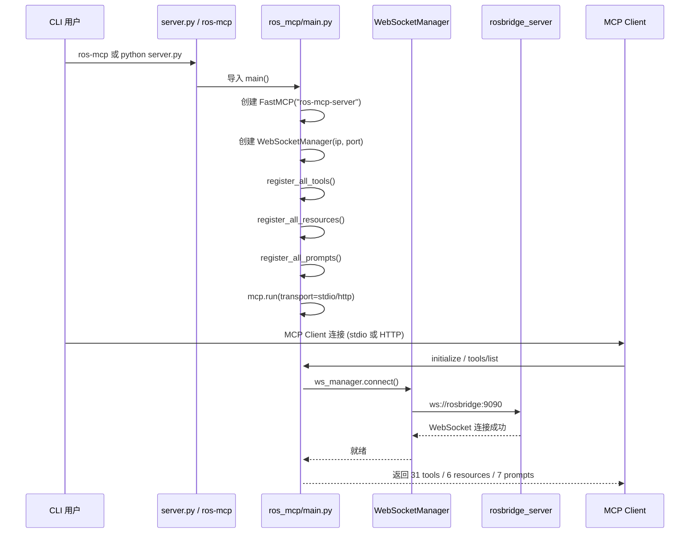

---

## 4. 核心架构

### 4.1 MCP Server 初始化 (main.py)

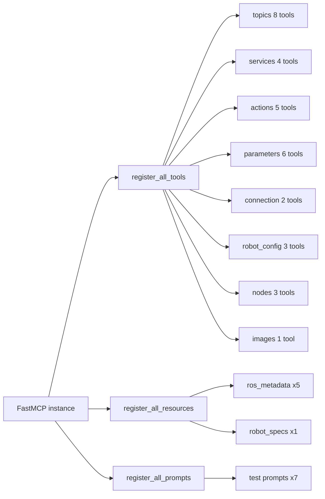

所有组件在进程启动时一次性注册，运行时无动态扩展。

### 4.2 WebSocketManager 核心通信

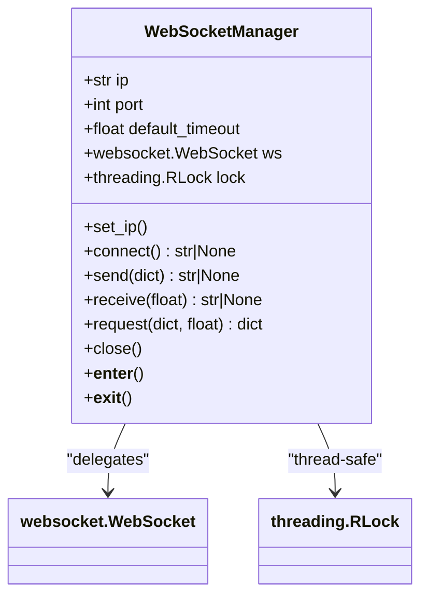

关键设计：
- **单例模式**: 全局唯一 WebSocketManager 实例，所有工具共享
- **线程安全**: `threading.RLock` 保护所有 I/O 操作
- **自动连接**: `send()` / `receive()` 内部自动调用 `connect()`
- **上下文管理**: `with ws_manager:` 确保连接关闭

### 4.3 请求-响应协议

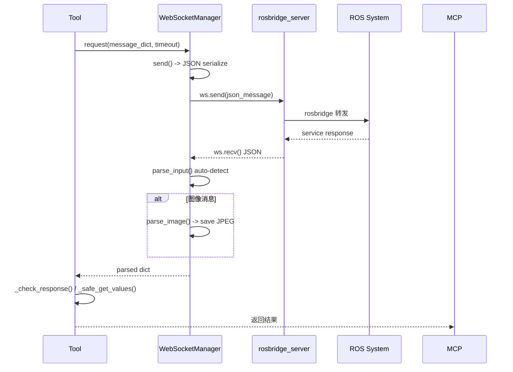

---

## 5. 工具详细分析

### 5.1 工具分类

| 类别 | 文件 | 工具数 | 只读 | ROS2 专属 |
|------|------|--------|------|-----------|
| Topics | topics.py | 8 | 部分 | 否 |
| Services | services.py | 4 | 部分 | 否 |
| Actions | actions.py | 5 | 部分 | 是 |
| Parameters | parameters.py | 6 | 部分 | 是 |
| Nodes | nodes.py | 3 | 是 | 否 |
| Connection | connection.py | 2 | 是 | 否 |
| Robot Config | robot_config.py | 3 | 是 | 否 |
| Images | images.py | 1 | 是 | 否 |

### 5.2 各工具详情

#### Topics (8 tools)

| 工具 | 功能 | 关键操作 |
|------|------|----------|
| `get_topics()` | 列出所有 Topic | `/rosapi/topics` |
| `get_topic_type(topic)` | 获取 Topic 类型 | `/rosapi/topic_type` |
| `get_topic_details(topic)` | Topic 详情(含 pub/sub) | `/rosapi/topic_type` + `publishers` + `subscribers` |
| `get_message_details(type)` | 消息类型结构定义 | `/rosapi/message_details` |
| `subscribe_once(topic, msg_type)` | 单次订阅并返回第一条消息 | `op:subscribe` + 循环 recv |
| `subscribe_for_duration(topic, msg_type, duration)` | 定时订阅收集多条消息 | `op:subscribe` + `op:unsubscribe` |
| `publish_for_durations(topic, msg_type, msgs, durations, rate_hz)` | 发布消息序列(支持流式) | `op:advertise` → `op:publish` x N → `op:unadvertise` |
| `publish_once(topic, msg_type, msg)` | 单次发布 | `op:advertise` → `op:publish` → `op:unadvertise` |

#### Services (4 tools)

| 工具 | 功能 | 关键操作 |
|------|------|----------|
| `get_services()` | 列出所有 Service | `/rosapi/services` |
| `get_service_type(service)` | 获取 Service 类型 | `/rosapi/service_type` |
| `get_service_details(service)` | Service 详情(请求/响应结构 + provider) | `/rosapi/service_type` + `service_request_details` + `service_response_details` + `service_node` |
| `call_service(service_name, service_type, request)` | 调用 Service | `op:call_service` |

#### Actions (5 tools, ROS 2 only)

| 工具 | 功能 | 关键操作 |
|------|------|----------|
| `get_actions()` | 列出所有 Action | `/rosapi/action_servers` |
| `get_action_details(action)` | Action 详情(goal/result/feedback) | `/rosapi/action_goal_details` + `action_result_details` + `action_feedback_details` |
| `get_action_status(action_name)` | 获取 Action 状态 | 订阅 `/_action/status` |
| `send_action_goal(action, type, goal)` | 发送 Action Goal(异步) | `op:send_action_goal` + 轮询 `action_result/feedback` |
| `cancel_action_goal(action, goal_id)` | 取消 Action Goal | `op:cancel_action_goal` |

#### Parameters (6 tools, ROS 2 only)

| 工具 | 功能 | 关键操作 |
|------|------|----------|
| `get_parameter(name)` | 获取参数值 | `/rosapi/get_param` |
| `set_parameter(name, value)` | 设置参数值 | `/rosapi/set_param` |
| `has_parameter(name)` | 检查参数是否存在 | `/rosapi/get_param` (安全替代) |
| `delete_parameter(name)` | 删除参数 | `/rosapi/delete_param` |
| `get_parameters(node_name)` | 获取节点所有参数 | `{node}/list_parameters` |
| `get_parameter_details(name)` | 参数完整详情(含类型/描述) | `get_param` + `describe_parameters` |

#### Connection (2 tools)

| 工具 | 功能 | 关键操作 |
|------|------|----------|
| `connect_to_robot(ip, port)` | 连接并测试连通性 | ping + port check + `detect_rosapi_types()` |
| `ping_robots(targets)` | 批量 ping(并行) | `ThreadPoolExecutor` 并发 ping |

#### Robot Config (3 tools)

| 工具 | 功能 | 关键操作 |
|------|------|----------|
| `get_robots_list()` | 获取可用机器人列表 | 扫描 `robot_specifications/*.yaml` |
| `get_robot_spec(robot_name)` | 获取机器人规范 | 读取 YAML 配置 |
| `get_ros_version()` | 获取 ROS 版本 | `/rosapi/get_ros_version` (ROS2) 或 `/rosapi/get_param /rosdistro` (ROS1) |

#### Nodes (3 tools)

| 工具 | 功能 | 关键操作 |
|------|------|----------|
| `get_nodes()` | 列出所有 Node | `/rosapi/nodes` |
| `get_node_details(node)` | Node 详情(pub/sub/services) | `/rosapi/node_details` |
| `get_node_types()` | 列出 Node 类型 | `/rosapi/node_types` |

#### Images (1 tool)

| 工具 | 功能 | 关键操作 |
|------|------|----------|
| `analyze_image(path)` | 图像分析 | 读取本地图像文件 → MCP ImageContent |

---

## 6. 资源分析

### 6.1 ROS Metadata 资源

| URI | 返回值 | 背后调用 |
|-----|--------|----------|
| `ros-mcp://ros-metadata/all` | topics/services/nodes/parameters/ROS版本汇总 | 4 次 service call + ros版本探测 |
| `ros-mcp://ros-metadata/topics/all` | 每个 topic 的 type/publishers/subscribers | `/rosapi/topics` + 每个 topic 的 publishers/subscribers |
| `ros-mcp://ros-metadata/services/all` | 每个 service 的 type/providers | `/rosapi/services` + 每个 service 的 type/node |
| `ros-mcp://ros-metadata/nodes/all` | 每个 node 的 pub/sub/services | `/rosapi/nodes` + 每个 node 的 details |
| `ros-mcp://ros-metadata/actions/all` | 每个 action 的 type/status | `/rosapi/action_servers` + interfaces |

### 6.2 Robot Specs 资源

| URI | 功能 |
|-----|------|
| `ros-mcp://robot-specs/get_verified_robots_list` | 扫描 `robot_specifications/*.yaml` 列表 |

### 6.3 资源访问时序图

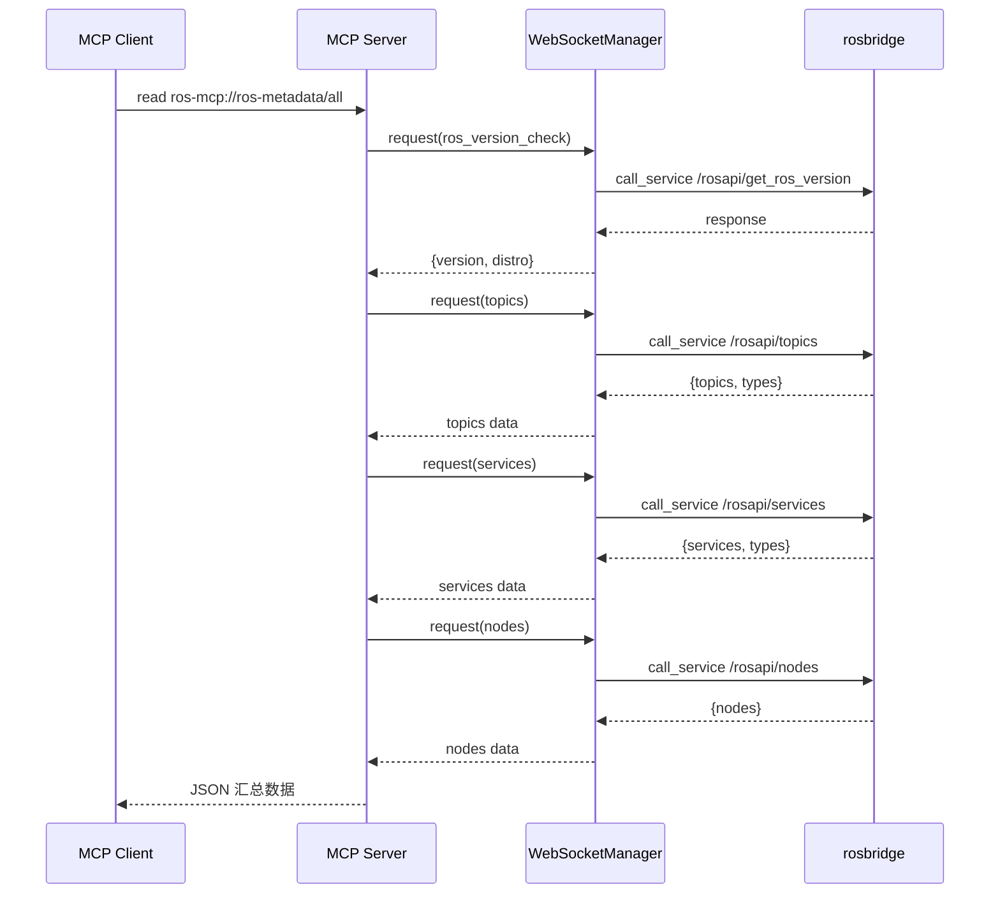

---

## 7. 数据流详解

### 7.1 主题订阅-发布流

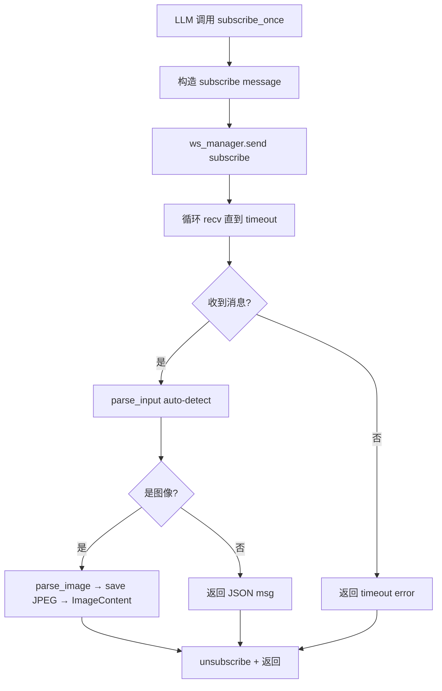

### 7.2 Publish 流程 (advertise → publish → unadvertise)

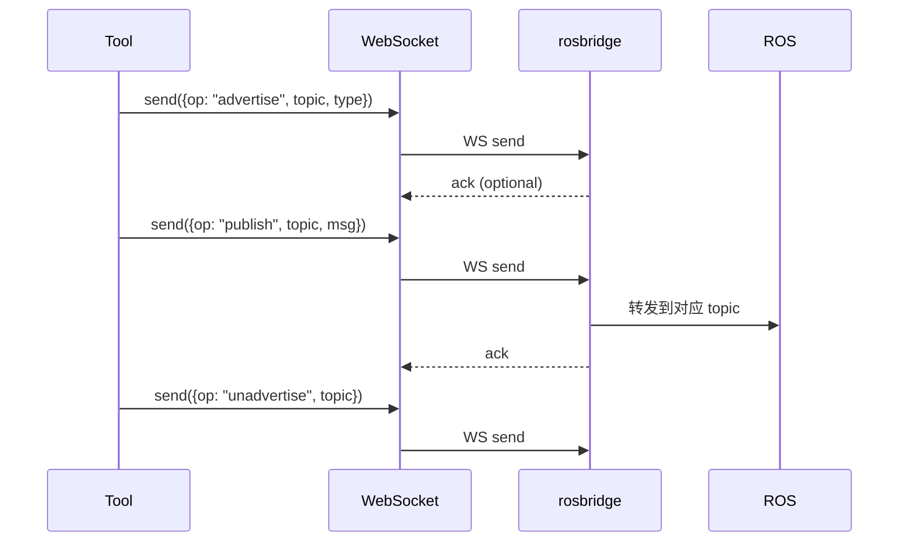

### 7.3 Action Goal 异步流程

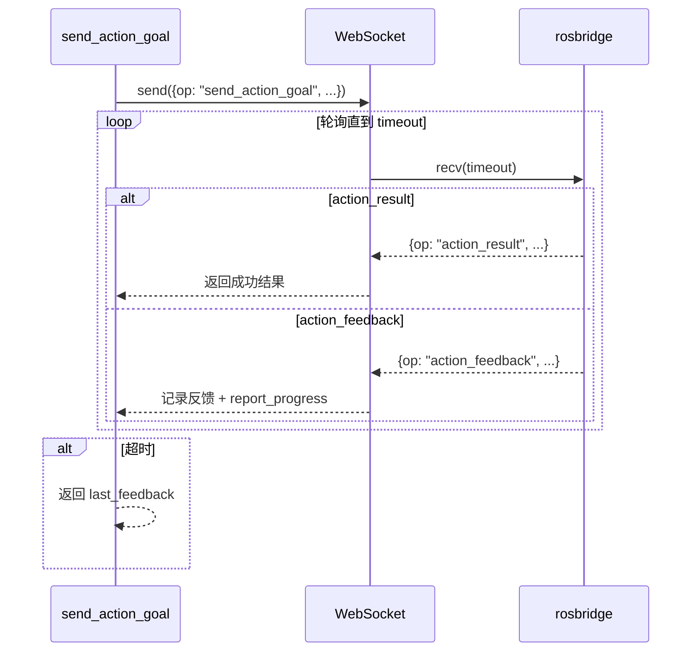

---

## 8. 关键设计模式

### 8.1 工具注册模式

```
ros_mcp/tools/__init__.py
    ┌─────────────────────────────────────────┐
    │  register_all_tools(mcp, ws_manager)    │
    │     ├─ register_action_tools()          │
    │     ├─ register_connection_tools()      │
    │     ├─ register_robot_config_tools()    │
    │     ├─ register_image_tools()           │
    │     ├─ register_node_tools()            │
    │     ├─ register_parameter_tools()       │
    │     ├─ register_service_tools()         │
    │     └─ register_topic_tools()           │
    └─────────────────────────────────────────┘

每个 register_*_tools() 内部:
    @mcp.tool(description=..., annotations=ToolAnnotations(...))
    def tool_name(params) -> dict:
        with ws_manager:
            response = ws_manager.request(message)
        error = _check_response(response)
        if error: return error
        values = _safe_get_values(response)
        return {"result": values}
```

### 8.2 响应处理统一模式

```
ws_manager.request() 返回
    ├─ {"values": {...}}    → 成功 → _safe_get_values() 提取
    ├─ {"error": "..."}     → 连接/WS 错误
    ├─ {"result": false}    → 服务调用失败 → _extract_error()
    └─ {"op": "status", "level": "error"} → rosbridge 状态错误
```

### 8.3 图像数据处理

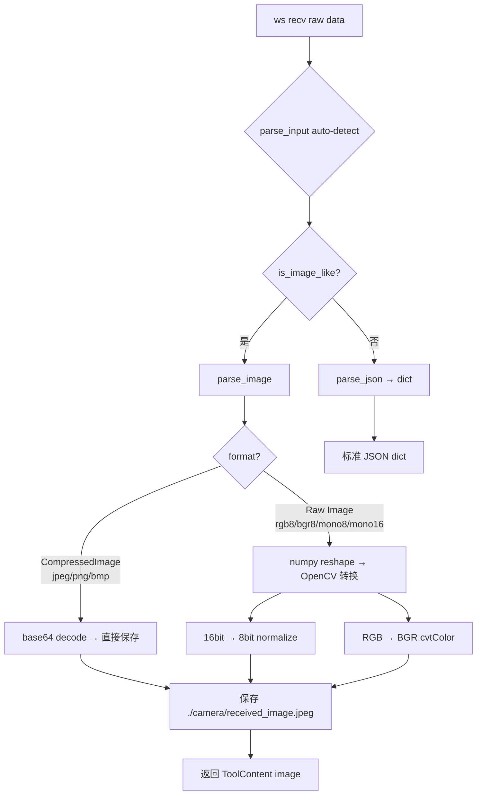

---

## 9. 工具依赖关系图

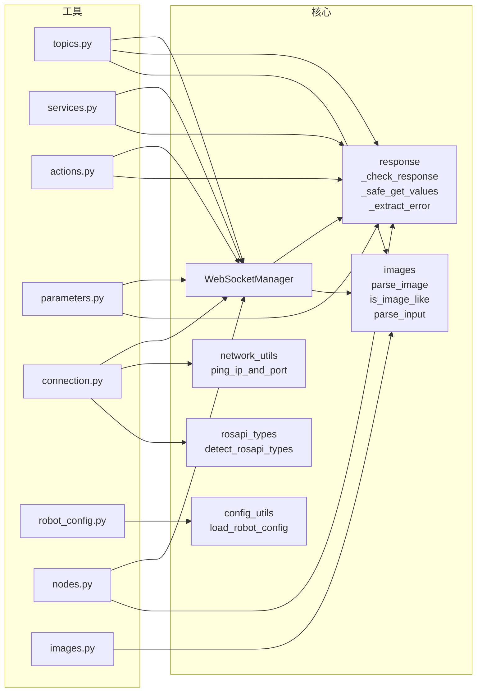

---

## 10. 测试架构

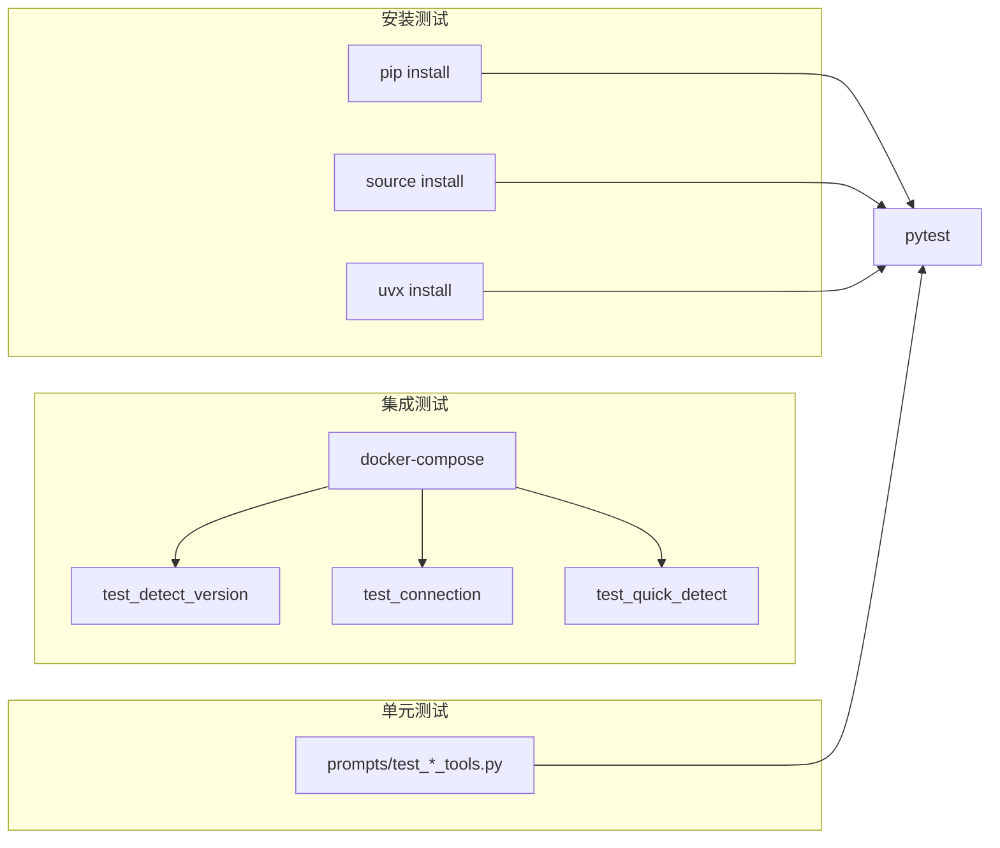

- **安装测试** (`tests/installation/`): Docker 容器内验证 pip/source/uvx 安装
- **集成测试** (`tests/integration/`): Docker + ROS launch，测试连接和功能
- **标记分类**: `@pytest.mark.installation`, `@pytest.mark.integration`, `@pytest.mark.slow`

运行方式：
```bash
pytest                           # 全部
pytest -m "not slow"             # 跳过慢测试
pytest tests/installation/       # 仅安装测试
```

---

## 11. 构建与发布

### 构建

```bash
pip install build
python -m build                  # 生成 dist/ 下的 sdist + wheel
```

### CI/CD 流程

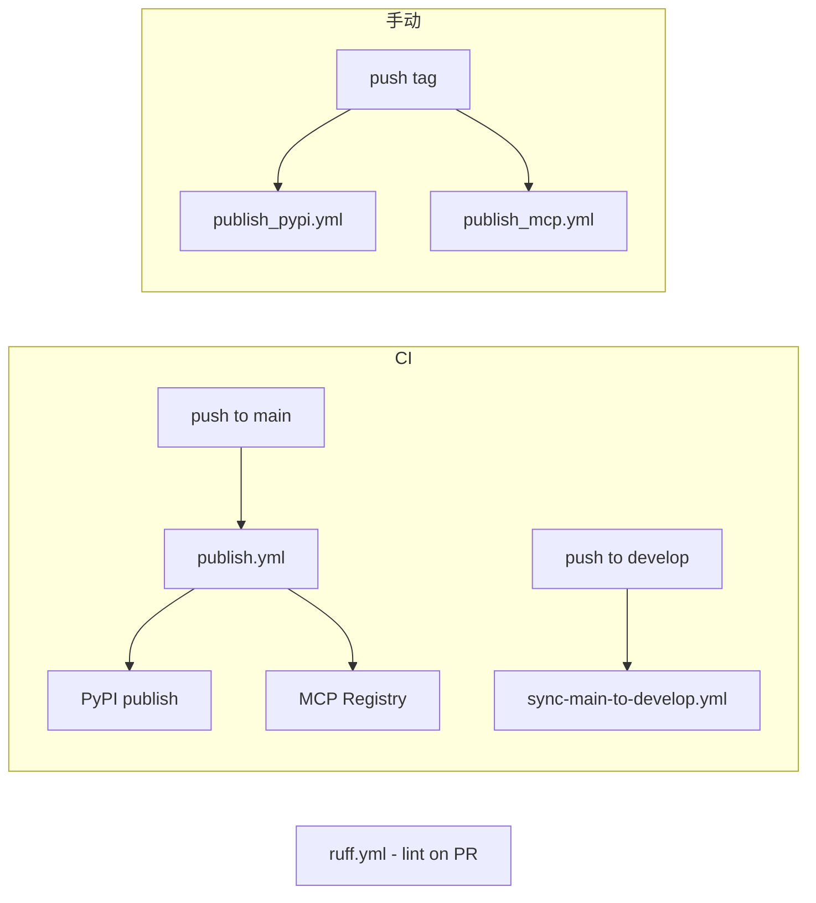

### 发布流程

1. 修改 `pyproject.toml` version
2. `git tag` 并 push tag
3. `publish_pypi.yml` 自动触发 PyPI 发布
4. `publish_mcp.yml` 自动触发 MCP Registry 发布

---

## 12. 关键文件速查

| 文件 | 职责 |
|------|------|
| `ros_mcp/main.py` | FastMCP 实例、WebSocketManager、CLI 入口、传输配置 |
| `ros_mcp/tools/__init__.py` | 8 个类别工具注册入口 |
| `ros_mcp/tools/topics.py` | 最复杂的工具模块 (8 tools, subscribe/publish 逻辑) |
| `ros_mcp/tools/actions.py` | 唯一异步工具模块 (send_action_goal async) |
| `ros_mcp/utils/websocket.py` | WebSocketManager (424行) + 图像解析函数 |
| `ros_mcp/resources/ros_metadata.py` | 最复杂资源模块 (662行), 5个 URI 资源 |
| `ros_mcp/tools/services.py` | Service 调用 + 类型探查 |
| `ros_mcp/tools/parameters.py` | ROS2 参数管理 (_safe_check_parameter_exists 安全封装) |
| `ros_mcp/tools/connection.py` | 连通性测试 (并行 ping) |
| `server.py` | 薄封装: `from ros_mcp.main import main` |
| `pyproject.toml` | 依赖、ruff、pytest、MCP registry 配置 |
| `robot_specifications/*.yaml` | 预置机器人规范文件 |

---

## 13. 扩展指南

### 添加新工具

```
1. 在 ros_mcp/tools/ 对应模块中编写工具函数
2. 使用 @mcp.tool(description=..., annotations=ToolAnnotations(...))
3. 内部统一通过 ws_manager.request() 与 rosbridge 通信
4. 返回 dict: {"result": ..., "error": ...} 统一格式
5. 在 ros_mcp/tools/__init__.py 中导入 + 调用
```

### 添加新资源

```
1. 在 ros_mcp/resources/ 中编写资源函数
2. 使用 @mcp.resource("ros-mcp://your-uri")
3. 返回 str (JSON 字符串)
4. 在 ros_mcp/resources/__init__.py 中注册
```

### 添加新 Prompt

```
1. 在 ros_mcp/prompts/ 中创建 test_*.py
2. 使用 @mcp.prompt("name") 装饰
3. 在 ros_mcp/prompts/__init__.py 中注册
```
