# ROSA 项目分析报告

## 1. 项目概述

**ROSA** (Robot Operating System Agent) 是由 NASA JPL 开发的 AI 驱动机器人操作系统助手。它基于 LangChain 的 `create_tool_calling_agent` 框架构建，允许用户通过自然语言查询和控制 ROS1/ROS2 机器人系统。

**核心定位**：用自然语言与 ROS 系统交互的 AI Agent，降低机器人开发与运维门槛。

**技术栈**：Python 3.9+、LangChain、OpenAI/Azure/Anthropic/Ollama LLM、ROS1 (Noetic) / ROS2 (Humble/Iron/Jazzy)

**版本**：1.0.10 | **许可**：Apache 2.0 | **发布**：PyPI (`jpl-rosa`)

---

## 2. 系统功能总体描述图


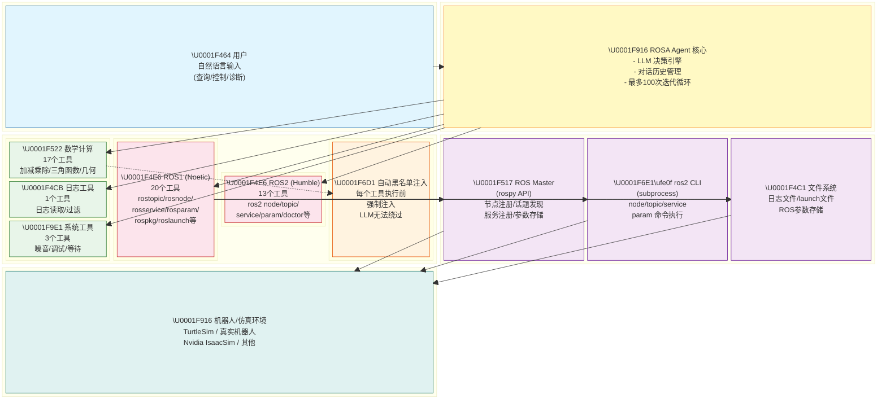

---

## 3. 核心架构图

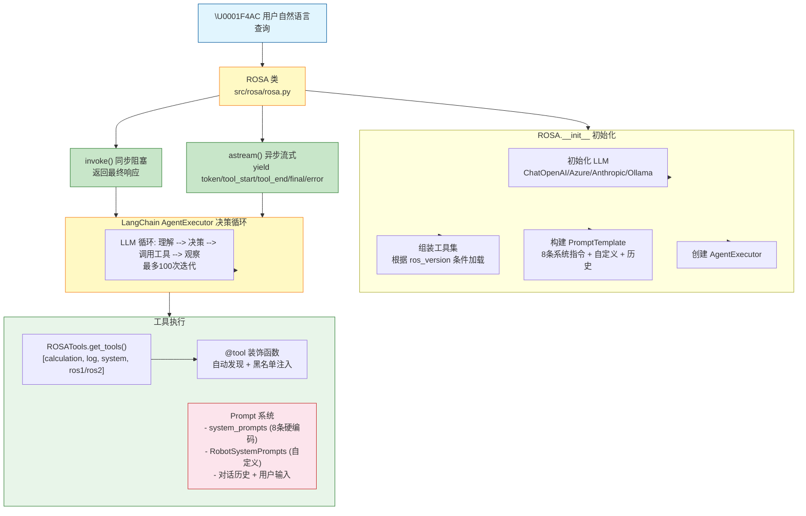

---

## 4. 数据流与处理流程

### 4.1 单次请求处理流程

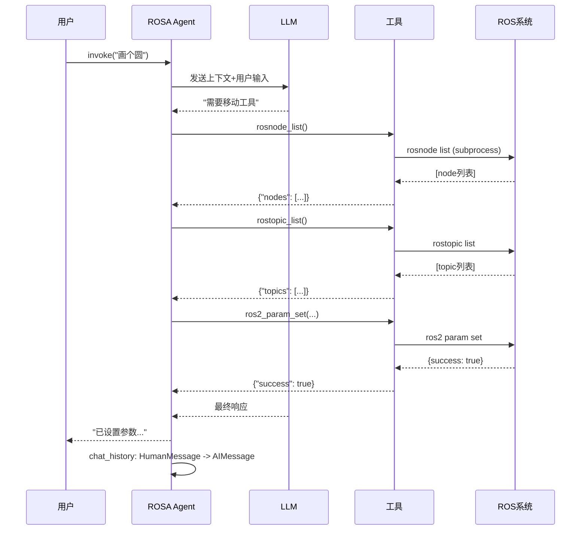

### 4.2 Agent 迭代循环流程

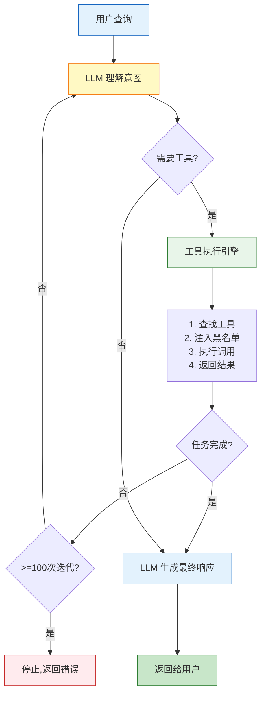

---

## 5. 模块详细分析

### 5.1 核心模块

#### 5.1.1 ROSA 类 (`src/rosa/rosa.py`)

**职责**：整个系统的入口和协调器。

| 属性/方法 | 说明 |
|-----------|------|
| `ros_version` | 1=ROS1, 2=ROS2，决定加载哪组ROS工具 |
| `llm` | 支持的模型：ChatOpenAI / AzureChatOpenAI / ChatAnthropic / ChatOllama |
| `invoke(query)` | 同步阻塞调用，返回最终响应 |
| `astream(query)` | 异步流式调用，yield token/tool_start/tool_end/final/error 事件 |
| `clear_chat()` | 清空对话历史 |
| `_get_tools()` | 根据 ros_version 组装工具集 |
| `_get_prompts()` | 构建 ChatPromptTemplate (系统提示 + 对话历史 + 用户输入) |
| `_token_callback()` | OpenAI token 用量追踪 (仅 ChatOpenAI/AzureChatOpenAI 支持) |

**关键设计**：
- 工具自动发现：`dir(package)` 遍历所有 `@tool` 装饰的函数
- `blacklist` 自动注入：`inject_blacklist` 装饰器在每个工具执行前自动注入黑名单
- token 追踪：仅 OpenAI 系列模型支持，非 OpenAI 模型自动禁用
- streaming 默认开启，但 streaming 模式下不显示 token 用量

#### 5.1.2 Prompts 系统 (`src/rosa/prompts.py`)

**system_prompts** (8条硬编码指令)，按顺序排列：

| # | 主题 | 关键内容 |
|---|---|---|
| 1 | 身份定义 | ROSA 身份，实时信息优先 |
| 2 | 工具调用强制 | 声称"不存在"前必须先调工具验证 |
| 3 | 顺序执行 | **禁止并行工具调用**，必须一个个执行 |
| 4 | 行动工作流 | 先 rosnode_list + rostopic_list，再行动 |
| 5 | 名称确认 | 使用前先获取列表，不用假设的名字 |
| 6 | /rosa 命名空间 | agent 自用的 rosparam 必须用 `/rosa/` 前缀 |
| 7 | 文件读取 | 超过 32KB 需分段读取 |
| 8 | 数学计算强制 | 角度/距离/坐标计算必须用数学工具 |

**RobotSystemPrompts**：用户可自定义的系统提示扩展，支持 9 个字段（身份、操作员信息、关键指令、约束、环境、能力、假设、任务目标、环境变量）。

#### 5.1.3 ROSATools 类 (`src/rosa/tools/__init__.py`)

**职责**：工具注册与管理的核心类。

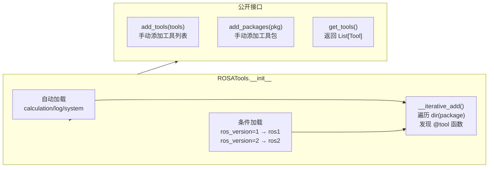

**inject_blacklist 机制**：当工具函数签名包含 `blacklist` 参数时，自动将默认黑名单 + 工具自带黑名单合并注入。LLM 无法绕过此机制。

### 5.2 工具分类

#### 通用工具 (所有版本共用)

**calculation.py (17个工具)**：
- 聚合运算：`add_all`, `multiply_all`, `mean`, `median`, `mode`, `variance`
- 二元运算：`add`, `subtract`, `multiply`, `divide`, `exponentiate`, `modulo`
- 三角函数：`sine`, `cosine`, `tangent`, `asin`, `acos`, `atan`, `sinh`, `cosh`, `tanh`
- 计数：`count_list`, `count_words`, `count_lines`
- 单位转换：`degrees_to_radians`, `radians_to_degrees`
- 几何核心：`sqrt`, `atan2`, `distance_between_points`, `calculate_line_angle_and_distance`

**log.py (1个工具)**：
- `read_log`：读取日志文件，支持级别过滤 (ERROR/INFO/DEBUG 等) 和行数限制，最大 200 行返回

**system.py (3个工具)**：
- `set_verbosity`：控制 agent 输出详细程度
- `set_debugging`：控制 agent 调试输出 (API调用/工具执行详情)
- `wait`：等待指定秒数

#### ROS1 专属工具 (ros1.py, 14个工具)

| 工具 | 功能 |
|------|------|
| `rosgraph_get` | 获取ROS图 (publisher/topic/subscriber) |
| `rostopic_list` | 列出话题 (支持 pattern/namespace/blacklist 过滤) |
| `rosnode_list` | 列出节点 (支持 pattern/namespace/blacklist 过滤) |
| `rostopic_info` | 话题详细信息 (type/publishers/subscribers) |
| `rostopic_echo` | 实时回声话题消息 (1-100条) |
| `rosnode_info` | 节点详细信息 |
| `rosservice_list` | 列出服务 (支持多种过滤) |
| `rosservice_info` | 服务详细信息 |
| `rosservice_call` | 调用服务 |
| `rosmsg_info` | ROS消息类型定义 |
| `rossrv_info` | ROS服务类型定义 |
| `rosparam_list` | 列出参数 |
| `rosparam_get` | 获取参数值 |
| `rosparam_set` | 设置参数值 (支持 /rosa 命名空间) |
| `rospkg_list` | 列出ROS包 |
| `rospkg_info` | ROS包详情 (路径/依赖/manifest) |
| `rospkg_roots` | ROS包根路径 |
| `roslog_list` | 列出ROS日志文件 |
| `roslaunch` | 启动launch文件 |
| `roslaunch_list` | 列出launch文件 |
| `rosnode_kill` | 杀死节点 |

#### ROS2 专属工具 (ros2.py, 11个工具)

| 工具 | 功能 |
|------|------|
| `ros2_node_list` | 列出节点 (pattern/blacklist) |
| `ros2_topic_list` | 列出话题 (pattern/blacklist) |
| `ros2_topic_echo` | 回声话题 (1-10条) |
| `ros2_service_list` | 列出服务 (pattern/blacklist) |
| `ros2_node_info` | 节点详细信息 |
| `ros2_topic_info` | 话题详细信息 |
| `ros2_param_list` | 列出参数 (按node/pattern过滤) |
| `ros2_param_get` | 获取参数值 |
| `ros2_param_set` | 设置参数值 |
| `ros2_service_info` | 服务类型信息 |
| `ros2_service_call` | 调用服务 |
| `ros2_doctor` | 检查ROS环境 |
| `roslog_list` | 列出ROS2日志文件 |

### 5.3 示例 Agent：TurtleSim

**`src/turtle_agent/`** 是一个自定义 Agent 示例，展示如何扩展 ROSA。

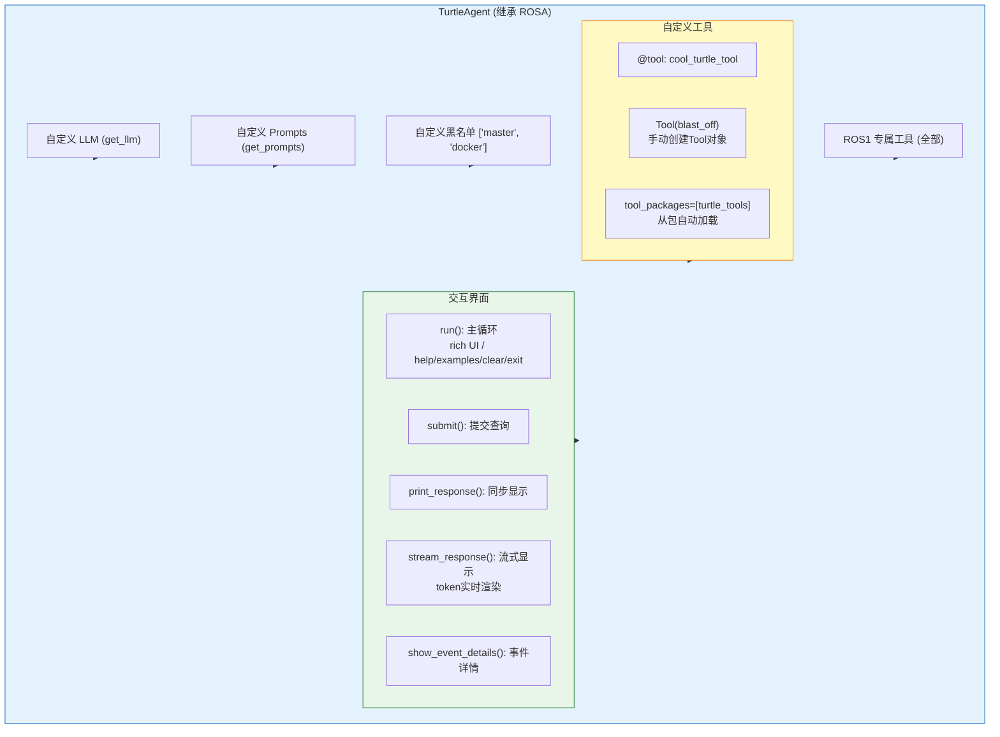

---

## 6. 目录结构

```
rosa/
├── src/
│   ├── rosa/                     # 核心包
│   │   ├── __init__.py           # 导出: ROSA, RobotSystemPrompts, ChatModel
│   │   ├── rosa.py               # ROSA 类 (341行) - 入口与协调器
│   │   ├── prompts.py            # system_prompts (8条) + RobotSystemPrompts 类
│   │   └── tools/
│   │       ├── __init__.py       # ROSATools 类 + inject_blacklist
│   │       ├── calculation.py    # 17个数学/几何工具
│   │       ├── log.py            # 1个日志读取工具
│   │       ├── system.py         # 3个系统管理工具
│   │       ├── ros1.py           # 20个ROS1专属工具
│   │       └── ros2.py           # 13个ROS2专属工具
│   └── turtle_agent/             # TurtleSim 示例 Agent
│       ├── launch/agent.launch   # ROS launch 文件
│       ├── package.xml           # ROS package 元数据
│       ├── CMakeLists.txt        # ROS build 配置
│       └── scripts/
│           ├── turtle_agent.py   # TurtleAgent 主程序 (366行)
│           ├── llm.py            # LLM 配置
│           ├── prompts.py        # 示例自定义提示
│           ├── help.py           # 帮助信息
│           └── tools/
│               └── turtle.py     # 海龟自定义工具
├── tests/
│   └── test_rosa/
│       ├── test_rosa.py          # ROSA 核心测试
│       ├── test_prompts.py       # Prompt 测试
│       ├── test_signal_handling.py # 信号处理测试
│       └── tools/
│           ├── test_calculation.py
│           ├── test_log.py
│           ├── test_system.py
│           ├── test_rosa_tools.py
│           ├── test_ros1.py      # ROS_VERSION=1 过滤
│           ├── test_ros2.py      # ROS_VERSION=2 过滤
│           └── test_rosa_tools.py
├── setup.py                      # 安装配置
├── pyproject.toml                # 依赖配置 (版本 1.0.10)
├── Dockerfile                    # ROS1 Noetic 容器
├── .github/
│   ├── workflows/
│   │   ├── ci.yml                # CI: Noetic + Humble 双容器测试
│   │   └── publish.yml           # PyPI 发布
│   └── copilot-instructions.md   # Copilot 指令 (与CLAUDE.md内容一致)
├── README.md
├── TESTING.md
├── CONTRIBUTING.md
├── CHANGELOG.md
├── LICENSE (Apache 2.0)
└── demo.sh
```

---

## 7. 依赖分析

### 7.1 核心依赖 (`pyproject.toml`)

| 依赖 | 版本 | 用途 |
|------|------|------|
| langchain | ~=0.3.23 | Agent 框架核心 |
| langchain-community | ~=0.3.21 | 社区工具集成 |
| langchain-core | ~=0.3.52 | Agent 核心抽象 |
| langchain-openai | ~=0.3.14 | OpenAI LLM 适配 |
| pydantic | - | 数据验证 |
| pyinputplus | - | 用户输入验证 |
| azure-identity | - | Azure 认证 |
| cffi | - | C 扩展接口 |
| rich | - | 终端渲染 |
| pillow | >=10.4.0 | 图像处理 |
| numpy | >=1.26.4 | 数值计算 |
| PyYAML | ==6.0.1 | YAML 解析 |
| python-dotenv | >=1.0.1 | 环境变量加载 |

### 7.2 可选依赖

| 额外 | 依赖 | 用途 |
|------|------|------|
| anthropic | langchain-anthropic ~=0.3.12 | Anthropic Claude LLM |
| ollama | langchain-ollama ~=0.3.2 | Ollama 本地 LLM |
| all | 以上两者 | 全部可选依赖 |

### 7.3 ROS 运行时依赖 (条件加载)

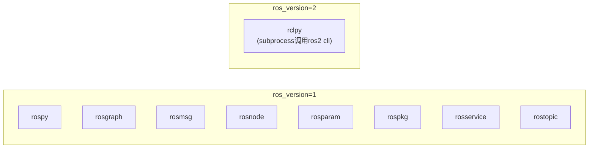

---

## 8. 测试体系

### 8.1 测试框架

- **框架**：Python unittest (pytest 也兼容)
- **过滤机制**：`ROS_VERSION` 环境变量

### 8.2 测试命令

```bash
# 运行全部测试
python -m unittest discover -s tests --verbose

# 运行单个测试文件
python -m unittest tests/test_rosa/tools/test_calculation.py -v

# 运行指定测试类
python -m unittest tests/test_rosa/tools/test_calculation.py::TestCalculationTools -v

# ROS1 环境测试
ROS_VERSION=1 python -m unittest discover -s tests --verbose

# ROS2 环境测试
ROS_VERSION=2 python -m unittest discover -s tests --verbose
```

### 8.3 CI/CD 流程

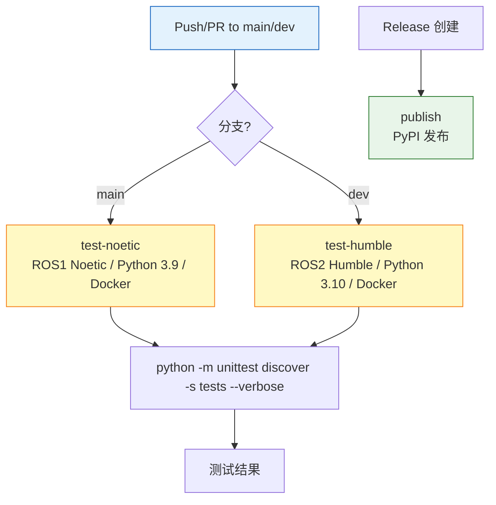

---

## 9. 关键技术设计

### 9.1 工具自动发现机制

```python
# ROSATools.__iterative_add() 实现
for tool_name in dir(package):
    if not tool_name.startswith("_"):
        t = getattr(package, tool_name)
        if hasattr(t, "name") and hasattr(t, "func"):
            self.__tools.append(t)
```

**说明**：所有 `@tool` 装饰的函数无需手动注册即可自动生效。

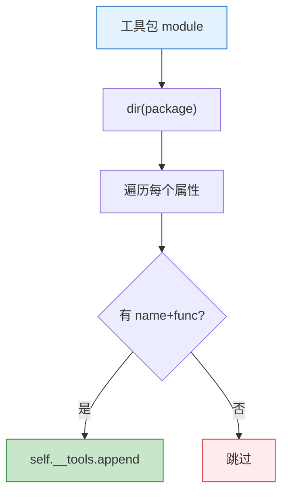

### 9.2 黑名单注入机制

```
工具定义: def my_tool(blacklist: List[str] = None)

执行时:
  args[0]["blacklist"] = default_blacklist + user_blacklist
  # LLM 无法绕过，因为每次调用都会被强制注入
```

### 9.3 Prompt 组装顺序

```
1. system_prompts[0]  "你是ROSA..."
2. system_prompts[1]  "CRITICAL - 工具使用要求..."
3. system_prompts[2]  "CRITICAL - 顺序执行..."
4. system_prompts[3]  "行动工作流..."
5. system_prompts[4]  "名称确认..."
6. system_prompts[5]  "/rosa 命名空间..."
7. system_prompts[6]  "文件读取..."
8. system_prompts[7]  "数学计算强制..."
9. RobotSystemPrompts (用户自定义，追加到 system_prompts 之后)
10. MessagesPlaceholder("chat_history")  (对话历史)
11. ("user", "{input}")  (用户输入)
12. MessagesPlaceholder("agent_scratchpad")  (Agent 中间结果)
```

```mermaid
graph LR
    subgraph SP["system_prompts (8条硬编码)"]
        S1["身份"]
        S2["工具强制"]
        S3["顺序执行"]
        S4["行动工作流"]
        S5["名称确认"]
        S6["rosa命名空间"]
        S7["文件读取"]
        S8["数学强制"]
    end
    subgraph RP["RobotSystemPrompts (用户自定义)"]
        U1["用户设定"]
    end
    subgraph CH["对话上下文"]
        H1["chat_history"]
        I1["{input}"]
        S11["agent_scratchpad"]
    end

    SP --> RP
    RP --> CH
    CH --> Template["ChatPromptTemplate"]

    style SP fill:#fce4ec,stroke:#c62828
    style RP fill:#e3f2fd,stroke:#1565c0
    style CH fill:#fff9c4,stroke:#f57f17
```

### 9.4 流式响应事件类型

| 事件类型 | 内容 | 触发时机 |
|----------|--|------|
| `token` | `{"content": ".."}` | LLM 生成每个 token |
| `tool_start` | `{"name": "..", "input": {...}}` | 工具开始执行 |
| `tool_end` | `{"name": "..", "output": ".."}` | 工具执行完成 |
| `final` | `{"content": ".."}` | Agent 返回最终响应 |
| `error` | `{"content": ".."}` | 发生错误 |

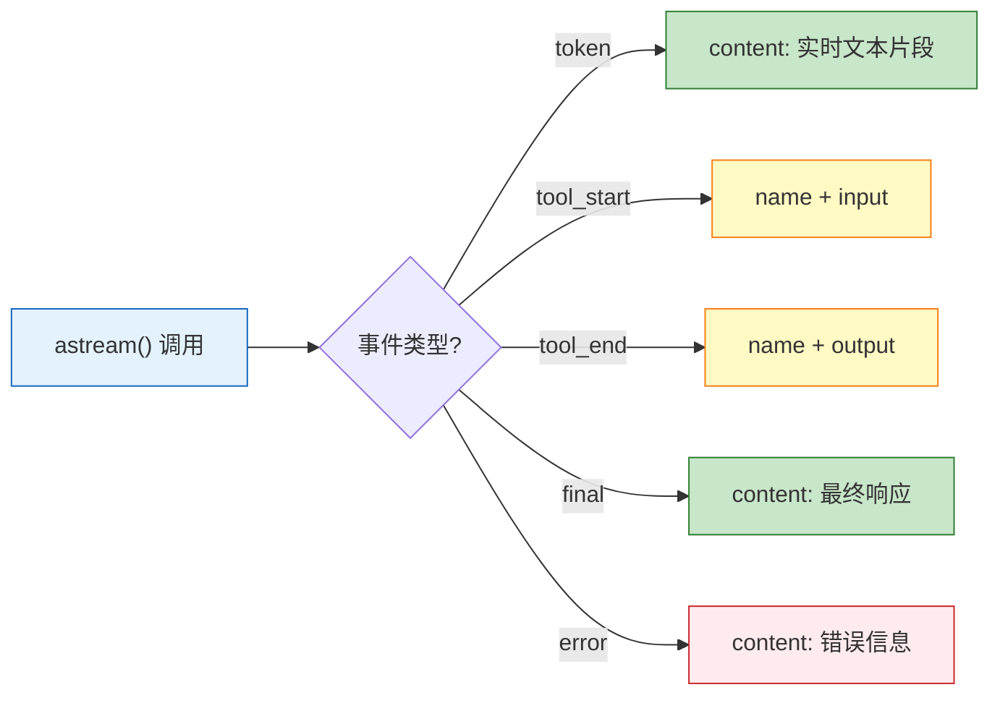

---

## 10. 扩展指南

### 10.1 添加新工具

```python
# src/rosa/tools/my_tools.py
from langchain.agents import tool

@tool
def my_new_tool(description: str) -> str:
    """描述: 新工具的功能说明。"""
    return f"处理结果: {description}"
```

**规则**：
- 使用 `@tool` 装饰器
- 自动被 `dir(package)` 发现
- 如需黑名单支持，添加 `blacklist: Optional[List[str]] = None` 参数

### 10.2 创建自定义 Agent

```python
from rosa import ROSA, RobotSystemPrompts

class MyAgent(ROSA):
    def __init__(self):
        super().__init__(
            ros_version=1,
            llm=my_llm,
            tools=[my_new_tool],           # 或 tool_packages=[my_tools_pkg]
            prompts=RobotSystemPrompts(
                embodiment_and_persona="你的机器人设定",
                critical_instructions="关键指令",
            ),
            blacklist=["node_to_exclude"],
        )
```

### 10.3 扩展新 ROS 版本支持

在 `src/rosa/tools/` 下新建 `ros3.py`，在 `ROSATools.__init__` 中添加 `elif self.__ros_version == 3:` 分支。

---

## 11. 安全考虑

1. **黑名单注入**：`inject_blacklist` 强制注入，LLM 无法绕过
2. **参数验证**：`execute_ros_command` 在 ros2.py 中校验命令白名单 (`node/topic/service/param/doctor`)
3. **文件读取限制**：日志读取超过 200 行需分页，超过 32KB 需分段
4. **消息数量限制**：`rostopic_echo` count 限制 1-100，`ros2_topic_echo` 限制 1-10
5. **子进程执行**：ROS2 工具通过 `subprocess` 执行，ROS1 通过 `rospy` API

---

## 12. 版本信息

| 项目 | 值 |
|------|---|
| 当前版本 | 1.0.10 |
| Python 要求 | 3.9 - 3.x |
| ROS1 支持 | Noetic |
| ROS2 支持 | Humble / Iron / Jazzy |
| 主要维护者 | Rob Royce (Jet Propulsion Laboratory) |
| 论文 | arXiv: 2410.06472 |
