# ROSClaw 项目详细分析报告

## 1. 项目概述

ROSClaw 是一个 Python 包，提供生产级中间件，通过 ROS 2 和模型上下文协议（MCP）将 LLM 连接到物理机器人（UR5e 机械臂）。它实现了四层递进式安全架构，带有基于 MuJoCo 的数字孪生防火墙。

**项目定位：** 连接 LLM 与物理机器人的桥梁——让 AI 代理安全地控制真实机器人。

**项目状态：** Pre-Alpha (V0.1) — 结构性概念验证。

---

## 2. 系统总体架构

### 2.1 系统总体架构（从上到下分层）

下图展示整个系统的分层架构和核心职责。AI 代理发出自然语言指令，经过四层处理，最终安全驱动物理机器人执行：

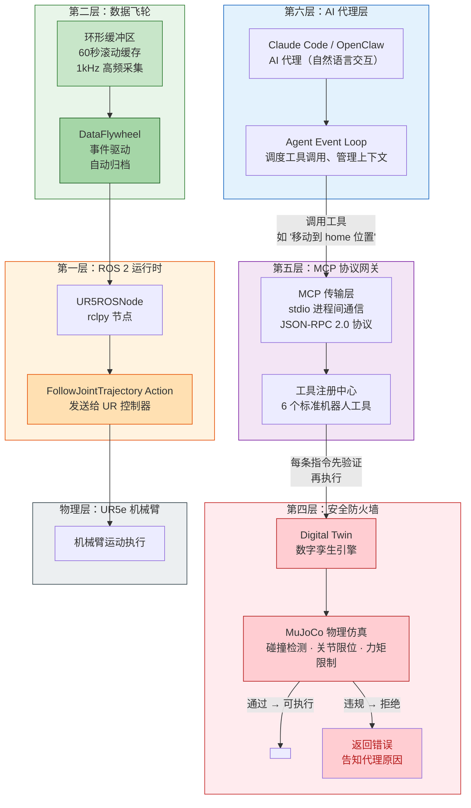

**分层说明：**

| 层级 | 核心职责 | 解决的问题 |
|------|------|------|
| **L6: AI 代理** | 用自然语言理解用户意图 | 人类/代理无需懂机器人编程 |
| **L5: MCP 网关** | 标准化接口，对接任意 AI 框架 | 不绑定单一 Agent，plug-and-play |
| **L4: 安全防火墙** | 每条指令先在数字孪生中仿真验证 | 防止 LLM 幻觉导致物理事故 |
| **L2: 数据飞轮** | 持续采集机器人数据，事件触发自动归档 | 为后续 VLA 模型训练积累数据 |
| **L1: ROS 2 运行时** | 与真实机器人硬件通信 | 抽象底层 DDS 协议，统一控制接口 |
| **物理层** | 实际执行运动 | UR5e 机械臂 |

### 2.2 分层详解

| 层级 | 模块 | 职责 | 延迟目标 | 关键技术 |
|------|------|------|----------|----------|
| L6 | OpenClaw / Claude Code | AI 代理，自然语言交互 | - | Agent Event Loop |
| L5 | MCP 协议网关 | 标准化接口，对接任意 Agent | - | stdio + JSON-RPC 2.0 |
| L4 | `DigitalTwinFirewall` | 每条指令先在数字孪生中仿真验证 | < 10ms | MuJoCo 物理仿真 |
| L2 | `DataFlywheel` + `RingBuffer` | 持续采集 + 事件驱动归档 | < 1ms | NumPy 预分配 RingBuffer |
| L1 | `UR5ROSNode` | 与真实机器人硬件通信 | - | rclpy/DDS |

### 2.3 模块关系图

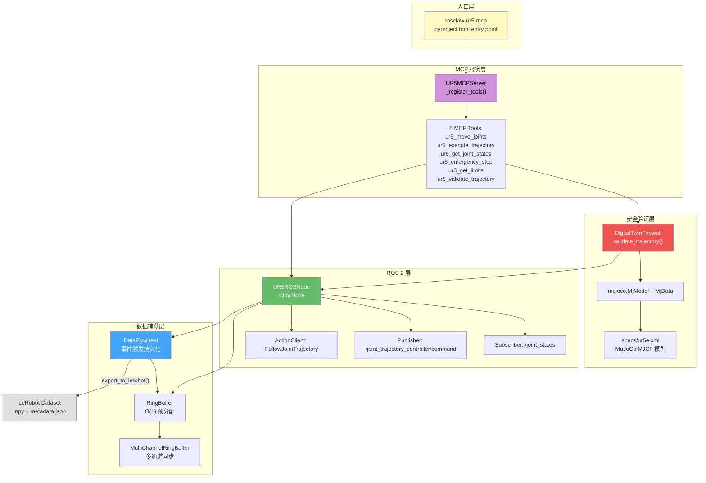

---

## 3. 核心模块详细分析

### 3.1 Layer 4: Embodiment MCP (`src/rosclaw/mcp/ur5_server.py`)

**职责：** 通过 MCP 协议暴露机器人控制工具，供 LLM 代理调用。

**核心类：**

| 类名 | 行数 | 职责 |
|------|------|------|
| `UR5MCPServer` | ~350 | MCP 服务器，6 个 `ur5_*` 工具注册和路由 |
| `UR5ROSNode` | ~260 | rclpy 节点，关节状态订阅/发布，轨迹 Action Client |
| `RobotState` | ~10 | 数据类，封装关节位姿/速度/力矩状态 |

**MCP 工具列表：**

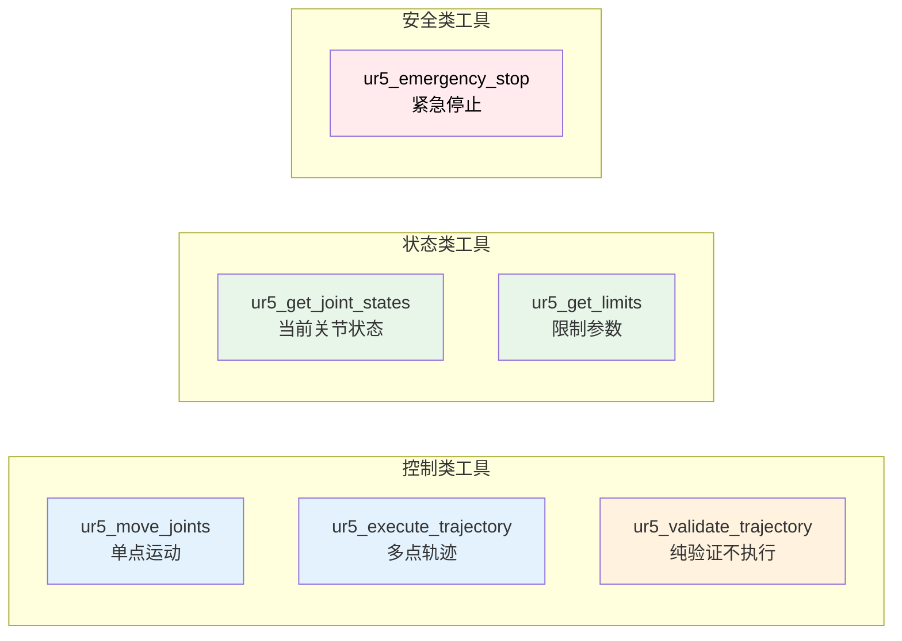

**关键实现要点：**
- MCP Server 使用 `stdio_server()` 传输（Claude Code 默认）
- 每个工具处理函数通过 `_handle_<tool_name>()` 方法路由
- 运动工具默认启用 `validate=True`，走 Digital Twin 验证
- `rclpy` 导入使用 try/except 兼容非 ROS 环境

### 3.2 Layer 3: Digital Twin Firewall (`src/rosclaw/firewall/decorator.py`)

**职责：** 执行前通过 MuJoCo 物理仿真验证机器人轨迹。

**核心类：**

| 类/枚举 | 职责 |
|---------|------|
| `DigitalTwinFirewall` | MuJoCo 仿真引擎，加载 UR5e 模型，执行碰撞/限位/力矩检测 |
| `SafetyLevel` | 枚举：`STRICT` / `MODERATE` / `LENIENT` |
| `ValidationResult` | frozen dataclass，封装验证结果 |
| `SafetyViolationError` | 携带 ValidationResult 的异常 |
| `mujoco_firewall()` | 快捷装饰器工厂 |

**验证流程图：**

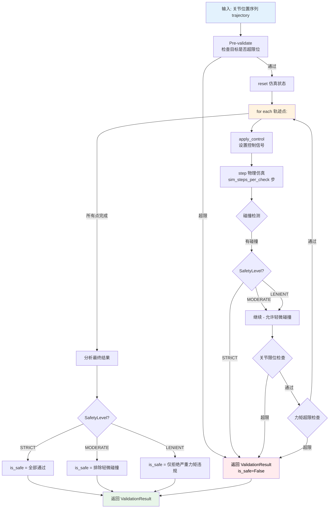

**装饰器用法：**

```python
# 方式 1: 装饰器
@mujoco_firewall(model_path="specs/ur5e.xml", safety_level=SafetyLevel.STRICT)
def execute_motion(trajectory):
    return robot.move(trajectory)  # 仅验证通过后执行

# 方式 2: 直接调用
firewall = DigitalTwinFirewall("specs/ur5e.xml")
result = firewall.validate_trajectory(trajectory)
if result.is_safe:
    robot.move(trajectory)
```

### 3.3 Layer 2: Data Layer (`src/rosclaw/data/`)

#### RingBuffer - 高性能环形缓冲区

**职责：** 1kHz 高频数据采集，预分配内存，O(1) 追加，零 GC 压力。

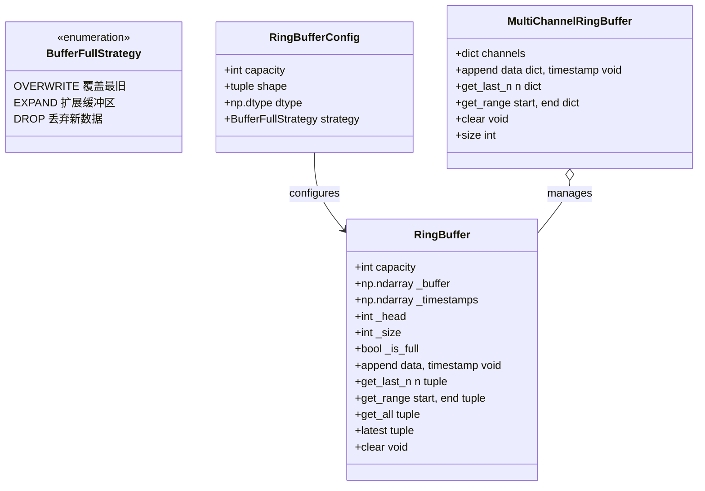

**设计原则：**
- 预分配 NumPy 数组，运行时无 GC 压力
- O(1) 追加操作（环形指针轮换）
- `get_last_n()` 自动处理跨环边界的合并复制
- `MultiChannelRingBuffer` 支持多通道同步捕获（joint/velocity/torque/camera）

#### DataFlywheel - 事件驱动数据捕获

**职责：** 事件触发的高频数据持久化，实现 100 倍存储优化。

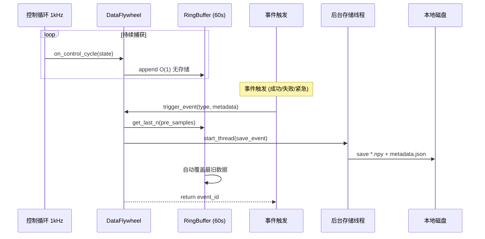

**数据流架构：**

```mermaid
graph TB
    subgraph "数据采集层"
        CTRL["控制循环 1kHz"]
        STATE["RobotState<br/>position/velocity/torque"]
        CTRL -->|每周期| STATE
    end

    subgraph "内存缓存层"
        RING["MultiChannelRingBuffer<br/>60s 滚动窗口 @ 1kHz"]
        STATE --> RING
        RING -.->|"自动覆盖最旧数据"| RING2[RING (满)]
    end

    subgraph "事件触发层"
        EVT["DataFlywheel.trigger_event()"]
        EVT_TYPES["SUCCESS / FAILURE / EMERGENCY / USER_MARK / MILESTONE"]
        EVT --> EVT_TYPES
    end

    subgraph "持久化层"
        DIR["{robot_id}_{event_id}/<br/>joint_positions.npy<br/>joint_velocities.npy<br/>joint_torques.npy<br/>metadata.json"]
        LE["export_to_lerobot()<br/>LeRobot Dataset 格式"]
        RING2 -->|"get_last_n"| DIR
        DIR --> LE
    end

    CTRL -.->|1kHz 驱动| EVT
    style CTRL fill:#e3f2fd
    style RING fill:#42a5f5,color:#000
    style EVT fill:#fff3e0
    style DIR fill:#e8f5e9
    style LE fill:#fce4ec
```

### 3.4 Layer 1: ROS 2 Runtime (`src/rosclaw/mcp/ur5_server.py`)

**职责：** 实际的 ROS 2 通信层，负责与 UR5e 机械臂的物理交互。

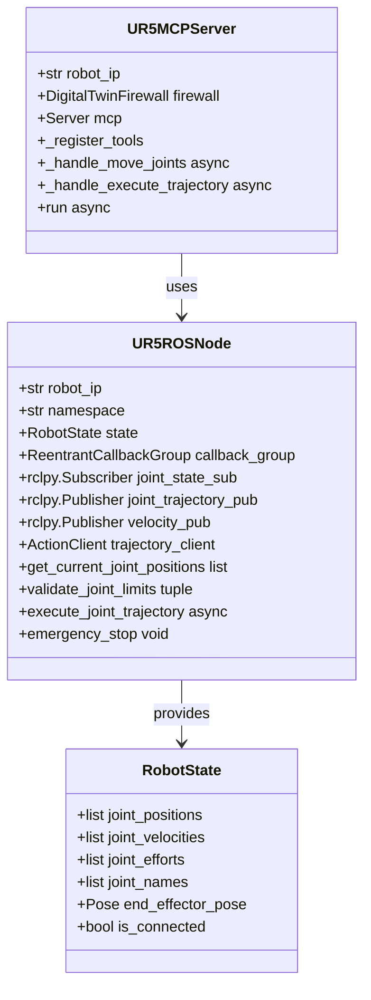

**ROS 2 通信拓扑：**

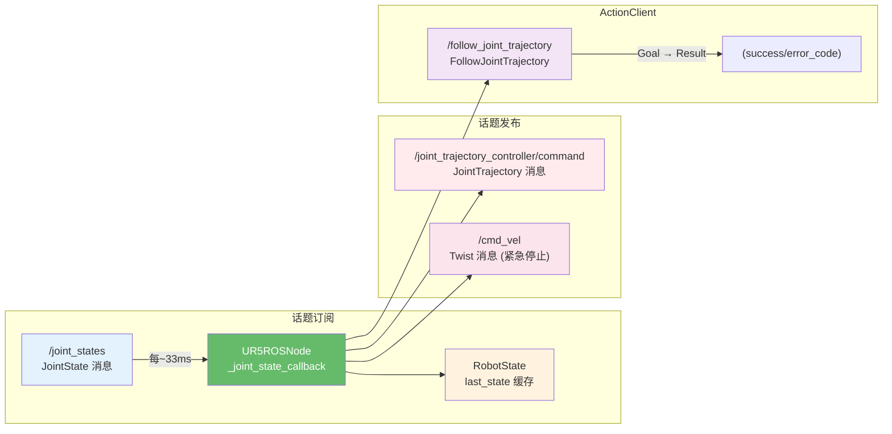

### 3.5 MuJoCo 机器人模型 (`src/rosclaw/specs/ur5e.xml`)

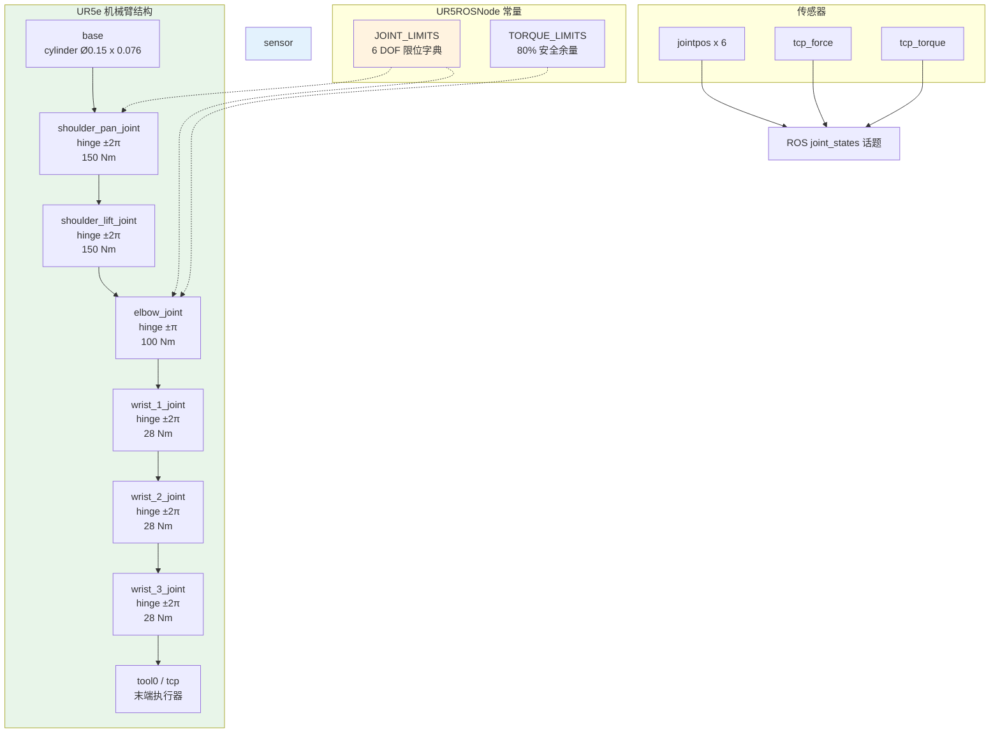

---

## 4. 数据流与交互流程

### 4.1 工具调用全流程（LLM → 机器人）

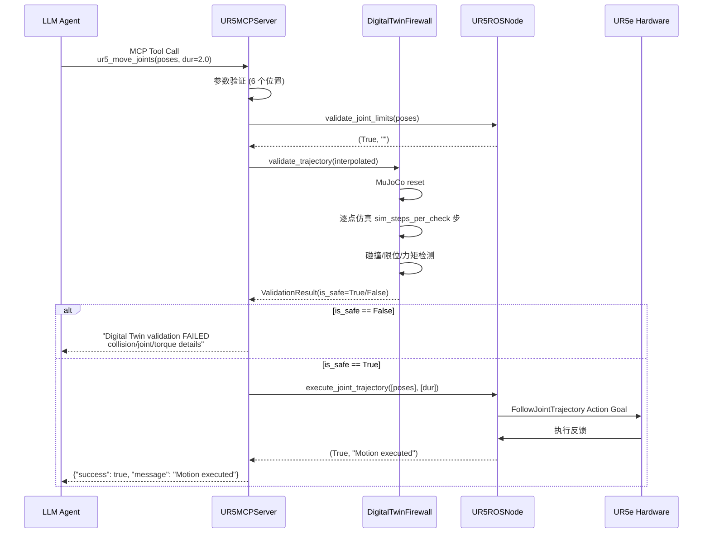

### 4.2 MCP Server 启动流程

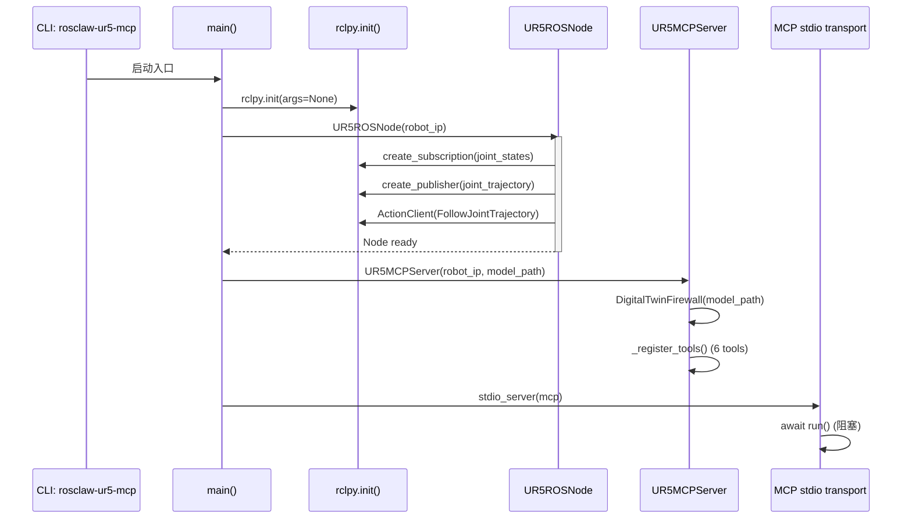

### 4.3 装饰器安全验证流程

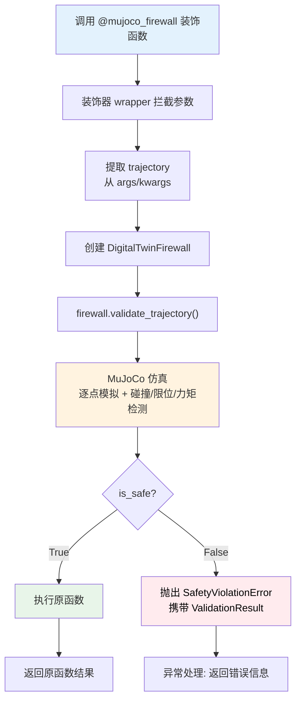

### 4.4 数据捕获流程

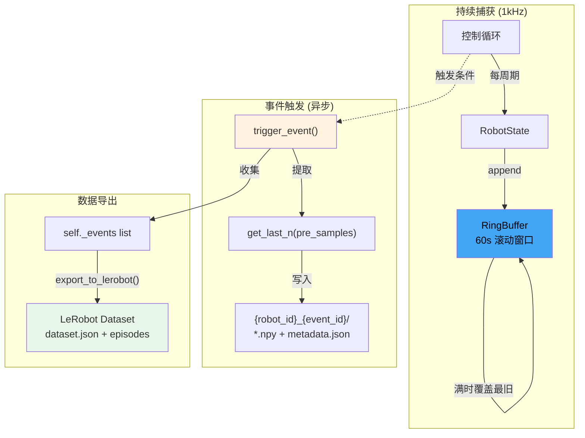

---

## 5. 模块依赖关系

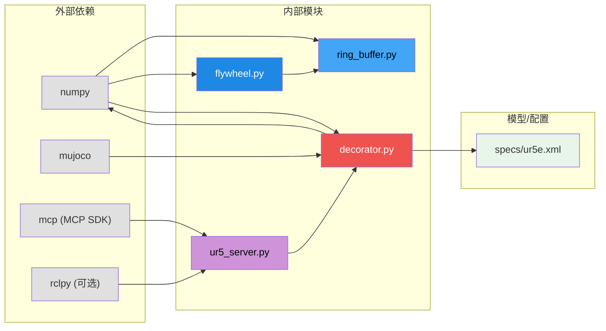

---

## 6. 测试架构

### 6.1 测试分层

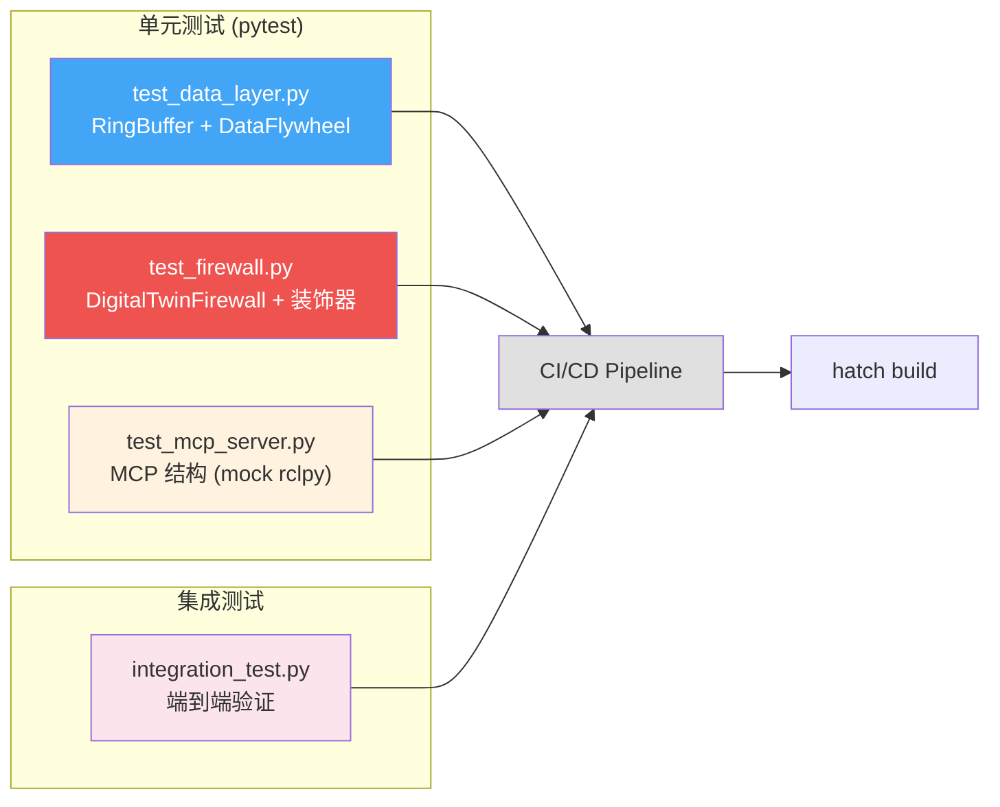

### 6.2 关键测试模式

**防火墙测试 — 使用真实 MuJoCo 模型：**
```python
@pytest.fixture
def firewall():
    return DigitalTwinFirewall(
        model_path=MODEL_PATH,
        joint_limits=JOINT_LIMITS,
        sim_steps_per_check=10,  # 加速测试
    )
```

**MCP 测试 — mock rclpy：**
```python
sys.modules["rclpy"] = MagicMock()
sys.modules["rclpy.node"] = MagicMock()
from rosclaw.mcp.ur5_server import UR5ROSNode
```

### 6.3 CI/CD Pipeline

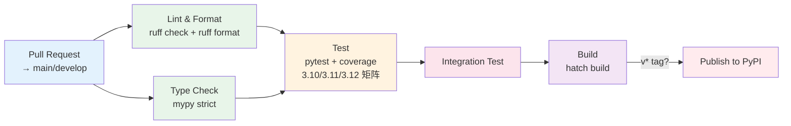

---

## 7. 配置与常量

### 7.1 pyproject.toml 关键配置

```toml
[project]
requires-python = ">=3.10"
dependencies = ["numpy>=1.24", "mujoco>=3.0", "mcp>=1.0"]

[project.optional-dependencies]
ros2 = ["rclpy>=3.0", "geometry-msgs", "sensor-msgs", ...]
dev = ["pytest>=7", "ruff>=0.1", "mypy>=1.5"]

[tool.ruff]
line-length = 100
ignore = ["E501"]

[tool.mypy]
strict = true
ignore_missing_imports = true

[tool.hatch.build.targets.wheel]
packages = ["src/rosclaw"]
```

### 7.2 UR5e 规格常量

| 关节 | 位置限制 (rad) | 速度限制 (rad/s) | 力矩限制 (Nm) |
|------|------|------|------|
| shoulder_pan | ±2π | 3.15 | 150 × 0.8 |
| shoulder_lift | ±2π | 3.15 | 150 × 0.8 |
| elbow | ±π | 3.15 | 100 × 0.8 |
| wrist_1 | ±2π | 6.28 | 28 × 0.8 |
| wrist_2 | ±2π | 6.28 | 28 × 0.8 |
| wrist_3 | ±2π | 6.28 | 28 × 0.8 |

### 7.3 环境变量

| 变量 | 默认值 | 说明 |
|------|--------|------|
| `ROBOT_IP` | `192.168.1.100` | UR5 机器人 IP |
| `ROBOT_PORT` | `50002` | RTDE 端口 |
| `DIGITAL_TWIN_ENABLED` | `true` | 是否启用数字孪生 |
| `MUJOCO_MODEL_PATH` | `src/rosclaw/specs/ur5e.xml` | MuJoCo 模型路径 |
| `SAFETY_LEVEL` | `strict` | 安全验证级别 |

---

## 8. 设计文档中规划但尚未实现的功能

| 特性 | 当前实现 | 设计文档 (规划) |
|------|----------|--------|
| 硬限制检查 | `DigitalTwinFirewall` | Layer 1: `HardLimitChecker` |
| MuJoCo 仿真 | `DigitalTwinFirewall` | Layer 3: `MJXFirewall` (GPU 并行) |
| 解析验证 | ❌ 未实现 | Layer 2: `Pinocchio + Ruckig` |
| 预测性安全 | ❌ 未实现 | Layer 4: `Neural Twin` |
| 多通道缓冲区 | `MultiChannelRingBuffer` | ✅ 已实现 |
| LeRobot 导出 | `export_to_lerobot()` | ✅ 已实现 (简化版) |
| MCP 工具 | 6 个 `ur5_*` 工具 | ✅ 已实现 |
| 安全编排器 | ❌ 未实现 | `SafetyFirewallOrchestrator` |
| Skill 市场 | ❌ 未实现 | `ClawHub` + `rosclaw skills` CLI |
| 跨硬件迁移 | ❌ 未实现 | `CrossEmbodimentAdapter` |

---

## 9. 关键文件速查

| 文件 | 核心类/函数 | 行数 |
|------|------|------|
| `src/rosclaw/mcp/ur5_server.py` | `UR5ROSNode`, `UR5MCPServer`, `RobotState` | ~650 |
| `src/rosclaw/firewall/decorator.py` | `DigitalTwinFirewall`, `mujoco_firewall` | ~440 |
| `src/rosclaw/data/flywheel.py` | `DataFlywheel`, `RobotState`, `DataEvent` | ~410 |
| `src/rosclaw/data/ring_buffer.py` | `RingBuffer`, `MultiChannelRingBuffer` | ~300 |
| `src/rosclaw/__init__.py` | Package entry, exports | ~20 |
| `tests/test_firewall.py` | 防火墙测试类 | ~360 |
| `tests/test_data_layer.py` | 数据层测试类 | ~320 |
| `tests/test_mcp_server.py` | MCP 结构测试 (mock) | ~370 |
| `scripts/integration_test.py` | 端到端集成测试 | ~270 |
| `src/rosclaw/specs/ur5e.xml` | MuJoCo UR5e 模型 | ~128 |
