# ROSClaw 项目详细分析报告

## 1. 项目概述

ROSClaw 是一个 Python 包，提供生产级中间件，通过 ROS 2 和模型上下文协议（MCP）将 LLM 连接到物理机器人（UR5e 机械臂）。它实现了四层安全架构，带有基于 MuJoCo 的数字孪生防火墙。

**核心定位：** 连接 LLM 与物理机器人的桥梁——让 AI 代理安全地控制真实机器人。

## 2. 整体架构

### 2.1 四层架构总览

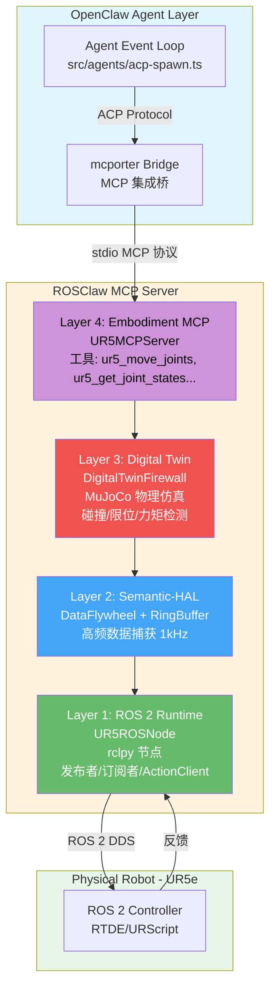

### 2.2 四层架构详解

| 层级 | 模块 | 职责 | 延迟目标 | 关键技术 |
|------|------|------|----------|----------|
| Layer 4 | MCP Server | 对外暴露 MCP 工具接口 | - | MCP/JSON-RPC 2.0 |
| Layer 3 | Digital Twin | 轨迹安全验证 | < 10ms | MuJoCo 物理仿真 |
| Layer 2 | Semantic-HAL | 高频数据捕获/缓存 | < 1ms | NumPy RingBuffer |
| Layer 1 | ROS 2 Runtime | 实际硬件通信 | - | rclpy/DDS |

## 3. 模块详细分析

### 3.1 项目结构

```
rosclaw/
├── src/rosclaw/
│   ├── __init__.py                    # 包入口 - 导出防火墙相关类
│   ├── data/                          # Layer 2: 数据层
│   │   ├── __init__.py
│   │   ├── ring_buffer.py             # 高性能环形缓冲区
│   │   └── flywheel.py               # 事件驱动数据捕获系统
│   ├── firewall/                      # Layer 3: 安全防火墙
│   │   ├── __init__.py
│   │   └── decorator.py               # DigitalTwinFirewall + 装饰器
│   ├── mcp/                          # Layer 4: MCP 服务
│   │   ├── __init__.py
│   │   └── ur5_server.py             # UR5ROSNode + UR5MCPServer
│   └── specs/
│       └── ur5e.xml                   # UR5e MuJoCo MJCF 模型
├── tests/
│   ├── test_data_layer.py            # RingBuffer + DataFlywheel 测试
│   ├── test_firewall.py              # DigitalTwinFirewall 测试
│   └── test_mcp_server.py            # MCP 结构测试（mock rclpy）
├── scripts/
│   └── integration_test.py           # 端到端集成测试
├── docs/
│   ├── OPENCLAW_INTEGRATION.md       # OpenClaw 集成文档
│   └── design/
│       ├── mcp_hub_design.md
│       ├── safety_firewall_design.md # 四层安全防火墙设计
│       └── skill_market_design.md
├── pyproject.toml                    # 项目配置
└── .github/workflows/ci.yml          # CI/CD 流程
```

### 3.2 Layer 1: ROS 2 Runtime - `UR5ROSNode`

**文件：** `src/rosclaw/mcp/ur5_server.py`

**职责：** 实际的 ROS 2 通信层，负责与 UR5e 机械臂的物理交互。

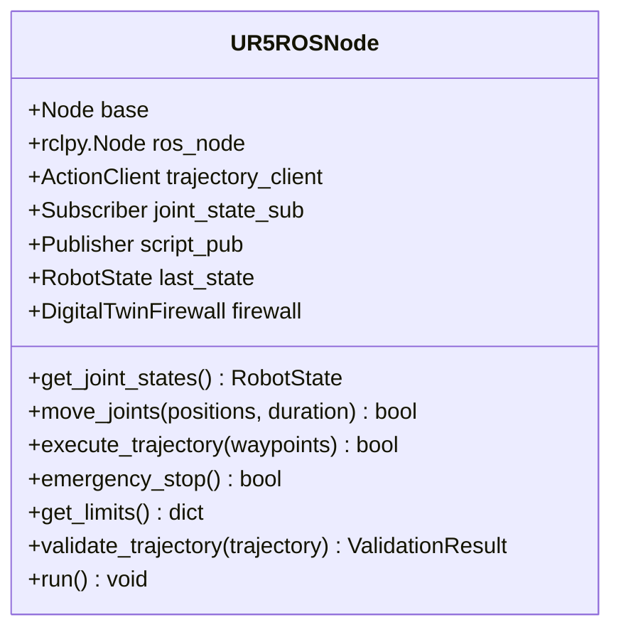

**关键特性：**
- 继承自 `rclpy.node.Node`
- 使用 `FollowJointTrajectory` Action 进行运动控制
- 订阅 `/joint_states` 获取实时反馈
- 内部集成 `DigitalTwinFirewall` 进行实时安全校验
- ROS 消息导入使用 try/except 兼容非 ROS 环境

### 3.3 Layer 2: Semantic-HAL - `RingBuffer` & `DataFlywheel`

**文件：** `src/rosclaw/data/ring_buffer.py` + `src/rosclaw/data/flywheel.py`

**职责：** 高频数据采集与事件驱动的数据持久化。

#### RingBuffer 类图

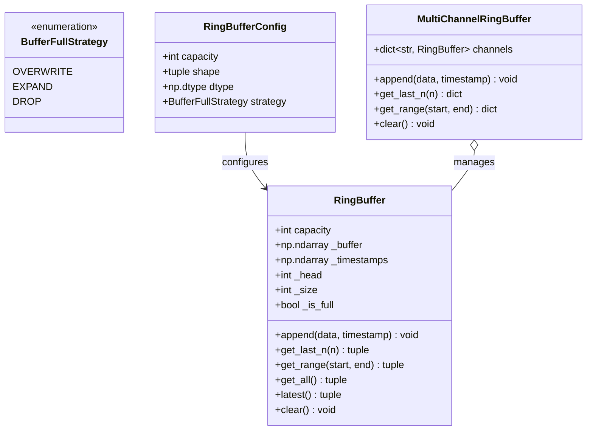

**设计原则：**
- 预分配内存，运行时无 GC 压力
- NumPy 向量化，O(1) 追加
- 环形缓冲区自动覆盖最旧数据
- 支持多通道同步捕获

#### DataFlywheel 类图

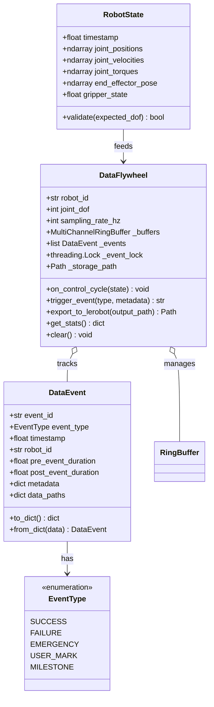

**核心创新：** 事件驱动持久化策略
- 持续在内存中循环缓存 60 秒数据（1kHz，无存储开销）
- 仅在有趣事件时提取数据并持久化
- 背景线程异步写入，不阻塞控制循环
- 100 倍存储优化（10GB/天 vs 1TB/天）

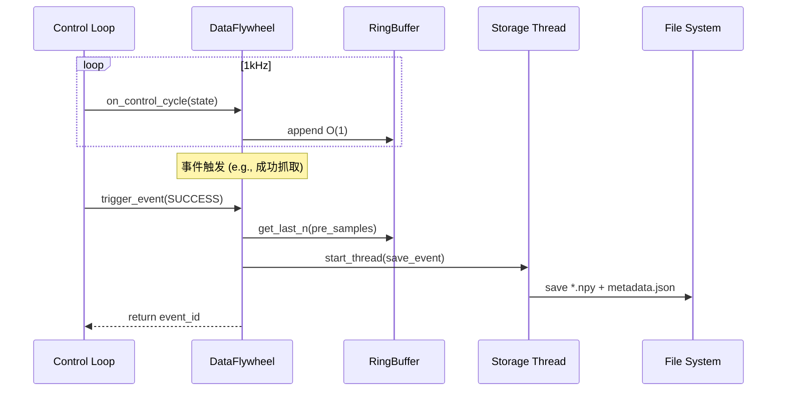

### 3.4 Layer 3: Digital Twin - `DigitalTwinFirewall`

**文件：** `src/rosclaw/firewall/decorator.py`

**职责：** 在执行前通过 MuJoCo 物理仿真验证机器人轨迹。

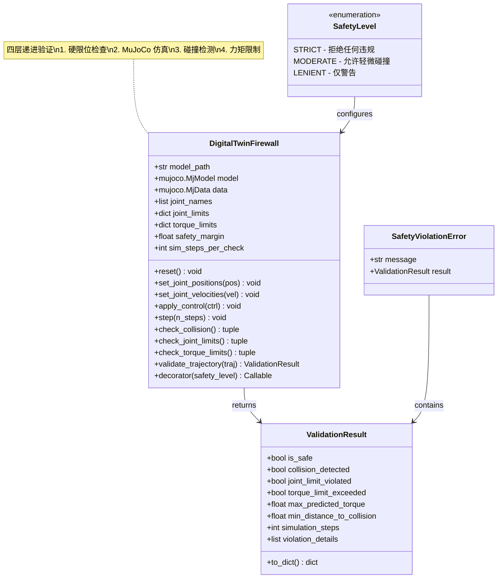

**验证流程：**

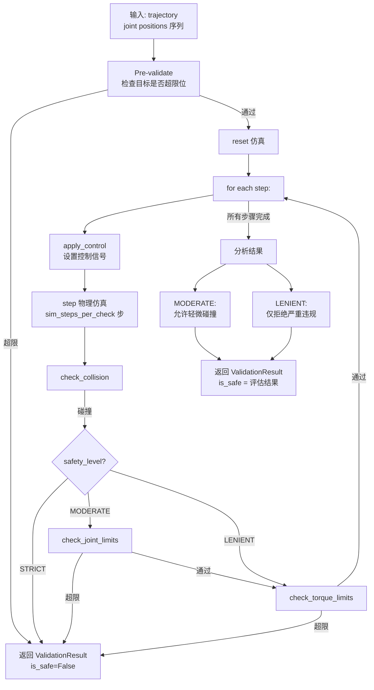

**装饰器用法：**

```python
@DigitalTwinFirewall(
    model_path="src/rosclaw/specs/ur5e.xml",
    joint_limits=JOINT_LIMITS,
    torque_limits=TORQUE_LIMITS
).decorator(safety_level=SafetyLevel.STRICT)
def execute_motion(trajectory):
    return actual_robot_move(trajectory)  # 仅通过验证后执行
```

### 3.5 Layer 4: MCP Server - `UR5MCPServer`

**文件：** `src/rosclaw/mcp/ur5_server.py`

**职责：** 通过 MCP 协议暴露机器人控制工具，供 LLM 代理调用。

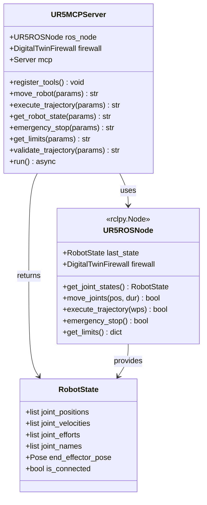

**MCP 工具列表（JSON-RPC 2.0）：**

| 工具名 | 参数 | 说明 |
|--------|------|------|
| `ur5_move_joints` | `joint_positions` (6x), `duration` | 移动到指定关节位置 |
| `ur5_execute_trajectory` | `waypoints` (Nx6), `times` | 执行多点位轨迹 |
| `ur5_get_joint_states` | 无 | 获取当前关节状态 |
| `ur5_emergency_stop` | 无 | 紧急停止 |
| `ur5_get_limits` | 无 | 获取机器人限制参数 |
| `ur5_validate_trajectory` | `trajectory` (Nx6) | 安全验证（不执行） |

### 3.6 MuJoCo 机器人模型

**文件：** `src/rosclaw/specs/ur5e.xml`

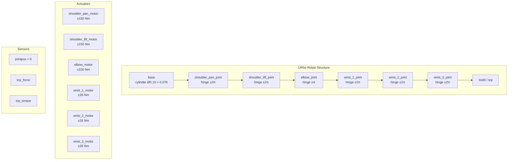

## 4. 关键数据流

### 4.1 工具调用流程（从 LLM 到机器人）

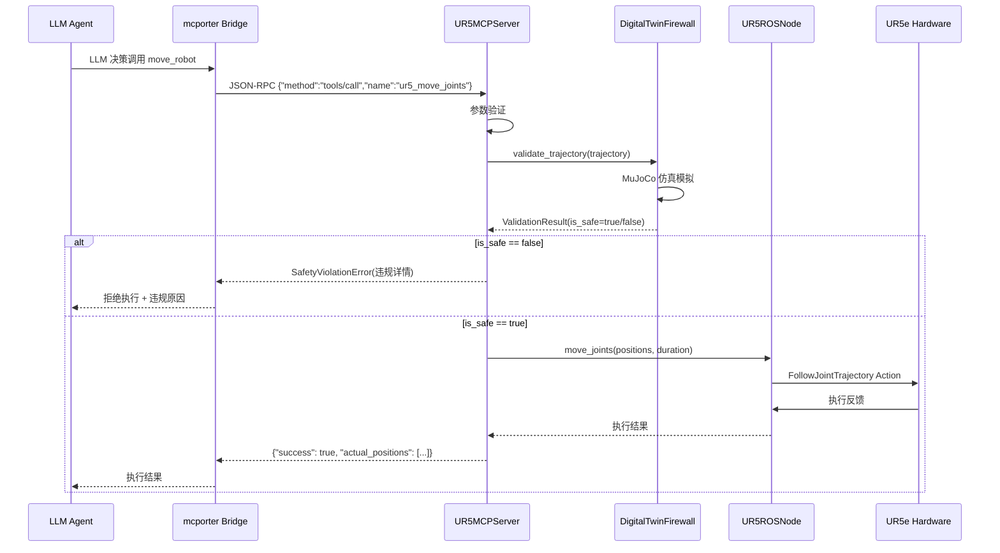

### 4.2 数据捕获流程

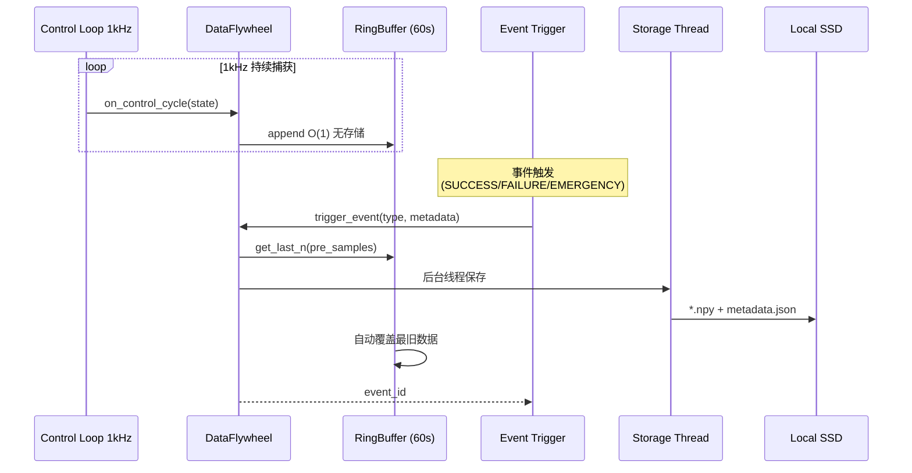

### 4.3 MCP Server 启动流程

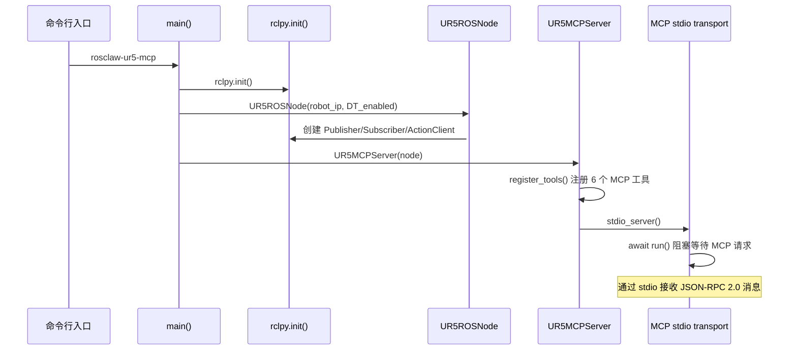

### 4.4 装饰器安全验证流程

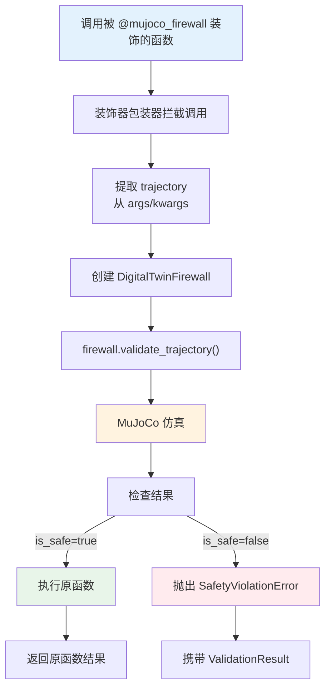

## 5. CI/CD 流水线

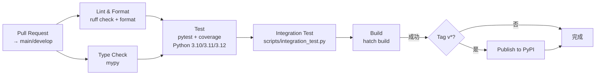

**CI 流水线步骤：**
1. **Lint & Format**: ruff check + format check
2. **Type Check**: mypy strict mode
3. **Test**: pytest + coverage (多 Python 版本矩阵)
4. **Integration Test**: 端到端集成测试
5. **Build**: hatch 打包
6. **Release**: 匹配 `refs/tags/v*` 时发布到 PyPI

## 6. 配置与依赖

### 6.1 依赖关系

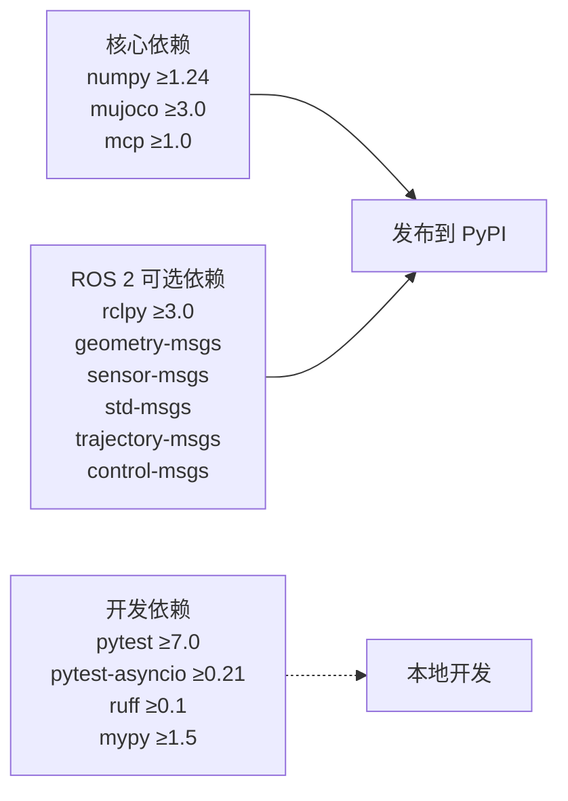

### 6.2 环境变量

| 变量 | 默认值 | 说明 |
|------|--------|------|
| `ROBOT_IP` | `192.168.1.100` | UR5 机械臂 IP |
| `ROBOT_PORT` | `50002` | RTDE 端口 |
| `DIGITAL_TWIN_ENABLED` | `true` | 是否启用数字孪生 |
| `MUJOCO_MODEL_PATH` | `src/rosclaw/specs/ur5e.xml` | MuJoCo 模型路径 |
| `SAFETY_LEVEL` | `strict` | 安全验证级别 |

### 6.3 关键常量 - UR5e 规格

| 关节 | 位置限制 (rad) | 速度限制 (rad/s) | 力矩限制 (Nm) |
|------|----------------|-------------------|----------------|
| shoulder_pan | ±2π (±6.28) | 3.15 | 150 |
| shoulder_lift | ±2π (±6.28) | 3.15 | 150 |
| elbow | ±π (±3.14) | 3.15 | 100 |
| wrist_1 | ±2π (±6.28) | 6.28 | 28 |
| wrist_2 | ±2π (±6.28) | 6.28 | 28 |
| wrist_3 | ±2π (±6.28) | 6.28 | 28 |

## 7. 安全机制详解

### 7.1 DigitalTwinFirewall 验证层次

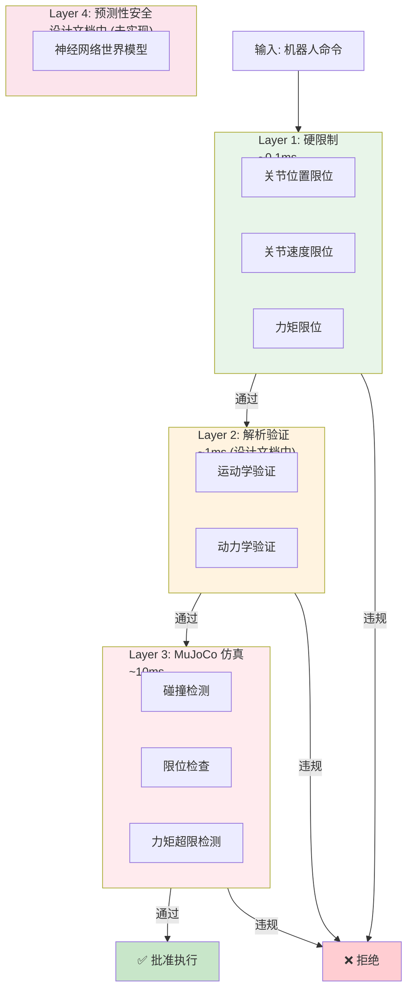

### 7.2 SafetyLevel 策略对比

| 级别 | 碰撞 | 限位违规 | 力矩超限 | 适用场景 |
|------|------|----------|----------|----------|
| `STRICT` | 拒绝 | 拒绝 | 拒绝 | 生产环境/人类共存 |
| `MODERATE` | 允许轻微 | 拒绝 | 拒绝 | 仿真/调试 |
| `LENIENT` | 允许 | 允许 | 仅严重拒绝 | 离线仿真测试 |

## 8. 测试策略

### 8.1 测试分层

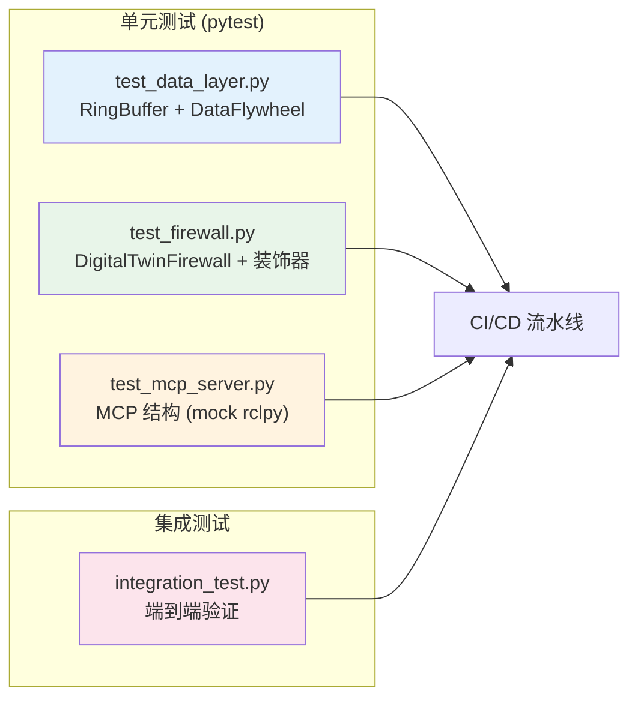

### 8.2 测试关键模式

```python
# 测试防火墙 - 直接使用真实 MuJoCo 模型
MODEL_PATH = Path(__file__).parent.parent / "src" / "rosclaw" / "specs" / "ur5e.xml"

@pytest.fixture
def firewall():
    return DigitalTwinFirewall(
        model_path=str(MODEL_PATH),
        joint_limits=JOINT_LIMITS,
        sim_steps_per_check=10,  # 加速测试
    )

# 测试 MCP - 在导入前 mock 所有 ROS 模块
sys.modules["rclpy"] = MagicMock()
sys.modules["rclpy.node"] = MagicMock()
# ... 更多 mock
from rosclaw.mcp.ur5_server import UR5ROSNode
```

## 9. 关键技术决策

### 9.1 为什么选择装饰器模式进行安全验证？

- **透明集成**：无需修改业务逻辑，一行装饰器即可
- **灵活级别**：不同函数可使用不同 `SafetyLevel`
- **明确异常**：`SafetyViolationError` 携带完整验证结果
- **可组合**：可与 `@functools.wraps` 等装饰器链式使用

### 9.2 为什么使用环形缓冲区？

- **确定性延迟**：O(1) 操作，无动态内存分配
- **零 GC 压力**：预分配 NumPy 数组
- **自动覆写**：满时自动覆盖最旧数据
- **高效提取**：`get_last_n()` 支持跨环边界的合并复制

### 9.3 为什么用 MuJoCo 而非 Gazebo/PyBullet？

- **性能**：MuJoCo 的隐式积分器更高效
- **集成**：`mujoco` Python 包 API 简洁
- **仿真精度**：更适合精细机械臂仿真

## 10. 当前实现 vs 设计文档规划

| 特性 | 当前实现 | 设计文档 (规划) |
|------|----------|-----------------|
| 硬限制检查 | ✅ `DigitalTwinFirewall` | Layer 1: `HardLimitChecker` |
| MuJoCo 仿真 | ✅ `DigitalTwinFirewall` | Layer 3: `MJXFirewall` (GPU 并行) |
| 解析验证 | ❌ 未实现 | Layer 2: `Pinocchio + Ruckig` |
| 预测性安全 | ❌ 未实现 | Layer 4: `Neural Twin` |
| 多通道缓冲区 | ✅ `MultiChannelRingBuffer` | ✅ 已实现 |
| LeRobot 导出 | ✅ `export_to_lerobot()` | ✅ 已实现 (简化版) |
| MCP 工具 | ✅ 6 个 `ur5_*` 工具 | ✅ 已实现 |
| 安全编排器 | ❌ 未实现 | `SafetyFirewallOrchestrator` |

## 11. 文件速查表

| 文件 | 核心类/函数 | 行数 |
|------|------------|------|
| `src/rosclaw/mcp/ur5_server.py` | `UR5ROSNode`, `UR5MCPServer`, `RobotState` | ~500 |
| `src/rosclaw/firewall/decorator.py` | `DigitalTwinFirewall`, `mujoco_firewall` | ~430 |
| `src/rosclaw/data/flywheel.py` | `DataFlywheel`, `RobotState`, `DataEvent` | ~410 |
| `src/rosclaw/data/ring_buffer.py` | `RingBuffer`, `MultiChannelRingBuffer` | ~300 |
| `tests/test_firewall.py` | 防火墙测试类 | ~360 |
| `tests/test_data_layer.py` | 数据层测试类 | ~320 |
| `tests/test_mcp_server.py` | MCP 结构测试 (mock) | ~370 |
| `scripts/integration_test.py` | 端到端集成测试 | ~270 |
| `specs/ur5e.xml` | MuJoCo UR5e 模型 | ~128 |
