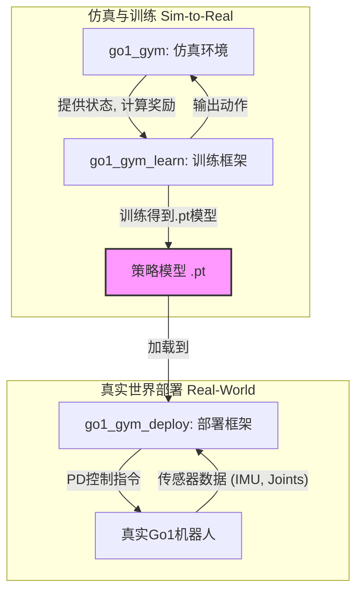

# walk-these-ways 项目分析

本文档旨在深入分析 `walk-these-ways` 项目，阐述其工作原理、模块功能、模块间关系及数据交互流程。

## 1. 各模块的功能

`walk-these-ways` 项目是一个基于 Isaac Gym 的强化学习框架，用于训练四足机器人（以 Unitree Go1 为主）的运动控制策略，并支持将训练好的策略部署到真实机器人上。项目主要由三个核心模块组成：`go1_gym`、`go1_gym_learn` 和 `go1_gym_deploy`。

### 1.1. `go1_gym` - 仿真环境模块

这是项目的核心，提供了基于 Isaac Gym 的、高度并行的机器人仿真环境。

- **功能**:
  - **创建并管理仿真环境**: 利用 Isaac Gym 的 GPU 加速物理仿真，可以同时运行数千个并行的机器人环境，极大地提高了数据采集效率。
  - **定义机器人模型**: 加载 Go1 的 URDF 模型，并设置其物理属性，如关节、执行器、传感器等。
  - **地形生成**: 动态生成多样化的地形（如平地、斜坡、楼梯、离散方块等），用于训练策略的鲁棒性。这是通过 `go1_gym/utils/terrain.py` 实现的。
  - **定义任务与奖励**: 定义了机器人需要完成的任务（如按指定速度行走）以及用于指导学习的奖励函数。奖励函数的设计是强化学习中的关键，通常包括任务完成度、能量消耗、稳定性、步态平滑度等多个部分。

- **重要类/方法**:
  - `go1_gym.envs.base.base_task.BaseTask`: 所有环境的基类，定义了仿真循环的核心逻辑，如 `step()`、`reset()`、`_compute_reward()` 等。
  - `go1_gym.envs.go1.go1_env.Go1Env`: 继承自 `BaseTask`，是专门为 Go1 机器人定制的环境。它实现了 Go1 特有的状态观测、动作应用和奖励计算。
  - `go1_gym.utils.terrain.Terrain`: 地形生成器，能够创建程序化的、具有挑战性的地形，以实现课程学习（Curriculum Learning）和域随机化（Domain Randomization）。

### 1.2. `go1_gym_learn` - 强化学习训练模块

该模块基于 `go1_gym` 提供的环境，使用强化学习算法来训练神经网络策略。

- **功能**:
  - **实现 PPO 算法**: 采用近端策略优化（Proximal Policy Optimization, PPO）算法进行训练。PPO 是一种高效且稳定的 Actor-Critic 算法。
  - **定义神经网络模型**: 定义了 Actor (策略) 和 Critic (价值) 两个网络。Actor 网络根据当前状态输出动作，Critic 网络评估当前状态的价值。
  - **管理训练流程**: 负责从环境中收集数据（Rollout），计算优势函数（Advantage），更新网络参数，并记录训练过程中的各项指标（如奖励、步长等）。

- **重要类/方法**:
  - `go1_gym_learn.ppo.ppo.PPO`: PPO 算法的核心实现。其 `update()` 方法执行一次完整的网络参数更新。
  - `go1_gym_learn.ppo.actor_critic.ActorCritic`: 定义了策略网络和价值网络的结构。这是一个多层感知机（MLP），输入是机器人的状态历史，输出是12个关节的目标位置。
  - `scripts/train.py`: 训练的入口脚本。它负责解析配置、创建环境和 PPO 实例，并启动整个训练循环。

### 1.3. `go1_gym_deploy` - 策略部署模块

此模块负责将 `go1_gym_learn` 训练出的策略部署到真实的 Go1 机器人上。

- **功能**:
  - **与机器人硬件通信**: 使用 LCM (Lightweight Communications and Marshalling) 作为底层通信协议，与机器人主控板进行数据交换。
  - **状态估计**: 从机器人的传感器（IMU、关节编码器）数据中估计出策略网络需要的状态信息（如机身速度、足端位置等）。
  - **策略推理**: 加载训练好的 `.pt` 模型文件，在机器人上进行实时推理，根据当前状态计算出目标关节位置。
  - **指令转换与发送**: 将神经网络输出的目标关节位置，通过一个PD控制器转换为关节力矩，并打包成 LCM 消息发送给机器人底层控制器。

- **重要类/方法**:
  - `go1_gym_deploy.scripts.deploy_policy.py`: 部署的入口脚本。它加载策略模型，并启动一个循环，持续地从机器人接收状态、进行推理、发送指令。
  - `go1_gym_deploy.envs.lcm_agent.LCMAgent`: 封装了与机器人硬件的 LCM 通信。它负责订阅机器人状态消息 (`state_estimator_lcmt`) 和发布控制指令消息 (`pd_tau_targets_lcmt`)。
  - `go1_gym_deploy.utils.cheetah_state_estimator.CheetahStateEstimator`: 一个简单的状态估计器，通过运动学计算机器人的速度和足端位置等信息。

## 2. 各模块的关系

这三个模块构成了“仿真-训练-部署”的完整闭环。

- **文字表述**:
  1. `go1_gym` 模块提供了一个虚拟的训练场（仿真环境）。
  2. `go1_gym_learn` 模块在这个虚拟训练场中，像一个教练一样，使用 PPO 算法训练 `ActorCritic` 神经网络（运动员）。
  3. 训练完成后，得到一个成熟的策略模型（`.pt` 文件）。
  4. `go1_gym_deploy` 模块将这个策略模型加载到真实机器人上，并通过 LCM 通信协议，让机器人在现实世界中执行学习到的技能。

- **Mermaid 关系图**:

## 3. 数据交互流程

### 3.1. 训练流程 (在 `go1_gym` 和 `go1_gym_learn` 之间)

1.  **初始化**: `train.py` 创建数千个并行的 `Go1Env` 实例。
2.  **状态收集**: 在每个仿真步，所有环境将当前的状态（机身姿态、关节位置/速度、历史动作等）拼接成一个大的张量，传递给 `ActorCritic` 网络。
3.  **动作生成**: `ActorCritic` 网络的策略部分（Actor）进行前向传播，为每个环境生成一个动作（12个目标关节角度）。
4.  **仿真步进**: `Go1Env` 将这些动作应用到对应的机器人上，并执行一步物理仿真。
5.  **奖励计算**: `Go1Env` 根据仿真后的新状态，计算每个环境的奖励值。
6.  **数据存储**: `PPO` 模块将 (状态, 动作, 奖励, 新状态) 这个转换元组存储在 `RolloutStorage` 中。
7.  **网络更新**: 当收集到足够多的数据后，`PPO` 模块利用这些数据计算优势函数，并更新 `ActorCritic` 网络的参数。
8.  **循环**: 重复步骤2-7，直到策略收敛。

### 3.2. 部署流程 (在 `go1_gym_deploy` 和真实机器人之间)

1.  **加载模型**: `deploy_policy.py` 加载训练好的策略模型 (`.pt` 文件)。
2.  **接收状态**: `LCMAgent` 通过 LCM 订阅机器人底层发送的状态消息，包含 IMU 数据和关节编码器数据。
3.  **状态估计**: `CheetahStateEstimator` 利用接收到的原始数据，计算出策略网络所需的完整状态向量（例如，通过对足端雅可比积分来估计足端位置）。
4.  **策略推理**: 将估计出的状态向量输入到加载的策略网络中，得到12个目标关节角度。
5.  **计算力矩**: 一个简单的PD控制器根据当前关节角度和目标关节角度，计算出需要施加的关节力矩 `tau`。 `tau = Kp * (pos_target - pos_current) + Kd * (vel_target - vel_current)`。其中 `vel_target` 通常为0。
6.  **发送指令**: `LCMAgent` 将计算出的12个关节力矩和PD增益打包成 `pd_tau_targets_lcmt` 消息，通过 LCM 发布出去。
7.  **底层执行**: 机器人主控接收到该消息，并驱动电机执行相应的力矩指令。
8.  **循环**: 重复步骤2-7，形成一个高频的控制闭环（通常为500Hz）。

## 4. 补充说明

- **命令条件策略 (Command-Conditioned Policy)**: 该项目的策略不仅学习如何行走，还学习如何根据外部命令（如期望的前进速度、转向速度）来调整行走方式。这些命令作为状态向量的一部分输入到策略网络中，使得机器人可以由用户通过手柄等设备进行遥控。
- **执行器网络 (Actuator Net)**: 项目中使用了一个单独训练的“执行器网络”(`resources/actuator_nets/unitree_go1.pt`)。它的作用是模拟真实电机（PD控制器、延迟、饱和等）的行为。在训练时，策略的输出会先经过这个执行器网络再应用到仿真中，从而缩小仿真和现实之间的差距（Sim-to-Real Gap）。
- **域随机化 (Domain Randomization)**: 在训练过程中，通过随机化物理参数（如质量、摩擦力、电机强度）和外部扰动（如对机器人施加推力），来提高策略的鲁棒性，使其能够更好地适应现实世界中的不确定性。
- **状态估计的重要性**: 在部署时，由于无法像仿真中一样直接获取所有状态（如机身速度），因此需要一个状态估计器。该项目中的估计器相对简单，更复杂的运动（如跳跃）可能需要更先进的估计方法（如基于卡尔曼滤波的估计器）。

这份文档全面地分析了 `walk-these-ways` 项目的核心架构和技术细节。
